# Felix Billieres

> *Cybersecurity Student & Professional - Offensive Security Enthusiast*

---

## Professional Experience

### Analyste SOC N2 @ ITrust
*Toulouse & Paris, France*  
*September 2023 - September 2024*

- SOC Analyst Level 2 with focus on Blue Team & Red Team skill development
- Log analysis and incident report writing
- Team participation in pentest seminars and CTF competitions
- Internal penetration testing and offensive security

### Pentester @ Galeries Lafayette
*Paris, France*  
*September 2024 - September 2025*

- Vulnerability identification and remediation
- Web services and Active Directory hardening supervision
- Blue Team training on advanced AD attacks
- Security assessment and penetration testing

---

## Education

**4th Year Cybersecurity Student @ École 2600**  
*Specializing in offensive security with strong foundations from CTF competitions with Phreaks 2600*

Passionate about **web security** and **Active Directory exploitation**, I'm determined to develop deep expertise in these areas.

---

## Certifications & Achievements

### December 2025

#### CRTO (Certified Red Team Operator) - Zero-Point Security
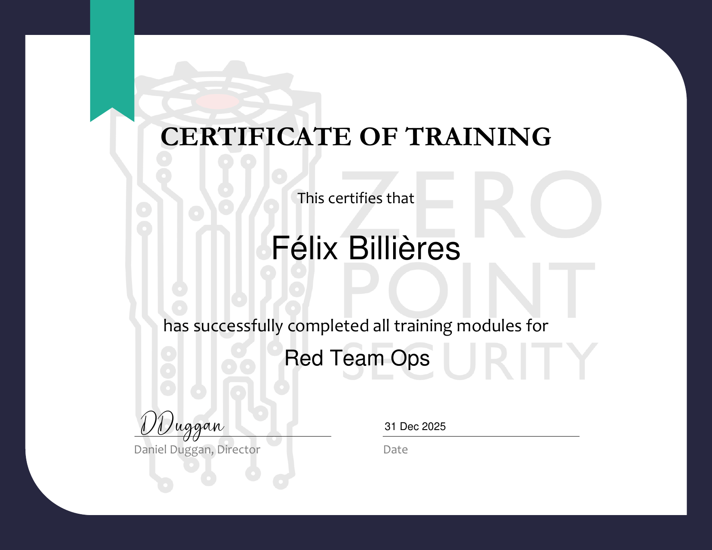

**Skills**: Cobalt Strike, Adversary Simulation, EDR Bypass

---

#### Mythical - Mini Pro Lab - HackTheBox
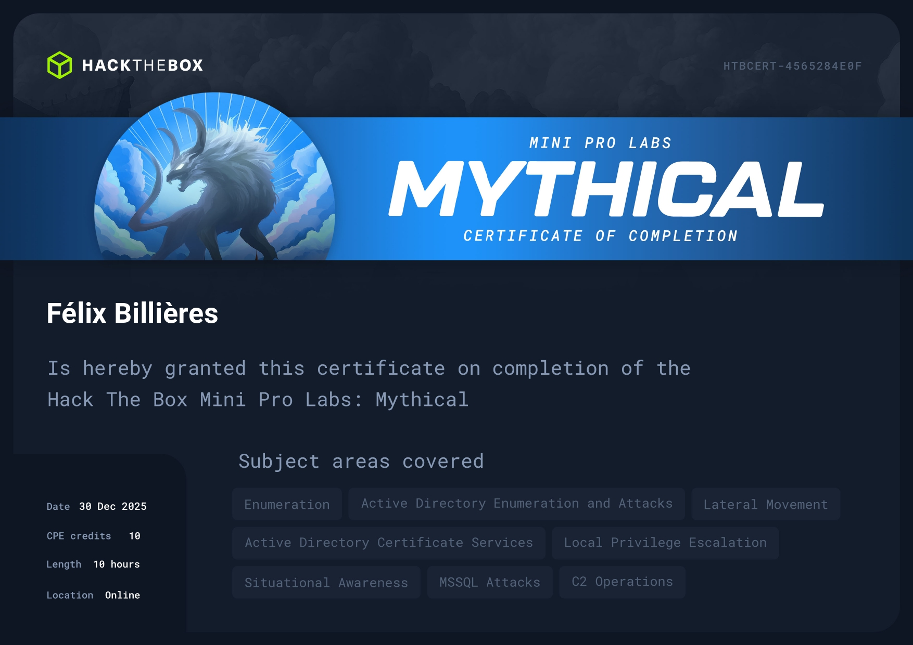

**Skills**: C2 Operations, MSSQL attacks

---

#### University CTF 2025: Tinsel Trouble - HackTheBox
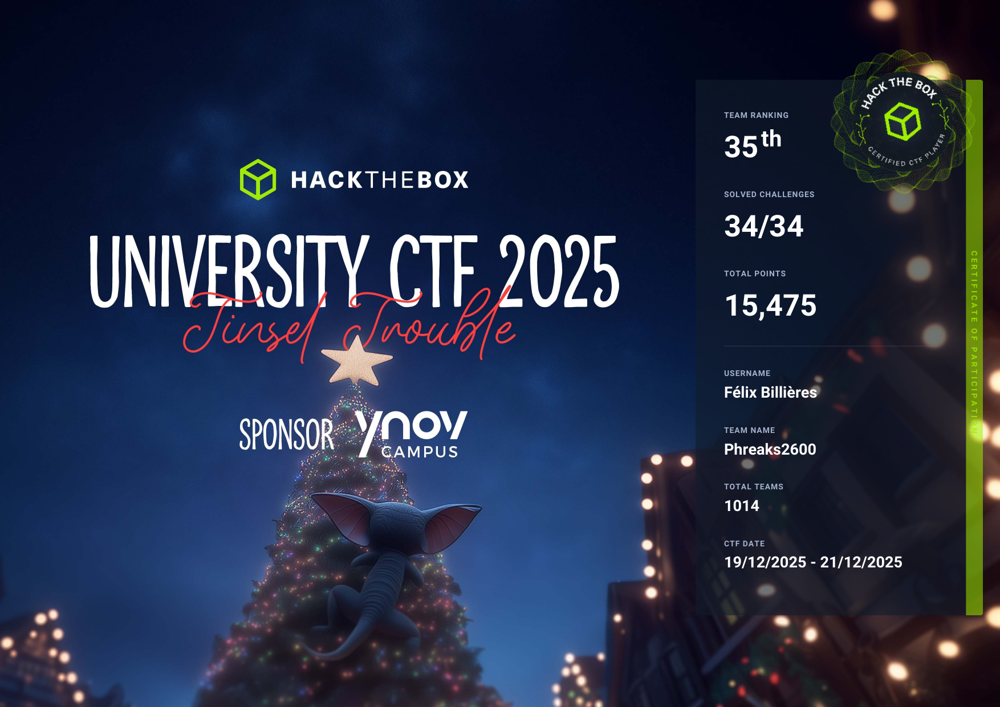

---

### November 2024

#### Practical Network Penetration Tester - TCM Security
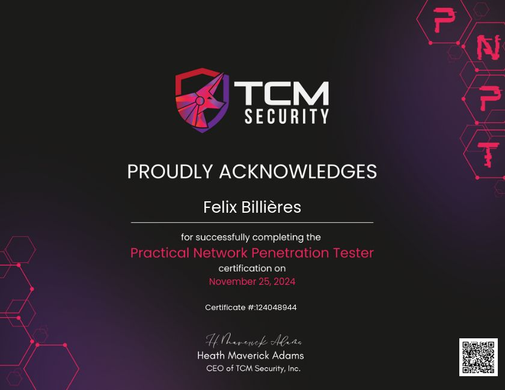

**Skills**: Network Penetration Testing, Active Directory, Post-Exploitation

---

### October 2025

#### Rastalabs Prolab - HackTheBox
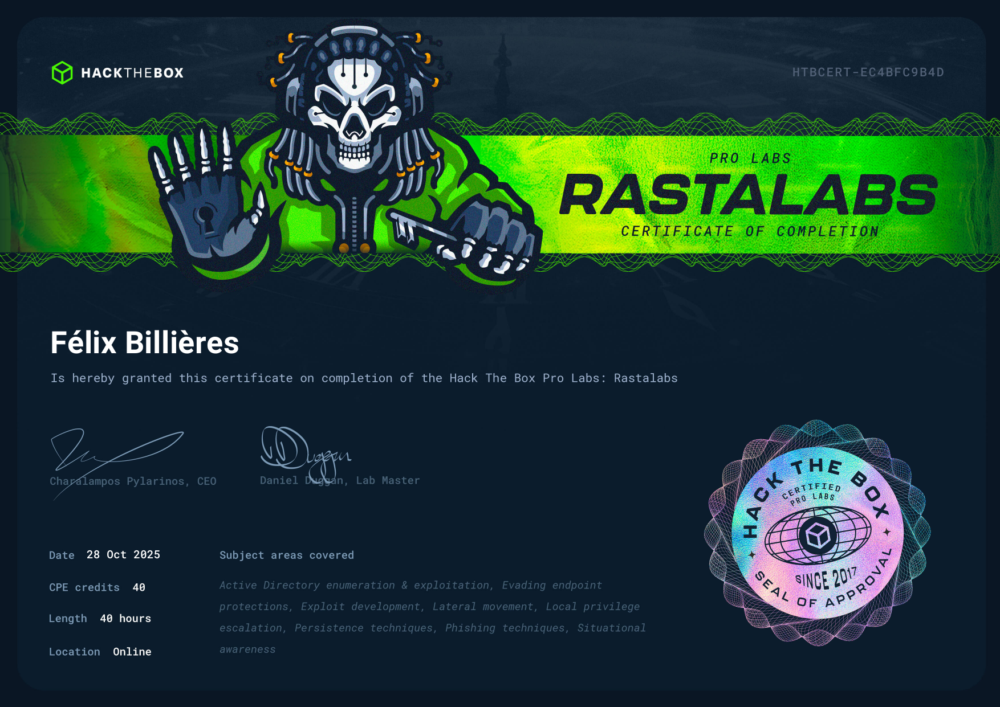

**Skills**: Phishing, Situational Awareness, Token Impersonation and Pass-The-Hash, Exploit Development, Active Directory Enumeration and Exploitation, Password Cracking and Credential Theft, Local Privilege Escalation

---

### September 2025

#### Certified Web Exploitation Specialist - HackTheBox
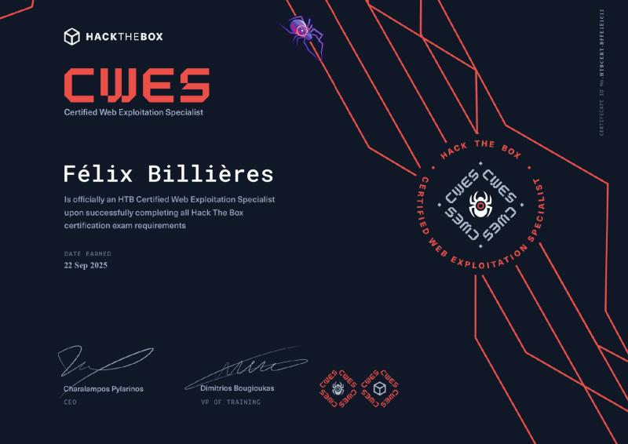

**Skills**: Bug Bounty Hunting processes, Web application/web service static and dynamic analysis, Information gathering techniques, Web application, web service and API vulnerability identification and analysis, Manual and automated exploitation of various vulnerability classes, Vulnerability communication and reporting

---

#### Certified Bug Bounty Hunter - HackTheBox
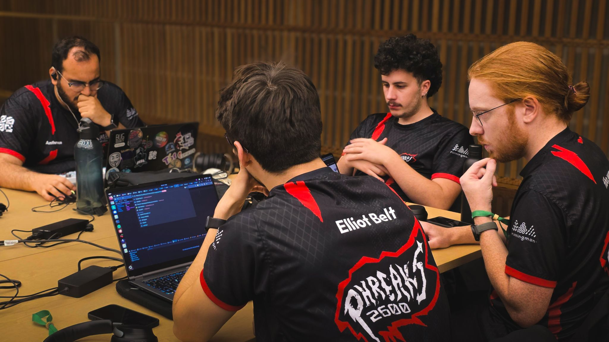

**Skills**: Bug Bounty Hunting, Web Application Security, Vulnerability Assessment

---

### August 2025

#### Zephyr Prolab - HackTheBox
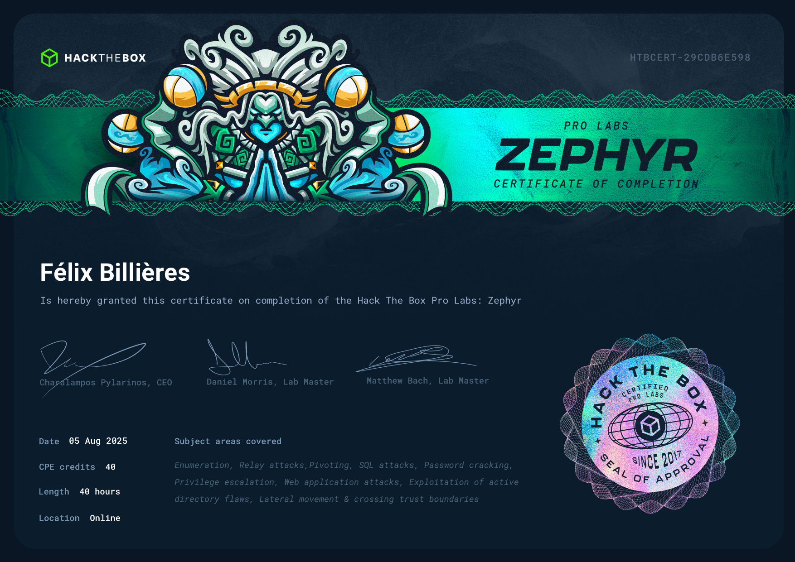

**Skills**: Exploitation of a wide range of real-world Active Directory flaws, Relay attacks, Lateral movement and crossing trust boundaries, Pivoting, SQL attacks, Web application attacks

---

### June 2024

#### Attacking and Defending Active Directory: Beginner's Edition - Altered Security
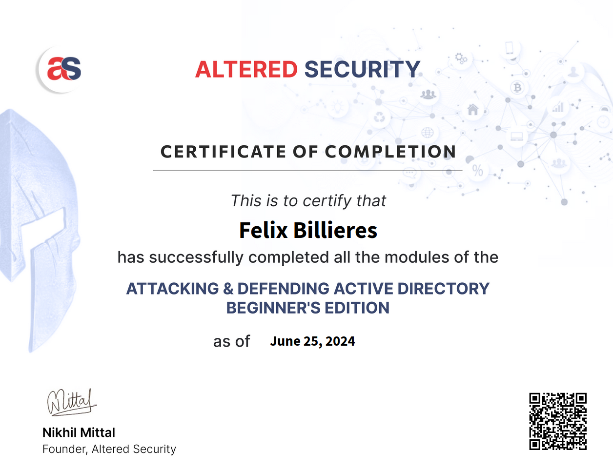

**Skills**: Active Directory Security, Attack and Defense Techniques

---

### December 2024

#### University CTF 2024: Binary Badlands - HackTheBox
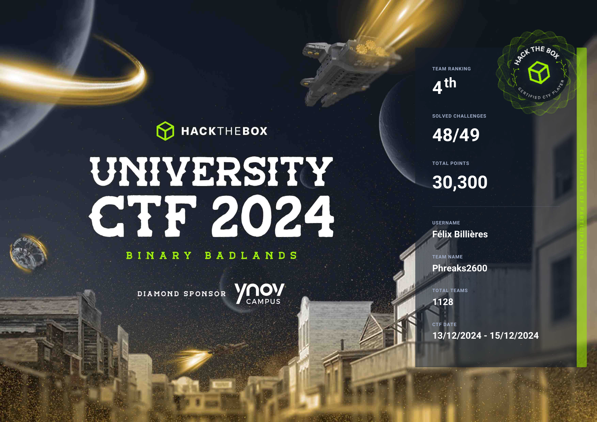

---

### Path Certifications

#### Certified Penetration Tester - HackTheBox

**Skills**: Penetration Testing Methodology, Network Security, Web Application Security, Active Directory

---

## Platform Statistics

| Platform | Achievement |
|----------|-------------|
| **HackTheBox** | 70+ machines (Easy to Hard) |
| **OffSec** | 60+ machines (Easy to Very Hard) |
| **RootMe** | 4000+ points |
| **PortSwigger Academy** | 60%+ completion |

---

## Community Involvement

### Phreaks 2600

**Board Member** - Leading cybersecurity community initiatives

- **Internal project management** and event organization
- **CTF Challenge Creator** - Web, Forensics, Pwn challenges
- **Workshop Developer** - Advanced training labs and web vulnerability exploitation

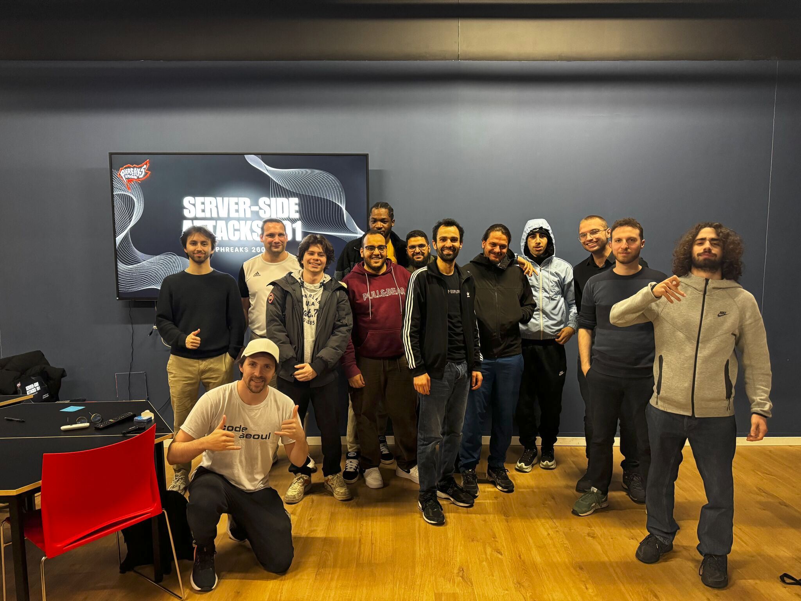

- **Custom CTF Challenges** - Web workshops for Phreaks 2600 members

### Bug Bounty Hunter

Active bug bounty hunting across various programs, identifying and reporting security vulnerabilities.

---

## Tools & Development

### Exegol MCP

**[Exegol MCP Development](https://github.com/ThePorgs/Exegol-MCP)** - Model Context Protocol integration for Exegol

- Custom pentest tools for reconnaissance, AD, web security
- Advanced audit mapping with integrated exploitation for various services
- Open-source contribution to the Exegol ecosystem

---

## Skills & Specializations

| Category | Skills |
|----------|--------|
| **Web Security** | Web Exploitation, Bug Bounty Hunting, API Security |
| **Active Directory** | AD Attacks & Defense, Kerberos Exploitation, Lateral Movement |
| **Offensive Security** | Penetration Testing, Red Team Operations, Exploit Development |
| **Purple Teaming** | SOC Analysis, Incident Response, Threat Hunting |
| **CTF** | Web, Forensics, Pwn, Reverse Engineering |
| **Development** | Python, PowerShell, Tool Development |

---

## Contact & Links

| Platform | Link |
|----------|------|
| **GitHub** | [github.com/felixbillieres](https://github.com/felixbillieres) |
| **HackTheBox** | [ElliotBelt](https://app.hackthebox.com/profile/elliotbelt) |
| **LinkedIn** | [Felix Billieres](https://linkedin.com/in/felixbillieres) |
| **RootMe** | [Elliot_Belt](https://www.root-me.org/Elliot_Belt) |

*Last updated: January 2026*
