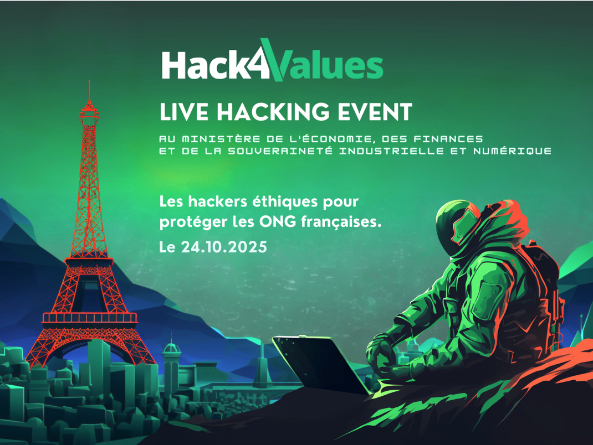
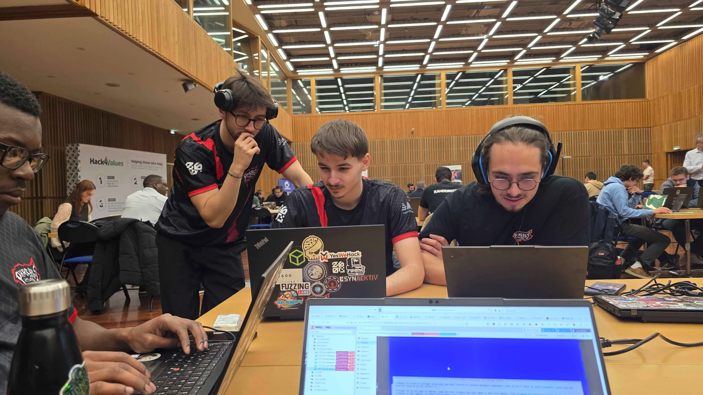
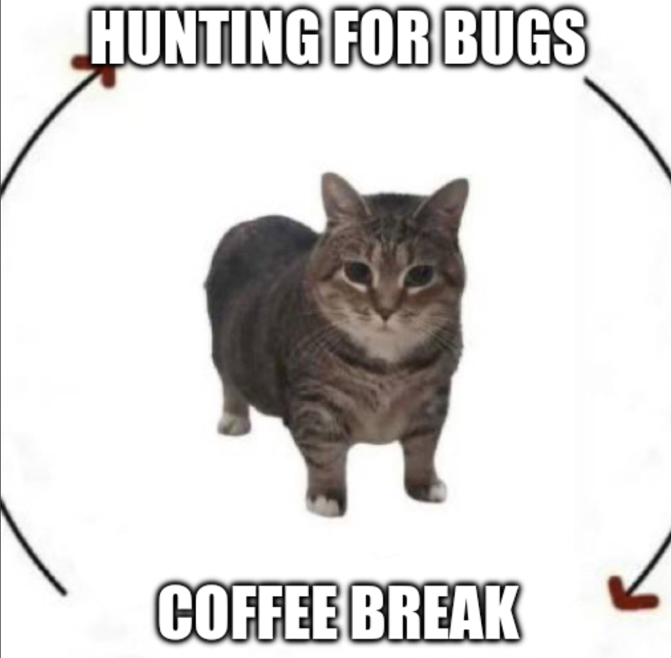
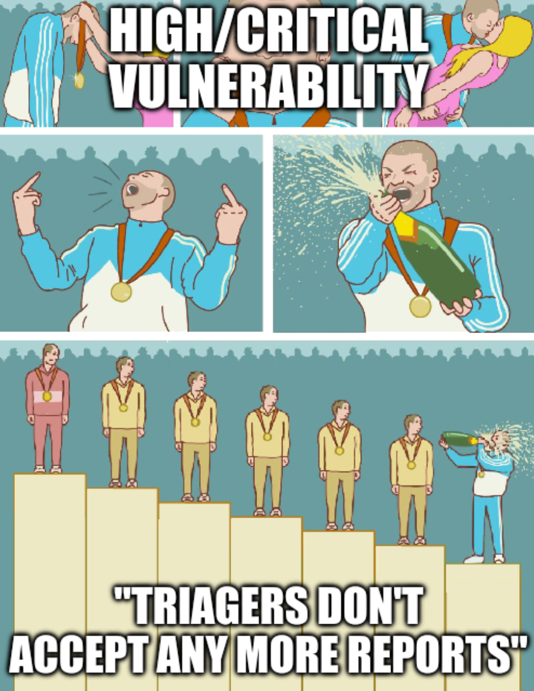
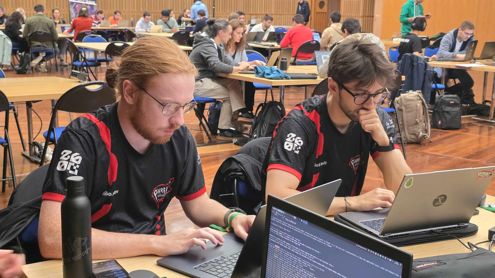

# Retex: Phreaks 2600 at the Hack4Values "Grand Live Hacking Solidaire" 2025

## Introduction to the Event

The **"Grand Live Hacking Solidaire"** organized by **Hack4Values** is an event that brings together the French ethical hacking community around a cause close to our hearts: securing NGOs and associations that often don't have the means to protect themselves against cyber threats. Hack4Values, created in 2021, mobilizes a network of ethical hackers and security researchers to offer a pro bono bug hunting program.

The 2025 edition took place on **October 24, 2025**, from 9 AM to 6 PM, in a pretty impressive setting: the **Ministère de l'Économie, des Finances et de la Souveraineté Industrielle et Numérique** (Ministry of Economy, Finance, and Digital Sovereignty) in Paris, at 139 Rue de Bercy. It gives you an idea of how important the government considers this cybersecurity mission.

The organizations that benefited from our work were major players in the nonprofit sector: **AMNESTY INTERNATIONAL**, **HANDICAP INTERNATIONAL**, **ACTION AGAINST HUNGER**, **SOS MEDITERRANEE**, **HABITAT ET HUMANISME**, **WE SIGN IT**, **E-ENFANCE**, and **RCF RADIO**.

## Team Phreaks 2600 Participation

Our **Phreaks 2600** team was present with **7 hunters** on site. The format was simple: a full day of vulnerability hunting on the scope defined by the organizers.

**Team members:**
- [Wepfen](https://wepfen.github.io)
- Elliot Belt
- [Istark](https://istaarkk.github.io)
- [Anthrace](https://anthr4ce.github.io)
- Wored
- P4stis
- Tibo.wav

What really struck me was the **cohesion and complementarity** of our team. Everyone had their specialties, which allowed us to efficiently cover different types of attacks and validate our findings among ourselves. We maintained a good pace throughout the day, interspersed with welcome breaks to debrief and refuel with coffee ☕.

## Scope and Technical Findings

The bug bounty scope was intentionally broad, covering multiple web applications, APIs, and digital platforms from the partner NGOs.

In total, our team identified and reported approximately **7 to 10 valid vulnerabilities**. The severity of these findings ranged from **Low** to **High**, which shows the diversity of the systems tested.

The types of vulnerabilities found were varied:

- **API Misconfigurations:** Configuration issues that could lead to data exposure or unauthorized actions.
- **IDOR (Insecure Direct Object Reference):** Flaws allowing access to sensitive data by manipulating object identifiers.
- **Feature Abuse:** Exploiting legitimate functionalities for malicious purposes.
- **Broken Access Control:** Failures in access control allowing access to unauthorized resources.
- **Elevation of Privileges:** Vulnerabilities allowing a low-privilege user to obtain higher rights.

## Achievement and Key Operational Note

The combined effort of all the hunters present allowed us to reach the organization's target: **300 points**. To give a bit of context, that represents a good density of verified findings, with Low vulnerabilities earning a few points and Critical ones around 15 points each.

Little anecdote from the day: we finished writing the report for a vulnerability we judged **High or Critical** just **3 minutes after** the deadline for the final report triage. 

It was a bit frustrating at the time, but in the end, the vulnerability was still properly disclosed. The main goal remains securing the NGOs' systems, and that's done! 

## Conclusion

The Hack4Values "Grand Live Hacking Solidaire" 2025 was a great experience for the Phreaks 2600 team. The event successfully combines technical expertise with a solidarity objective, which gives a special meaning to our work.

Our participation allowed us to put our skills at the service of organizations that really need them, while learning a lot about real systems. It's this kind of experience that reminds us why we do this job: protecting those who need it, even if it's volunteer work.

A big thank you to Hack4Values for the organization and to the partner NGOs for their trust! 🙏

---

See you soon for another retex - Elliot