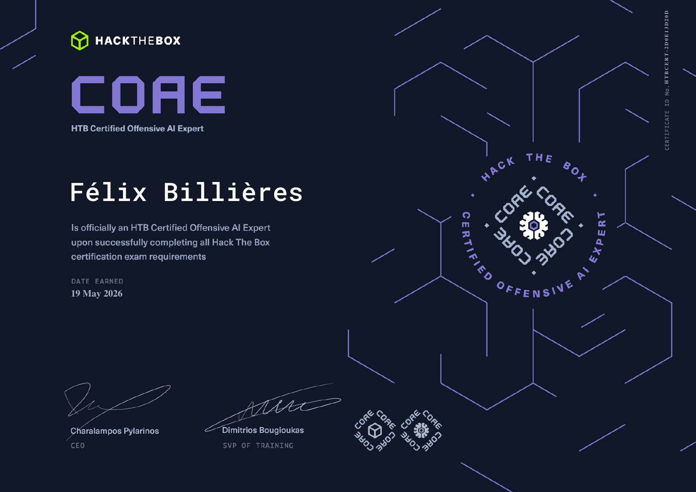

# Retex: HTB Certified Offensive AI Expert (COAE)

I have spent most of my career on the offensive side. Pentest, red team, CTFs, and a lot of vulnerability research, lately a fair amount of it pointed at AI systems and the Model Context Protocol. That research is scattered across this blog, and it is the work I enjoy the most: pulling apart a protocol, finding where the trust assumptions break, and writing it up. So when Hack The Box announced its **Certified Offensive AI Expert** in April 2026, the decision took about ten seconds. A certification that sits exactly where my offensive background meets the AI research I do for fun was never going to wait.

This is a retex of the road to it: the AI Red Teamer path, how I prepared, and the parts that actually stretched me. I am deliberately keeping it on the right side of HTB's rules, so there are no exam scenarios, no flags, and no module solutions here. More on why that line matters at the end.

## What the COAE actually is

The COAE is the capstone certification of HTB Academy's **AI Red Teamer** job-role path. The path was built in collaboration with Google and is aligned with Google's SAIF framework, which already tells you something about the intended altitude: this is not a prompt-injection party trick collection, it is a structured tour of the AI attack surface.

The path is twelve modules and a little over two hundred sections, rated Hard overall. The certification itself is a seven-day practical exam: you are dropped into a simulated corporate environment, you run a full offensive assessment against the AI systems in it, and you submit a commercial-grade technical report at the end. Seven days is shorter than the ten-day window HTB gives for CPTS, CWEE, and CAPE, which matters more than it sounds, and I will come back to it.

The scope HTB advertises is the whole surface: adversarial machine learning, data poisoning, evasion, LLM exploitation, AI application and system security, privacy, and defense. The phrase "full attack surface" is their marketing, but having gone through the path I think it is fair. The spread of topics is genuinely wide.

## Where my background helped, and where it did not

The honest part of any retex is admitting what you walked in already knowing.

The offensive instincts transferred cleanly. Mapping an attack surface, thinking in terms of trust boundaries, abusing the gap between what a system is supposed to do and what it actually does, chaining small findings into something that matters, and then writing all of it up so a reader can reproduce and remediate. None of that changes because the target happens to be a model. The application and system security parts of the path, and the LLM exploitation work, felt like home. My MCP research in particular meant the "AI plugged into external tools" angle was familiar territory rather than a new world.

What did not transfer for free was the math. This is the part I want to be useful about, because it is where an offensive person feels the friction.

## The math under the adversarial attacks

If you come from pure offensive security, the first real wall in the path is not a tool you do not know. It is that a good chunk of the adversarial ML material is gradient calculus wearing an attacker's hat. Once that clicked for me, the rest of the path got a lot easier, so this is the section I would have wanted to read before starting.

The mental model that unlocked it: a neural network is just a function that maps an input to a loss, and it is differentiable. In normal training you compute the gradient of the loss with respect to the **weights** and nudge the weights to make the loss smaller. An evasion attack flips that around. You freeze the weights and compute the gradient of the loss with respect to the **input** instead, then nudge the input to make the loss bigger, or to push it toward a class you want. Same calculus, opposite target. That single reframing is the whole foundation.

From there the classic attacks stop looking like separate tricks and start looking like points on a spectrum:

- **FGSM** (Fast Gradient Sign Method) is the one-liner. Take the sign of the input gradient, multiply by a small epsilon, add it to the image. One step, fast, and it is the "hello world" of evasion. It tells you which direction in pixel space the model is most sensitive to and shoves the input that way just enough to flip the decision while staying visually identical.
- Iterative methods are FGSM in a loop with a smaller step, projecting back into an epsilon ball each iteration so the perturbation stays bounded. More queries, smaller and more reliable perturbations.
- **DeepFool** asks a slightly different question: not "which way is the loss steepest" but "what is the shortest hop across the nearest decision boundary." It linearizes the boundary and steps to it, which tends to find genuinely minimal perturbations.
- **JSMA** (Jacobian-based Saliency Map Attack) is the one that finally made the word "Jacobian" mean something concrete to me. Instead of perturbing the whole input a little, it builds a saliency map from the Jacobian, the matrix of how every output class responds to every input feature, and then surgically changes the few pixels that most increase the target class while suppressing the others. It is a sparse, precise attack rather than a broad nudge, and the contrast with FGSM is the clearest way to feel what the Jacobian is actually telling you.
- **EAD** and the sparsity-flavored attacks push that idea further with L1 regularization, optimizing for perturbations that touch as few features as possible.

The path's three hardest modules, in my experience, are exactly the ones where this material lives: the data attacks module and the two AI evasion modules that go from first-order methods into sparsity. That is not a coincidence. The Hard rating is the math, not the tooling. Most of the hands-on work happens in Jupyter notebooks, which is the right call, because seeing the perturbation evolve tensor by tensor is what turns the formulas into intuition.

My advice to anyone with my profile: do not skim the foundational modules to get to the "hacking." The gradient intuition you build early is the thing that makes the later modules tractable. I spent real time with pen and paper on the first-order stuff and it paid for itself three modules later.

I will be honest, the math was the hard part for me, and I do not think there is any shame in saying that the HTB modules alone were not always enough to make it click. When a section assumed an intuition I did not have yet, I went and got it elsewhere, then came back. That loop, hit a wall in the module, go read a focused external explanation, come back and re-implement, is the single habit I would recommend the most. A few resources that genuinely moved the needle for me:

- **3Blue1Brown's neural network series** for the visual intuition of gradients and backpropagation. If "gradient of the loss with respect to the input" is still abstract, this is where it stops being abstract.
- The **original papers**, read after the modules rather than before, when you already have something to hang them on. They are shorter and more readable than you expect: Goodfellow et al., [Explaining and Harnessing Adversarial Examples](https://arxiv.org/abs/1412.6572) for FGSM, Papernot et al., [The Limitations of Deep Learning in Adversarial Settings](https://arxiv.org/abs/1511.07528) for JSMA and the saliency map, Moosavi-Dezfooli et al., [DeepFool](https://arxiv.org/abs/1511.04599), and Carlini and Wagner, [Towards Evaluating the Robustness of Neural Networks](https://arxiv.org/abs/1608.04644) for C&W.
- [Paras Dahal's "Breaking Deep Neural Networks with Adversarial Attacks"](https://www.parasdahal.com/adversarial-attack), which is the kind of from-scratch, math-then-code walkthrough that bridges the gap between the formula and a working notebook.
- The [CleverHans](https://github.com/cleverhans-lab/cleverhans) and [Adversarial Robustness Toolbox (ART)](https://github.com/Trusted-AI/adversarial-robustness-toolbox) source. Reading a reference implementation of an attack next to its paper is often what finally collapses the two into one understanding.

None of that replaces the modules. It just fills the gaps the modules assume you already have, and for an offensive person crossing into ML, those gaps are mostly mathematical.

## Building a toolkit to actually drill it

Reading and re-implementing in notebooks got me through the understanding. To keep the skills sharp and to stop re-writing the same attacks from scratch, I started building my own [AI offensive toolkit](https://github.com/felixbillieres/ai-offensive-toolkit). The idea is a modular, scriptable suite for AI security testing, think of it as an Impacket for AI security, organized along the same lines as the attack surface the path teaches: evasion (FGSM, PGD, DeepFool, JSMA, C&W, EAD), data poisoning, prompt injection, LLM output handling, privacy attacks, and AI application and system attacks including MCP tool poisoning.

It is early and very much a work in progress, but the act of building it was itself some of the best preparation I did. Implementing an attack cleanly enough that you would let someone else import it forces a level of understanding that just running a lab cell never does. If you learn the way I do, by building the tool rather than only reading about it, this kind of personal project doubles as revision.

## The LLM and prompt injection side

The other half of the surface is the one offensive people will find more immediately fun, because it rhymes with web and protocol work.

Prompt injection in the path is treated with more seriousness than the usual "ignore your previous instructions" demos. The interesting material is the indirect variety: payloads that ride in through data the model consumes rather than the user prompt, the way an injection turns into a real primitive once the model has tools or downstream actions wired to it, and the output-handling attacks where the danger is not what the model says but what the system does with what the model says. That framing, treating model output as an untrusted input to the rest of the application, is the same instinct that makes you suspicious of every parser in a normal pentest, and it is exactly the lens my MCP research had already trained.

The application and system module ties it together: AI is rarely a lone model, it is a model surrounded by retrieval, tools, agents, and glue code, and the glue is where the bugs live. If you have ever found a bug in the seam between two services, you already know how to think here. The novelty is the model in the loop, not the methodology.

The privacy module rounds it out with things like membership inference, where you ask whether a given record was in the training set by reading the model's confidence behavior. It is a different shape of attack, more statistical than the rest, and a good reminder that "offensive AI" is broader than getting a model to misbehave on cue.

## How I prepared

Concretely, the rhythm that worked for me:

1. Do every section of every module, in order, including the ones that look like background. The path is sequenced deliberately and the foundations are load-bearing.
2. For the adversarial ML modules, re-derive the key formulas by hand once, then re-implement at least one attack from a blank notebook without copying the lab. If you can write FGSM and a JSMA saliency step from scratch, you understand it. If you can only run the provided cell, you do not, yet.
3. Treat the report as a first-class skill, not an afterthought. The exam deliverable is a commercial-grade report, and report writing is a muscle. Coming from pentest I had this one, but I have watched strong technical people lose marks on certifications like this purely on the writeup. Practice articulating an AI finding the way you would a classic one: impact, reproduction, remediation.
4. Plan the seven days before they start. The window is shorter than HTB's other expert exams, and an AI assessment has a lot of moving parts. Knowing your methodology cold beforehand means the clock is spent executing, not deciding what to do next.

## A word on the disclosure line

I want to be explicit about why this retex stays general, because I think it is part of doing these writeups responsibly.

HTB's Platform Rules whitelist exactly what you are allowed to publish solutions for: retired machines, Sherlocks and challenges, Starting Point, the free Tier 0 Academy modules, and a few specific Pro Labs. Certification exam content and the solutions to paid Academy modules are not on that list. HTB is blunt about it: publishing that material is a ToS violation and they say legal action will follow. The User Agreement backs it up, defining assessment content and module solutions as protected, and reserving the right to revoke credentials, disqualify candidates, and even de-anonymize accounts when enforcing it.

So the rule I followed is simple. Format, duration, difficulty, preparation strategy, and my honest impressions of the topics are all fair game, and that is what this post is. Exam scenarios, flags, specific solutions, and the paid module internals are not, and you will not find them here. A retex is supposed to help the next person decide whether the certification is for them and how to get ready, not to hand them the answers.

## Where the COAE sits

For context, the COAE did not land alone. OffSec shipped its OSAI at almost the same moment, at the end of March 2026, and the two make an interesting contrast: OSAI is a 24-hour proctored exam, the COAE is a seven-day unproctored window with a heavier report. SANS and GIAC are rolling out their own AI security lineup through the end of 2026, though some of their "offensive AI" branding is about using AI as an attack tool rather than attacking AI systems, which is a different thing. If you are choosing, the question is really whether you want the sprint or the marathon, and whether you want the depth of adversarial ML math that the HTB path leans into.

For me the choice was easy, because the COAE happened to sit on the exact intersection I already live at: offensive security, AI research, and the kind of vulnerability work I do for the love of it. The path made me earn the math I had been avoiding, and the exam made me put all of it together under a clock. That is the best thing a certification can do, and it is why I jumped on it the week it came out.

If you come from offense and you have been circling AI security wondering where to start, this path is a good front door. Respect the foundations, do the math, and the rest is the hacking you already know.
