# How to Make Your First Billion in Bug Bounty (Easily)

A few days before [leHack 2026](https://lehack.org/), I was invited to speak at the **HackTheBox Meetup**. I picked the subject I have been spending most of my research time on this year: how to integrate and optimize an AI pipeline in a bug bounty context so that it actually finds real, reportable bugs instead of flooding triage queues with slop.

The deck is in French. This post is its written counterpart in English: the same slides, with the point of every technical one explained properly, plus the snippets, the numbers, and the research links that did not fit on screen.

If you want the long-form version of the same research, with the full architecture, it lives in my earlier deep dive: [Studying LLM Workflows Until They Actually Find Cool Bugs](/posts/llm-bug-bounty-pipeline-2026/). This post is the talk, slide by slide.

---

## The full deck

Here is the whole presentation, in order. You can flip through it, and the PDF is right below if you prefer to read or download it.



**Download the slides:** [slides-premier-milliard-bug-bounty.pdf](slides-premier-milliard-bug-bounty.pdf)

The rest of this post walks through the deck, focused on the technical content.

---

## The naive reflex, and why it fails

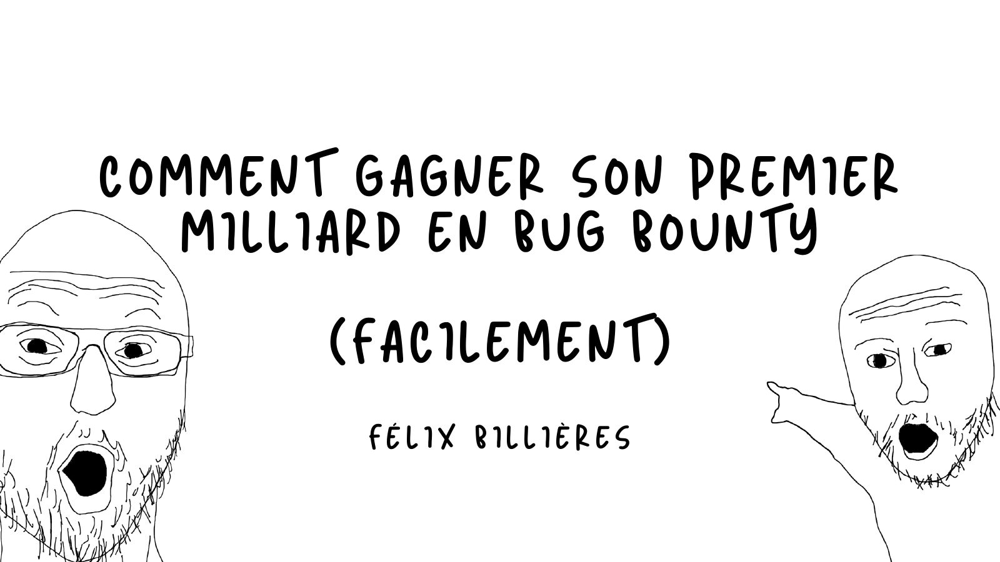

The default workflow most people reach for the first time they point a frontier model at a target:

1. Find a scope on YesWeHack.
2. Run `claude --dangerously-skip-permissions`.
3. Type "find me some bugs".

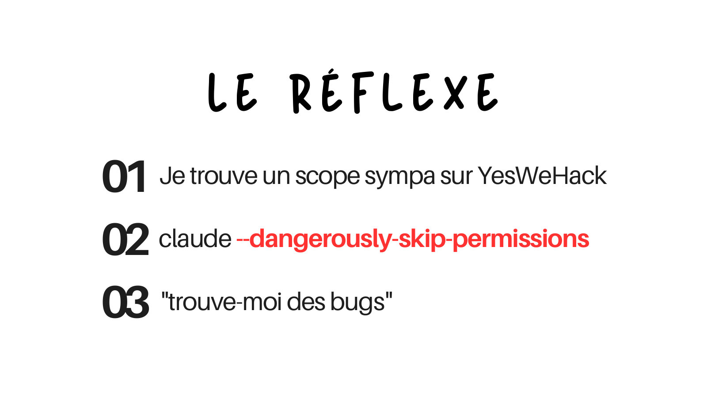

This does not work, and the measured outcome is the point. When you let a raw model loose on a program with no harness, you do not get a stream of valid findings. You get the **triager's nightmare**: a tiny bar of true positives and a huge bar of slop. Roughly 14% of what comes out is a real, exploitable finding. The rest is plausible-looking output, correct syntax, a CWE cited, that never had a reachable path to begin with.

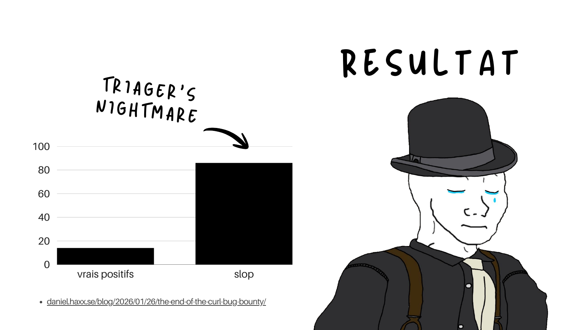

That is not a hypothetical. It is the exact dynamic that pushed the curl project to shut its bug bounty program down, which Daniel Stenberg documented in detail: the rate of confirmed reports fell below 5% in 2025, and the program closed at the end of January 2026. The references worth reading in full:

- Daniel Stenberg, [The end of the curl bug bounty](https://daniel.haxx.se/blog/2026/01/26/the-end-of-the-curl-bug-bounty/) and the earlier [Death by a thousand slops](https://daniel.haxx.se/blog/2025/07/14/death-by-a-thousand-slops/), with his [public gist of slop reports](https://gist.github.com/bagder/07f7581f6e3d78ef37dfbfc81fd1d1cd).
- Seth Larson (Python Software Foundation), [slop security reports](https://sethmlarson.dev/slop-security-reports).
- Bugcrowd on the platform response: [Sloptimism is breaking any system built on human validation](https://www.bugcrowd.com/blog/sloptimism-is-breaking-any-system-built-on-human-validation/) and their [policy changes to address AI slop](https://www.bugcrowd.com/blog/bugcrowd-policy-changes-to-address-ai-slop-submissions/).

Everything below is about closing the gap between that slop bar and a stream of real findings, using the same model.

---

## Configuration beats capability

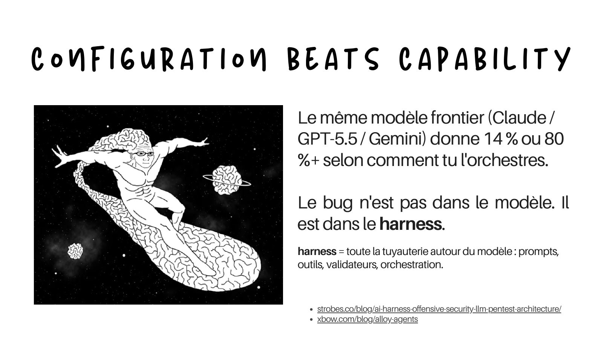

The central thesis. The same frontier model (Claude, GPT-5.5, Gemini) gives you a low number or a high number depending on how you orchestrate it. The bug is not in the model. It is in the **harness**, which I define as all the plumbing around the model: prompts, tools, validators, orchestration.

The "14% or 80%" is an illustrative framing, not a single measured pair. The published before-and-after pairs land in that same range though: XBOW reports roughly 25% to 79% with their alloy and harness work, and the broader "the harness is 80% of the performance, the model is 20%" thesis is laid out by Strobes. The point is the spread, and that it comes from configuration, not from the weights.

The reason I believe this is not vibes, it is the spread in the public numbers. Two researchers can run the same Claude, the same GPT, the same Gemini, and get results that differ by an order of magnitude. A few data points that anchor it:

- Claude alone on real-world vulnerability detection: roughly **14% true positive rate** across 800k lines of code ([Semgrep](https://semgrep.dev/blog/2025/can-llms-detect-idors-understanding-the-boundaries-of-ai-reasoning/)).
- The same Claude wired into a hybrid with Semgrep running first: **61% precision** with a large recall improvement on IDOR ([Semgrep, AI-powered detection](https://semgrep.dev/blog/2025/ai-powered-detection-with-semgrep/)). Same model, twenty-seven points of false positive rate removed by a structural change.
- XBOW on the same Sonnet 4.0: 57.5% solve rate solo, **68.8%** when alternated with another provider in the same thread ([XBOW Alloy Agents](https://xbow.com/blog/alloy-agents)).

Capability is the cheapest variable to switch. Anyone can buy a frontier model this quarter. The configuration around it is what compounds.

**Go deeper:**

- [The AI harness for offensive security](https://strobes.co/blog/ai-harness-offensive-security-llm-pentest-architecture/) (Strobes), which is where I borrowed the word "harness".
- [XBOW Alloy Agents](https://xbow.com/blog/alloy-agents).

---

## The myth to kill: bigger context is not better

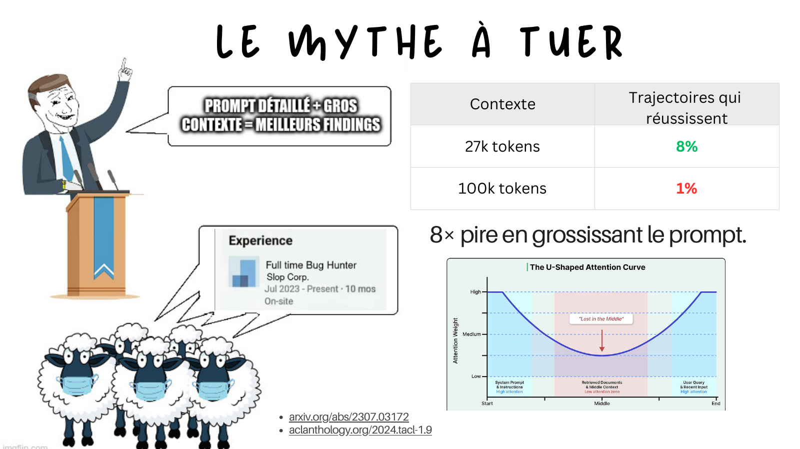

The single most common mistake I see: people assume a detailed prompt plus a huge context equals better findings. The opposite is true past a surprisingly small point.

The number on this slide comes from Sean Heelan's work finding CVE-2025-37899 in the Linux kernel SMB implementation. Same `o3`, same target, same prompt:

| Context | Successful trajectories |
|---|---|
| 27k tokens | 8% |
| 100k tokens | 1% |

Performance divided by eight, just by enlarging the prompt with helpful-looking information. The mechanism is the U-shaped attention curve from the **Lost in the Middle** paper: a model attends strongly to the start and the end of its context, and weakly to the middle. For offensive work this is brutal, because the subtle precondition for a vulnerability (a validator that almost catches the input, a check that is off by one) is exactly the kind of detail that ends up buried in the middle.

The operational rule that falls out: one unit of work is **one handler, one endpoint, one component**, not "the whole module", and the token sweet spot is **25k to 30k per audit task**.

**Go deeper:**

- Sean Heelan, [How I used o3 to find CVE-2025-37899](https://sean.heelan.io/2025/05/22/how-i-used-o3-to-find-cve-2025-37899-a-remote-zeroday-vulnerability-in-the-linux-kernels-smb-implementation/), and the [companion repo](https://github.com/SeanHeelan/o3_finds_cve-2025-37899).
- [Lost in the Middle](https://arxiv.org/abs/2307.03172) (arXiv 2307.03172) and the [TACL version](https://aclanthology.org/2024.tacl-1.9/).

---

## 2026: raw capability is becoming a commodity

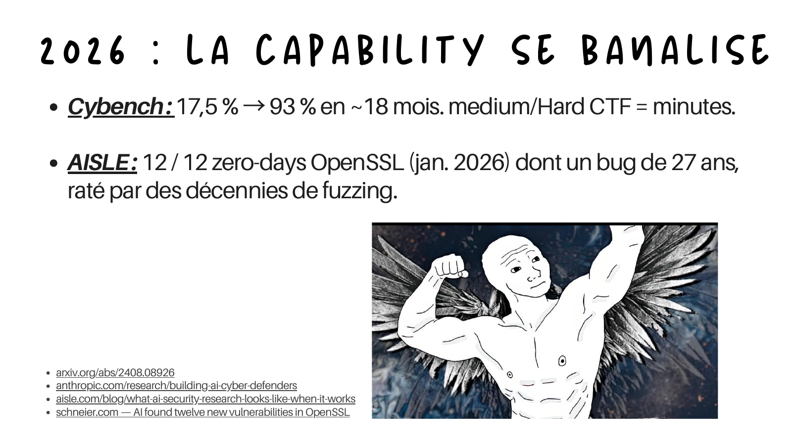

A point I wanted to make before diving into technique: the model capability is no longer the bottleneck, and it is moving fast.

- **Cybench**: the solve rate on the benchmark went from 17.5% to 93% in roughly eighteen months. Medium and hard CTF tasks are now solved in minutes. (The two numbers are not iso-methodology: 17.5% is Claude 3.5 Sonnet unguided, single attempt, from the original 2024 paper, and 93% is Claude Opus 4.6 in early 2026 on a 37-task slice with a multi-try budget. The trend is the point.)
- **AISLE**: 12 out of 12 zero-days in OpenSSL in January 2026, including a bug roughly 27 years old (it actually predates OpenSSL, inherited from SSLeay) that decades of fuzzing had missed.

If the capability is becoming a commodity, then the durable edge is everything else: the harness, the validators, the orchestration. That is the whole reason this talk is about configuration and not about which model to pick.

**Go deeper:**

- [Cybench](https://arxiv.org/abs/2408.08926) (arXiv 2408.08926).
- Anthropic, [Building AI cyber defenders](https://www.anthropic.com/research/building-ai-cyber-defenders).
- AISLE, [What AI security research looks like when it works](https://aisle.com/blog/what-ai-security-research-looks-like-when-it-works).
- Bruce Schneier on the OpenSSL finding, [AI found twelve new vulnerabilities in OpenSSL](https://www.schneier.com/).

---

## Same AI wave, two opposite outcomes

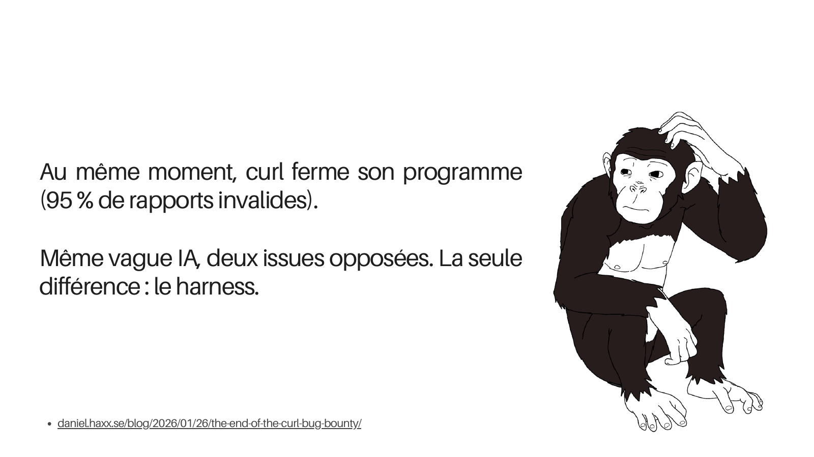

At the exact moment AISLE was finding real zero-days, curl was closing its program because 95% of incoming reports were invalid. Same AI wave, two opposite outcomes. The only thing that separates them is the harness. One side wraps the model in deterministic validation and tight scope, the other side lets it free-associate into a submission form.

Everything below is the how.

---

## Discovery is not validation

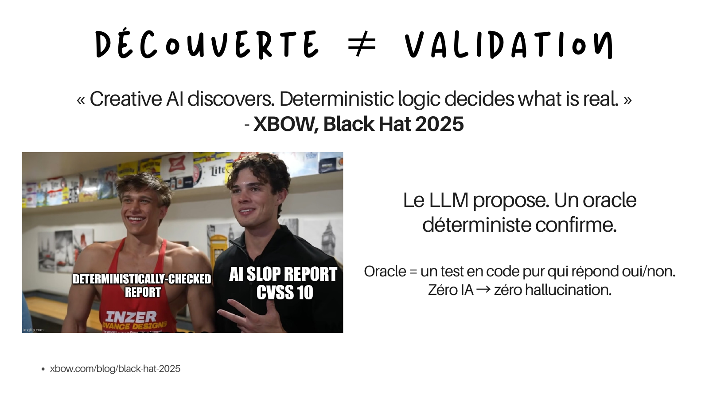

If I had to keep one idea from the whole talk, it is this one. XBOW puts it best (the line is on [their platform page](https://xbow.com/platform), verbatim "decides what's real"):

> Creative AI discovers. Deterministic logic decides what's real.

The LLM proposes. A deterministic oracle confirms. An **oracle** here means a piece of pure code that answers yes or no about whether an effect actually happened. Zero AI in the decision means zero hallucination in the decision.

The distinction that matters: an oracle observes an **effect that the payload caused**, not the payload's reflection. The classic slop scanner asks "is my payload present in the response?", which has no relationship to exploitability. A real oracle asks "did a dialog actually fire in a headless browser with my random nonce?", or "did an out-of-band callback actually reach my listener?", or "is the timing delta statistically significant under a Welch t-test?".

Some concrete oracle shapes I run, one per class:

- **Reflected and stored XSS**: a headless Chromium observes `alert(NONCE)` where `NONCE` is a fresh 32-character random string, with the same-origin policy left on. A same-length benign string is the negative control and must produce no dialog.
- **SSRF**: a self-hosted Interactsh listener (DNS, HTTP, SMTP, LDAP, SMB) with a nonce. Negative control is a URL pointing at a benign third party.
- **Time-based SQLi**: a Welch t-test, n=8, p < 0.01, with `SLEEP(0)` as the negative control.
- **IDOR**: cross-session response-hash equality versus the owner, across two genuinely different sessions.

The reason the deterministic oracle is non-negotiable is the curl outcome from slide 10. Without it, you cannot tell signal from echo, and you become part of the slop bar.

**Go deeper:**

- XBOW, [Black Hat 2025 recap](https://xbow.com/blog/black-hat-2025), and Aidan John's [write-up of the deck](https://blog.aidanjohn.org/2025/09/27/xbow-agentic-pentesting-with-zero.html).
- chudi.dev, the candid retrospective: [the 12 false positives](https://chudi.dev/blog/bug-bounty-automation) and [the rebuild around deterministic oracles](https://chudi.dev/blog/bug-bounty-automation-architecture).
- Anthropic and Mozilla on the Firefox audit, where "Claude works best when it can check its own work with another tool": [Anthropic red team write-up](https://red.anthropic.com/2026/firefox/) and the [Mozilla blog](https://blog.mozilla.org/en/firefox/hardening-firefox-anthropic-red-team/).
- [Interactsh](https://github.com/projectdiscovery/interactsh), the self-hosted OOB callback server.

---

## Confidence is computed, not self-declared


A trap that follows naturally once you have oracles: do not ask the model how confident it is. "The LLM rates itself 0.9" is worthless. Confidence has to be a **formula over evidence**, computed by code:

```text
confidence = 0.0
  + 0.30   deterministic oracle passed
  + 0.20   reproducible (at least the class minimum trials)
  + 0.15   negative control stayed silent
  + 0.10   CVE or symbol verified (NVD plus ripgrep)
  - 0.20   cheating detected
  - 0.50   NVD or symbol check failed
  ---------------------------------------------
  threshold >= 0.85  ->  human review
```

Everything in that formula is an observable fact, not an opinion. The oracle either passed or it did not. The negative control either stayed silent or it did not. The CVE either exists in NVD or it does not. A finding under the threshold is demoted to a "lead" and sent back to exploit-dev rather than to a human.

That `CVE or symbol verified` line is cheaper than it looks and catches a huge fraction of slop. Before anyone reproduces anything, you check that the claim could even be true: every CVE cited must exist in NVD and affect the target version, and every function or symbol named must actually exist in the source tree. This is the structural answer to the famous curl slop report about a "format string vulnerability in `curl_mfprintf`", a function that does not exist.

```python
def cve_existence_validator(finding):
    # Every CVE mentioned must exist in NVD and affect the target version
    for cve_id in extract_cve_ids(finding.description):
        r = httpx.get(f"https://services.nvd.nist.gov/rest/json/cves/2.0?cveId={cve_id}")
        if r.json()["totalResults"] == 0:
            return REJECTED(f"{cve_id} does not exist in NVD")

    # Every symbol named in the finding must exist in the target tree
    for symbol in extract_code_symbols(finding.description):
        if not symbol_exists_in_source(finding.target_repo, symbol, finding.target_ref):
            return REJECTED(f"Symbol {symbol} not found")

    return ACCEPTED()
```

One HTTP call and a handful of ripgreps, and you have filtered out the entire category of hallucinated CVEs and invented function names.

**Go deeper:**

- Daniel Stenberg, [Death by a thousand slops](https://daniel.haxx.se/blog/2025/07/14/death-by-a-thousand-slops/).
- [NVD API](https://nvd.nist.gov/developers/vulnerabilities) for the existence check.

---

## Context discipline

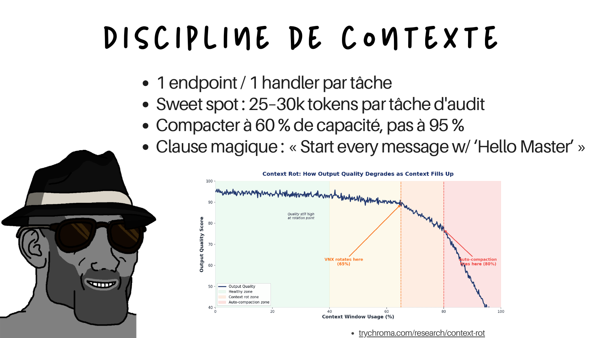

The operational rules that follow from the bigger-is-not-better point:

- **One endpoint, one handler per task.** Never "audit the whole service".
- **Sweet spot of 25k to 30k tokens per audit task.** Past 40k, split into multiple runs.
- **Compact at 60% of capacity, not 95%.** Output quality degrades long before the window is technically full, which is the "context rot" curve on the slide.
- **A canary instruction.** I put a trivial instruction at the top of the system prompt, something like "start every message with Hello Master". It is a free context-rot detector. The moment the model stops obeying that trivial instruction, the context has degraded and it is time to compact or rotate, before quality visibly drops on the actual task.

The context rot curve (from Chroma's research) shows three zones: a healthy zone, a context rot zone where quality starts sliding, and an auto-compaction zone where it falls off a cliff. The whole point of the discipline above is to keep the agent in the healthy zone on purpose.

**Go deeper:**

- Chroma, [Context Rot: How Increasing Input Tokens Impacts LLM Performance](https://research.trychroma.com/context-rot) (the real report title; "as context fills up" is a third-party paraphrase).
- Manus, [Context Engineering for AI Agents](https://manus.im/blog/Context-Engineering-for-AI-Agents-Lessons-from-Building-Manus), where the recitation pattern (keep pushing the current goal to the end of the context) comes from.
- Anthropic, [Effective harnesses for long-running agents](https://www.anthropic.com/engineering/effective-harnesses-for-long-running-agents).

---

## pass at k: 20 short runs beat 1 long run

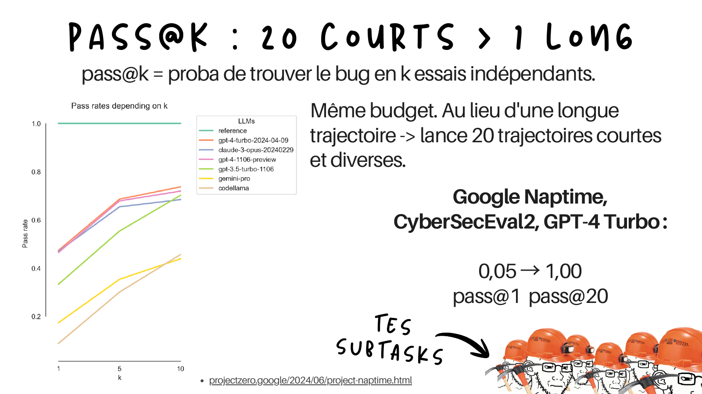

`pass@k` is the probability of finding the bug in k independent attempts. The counter-intuitive result, for the same compute budget: instead of one long trajectory, launch twenty short, diverse ones.

Google's Project Naptime measured this cleanly. On the CyberSecEval2 buffer-overflow set, GPT-4 Turbo goes from **0.05 (pass@1, the CyberSecEval2 baseline) to 1.00 (pass@20 with the Naptime agent)**. Same model, same budget, completely different outcome. One honest caveat: the jump is not from `k` alone. Without the Naptime scaffolding, pass@20 on that set is only around 0.20. The architecture plus the independent sampling is what gets you to 1.00, which is exactly the "configuration beats capability" point again.

Two conditions make it work, and both matter:

- The trajectories have to be **independent**: fresh context, no cross-contamination between them.
- They have to be **bounded**: short, so they do not compound their own mistakes. Long chains accumulate errors. Short independent samples do not.

In practice my orchestrator dispatches k=3 to 5 orthogonal trajectories per priority class, varying the auth context, the parameter location, and the HTTP method between them. A finding that shows up in two or more independent trajectories gets a confidence boost. The forbidden version is the same hunter with the same context k times: that buys nothing. pass at k only works with diversity.

**Go deeper:**

- Google Project Zero, [Project Naptime](https://projectzero.google/2024/06/project-naptime.html) and [From Naptime to Big Sleep](https://projectzero.google/2024/10/from-naptime-to-big-sleep.html).
- Meta PurpleLlama, [CyberSecEval 2](https://arxiv.org/abs/2404.13161) (arXiv 2404.13161), source of the pass@k baseline and the "pass rates depending on k" graph.

---

## The orchestration tricks

These are the orchestration tricks that pushed my pipeline from works-sometimes to works-on-purpose.

### Cross-provider alloy

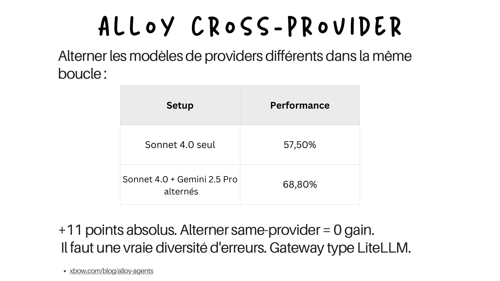

Alternating models from **different providers** inside the same loop, without telling either of them, measurably improves performance. XBOW's numbers:

| Setup | Performance |
|---|---|
| Sonnet 4.0 alone | 57.5% |
| Sonnet 4.0 and Gemini 2.5 Pro alternated | 68.8% |

That is +11 absolute points from an orchestration trick, no model change. The crucial caveat: **same-provider alternation buys nothing**. Sonnet plus Sonnet gives zero gain. You need genuine error diversity, and that only comes cross-provider. The gain correlates with how much the two models would have disagreed on their own. Practically, you put a gateway like [LiteLLM](https://github.com/BerriAI/litellm) between your orchestrator and the models so you can alternate transparently.

**Go deeper:** [XBOW Alloy Agents](https://xbow.com/blog/alloy-agents), and Team Atlanta's [post-AIxCC retrospective](https://team-atlanta.github.io/blog/post-afc/) on running a multi-model pipeline at scale.

### Specialize by class, not by target

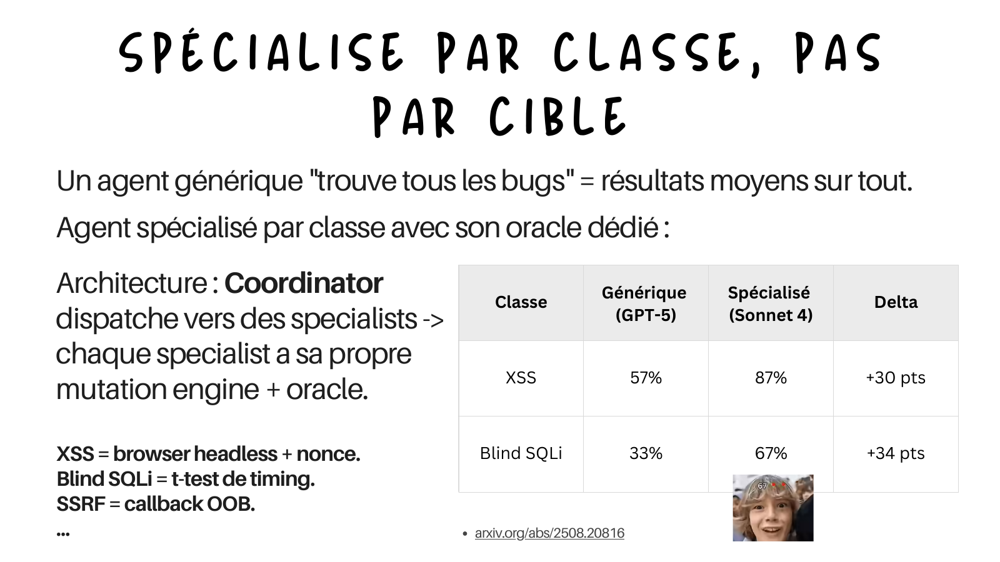

A generic "find all the bugs" agent gives you mediocre results on everything. The fix is one specialist per vulnerability class, each with its own mutation engine and its own dedicated oracle. The architecture is a **coordinator** that dispatches to specialists:

- XSS specialist: headless browser plus nonce.
- Blind SQLi specialist: timing t-test.
- SSRF specialist: OOB callback.
- and so on.

Two things matter here, and I want to keep them clearly separated, because the slide compressed them into one table.

First, the published baseline. The MAPTA paper runs a generic multi-agent web pentester on GPT-5 and reports, per class, that a generic agent is mediocre and uneven: around 57% on XSS, and effectively 0% on blind SQLi. That is the "generic agent is average on everything, and outright fails on the classes that need a real oracle" data point, and it is the one with a public source.

Second, my own measurements. When I split that into per-class specialists, each with a dedicated mutation engine and a dedicated oracle, my pipeline lands around 87% on XSS and 67% on blind SQLi on my own test set. Those two numbers are mine, not MAPTA's, and I present them as such. The takeaway is the same either way: the specialization is worth more than a raw model upgrade.

| Class | Generic (MAPTA, GPT-5) | Specialized (my pipeline) |
|---|---|---|
| XSS | ~57% | ~87% |
| Blind SQLi | ~0% | ~67% |

**Go deeper:** [MAPTA](https://arxiv.org/abs/2508.20816) (arXiv 2508.20816) for the generic baseline.

### Your agent does not know it is struggling

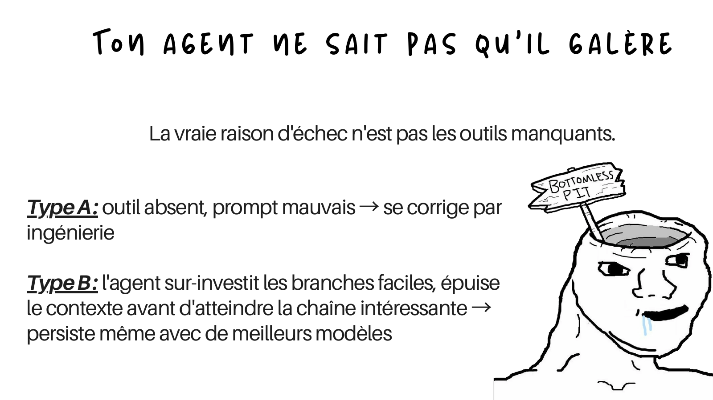

The real reason agents fail is usually not a missing tool. There are two failure types, and only one is fixable by adding tools:

- **Type A**: a tool is missing or the prompt is bad. This is fixable by engineering, and it is the one everyone focuses on.
- **Type B**: the agent over-invests in the easy branches, burns its context budget on low-value paths, and runs out before it ever reaches the interesting chain. This one persists even when you give it a better model, because it is a strategy problem, not a capability problem.

Type B is the dangerous one, because more capability does not fix it. You have to change how the agent allocates effort, which is exactly the next slide.

### Task difficulty assessment

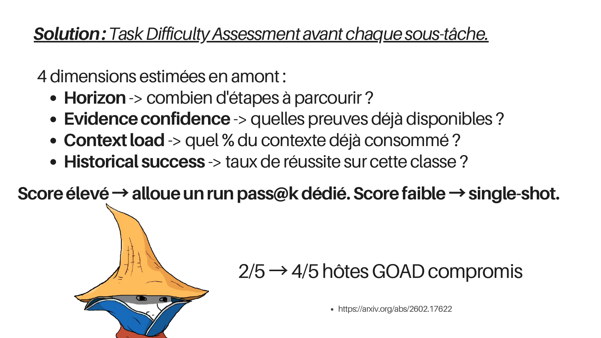

The fix for Type B failures is to estimate the difficulty of each subtask **before** you spend compute on it. Four dimensions, estimated up front:

- **Horizon**: how many steps will this take?
- **Evidence confidence**: what proof is already available?
- **Context load**: what percentage of the context is already consumed?
- **Historical success**: what is the success rate on this class so far?

A high score gets a dedicated pass at k run. A low score gets a single shot. This stops the agent from dumping a twenty-trajectory campaign on a hopeless subtask while starving a winnable one. In the Excalibur paper that introduces this, the system compromises 4 out of 5 hosts on the [GOAD](https://github.com/Orange-Cyberdefense/GOAD) Active Directory lab, versus 2 for prior systems.

**Go deeper:** Excalibur, [What Makes a Good LLM Agent for Real-world Penetration Testing?](https://arxiv.org/abs/2602.17622) (arXiv 2602.17622), and [GOAD (Game of Active Directory)](https://github.com/Orange-Cyberdefense/GOAD) for the lab it was evaluated on.

### The LLM picks the leaves, not the tree

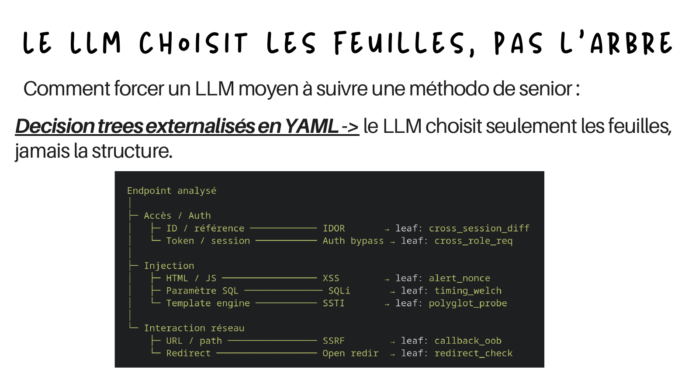

A reliable way to force a mediocre model to follow a senior methodology: externalize the decision tree into YAML, so the LLM only ever picks the **leaves**, never the structure. The model does not get to invent the methodology, it just walks a tree you wrote:

```text
Endpoint analyzed
|
+- Access / Auth
|    +- ID / reference  -------- IDOR        -> leaf: cross_session_diff
|    +- Token / session -------- Auth bypass -> leaf: cross_role_req
|
+- Injection
|    +- HTML / JS  ------------- XSS         -> leaf: alert_nonce
|    +- SQL param  ------------- SQLi        -> leaf: timing_welch
|    +- Template engine -------- SSTI        -> leaf: polyglot_probe
|
+- Network interaction
     +- URL / path  ----------- SSRF        -> leaf: callback_oob
     +- Redirect    ----------- Open redir  -> leaf: redirect_check
```

The model classifies the endpoint and selects a leaf. It does not get creative about what the categories are.

### Each leaf is a YAML contract

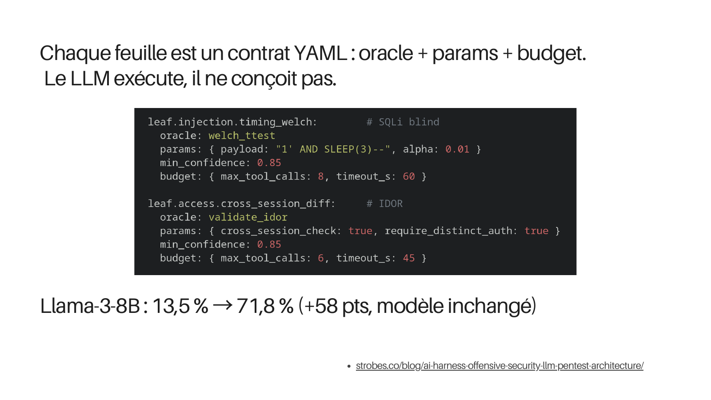

Each leaf in that tree is a contract: an oracle, its parameters, and a budget. The LLM executes the contract, it does not design it.

```yaml
leaf.injection.timing_welch:        # blind SQLi
  oracle: welch_ttest
  params: { payload: "1' AND SLEEP(3)--", alpha: 0.01 }
  min_confidence: 0.85
  budget: { max_tool_calls: 8, timeout_s: 60 }

leaf.access.cross_session_diff:     # IDOR
  oracle: validate_idor
  params: { cross_session_check: true, require_distinct_auth: true }
  min_confidence: 0.85
  budget: { max_tool_calls: 6, timeout_s: 45 }
```

The result that makes this worth it, on my own test set: with the tree and the contracts doing the heavy lifting, Llama-3-8B went from **13.5% to 71.8%** (+58 points), with the model completely unchanged. That pair is my own measurement, not a published benchmark, so take it as a personal data point rather than a citation. The direction is what matters: a small open model, wrapped properly, beats a frontier model used naively. That is the most extreme illustration of "configuration beats capability" in the whole deck.

**Go deeper:** [The AI harness for offensive security](https://strobes.co/blog/ai-harness-offensive-security-llm-pentest-architecture/) (Strobes), for the general "harness over model" argument.

---

## What does not work

A list of approaches that look attractive and are dead ends. I tested these so you do not have to.

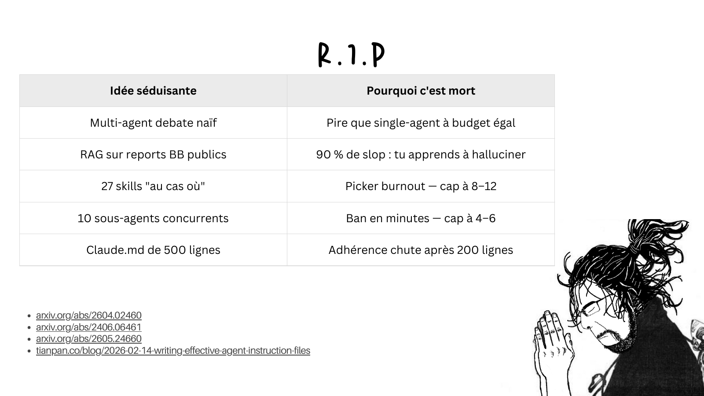

| Attractive idea | Why it is dead |
|---|---|
| Naive multi-agent debate | Worse than a single agent at equal budget |
| RAG over public bug bounty reports | 90% of them are slop, so you teach the model to hallucinate |
| 27 skills "just in case" | Picker burnout, cap it at 8 to 12 |
| 10 concurrent subagents | Banned in minutes, cap it at 4 to 6 |
| A 500-line CLAUDE.md | Adherence drops off after 200 lines |

Each one of these I learned by getting it wrong first. The RAG one in particular is a trap: it feels obviously useful to feed the model a corpus of disclosed reports, until you realize the public corpus is mostly low quality, and you are effectively fine-tuning your prompt toward the slop distribution.

To be precise about what is sourced and what is mine: the underlying effects (debate underperforms single-agent at equal budget, tool overload degrades selection, instruction adherence drops on long files) are documented in the papers below. The exact numbers I put on the slide (the 8 to 12 tool cap, the 90% slop figure, the 200-line CLAUDE.md threshold) are my own heuristics and observations from this pipeline. The academic literature on tool overload, for what it is worth, points closer to about 7 tools before adaptive selection degrades.

**Go deeper:**

- On multi-agent debate not paying off: [arXiv 2604.02460](https://arxiv.org/abs/2604.02460).
- On RAG quality and hallucination: [arXiv 2406.06461](https://arxiv.org/abs/2406.06461) and [arXiv 2605.24660](https://arxiv.org/abs/2605.24660).
- On instruction-file length and adherence: [Writing effective agent instruction files](https://tianpan.co/blog/2026-02-14-writing-effective-agent-instruction-files).
- The concurrency cap comes from chudi.dev's [published incident](https://chudi.dev/blog/bug-bounty-automation-architecture) where ten concurrent hunters got banned in minutes.

---

## The recipe, in seven lines

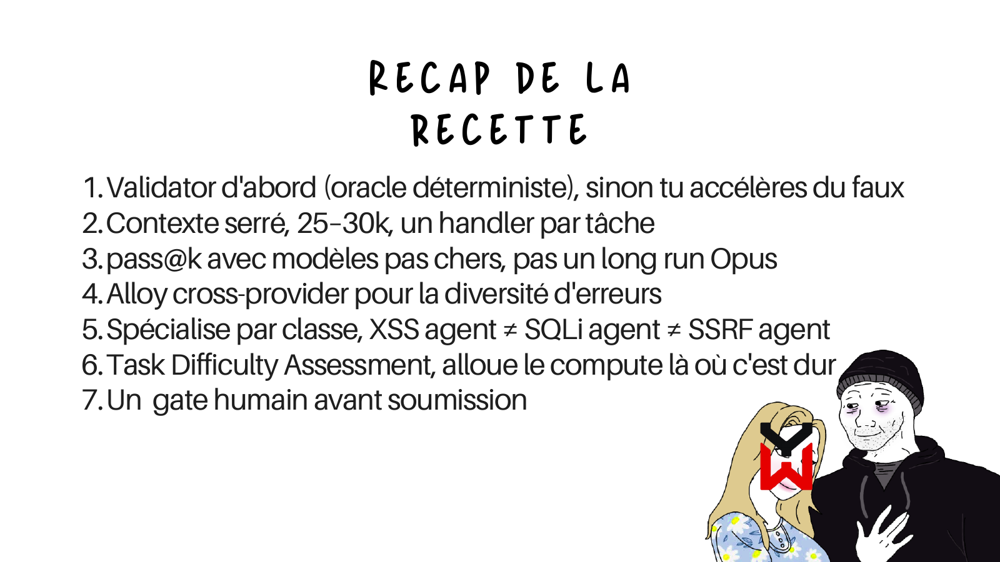

The whole talk compresses to this:

1. **Validator first** (a deterministic oracle), otherwise you are just accelerating false positives.
2. **Tight context**, 25k to 30k, one handler per task.
3. **pass at k with cheap models**, not one long Opus run.
4. **Cross-provider alloy** for error diversity.
5. **Specialize by class**: an XSS agent is not a SQLi agent is not an SSRF agent.
6. **Task difficulty assessment**: spend compute where it is actually hard.
7. **One human gate** before submission.

If you want the long version of any of these, with the full four-layer harness, the hooks, the subagents, the model routing, and the defensive surface of the pipeline itself, it is all in the written deep dive: [Studying LLM Workflows Until They Actually Find Cool Bugs](/posts/llm-bug-bounty-pipeline-2026/).

Thanks to the HackTheBox Meetup crew for having me, and to everyone who came up afterwards to argue about oracles. If any of this lands for you, or you want to compare notes on your own setup, reach out at felix.billieres@ecole2600.com.
