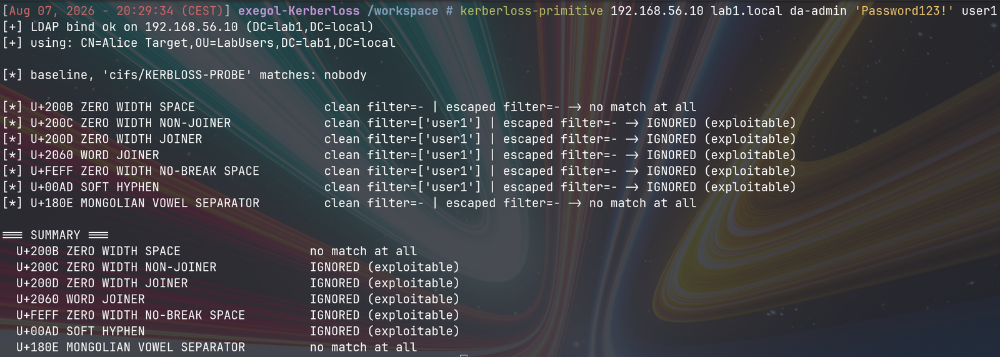
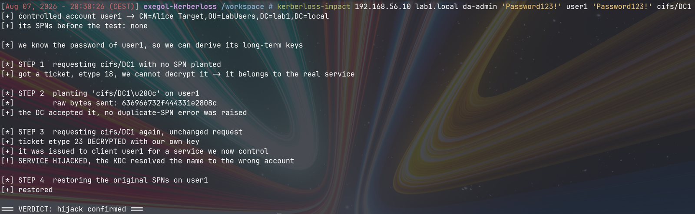
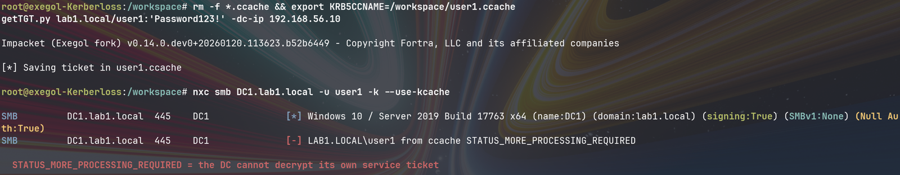
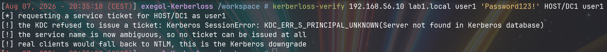
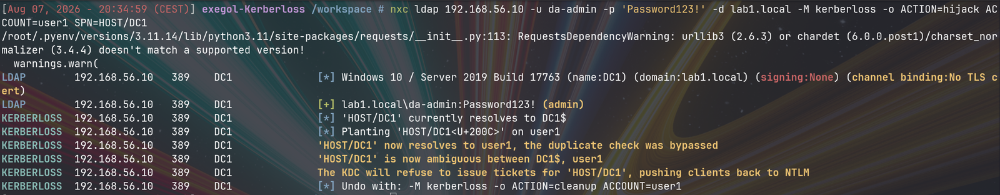
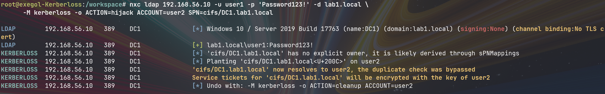
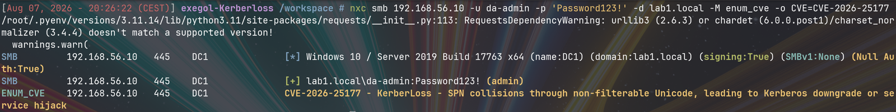
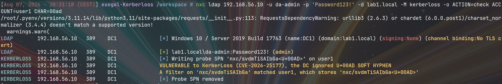
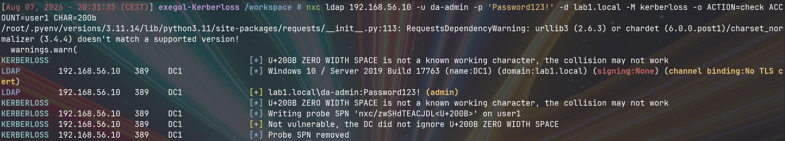
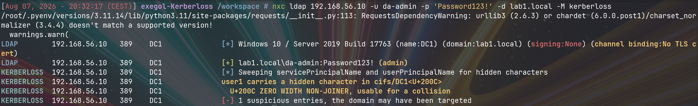

Here is a service principal name:

```
cifs/DC1
```

And here is another one:

```
cifs/DC1‌
```

They are not the same string. The second one ends with `U+200C`, a zero width non-joiner. Three bytes, `e2 80 8c`, that your terminal, your browser and your eyes all agree to pretend do not exist.

Active Directory stores that second value happily. It also, when asked to find `cifs/DC1`, hands it back to you. Both facts are individually reasonable. Together they are CVE-2026-25177, and they are enough to make a domain controller encrypt its own service tickets with an attacker's password.

This post is the full reconstruction: what I read, what I tested, what each output told me to do next, and what I got wrong on the way. There is no public proof of concept for this one, so everything here was rebuilt from a prose description. Part 1 assumes you know nothing about Kerberos. From Part 6 onward I assume you have used impacket at least once.

---

## Part 1: how a name becomes a key

Kerberos is usually taught as a diagram with three arrows. For this vulnerability you only need one idea, so let's get it exactly right.

When a client wants to reach a service, it does not negotiate with that service. It goes to the domain controller, which acts as a ticket office: the **KDC**.

The client sends a `TGS-REQ` containing a field called `sname`, the name of the service it wants, something like `cifs/DC1`. The KDC must turn that string into an account, because a Kerberos ticket is **encrypted with the long-term key of the account that owns the service**, and that key is derived from the account's password.

The service then decrypts the ticket with its own key. If it opens, the ticket is genuine. That is the whole trust model, and it rests on one assumption:

> A service name maps to exactly one account, and the KDC knows which one.

So the interesting question is not "how does Kerberos work". It is: **how does the KDC turn that string into an account?**

It runs an LDAP filter against the directory. Roughly `(servicePrincipalName=cifs/DC1)`.

That is the sentence to hold on to. The security of Kerberos service resolution is, at the bottom, a directory string comparison — the same comparison LDAP exposes, which is why I can probe it with an LDAP client.

### The detail almost nobody notices

Before going further, dump the SPNs actually stored on a real domain controller's computer account:

```
Dfsr-12F9A27C-.../DC1.lab1.local
TERMSRV/DC1
ldap/DC1.lab1.local
DNS/DC1.lab1.local
GC/DC1.lab1.local/lab1.local
RestrictedKrbHost/DC1
HOST/DC1
HOST/DC1.lab1.local
...
```

That is the complete list. Read it again and notice what is **missing**: there is no `cifs/DC1`. None. Yet every Windows machine on that network mounts SMB shares on the DC using exactly that name, all day long.

The explanation is an attribute called `sPNMappings`, on the `Directory Service` object in the configuration partition. It declares that the `HOST` class implicitly covers a long list of other service classes: `cifs`, `http`, `www`, `dns`, `ftp`, and dozens more. So when the KDC is asked for `cifs/DC1` and the directory returns nothing, it retries the lookup against `HOST/DC1` and answers with the DC.

This is a fallback, and fallbacks have priority rules. This one has a rule that matters enormously:

> An explicitly stored SPN always wins over one derived through `sPNMappings`.

That is not a bug. It is exactly what you want: if an administrator explicitly assigns `cifs/FILESERVER` to a dedicated service account, that assignment must override the generic `HOST` mapping. The rule is correct. It only becomes a weapon once you can write an explicit SPN that the uniqueness check fails to recognise as a duplicate.

Here is the whole vulnerability in one picture, the normal path on top and the poisoned one below:


%%{init: {'theme':'base','themeVariables':{'background':'#ffffff','fontSize':'15px','primaryColor':'#dbeafe','primaryTextColor':'#0f172a','primaryBorderColor':'#1e40af','lineColor':'#334155','textColor':'#0f172a','actorBkg':'#dbeafe','actorTextColor':'#0f172a','actorBorder':'#1e40af','noteBkgColor':'#fef08a','noteTextColor':'#0f172a','noteBorderColor':'#a16207','signalColor':'#0f172a','signalTextColor':'#0f172a','labelBoxBkgColor':'#fef08a','labelTextColor':'#0f172a','sequenceNumberColor':'#ffffff'}}}%%
sequenceDiagram
    autonumber
    participant C as Client
    participant KDC as KDC (DC1)
    participant DIR as Directory

    rect rgb(209, 250, 229)
    Note over C,DIR: Normal resolution
    C->>KDC: TGS-REQ, sname = cifs/DC1
    KDC->>DIR: (servicePrincipalName=cifs/DC1)
    DIR-->>KDC: no explicit SPN stored
    KDC->>DIR: retry via sPNMappings, HOST/DC1
    DIR-->>KDC: DC1$
    KDC-->>C: ticket encrypted with the key of DC1$ (AES256)
    end

    rect rgb(254, 226, 226)
    Note over C,DIR: After planting "cifs/DC1 + U+200C" on user1
    C->>KDC: TGS-REQ, sname = cifs/DC1 (identical request)
    KDC->>DIR: (servicePrincipalName=cifs/DC1)
    Note right of DIR: the stored U+200C is dropped<br/>before the comparison
    DIR-->>KDC: user1
    KDC-->>C: ticket encrypted with the key of user1 (RC4)
    end


Same request, twice. Different account, twice.

---

## Part 2: what I started from

Two published sources, and nothing else:

- [Semperis' write-up](https://www.semperis.com/blog/identity-crisis-novel-vulnerabilities-leading-to-kerberos-downgrade-dos-and-full-domain-takeover/), which describes the mechanism and names three exploitation scenarios, but ships no proof of concept and no usable list of characters. Its core claim is one sentence: *"The Unicode character in the filter was ignored, either by PowerShell or by the DC."* Note the *"either / or"*: even the original researchers were not stating which layer did it.
- [danaug23's read-only scanner](https://github.com/danaug23/detect_CVE-2026-25177), which looks for the aftermath rather than reproducing the cause.

For the sibling vulnerability in the same research, ResetNightmare (CVE-2026-27912), there is [a public PoC](https://github.com/Semperis-Community/ResetNightmare). For KerberLoss there was none.

So the starting position is: a claimed behaviour, no code, no character list, and an open question about which component is responsible. Everything below runs against a Windows Server 2019 DC at build 17763.5329, well under the March 2026 fix.

Worth keeping open: RFC 4120 for Kerberos, RFC 4515 for how LDAP filters escape arbitrary bytes, and MS-ADTS for `sPNMappings`.

---

## Part 3: does the DC ignore it at all?

The first question is deliberately the dumbest one available, because the write-up left an ambiguity I can kill immediately. If PowerShell was mangling the filter, then talking raw LDAP would make the problem vanish. If the DC is doing it, going raw changes nothing.

So I wrote a quick script that talks straight LDAP through impacket, with no PowerShell anywhere in the path. For each candidate character it writes `cifs/KERBLOSS-PROBE<character>` onto a throwaway account, searches for `(servicePrincipalName=cifs/KERBLOSS-PROBE)` **without** the character, and prints which accounts came back. It runs the same search with the character escaped byte by byte per RFC 4515 as a control, and strips the SPN off the account afterwards.

The core is three lines:

```python
conn.modify(dn, {"servicePrincipalName": [(MODIFY_REPLACE, BASE_SPN + char)]})
clean   = count_matches(conn, base_dn, BASE_SPN)                      # filter without the character
escaped = count_matches(conn, base_dn, ldap_escape(BASE_SPN + char))  # byte-exact filter
```



Read that output the way you would during an engagement. Three separate facts fall out of it.

**The baseline is clean.** `cifs/KERBLOSS-PROBE` matches nobody before I start, so any later match is caused by me and not by some pre-existing object. Always establish this, otherwise a positive result proves nothing.

**Five characters return the account through the clean filter.** No PowerShell in the path, so the ambiguity in the original write-up is settled: **the DC does this**, not the client library.

**Two characters return nothing on either filter.** At the time I read that as an anomaly worth chasing. It was not. My escaped-filter control was broken and I would not find out for days, so take only the clean-filter column at face value for now. It is the column that carries the vulnerability, and it is the one that was never in doubt. Part 6 is about how the other one fooled me.

---

## Part 4: mapping every behaviour

The write-up mentions three categories of behaviour. I had just seen something matching none of them, so the next move is to stop testing one thing at a time and instrument properly.

So I wrote a second script that, for each character, does four things: writes the value, **reads back what the DC actually stored** and dumps it as raw hex to catch silent rewriting, tries three different filter shapes against it, and classifies the result. The three shapes are the interesting part, because each one tests a distinct hypothesis:

| Filter shape | Hypothesis it tests |
|---|---|
| `cifs/KERBLOSS-PROBE` (clean) | the character was **removed** before comparison |
| `cifs/KERBLOSS-PROBE ` (with a space) | the character was **folded to a space** |
| RFC 4515 escaped, byte for byte | the character was **kept literally** |

That is the whole trick at this stage: instead of asking "does it match", ask three questions whose answers are mutually exclusive, and the output classifies itself.

| Character | Stored intact | Behaviour | Exploitable |
|---|:---:|---|:---:|
| U+200C ZERO WIDTH NON-JOINER | yes | ignored when filtering | **yes** |
| U+200D ZERO WIDTH JOINER | yes | ignored when filtering | **yes** |
| U+2060 WORD JOINER | yes | ignored when filtering | **yes** |
| U+FEFF ZERO WIDTH NO-BREAK SPACE | yes | ignored when filtering | **yes** |
| U+00AD SOFT HYPHEN | yes | ignored when filtering | **yes** |
| U+034F COMBINING GRAPHEME JOINER | yes | ignored when filtering | **yes** |
| U+061C ARABIC LETTER MARK | yes | ignored when filtering | **yes** |
| U+180E MONGOLIAN VOWEL SEPARATOR | yes | treated as a space | no |
| U+3000 IDEOGRAPHIC SPACE | yes | treated as a space | no |
| U+0009 TAB | yes | filters normally | no |
| U+200B ZERO WIDTH SPACE | yes | kept literally | no |
| U+00A0 NO-BREAK SPACE | yes | kept literally | no |
| U+2000 EN QUAD | yes | kept literally | no |
| U+2028 LINE SEPARATOR | yes | kept literally | no |

Two immediate conclusions, one open problem.

**Every value is stored intact.** The hex dump matches what I sent, byte for byte, in all fourteen cases. The DC is not rewriting anything on write. Whatever happens, happens at **comparison** time. That one observation eliminates a whole family of hypotheses and points the rest of the investigation squarely at the matching engine.

**The published research names a character that does not work here.** Semperis lists `0x200B` as usable. On this DC it lands in the fourth bucket instead. That is not an error on their part, it is a signal: the behaviour depends on something version-specific, and any tool built on this should let the operator pick the character rather than hardcoding one.

**And two characters seem to match nothing at all.** That is the thread I pulled on for far too long before checking my own instrument.

---

## Part 5: why, actually

This is the part that turns a reproduction into research. I can already exploit the bug. I cannot yet *explain* it, which means I cannot predict it on another OS version,.

### Forming the hypothesis

Look at the exploitable set again, but ignore the names and look them up in the Unicode character database instead:

```
U+200C ZWNJ    Cf    U+2060 WORD JOINER    Cf    U+034F CGJ    Mn
U+200D ZWJ     Cf    U+FEFF BOM            Cf    U+061C ALM    Cf
U+00AD SHY     Cf
```

Mostly `Cf`, "format" characters, but `U+034F` is `Mn`, a combining mark. So general category is not the discriminator. There is, however, a Unicode property that groups exactly this kind of thing: **`Default_Ignorable_Code_Point`**, defined in `DerivedCoreProperties.txt`. It marks code points that a conforming implementation should render as nothing and that string-processing routines are expected to skip.

Cross-referencing my results against that property:

```
U+00AD  Cf   DICP=True    IGNORED
U+034F  Mn   DICP=True    IGNORED
U+061C  Cf   DICP=True    IGNORED
U+200C  Cf   DICP=True    IGNORED
U+200D  Cf   DICP=True    IGNORED
U+2060  Cf   DICP=True    IGNORED
U+FEFF  Cf   DICP=True    IGNORED
U+0009  Cc   DICP=False   filters normally
U+00A0  Zs   DICP=False   unreachable
U+2000  Zs   DICP=False   unreachable
U+2028  Zl   DICP=False   unreachable
U+3000  Zs   DICP=False   treated as a space
U+200B  Cf   DICP=True    unreachable          <- exception
U+180E  Cf   DICP=True    treated as a space   <- exception
```

Every single exploitable character is `Default_Ignorable`. Nothing outside that set is exploitable. That is not a coincidence, that is the rule.

So the mechanism is: **the comparison is not performed on the stored bytes, it is performed on a normalised form, and normalisation strips `Default_Ignorable` code points.** Both sides of the comparison go through it, which is precisely why the attack works.


%%{init: {'theme':'base','themeVariables':{'background':'#ffffff','fontSize':'15px','primaryColor':'#dbeafe','primaryTextColor':'#0f172a','primaryBorderColor':'#1e40af','lineColor':'#334155','textColor':'#0f172a','clusterBkg':'#f8fafc','clusterBorder':'#94a3b8','edgeLabelBackground':'#ffffff'}}}%%
flowchart TB
    subgraph W["Write path"]
        W1["cifs/DC1 + U+200C"] --> W2["stored verbatim<br/>63 69 66 73 2f 44 43 30 31 <b>e2 80 8c</b>"]
        W2 --> W3["uniqueness check runs on the<br/><b>normalised</b> form"]
    end
    subgraph S["Search path"]
        S1["filter: (servicePrincipalName=cifs/DC1)"] --> S2["normalised the same way"]
    end
    W3 --> N["<b>Normalisation</b><br/>Default_Ignorable code points<br/>are removed"]
    S2 --> N
    N --> M["both sides become<br/><b>cifs/DC1</b>"]
    M --> R["the filter matches<br/>a value it never equalled"]

    classDef attack fill:#fca5a5,stroke:#b91c1c,stroke-width:2px,color:#450a0a
    classDef norm fill:#fde68a,stroke:#b45309,stroke-width:2px,color:#451a03
    classDef ok fill:#bfdbfe,stroke:#1e40af,stroke-width:2px,color:#0f172a
    class W1,R attack
    class N,M norm
    class W2,W3,S1,S2 ok


And now the uniqueness check makes sense too. It is not broken. It is doing its job perfectly, on a string that has already had three bytes removed. `cifs/DC1<U+200C>` normalises to `cifs/DC1`, which is unique, because nobody stores `cifs/DC1` explicitly, because it comes from `sPNMappings`. The check passes honestly.

Every component here behaves correctly. The composition is catastrophic.

### Killing an alternative explanation

There is a boring possibility I have to eliminate before believing any of this. Every test so far placed the character at the **end** of the value. Trailing whitespace is routinely trimmed, either on the stored value or in the filter, and that alone could produce several of these results with no normalisation story at all.

So I wrote a third script that repeats the classification with the character in the **middle**, `cifs/KERBLOSS-PRO<char>BE`, where nothing can be trimmed. It prints the Unicode category and the `Default_Ignorable` flag next to each result, so the correlation appears in the output itself rather than being assembled afterwards in a spreadsheet.

```
codepoint  cat  DICP   dropped  -> space  literal  conclusion
U+200B     Cf   True   False    False     False    stored but unreachable by any filter tried
U+200C     Cf   True   True     False     False    DROPPED during normalisation
U+200D     Cf   True   True     False     False    DROPPED during normalisation
U+2060     Cf   True   True     False     False    DROPPED during normalisation
U+FEFF     Cf   True   True     False     False    DROPPED during normalisation
U+00AD     Cf   True   True     False     False    DROPPED during normalisation
U+034F     Mn   True   True     False     False    DROPPED during normalisation
U+061C     Cf   True   True     False     False    DROPPED during normalisation
U+180E     Cf   True   False    True      False    folded to a space
U+0009     Cc   False  False    False     True     kept literally, compares byte for byte
U+00A0     Zs   False  False    False     False    stored but unreachable by any filter tried
U+2000     Zs   False  False    False     False    stored but unreachable by any filter tried
U+3000     Zs   False  False    True      False    folded to a space
U+2028     Zl   False  False    False     False    stored but unreachable by any filter tried
```

Identical to the trailing-position results. Trimming is not involved, the normalisation explanation stands, and the position of the character is irrelevant, which incidentally makes the attack more flexible than it first appeared.

### The two exceptions, and what they say about Windows

`U+200B` and `U+180E` are `Default_Ignorable` yet not dropped. An exception either breaks a theory or sharpens it, so it is worth the detour.

Both share a history. `U+200B ZERO WIDTH SPACE` was classified as a space separator (`Zs`) until Unicode 4.0.1, when it moved to `Cf`. `U+180E MONGOLIAN VOWEL SEPARATOR` was `Zs` until Unicode 6.3, when it moved to `Cf` and gained `Default_Ignorable`.

And what do I observe? `U+180E` is **folded to a space**, which is precisely how a `Zs` character behaves. `U+3000 IDEOGRAPHIC SPACE`, an uncontroversial `Zs`, behaves identically.

So the rule is not "Windows implements `Default_Ignorable`". It is: **Windows normalises against its own character table, which is older than the current Unicode standard on these code points.** The exceptions are not exceptions to the mechanism, they are fossils in Microsoft's table.

That also explains, with no hand waving, why the published research and my lab disagree about `U+200B`: different Windows versions, different table vintages.

### The instrument was broken, and I built a category on it

That leaves `U+200B`, `U+00A0`, `U+2000` and `U+2028`: stored intact, retrieved by neither filter. I spent a long time on that. I wrote up a fourth behavioural class for it, called it a **concealment primitive**, reasoned that an SPN planted with `U+200B` would hide from every targeted `(servicePrincipalName=...)` query, and turned that into defensive advice.

All of it was wrong, and the reason is worth more than the conclusion it replaced.

My "byte-exact" control built filters like `cifs/PRO\e2\80\8cBE`, believing the `\XX` escapes put the three UTF-8 bytes of `U+200C` on the wire. They do not. impacket's filter parser resolves each escape with `chr(int(xx, 16))`, which yields three separate **code points**, `U+00E2 U+0080 U+008C`, and the encoder then serialises those as six bytes:

```
filter written : cifs/PRO\e2\80\8cBE
bytes on wire  : 63 69 66 73 2f 50 52 4f  c3a2 c280 c28c  42 45
bytes intended : 63 69 66 73 2f 50 52 4f  e2 80 8c        42 45
```

RFC 4515 escaping is defined on octets. impacket's parser works on code points. Every escape above `0x7F` came out as mojibake, so that column never tested what I thought it tested. "Unreachable by any filter" actually meant "unreachable by the clean filter, and by a filter containing six wrong bytes".

**The evidence was in my own table the whole time.** Look back at the taxonomy output: the escaped column reads `False` for all thirteen multi-byte characters, *including the five that demonstrably work*, and `True` for exactly one, `U+0009 TAB` — the only single-byte case in the set. A control that fires once in fourteen tries is not a control, it is a constant. I had a column of `False` that I read as a finding instead of as a broken instrument.

Re-running it properly, with the character itself in the filter so the encoder emits the stored bytes, and with the positive control I never had — escape every byte of a pure ASCII probe and confirm it still matches:

```
[+] POSITIVE CONTROL: fully escaped ASCII filter matches -> True ['user1']

codepoint    clean   space   exact bytes  conclusion
U+200B       False   False   True         kept literally, matches on its own bytes
U+200C       True    False   True         dropped before comparison
U+180E       False   True    True         folded to a space
U+00A0       False   False   True         kept literally, matches on its own bytes
U+2000       False   False   True         kept literally, matches on its own bytes
U+2028       False   False   True         kept literally, matches on its own bytes
U+0009       False   False   True         kept literally, matches on its own bytes
U+3000       False   True    True         folded to a space
```

There is no fourth category. Those four characters are stored and matched on their own bytes, which is the least interesting behaviour available. The taxonomy has three classes, exactly the three the original research described.

What survives is everything that mattered: the clean and space columns are pure ASCII and were never affected, so the seven exploitable characters, the `Default_Ignorable` correlation, and the whole vulnerability stand untouched. What died is a category I invented and the defensive advice I derived from it.

The lesson is not "check your tools", which everybody already agrees with and nobody acts on. It is more specific: **a control that never fires is indistinguishable from a control that always passes.** Mine returned `False` fourteen times and I treated the one deviation as signal. The positive control — prove the instrument can produce a `True` at all — costs one line, and I wrote this entire section because I skipped it.

Here is the complete decision tree, mechanism and all:


%%{init: {'theme':'base','themeVariables':{'background':'#ffffff','fontSize':'15px','primaryColor':'#dbeafe','primaryTextColor':'#0f172a','primaryBorderColor':'#1e40af','lineColor':'#334155','textColor':'#0f172a','edgeLabelBackground':'#ffffff'}}}%%
flowchart TD
    A["A character is written into an SPN"] --> B{"Is it Default_Ignorable<br/>in the table Windows uses?"}
    B -- yes --> C["<b>Removed</b> before comparison<br/>U+200C U+200D U+2060<br/>U+FEFF U+00AD U+034F U+061C"]
    B -- no --> D{"Is it a space separator<br/>in that table?"}
    D -- yes --> E["<b>Folded to U+0020</b><br/>U+180E U+3000"]
    D -- no --> G["<b>Kept literally</b><br/>compares on its own bytes<br/>U+0009 U+200B U+00A0 U+2000 U+2028"]

    C --> C2["collision, the SPN is hijackable"]
    E --> E2["no collision, the space is visible in the filter"]
    G --> G2["no collision, ordinary comparison"]

    classDef win fill:#86efac,stroke:#15803d,stroke-width:2px,color:#052e16
    classDef dead fill:#e2e8f0,stroke:#64748b,color:#0f172a
    class C,C2 win
    class E,E2,G,G2 dead


The absurdity is worth pausing on. `U+00AD SOFT HYPHEN` is a typographic hint meaning "you may break the word here". `U+061C ARABIC LETTER MARK` nudges bidirectional text rendering. `U+034F COMBINING GRAPHEME JOINER` was added largely to fix sorting edge cases. None of them were designed anywhere near a security boundary, and all of them dissolve one, because a rendering-layer concept leaked into a comparison used for authorisation.

### How far does this actually reach?

Everything so far was measured on one attribute. That is a sampling problem, not a conclusion. If the dropping happens inside a shared string-comparison layer rather than inside SPN handling, then every string attribute in the directory inherits it, and this stops being a Kerberos bug.

So I wrote a fifth script that writes `<prefix><U+200C>` into a series of attributes and searches for the clean prefix on each:

```
attribute                  written  clean filter matches   verdict
servicePrincipalName       yes      True                   AFFECTED, character dropped
userPrincipalName          yes      True                   AFFECTED, character dropped
description                yes      True                   AFFECTED, character dropped
displayName                yes      True                   AFFECTED, character dropped
givenName                  yes      True                   AFFECTED, character dropped
```

Every one of them. This is not an SPN bug, it is a **directory-wide string comparison behaviour**. Kerberos is simply the place where it happens to be catastrophic, because that is where a string comparison decides which key encrypts a ticket.

Which raises the obvious follow-up: if it is directory-wide, why is `sAMAccountName` reportedly safe?

### The control that explains the entire vulnerability

The original research notes that `sAMAccountName` resists the attack, blocked by its uniqueness verification. That deserved a test rather than a citation, so I created a throwaway machine account, `SCOPETEST$`, and tried to rewrite its own `sAMAccountName` with an invisible character appended:

```
[*] writing sAMAccountName = "SCOPETEST<U+200C>$"
    [-] refused: Error in modifyRequest -> entryAlreadyExists: 00000524: UpdErr: ...
```

`entryAlreadyExists`. Read that carefully, because it is the most informative error message in this whole investigation.

The DC rejected `SCOPETEST<U+200C>$` as a duplicate **of itself**. Which means the uniqueness check on `sAMAccountName` runs on the **normalised** form: it stripped the character, compared `SCOPETEST$` against `SCOPETEST$`, and correctly refused.

So the normalisation is not the vulnerability. The normalisation is applied consistently on `sAMAccountName`, on both the search path and the uniqueness path, and the result is a perfectly safe attribute.

The vulnerability is the **asymmetry on `servicePrincipalName`**:

| | Search path | Uniqueness path | Outcome |
|---|---|---|---|
| `sAMAccountName` | normalised | **normalised** | safe, duplicates are caught |
| `servicePrincipalName` | normalised | **not equivalently enforced** | a colliding value is accepted, then matches |

And there is a second, independent reason the SPN case slips through, which is where `sPNMappings` comes back. Even a perfect uniqueness check comparing normalised forms would have nothing to compare `cifs/DC1` against, because **`cifs/DC1` is never stored anywhere**. It is derived at request time. A uniqueness check can only detect collisions against values that exist in the directory, and the value being collided with does not.

That is the sharpest way to state this vulnerability, and it is more precise than "the uniqueness check is broken":

> A uniqueness check can only detect collisions against values that exist. Half of the SPN namespace is computed, not stored, so half of it is invisible to any such check.

The `sAMAccountName` control proves the machinery works when both halves are visible. Keep that formulation in mind, because the next test complicates it.

### Active Directory ships at least three different string comparators

That conclusion was satisfying enough to be suspicious, so I built a matrix. For each attribute: create two throwaway objects, write a value on the first, then try to write **(a)** the byte-identical value on the second, and **(b)** the same value plus `U+200C`. Then search for the clean value and see who answers.

Three outcomes are possible, and they are mutually exclusive: if (a) and (b) are both refused, uniqueness normalises and the attribute is safe. If (a) is refused but (b) is allowed, uniqueness is byte-exact while search normalises, and that gap is a collision primitive. If both are allowed, there is no uniqueness at all.

The two throwaway objects are `NRMHOLDER`, which holds the original value, and `NRMATTACK`, which tries to duplicate it. Both names appearing in column (c) means a single filter returned both.

```
attribute                    (a) exact dup  (b) ZWNJ dup  (c) clean filter        verdict
userPrincipalName            refused        ALLOWED       NRMATTACK, NRMHOLDER    *** COLLISION ***
servicePrincipalName         refused        ALLOWED       NRMATTACK, NRMHOLDER    *** COLLISION ***
altSecurityIdentities        ALLOWED        ALLOWED       NRMATTACK, NRMHOLDER    no uniqueness at all
mail / proxyAddresses        ALLOWED        ALLOWED       NRMATTACK, NRMHOLDER    no uniqueness at all
description                  ALLOWED        ALLOWED       NRMATTACK, NRMHOLDER    no uniqueness at all
```

With `sAMAccountName` from the previous test as the fourth data point, the picture is:

| Attribute | Uniqueness check | Search matching | Result |
|---|---|---|---|
| `sAMAccountName` | **strips ignorables** | normalises | safe, the variant is caught |
| `servicePrincipalName` | **does not strip ignorables** | normalises | **collision primitive** |
| `userPrincipalName` | **does not strip ignorables** | normalises | **collision primitive** |
| `mail`, `description`, `altSecurityIdentities` | none | normalises | no constraint to bypass |

A caveat on the middle column: I only tested one kind of variant, the appended ignorable character. That shows those checks do not strip ignorables. It does not show they are byte-exact, and they are not — SPN uniqueness is case-insensitive, so `CIFS/DC1` would be refused against a stored `cifs/DC1`. The right claim is narrower and still sufficient: **the uniqueness check applies a weaker canonicalisation than the search path.**

With that said, Active Directory does not have one string comparator with a flaw. It has **several, and they disagree with each other**. `sAMAccountName` refuses `NAME<U+200C>` as a duplicate of `NAME`. `servicePrincipalName`, one attribute away in the same object, on the same DC, in the same request, accepts it.

That reframes the whole thing. The vulnerability is not "AD normalises Unicode badly", because on `sAMAccountName` it normalises perfectly. The vulnerability is that **the layer enforcing a constraint and the layer evaluating it do not share a definition of equality**, and whether a given attribute is safe depends entirely on which comparator happens to sit behind it.

This also corrects what I wrote a few paragraphs earlier. I had concluded that the uniqueness check was fine and that the real problem was the half-computed namespace. The matrix shows I had found only one of two independent failures:

1. **SPN uniqueness does not strip ignorable code points** where `sAMAccountName`'s does. That alone is a collision primitive, and it is what makes the `HOST/DC1` duplicate possible even though `HOST/DC1` *is* stored.
2. **Half the SPN namespace is never stored.** Even a normalising uniqueness check would have had nothing to compare `cifs/DC1` against.

Fixing the first closes `HOST/DC1`. Only fixing both closes `cifs/DC1`. I had the second and assumed it was the whole story, which is exactly the sort of thing a matrix catches and a single well-chosen test does not.

Whenever two components disagree about whether two strings are the same, and one of them grants something on that basis, there is a bug waiting there.

---

## Part 6: is the KDC actually fooled?

Everything so far concerns LDAP. None of it proves Kerberos is affected. The KDC might resolve names through a different code path, a cached mapping, or an internal API that does not use the same comparison.

The tempting shortcut is to plant the SPN, watch something change, and call it exploitation. Resist it, because the failure mode is silent: you would ship a tool that reports success against patched DCs.

I need a proof that cannot be argued with, so use cryptography as the oracle. A service ticket is encrypted with the long-term key of the account owning the service. If the KDC behaves, that ticket belongs to `DC1$`, whose password I do not have, and it is mathematically closed to me. **If I can decrypt it with my own account's key, the KDC gave me the DC's service.**

So I wrote a script that does exactly that in four steps: request a TGS for the service and try to decrypt it, plant the colliding SPN, request the *identical* ticket again and try to decrypt it, then restore the original SPNs so the domain is left as it was found.


%%{init: {'theme':'base','themeVariables':{'background':'#ffffff','fontSize':'15px','primaryColor':'#dbeafe','primaryTextColor':'#0f172a','primaryBorderColor':'#1e40af','lineColor':'#334155','textColor':'#0f172a','actorBkg':'#dbeafe','actorTextColor':'#0f172a','actorBorder':'#1e40af','noteBkgColor':'#fef08a','noteTextColor':'#0f172a','noteBorderColor':'#a16207','signalColor':'#0f172a','signalTextColor':'#0f172a','labelBoxBkgColor':'#fef08a','labelTextColor':'#0f172a','sequenceNumberColor':'#ffffff'}}}%%
sequenceDiagram
    autonumber
    participant A as Attacker
    participant L as LDAP
    participant K as KDC

    rect rgb(226, 232, 240)
    Note over A,K: Baseline, before touching anything
    A->>K: TGS-REQ cifs/DC1
    K-->>A: ticket etype 18 (AES256)
    A->>A: decryption attempt
    Note right of A: fails, the key belongs to DC1$
    end

    rect rgb(254, 226, 226)
    Note over A,K: After planting the colliding SPN
    A->>L: MODIFY servicePrincipalName<br/>= "cifs/DC1" + U+200C
    L-->>A: success, no duplicate error
    A->>K: TGS-REQ cifs/DC1 (identical request)
    K-->>A: ticket etype 23 (RC4)
    A->>A: decrypt with my own key
    Note right of A: success, cname = user1<br/>the service is hijacked
    end




The requests in step 1 and step 3 are byte-for-byte identical. Same client, same `sname`, same everything. Two different accounts answered, because in between I wrote three invisible bytes into a directory attribute.

### The gift hidden in that output

Look at the encryption types. The baseline ticket is **etype 18**, the hijacked one is **etype 23**.

Etype 18 is AES256. Etype 23 is RC4-HMAC, keyed on the plain NT hash. Both account types derive AES keys when their password is set, so the difference is not that the keys are missing: computer accounts advertise AES through `msDS-SupportedEncryptionTypes`, which their password rotation maintains, while ordinary user accounts typically leave that attribute unset. On this build the KDC's default for such a principal still includes RC4, so the ticket comes back as etype 23.

That fallback is a **direct consequence of which account the KDC selected**, so a service that has issued AES256 tickets for years and suddenly answers in RC4 has changed owner. Events 4768 and 4769, "Ticket Encryption Type" field.

Treat it as opportunistic, not as a control. Two things limit it badly. The attacker's stated precondition is `GenericWrite` over the account, and that includes `msDS-SupportedEncryptionTypes`: one more LDAP write of `0x18` and the ticket comes back etype 18 like everyone else's. The signal is one attribute away from being erased, by someone who by construction already holds the right to erase it. And on estates where RC4 is disabled or deprioritised, it never fires at all.

The detection that actually holds is the one in Part 12: strip the ignorable code points and look for duplicates. That one cannot be evaded, because the collision *is* the attack.

### A Kerberos lesson learned by getting it wrong

The first decryption attempt failed:

```
ValueError: Wrong key length
```

The reflex is to assume the exploit failed. It had not. I had used the NT hash as the decryption key, which is 16 bytes, against an etype 18 ticket, which needs 32.

RC4 keys **are** the NT hash. AES keys are not: they are derived through `string_to_key` with an Active Directory specific salt, the uppercased realm concatenated with the account name, `LAB1.LOCALuser1`. Two entirely different derivations hiding behind the same word, "key".

```python
if etype == constants.EncryptionTypes.rc4_hmac.value:
    return Key(etype, MD4.new(password.encode("utf-16-le")).digest())
salt = f"{domain.upper()}{username}"
return _enctype_table[etype].string_to_key(password.encode(), salt.encode(), None)
```

Derive the key that matches the ticket, not the key you happen to have lying around. An error that looks like a broken exploit is frequently a correct exploit and a wrong assumption.

### From a decrypted ticket to a broken domain

Decrypting a ticket is a cryptographic proof, but it is still a lab result. Does anything actually break?

So I took an ordinary Kerberos client and authenticated it against the DC over SMB. The same command against an untouched DC succeeds with `[+] LAB1.LOCAL\user1 from ccache`. Here it is after the collision, unchanged in every other respect:



A word on that status, since getting error codes wrong is a running theme here. `STATUS_MORE_PROCESSING_REQUIRED` is **not** an error: it is the ordinary SMB2 session-setup continuation status, "send me the next token". It shows up as the last thing the client held because the Kerberos leg underneath never completed. The real failure is at the Kerberos layer, `KRB_AP_ERR_MODIFIED`, the service telling you it could not decrypt the ticket. The SMB status is the symptom you see; it is not the diagnosis.

Same client, same ticket request, same DC. That is the whole vulnerability landing on a real service. The KDC still issues a ticket, but it is sealed with the key of the account holding the planted SPN. The genuine DC tries to open it with its own, fails, and rejects the authentication. Every Kerberos client reaching that service falls over.

And the first attempt at this test failed, which taught me something worth more than the test itself.

Hijacking `cifs/DC1` changed **nothing** for a real client. The authentication kept working. Hijacking `cifs/DC1.lab1.local` broke it instantly.

The reason is that a client builds the SPN it requests from **the name it used to reach the server**. It connects to `DC1.lab1.local`, so it asks for `cifs/DC1.lab1.local`. The short name is a different SPN, and in practice nobody requests it.

So the operational rule is: **hijack the SPN your target actually asks for, not the one that looks right to you.** Two strings that read almost identically, one causes an incident and the other causes nothing at all. It is the sort of detail that separates a lab proof of concept from an exploitation that lands.

---

## Part 7: the same three bytes cause two opposite disasters

Everything above targeted `cifs/DC1`. Out of curiosity I pointed the exact same attack at `HOST/DC1`. Same character, same account, same command.



`KDC_ERR_S_PRINCIPAL_UNKNOWN`. No ticket at all. Not a hijack, an outage.

Go back to Part 1. An explicit SPN beats a derived one.

| Target | How it is stored | After the collision | Result |
|---|---|---|---|
| `cifs/DC1` | derived via `sPNMappings` | one explicit owner: me | **service hijack** |
| `HOST/DC1` | explicitly on `DC1$` | two explicit owners | **outage, NTLM downgrade** |

Aiming at `cifs/DC1`, I become the only explicit holder and the KDC picks me. Aiming at `HOST/DC1`, I create a genuine duplicate: after normalisation two accounts really do claim the same name, the KDC refuses to arbitrate, and it stops issuing tickets for that service entirely. Clients fall back to NTLM, which is the "Kerberos downgrade" half of the original research.

So the same invisible byte is either a full service takeover or a self-inflicted denial of service, and the deciding factor is a directory property you can query in one line beforehand.

This is not a subtlety you can leave in the documentation. A tool reporting "service hijacked" in the second case tells its operator they own something, when in fact they just switched off Kerberos for a service and are about to spend an hour wondering why nothing works. So the tooling prints the current resolution *before* writing, and distinguishes the outcomes after:



```
Collision on 'host/dc1', claimed by DC1$, user1
```

### The three scenarios, one primitive

The original research describes three attack scenarios. They are not three vulnerabilities: they are the **same write**, routed differently by properties of the target you can query in advance.


%%{init: {'theme':'base','themeVariables':{'background':'#ffffff','fontSize':'15px','primaryColor':'#dbeafe','primaryTextColor':'#0f172a','primaryBorderColor':'#1e40af','lineColor':'#334155','textColor':'#0f172a','clusterBkg':'#f8fafc','clusterBorder':'#94a3b8','edgeLabelBackground':'#ffffff'}}}%%
flowchart TD
    P["<b>One primitive</b><br/>write an SPN carrying a<br/>Default_Ignorable character<br/>needs GenericWrite on any account"]

    P --> Q{"Is the target SPN<br/>already stored explicitly?"}

    Q -- "no, it is derived<br/>via sPNMappings<br/>(cifs/DC1)" --> S1["<b>Scenario 1</b><br/>Service hijack"]
    Q -- "yes, stored on<br/>the real owner<br/>(HOST/DC1)" --> S3["<b>Scenario 3</b><br/>Kerberos downgrade"]

    S1 --> S1a["tickets for that service are<br/>encrypted with MY key"]
    S1a --> S1b["the real service cannot decrypt them<br/>KRB_AP_ERR_MODIFIED, unusable"]
    S1a --> S2{"Does a source account hold<br/>constrained delegation?"}

    S2 -- yes --> S2a["<b>Scenario 2</b><br/>SPN jacking"]
    S2a --> S2b["S4U2Self + S4U2Proxy<br/>then rewrite sname in the<br/>unencrypted part of the ticket"]
    S2b --> S2c["privileged access to a service<br/>without WriteSPN on it"]

    S3 --> S3a["two owners after normalisation<br/>KDC_ERR_S_PRINCIPAL_UNKNOWN"]
    S3a --> S3b["no ticket is issued at all<br/>clients fall back to NTLM"]

    classDef prim fill:#fde68a,stroke:#b45309,stroke-width:3px,color:#451a03
    classDef hij fill:#fca5a5,stroke:#b91c1c,stroke-width:2px,color:#450a0a
    classDef esc fill:#f9a8d4,stroke:#be185d,stroke-width:2px,color:#500724
    classDef dos fill:#fdba74,stroke:#c2410c,stroke-width:2px,color:#431407
    classDef neutral fill:#e2e8f0,stroke:#64748b,color:#0f172a
    class P prim
    class S1,S1a hij
    class S2a,S2b,S2c esc
    class S3,S3a,S3b dos
    class S1b neutral


Scenario 2 is the only one that reaches privileged access, and note where its second half lives: `S4U2Self`, `S4U2Proxy`, and rewriting `sname` in the unencrypted part of the ticket. None of that is KerberLoss. It is standard constrained delegation abuse, and impacket's `getST.py -altservice` and NetExec's `--delegate --spn` already implement it.

Which settles a design question that comes up as soon as you build tooling for this: KerberLoss supplies the **primitive**, an SPN nobody should have been able to write. What you chain onto it afterwards is an existing technique. A module that tried to own the whole chain would be reimplementing S4U for no reason.

---

## Part 8: who can actually do this?

"Write access to some account's SPNs" is the stated precondition. That phrasing hides the only question that matters on a real engagement: **which right, exactly?**

The obvious candidate is MachineAccountQuota. Any domain user can create up to ten computer accounts by default, and a machine account holds `Validated-Write-SPN` over itself. Create one, write the colliding SPN, done?

No.

```
[-] The DC rejected the SPN on KERBPWN$: constraintViolation:
    problem 1005 (CONSTRAINT_ATT_TYPE), Att 90303 (servicePrincipalName)
```

`Validated-Write-SPN` is *validated*: the DC checks that the SPN being written is built from the account's own hostname. You cannot use it to claim another machine's service name, invisible character or not. The free-for-all MAQ path is closed, which is a relief.

What does work is a plain `GenericWrite` or `WriteProperty` on `servicePrincipalName`, in other words a delegated ACL. That is a very common finding, so the attack is thoroughly realistic, but it needs that specific misconfiguration rather than a default every domain ships with.

### The mistake worth confessing

My first version reported that `constraintViolation` as *"the DC rejected the SPN as a duplicate, it looks patched"*.

Confidently false. Two entirely different situations produce that identical error code:

1. a **patched** DC, which now sees through the character and correctly refuses the duplicate
2. a **vulnerable** DC where the operator simply holds the wrong write primitive

Telling a pentester "this DC is patched" when it is fully vulnerable and they merely need a different ACL is close to the worst thing a tool can do, because it closes an avenue that was open. Same error code, opposite conclusions, and only the surrounding context separates them. The message now presents both hypotheses instead of guessing.

The general lesson: when your tool maps an error code to a conclusion, ask what *else* produces that code. Error codes are shared, conclusions are not.

---

## Part 9: the chain, from an account with no privileges

Everything above ran as a domain admin for convenience. None of it needs to. Here is the same hijack from `user1`, an ordinary domain user with a `GenericAll` delegated over `user2` — note the bind line, no `(admin)`, no `(Pwn3d!)`:



The ticket for `cifs/DC1.lab1.local` then decrypts with `user2`'s long-term key, exactly as it did in Part 6.

---

## Part 10: when your own console lies to you

One design problem deserves its own section, because it is specific to this class of bug and it bites everyone who builds tooling for it.

A linter flagged the character constants in the code as ambiguous. It was right in a way that goes past style: a reviewer reading that source sees **literally nothing**. The constants had to be declared as escape sequences so the code says what it does.

The same problem hits the output, and there it stops being cosmetic:

```
[*] Planting 'cifs/DC1' on user1            <- a lie
[*] Planting 'cifs/DC1<U+200C>' on user1    <- what it must print
```

On a vulnerability whose entire mechanism is invisibility, printing the raw value produces output that actively misleads. You would stare at a screen showing `cifs/DC1` next to a legitimate `cifs/DC1`, conclude your tool was broken, and move on. So every hidden character is rendered as `<U+200C>` before display, in both the exploitation and the audit paths.

If the bug is invisibility, a tool that faithfully reproduces the invisibility is part of the problem.

---

## Part 11: turning it into something usable

All of this became a NetExec module. **I have opened a pull request and I am waiting to see whether it gets accepted**, so treat what follows as a proposal rather than as shipped behaviour.

The patch-level check would go into `enum_cve`, following the project's existing convention for this kind of vulnerability:


 The module itself carries the audit and the exploitation.


%%{init: {'theme':'base','themeVariables':{'background':'#ffffff','fontSize':'15px','primaryColor':'#dbeafe','primaryTextColor':'#0f172a','primaryBorderColor':'#1e40af','lineColor':'#334155','textColor':'#0f172a','clusterBkg':'#f8fafc','clusterBorder':'#94a3b8','edgeLabelBackground':'#ffffff'}}}%%
flowchart LR
    subgraph EC["enum_cve (SMB)"]
        P["CVE-2026-25177<br/>build comparison"]
    end
    subgraph KL["kerberloss (LDAP)"]
        A["<b>audit</b><br/>read-only"]
        C["<b>check</b><br/>random probe"]
        H["<b>hijack</b><br/>colliding SPN"]
        CL["<b>cleanup</b><br/>removal"]
    end
    P -->|"DC possibly vulnerable"| C
    A -->|"already compromised?"| C
    C -->|"confirmed on the wire"| H
    H --> CL

    classDef ro fill:#bfdbfe,stroke:#1e40af,stroke-width:2px,color:#0f172a
    classDef safe fill:#86efac,stroke:#15803d,stroke-width:2px,color:#052e16
    classDef danger fill:#fca5a5,stroke:#b91c1c,stroke-width:2px,color:#450a0a
    classDef undo fill:#e9d5ff,stroke:#7e22ce,stroke-width:2px,color:#2e1065
    class A,P ro
    class C safe
    class H danger
    class CL undo


Three decisions came straight out of the testing above.

**Confirming a vulnerability and exploiting it are different acts, and the difference belongs in the code.** The `check` action writes a probe SPN with a *random* name, `nxc/<12 chars>`, matching no real service. It proves the DC drops the character without hijacking anything, and removes the probe in a `finally`. You get a definitive answer without touching production Kerberos.

**A tool should not trust its own success.** After writing, `hijack` re-runs the resolution to see who the KDC now points at. If the service does not resolve to the account, it rolls the change back and reports a probably patched DC, rather than leaving an orphan SPN behind in someone's directory.

**The character is an option, not a constant**, because Part 5 showed the working set depends on the vintage of Microsoft's character table. Same command, two characters, two opposite and correct verdicts:





That second screenshot matters more than it looks, and it caught a bug in my own tool. The module first reported a plain `Not vulnerable` there, which is the exact mistake I described in Part 8: the DC in that screenshot **is** vulnerable, the operator just picked a character it does not drop. It now scopes the verdict to the character tested and says so explicitly, because "not vulnerable to U+200B" and "not vulnerable" are not the same sentence.

The audit path catches the aftermath, character named and made visible:



---

## Part 12: if you defend a domain

Three signals, in increasing order of how hard they are to evade.

**Audit the attributes.** Sweep `servicePrincipalName` and `userPrincipalName` for non-ASCII characters, with broad enumeration plus client-side analysis rather than targeted equality filters. Not because equality cannot find these values, it can, but because you would have to already know which poisoned string to ask for.

**Detect collisions.** Strip `Default_Ignorable` code points from every SPN, then look for duplicates. Two accounts claiming the same normalised name *is* the attack, with no ambiguity, and it is a five-line script.

**Watch the encryption types.** The one an attacker cannot dodge. A service switching from AES256 to RC4 means the KDC changed its mind about who owns it.

Then the March 2026 update, and a hard look at which non-administrative principals hold `WriteSPN` or `GenericWrite` in your directory.

| OS | Fixed build | KB |
|---|---|---|
| Server 2016 | 14393.8957 | KB5078938 |
| Server 2019 | 17763.8511 | KB5078752 |
| Server 2022 | 20348.4893 | KB5078766 |
| Server 2022 23H2 | 25398.2207 | KB5078734 |
| Server 2025 | 26100.32522 | KB5078740 |

Server 2012 and 2012 R2 ship as Monthly Rollups publishing no usable UBR, so they are deliberately left out of the patch check rather than guessed at. An unknown product returns "unknown" and produces no false positive; an invented build number produces wrong answers forever, quietly.

---

## What is left

Validated on Windows Server 2019 only. Given that the mechanism is "whatever character table this Windows version normalises against", the taxonomy on 2016, 2022 and 2025 is an open question with a clear method attached: run the classification, correlate against `Default_Ignorable` and `Zs` for the relevant Unicode vintage, and the exceptions will tell you how old the table is.

The `Default_Ignorable` rule also predicts a far larger candidate set than the fourteen code points tested here. Variation selectors `U+FE00`–`U+FE0F`, the Hangul filler `U+3164`, and the tag characters `U+E0000`–`U+E007F` all carry that property. None were tested. If you want a research question to take home, that is the one.

The third scenario from the original research, SPN jacking through constrained delegation, is not implemented. Its second half is plain S4U, and impacket's `getST.py -altservice` already performs exactly that, including the sname substitution. Rebuilding it would add nothing.

## Sources

- [Semperis, Identity Crisis: Novel Vulnerabilities Leading to Kerberos Downgrade, DoS and Full Domain Takeover](https://www.semperis.com/blog/identity-crisis-novel-vulnerabilities-leading-to-kerberos-downgrade-dos-and-full-domain-takeover/) — the original research and the three scenarios
- [Semperis-Community/ResetNightmare](https://github.com/Semperis-Community/ResetNightmare) — PoC for the sibling vulnerability, CVE-2026-27912
- [danaug23/detect_CVE-2026-25177](https://github.com/danaug23/detect_CVE-2026-25177) — read-only defensive scanner, and a good illustration of why broad enumeration beats targeted filters here
- Unicode `DerivedCoreProperties.txt` — the `Default_Ignorable_Code_Point` property, which is the actual rule behind the exploitable set
- RFC 4120 — Kerberos v5, ticket structure, encryption types and error codes
- RFC 4515 — how LDAP filters escape arbitrary bytes, which makes the byte-exact control test possible
- MS-ADTS, `sPNMappings` — the attribute behind derived service names
