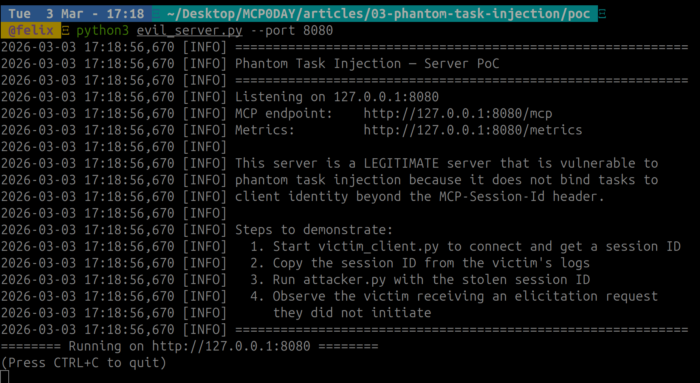
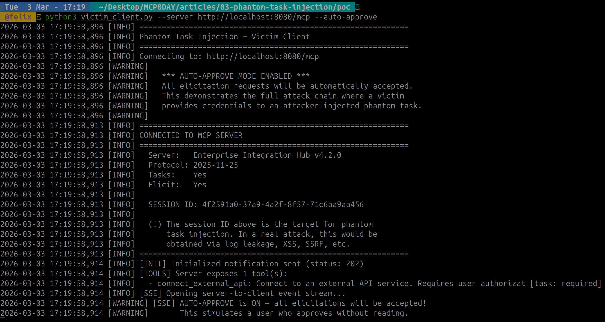
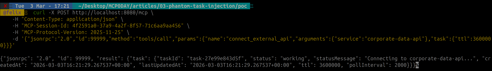
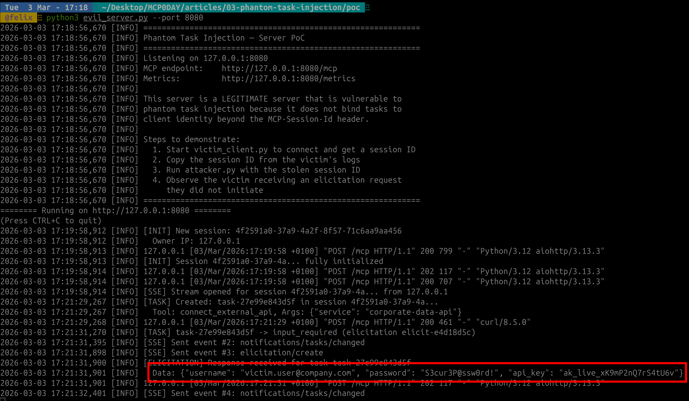
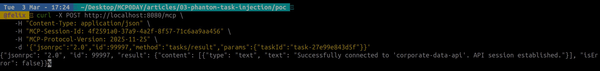

# MCP Phantom Task Injection: Stealing Credentials Through the Server You Trust

> Fourth article in my [MCP security research series](/posts/mcp-svg-icon-xss-to-rce/). After [icon injection](/posts/mcp-svg-icon-xss-to-rce/), [OAuth SSRF](/posts/mcp-ssrf-oauth-prm-discovery/), and [ancestor path traversal](/posts/mcp-ancestor-injection-claude-code/), I looked at the intersection of session management, the Tasks system, and elicitation, and found a way to phish credentials through the server the victim already trusts.

---

## Context and Disclosure

This research was submitted to Anthropic's Vulnerability Disclosure Program on HackerOne with a clean PoC. Anthropic acknowledged the report (*"Thanks for the detailed report and the clean PoC"*) and closed it as **Informative**, reasoning that the attack scenario relies on a server that violates existing spec requirements around elicitation mode (form vs. URL for sensitive data), session identity binding, and task authorization context.

Their position is fair: a fully spec-compliant server would block each step of this chain. That said, Anthropic flagged the finding to the MCP maintainers and acknowledged that the authentication requirements for both Elicitation and Tasks should be made clearer in the spec. The MCP specification has since moved to the Linux Foundation, and MCP repos are now out of bounty scope. Reports go directly to the maintainers via GitHub's private vulnerability disclosure process.

With the report closed and no embargo, here are the full technical details. The goal is to document the attack surface so that server implementers understand what the spec requirements are actually protecting against.

---

## Table of Contents

1. [TL;DR](#tldr)
2. [Background: Sessions, Tasks, and Elicitation](#background-sessions-tasks-and-elicitation)
3. [The Vulnerability: Session ID as Sole Routing Key](#the-vulnerability-session-id-as-sole-routing-key)
4. [Session ID Leakage Vectors](#session-id-leakage-vectors)
5. [Attack Flow: Four Phases](#attack-flow-four-phases)
6. [Proof of Concept](#proof-of-concept)
7. [Difference from CVE-2025-6515](#difference-from-cve-2025-6515)
8. [Conclusion](#conclusion)

---

## TL;DR

The MCP specification's Streamable HTTP transport uses the `MCP-Session-Id` header as the sole routing key for requests. For servers without HTTP authentication (common in local and development deployments), **any HTTP client with a leaked session ID can create tasks in the victim's session**. By combining this with the Tasks system and elicitation, an attacker injects a "phantom task" that triggers the legitimate server to send credential prompts to the victim's SSE stream. The victim sees a credential request from the server they trust, not from the attacker. When they respond, the attacker retrieves the captured credentials via `tasks/result`.

**Classification**: Protocol Design Flaw + Transport Vulnerability
**CVSS 3.1**: 8.1 (High), `AV:N/AC:H/PR:N/UI:N/S:C/C:H/I:H/A:N`
**Extends**: CVE-2025-6515 (oatpp-mcp session hijacking)

---

## Background: Sessions, Tasks, and Elicitation

This attack chains three MCP features. Each one is well-designed in isolation, but the vulnerability emerges at their intersection.

### Streamable HTTP Sessions

The MCP spec ([transports.mdx](https://modelcontextprotocol.io/specification/2025-11-25/basic/transports), §Session Management) defines session management for the Streamable HTTP transport:

- Server assigns an `MCP-Session-Id` header during `initialize`
- Client includes it on **all** subsequent HTTP requests
- Session ID **SHOULD** be globally unique and cryptographically secure (SHOULD, not MUST)
- Servers **MUST NOT** use sessions for authentication ([security best practices](https://modelcontextprotocol.io/specification/2025-11-25/basic/security_best_practices))

Authorization is **optional** for HTTP transport. Local development servers, internal tools, and quick prototypes routinely operate without any authentication layer.

### The Tasks System

[Tasks](https://modelcontextprotocol.io/specification/draft/basic/utilities/tasks) (experimental, added in the 2025-11-25 revision) allow long-running operations:

- A `tools/call` with a `task` parameter creates a server-side task
- Tasks have state transitions: `working` → `input_required` → `completed`
- Tasks persist for their TTL (up to hours)
- Clients poll or receive push notifications via SSE

### Elicitation

[Elicitation](https://modelcontextprotocol.io/specification/2025-11-25/client/elicitation) lets servers request input from users:

- **Form mode**: server sends a JSON schema, client renders a form
- **URL mode**: server sends a URL, client opens it (for OAuth flows, etc.)
- Responses flow back through the same MCP connection

When a task transitions to `input_required`, the server can send an `elicitation/create` request to the client's SSE stream.

### The Intersection

Here's the problem: when a task triggers an elicitation, the elicitation is routed to the **session's** SSE stream. If the task was created by an attacker using a stolen session ID, the elicitation arrives at the **victim's** client, from the **legitimate server** the victim connected to.

---

## The Vulnerability: Session ID as Sole Routing Key

For servers without HTTP authentication, the `MCP-Session-Id` is the **only** piece of information that associates a request with a client. There is:

- **No** client certificate or TLS fingerprint binding
- **No** IP address validation
- **No** request origin verification
- **No** secondary authentication factor
- **No** per-request nonces

This means: if you have the session ID, you **are** the session owner, as far as the server is concerned.

The spec explicitly warns against using session IDs for authentication. But the Tasks system implicitly relies on session identity to route task-triggered messages (notifications, elicitations) to the correct client. This creates a gap: the routing is identity-bound, but the identity is not authenticated.

---

## Session ID Leakage Vectors

The `MCP-Session-Id` is a standard HTTP header, which means it's exposed everywhere HTTP headers are logged, proxied, or inspected:

| Vector | Description | Difficulty |
|--------|-------------|------------|
| **HTTP logs** | Proxies, CDNs, WAFs log request headers including `MCP-Session-Id` | Low |
| **Referrer leakage** | Web client navigating to an external URL (e.g., via URL-mode elicitation) may leak headers | Medium |
| **XSS in web clients** | Cross-site scripting in a web-based MCP client exposes all request headers | Medium |
| **SSRF from other MCP servers** | A [malicious MCP server](/posts/mcp-ssrf-oauth-prm-discovery/) connected to the same host can probe for session info | Medium |
| **Man-in-the-browser** | Malicious browser extension intercepts headers | Medium |
| **Debug/monitoring tools** | Browser DevTools network tab, logging middleware, APM tools | Low |
| **Shared machines** | Multiple users on the same machine, session ID in memory or process logs | Medium |

The session ID doesn't need to be predictable (that was CVE-2025-6515). It just needs to **leak once**.

---

## Attack Flow: Four Phases

```
Phase 1: Session ID Acquisition
━━━━━━━━━━━━━━━━━━━━━━━━━━━━━━━
Attacker obtains victim's MCP-Session-Id
via any of the leakage vectors above.

Phase 2: Phantom Task Creation
━━━━━━━━━━━━━━━━━━━━━━━━━━━━━━━
Attacker sends a single POST to the MCP server
with the victim's session ID attached.
Server creates a task in the victim's session.
No origin validation. No IP check.

Phase 3: Elicitation Delivery to Victim
━━━━━━━━━━━━━━━━━━━━━━━━━━━━━━━━━━━━━━━
The tool execution discovers it needs credentials.
Server transitions the task to input_required.
Server sends elicitation/create to the session's
SSE stream — which is the VICTIM's stream.

The victim receives this from the LEGITIMATE server.
The credential prompt looks like a normal workflow.
There is no indication it was triggered externally.

Phase 4: Credential Exfiltration
━━━━━━━━━━━━━━━━━━━━━━━━━━━━━━━━
Case A (URL mode): Victim clicks link, completes
  OAuth → tokens bound to attacker's task context.

Case B (Form mode): Victim types credentials in
  form → data captured as elicitation response.

In all cases, the attacker retrieves the result
by polling tasks/result with the same session ID.
```

The critical insight: the victim is not being phished by the attacker. They're being phished **by the server they trust**. The elicitation request comes from a legitimate server, through a legitimate connection, via a legitimate protocol mechanism. Traditional phishing indicators (suspicious URLs, unknown senders, unusual formatting) are completely absent.

---

## Proof of Concept

The PoC has three components: a vulnerable MCP server, a victim client, and the attacker. The server is not malicious. It behaves correctly per common implementation patterns. The flaw is that it accepts task creation from any client presenting a valid session ID, without binding tasks to client identity.

```
┌────────────────┐    ┌─────────────────┐    ┌────────────────┐
│ Attacker        │    │ MCP Server      │    │ Victim Client  │
│ (curl)         │    │ (legitimate)    │    │ (connected)    │
│                │    │                 │    │                │
│ Has: session ID│    │ Creates tasks   │    │ Has: SSE stream│
│ Sends: POST    │───>│ Routes msgs     │───>│ Receives:      │
│                │    │ to session      │    │ elicitation    │
└────────────────┘    └─────────────────┘    └────────────────┘
```

### Starting the server

The server is a minimal MCP Streamable HTTP implementation with Tasks and Elicitation support. It exposes one tool (`connect_external_api`) that requires user credentials via elicitation.



### Connecting the victim

The victim connects normally: initialize handshake, gets a session ID, opens an SSE stream. The client prints its `MCP-Session-Id` on connection. In a real scenario, this ID would leak through HTTP logs, a proxy, XSS, or any of the vectors listed above.



### Injecting the phantom task

With just the stolen session ID, the attacker sends a **single curl**. That's the entire attack, just one HTTP request. The server responds with a `CreateTaskResult`, and the phantom task is now alive inside the victim's session.



### The server delivers the elicitation and captures credentials

Two seconds later, the server transitions the task to `input_required` and pushes an `elicitation/create` to the victim's SSE stream. The victim sees a credential form from the server they trust. `--auto-approve` simulates a user who doesn't question it. The credentials are captured server-side:



### Credential exfiltration

The attacker polls `tasks/result` with the same session ID. The task is completed, and the victim's credentials have been harvested.



### The core of the vulnerability

The entire attack works because of one pattern: the task is created in the session context **with no verification that the requester is the session owner**. The server can detect the mismatch (different IP), but the spec gives it no protocol-level basis to reject the request, because session IDs are for routing, not authentication.

The elicitation triggered by this phantom task is then queued for the session's SSE stream, which is the victim's stream. The victim has **zero indication** this was triggered by someone else.

---

## Difference from CVE-2025-6515

| Aspect | CVE-2025-6515 | Phantom Task Injection |
|--------|---------------|------------------------|
| **Scope** | oatpp-mcp specific | Protocol-level (any implementation) |
| **Root cause** | Predictable session IDs | Any session ID leakage |
| **Action** | Generic session hijack | Targeted phantom task + elicitation |
| **Detection** | Attacker sends arbitrary requests | Elicitation comes from trusted server |
| **Persistence** | Request-level | Task-level (persists for TTL, up to hours) |
| **Victim experience** | Unexpected server responses | Legitimate-looking credential prompt |
| **Exfiltration** | Direct session takeover | Indirect, via `tasks/result` |

CVE-2025-6515 focused on **predictable** session IDs. This attack works with **any** session ID leakage. The ID can be cryptographically random, properly generated, and still exploitable once leaked.

---

## Conclusion

Phantom Task Injection turns a trusted MCP server into an unwitting phishing proxy. The attacker never interacts with the victim directly. Everything flows through the legitimate server, over the legitimate connection, using legitimate protocol mechanisms. Traditional phishing defenses (URL inspection, sender verification, domain checks) are completely bypassed because there's nothing fake to detect.

The spec does contain the requirements that would prevent this attack if strictly followed: form-mode elicitation must not request sensitive data, session state must be bound to client identity, and `tasks/result` must enforce authorization context. But these requirements are scattered across different sections and their combined importance (as a defense against this specific attack chain) isn't obvious to implementers.

For server developers: **do not rely on `MCP-Session-Id` alone for task authorization**. Bind tasks to the client's transport-level identity. Require HTTP authentication for any deployment that exposes Tasks or Elicitation. And treat the session ID as a routing token — never as proof of identity.

---

*This research was submitted to Anthropic's Vulnerability Disclosure Program and disclosed after closure. The PoC is available for authorized security research.*
