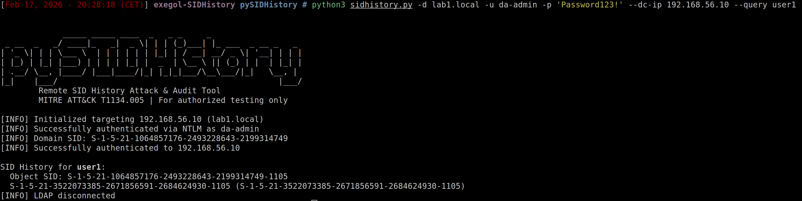
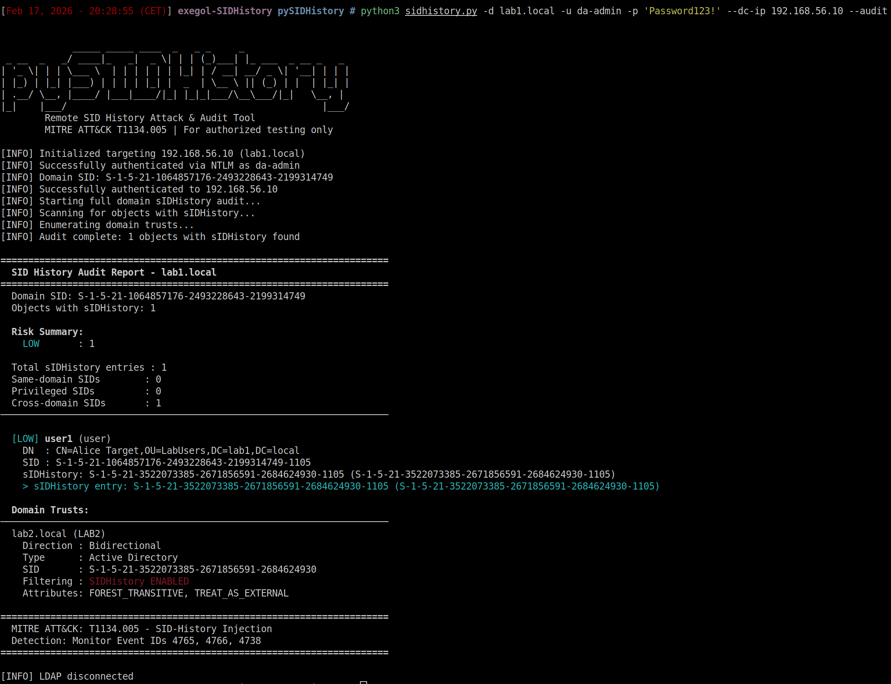
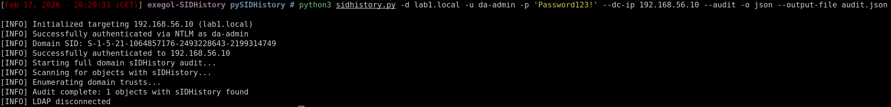
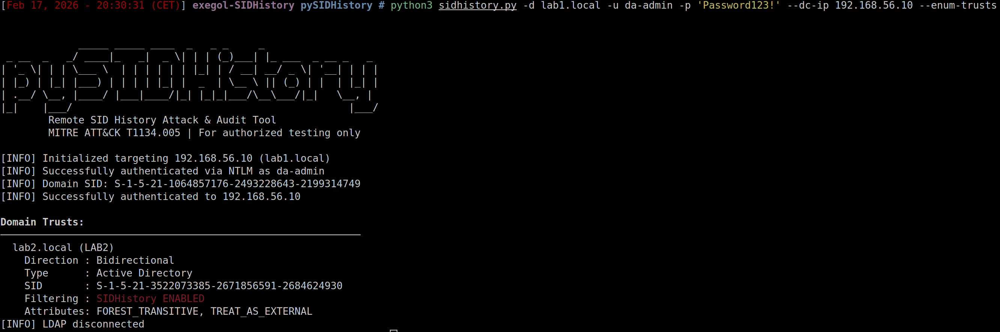
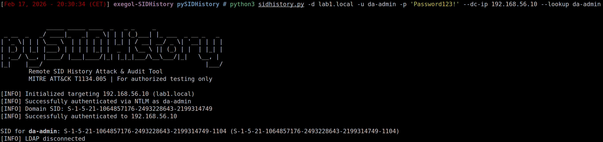
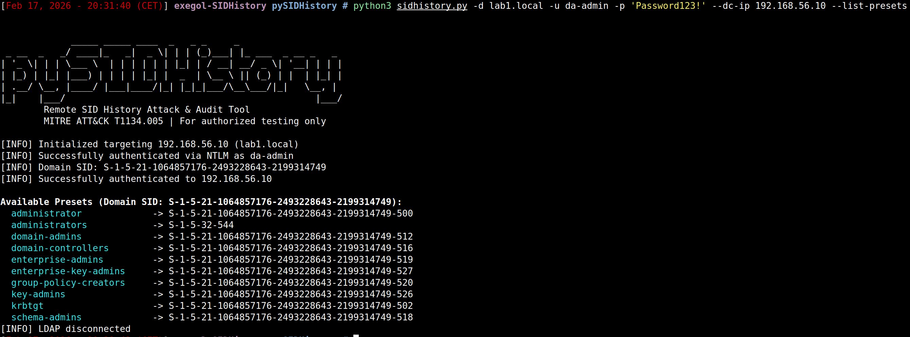

> *"There is currently no way to exploit this technique purely from a distant UNIX-like machine, as it requires some operations on specific Windows processes' memory."*
> — [The Hacker Recipes](https://www.thehacker.recipes/ad/persistence/sid-history)

Challenge accepted.

---

## So, what's sIDHistory?

Quick version: every AD object has a [`sIDHistory`](https://learn.microsoft.com/en-us/windows/win32/adschema/a-sidhistory) attribute. It exists for domain migrations — when you move a user from Domain A to Domain B, their old SID lands in `sIDHistory` so they keep access to their old resources.

The fun part? At authentication time, **every SID in sIDHistory goes straight into the user's access token**. Same level as their real SID and group memberships. No distinction.

So if you drop the [Domain Admins](https://learn.microsoft.com/en-us/windows-server/identity/ad-ds/manage/understand-security-identifiers) SID (`-512`) into some random user's `sIDHistory`... that user is now a Domain Admin. No group changes, no password resets, no visible modification in the admin tools. The privilege just appears.

That's [T1134.005](https://attack.mitre.org/techniques/T1134/005/) — SID-History Injection. And until now, pulling it off required one of these:

| Technique | Constraint |
|-----------|-----------|
| [mimikatz](https://github.com/gentilkiwi/mimikatz/blob/master/mimikatz/modules/kuhl_m_sid.c) `sid::patch` | SYSTEM on the DC, patches `ntdsa.dll` in memory |
| [DSInternals](https://github.com/MichaelGrafnetter/DSInternals) | Physical/offline access to `ntds.dit` |
| Golden Ticket + ExtraSids | Needs `krbtgt` hash, doesn't persist in AD |

All Windows-only. All require either being on the DC or having a pre-compromised secret.

I wanted to do it **remotely, from any platform (Linux, macOS, Windows), with just domain credentials**.

---

## The wall: why "just LDAP-modify it" doesn't work

The naive approach first. In Active Directory, every attribute in the schema has a [`systemOnly`](https://learn.microsoft.com/en-us/windows/win32/adschema/s-systemonly) flag. When it's set to `TRUE`, the attribute is entirely controlled by the system — no one can write to it, period. That's how `objectSid` works: locked at the schema level, immutable.

`sIDHistory`? It's `systemOnly: FALSE`. Which means AD treats it as a regular, writable attribute. So the logical assumption is: as a Domain Admin, with full control over an object, a simple LDAP `MODIFY_ADD` with the SID to inject should work.

```
insufficientAccessRights
```

Even as Domain Admin. Even with explicit `WriteProperty` delegation on the attribute. Every single time.

### Two layers of access control

The reason this fails is that Active Directory doesn't run a single access check when you modify an attribute — it runs **two**, and most people only know about the first one:


**Layer 1 — the DSA/LDAP layer** is the one everyone is familiar with. It checks the [DACL](https://learn.microsoft.com/en-us/windows/win32/secauthz/dacls-and-aces) on the target object — do you have `WriteProperty` on `sIDHistory`? `GenericAll`? Are you a Domain Admin? If yes, you pass this layer. This is the classic permission model that you configure through ACLs, delegations, and Group Policy.

**Layer 2 — the SAM layer** sits behind the first one and enforces its own rules on attributes it considers "its own". These rules are **hardcoded in the Domain Controller's code** — not configurable through ACLs, GPOs, or anything else. Regardless of your AD permissions, the SAM layer has the final say on its attributes.


And the SAM layer's verdict on `sIDHistory` writes is asymmetric:

```
MODIFY_ADD     →  BLOCKED  (always, regardless of permissions)
MODIFY_REPLACE →  BLOCKED  (same check)
MODIFY_DELETE  →  ALLOWED  (if Layer 1 passed)
```

You can **remove** SIDs from `sIDHistory` via LDAP. You just can't **add** them. This asymmetry is deliberate on Microsoft's part — write operations on `sIDHistory` are restricted to a specific API path that enforces additional security checks (auditing, trust validation, etc.), while deletions are considered less sensitive.

That's exactly why [mimikatz's `sid::patch`](https://github.com/gentilkiwi/mimikatz/blob/master/mimikatz/modules/kuhl_m_sid.c) takes the approach it does — it patches the conditional jumps in `ntdsa.dll` directly in memory to disable these SAM-layer checks. But that means running on the DC itself with SYSTEM privileges, and the memory layout of `ntdsa.dll` has shifted enough since Server 2016 that it's getting unreliable.

So LDAP is a dead end for adding SIDs. Time to look elsewhere.

---

## The backdoor Microsoft left open

Turns out Microsoft actually provides a *supported* way to add SIDs to `sIDHistory`. It's called [`DsAddSidHistory`](https://learn.microsoft.com/en-us/windows/win32/ad/using-dsaddsidhistory), a Win32 API designed for their [Active Directory Migration Tool](https://learn.microsoft.com/en-us/windows-server/identity/ad-ds/deploy/ad-ds-metadata-cleanup) (ADMT). When you migrate users from one domain to another, this API is what copies the old SIDs into `sIDHistory` to preserve access to legacy resources.

Under the hood, it makes an RPC call via the [MS-DRSR](https://learn.microsoft.com/en-us/openspecs/windows_protocols/ms-drsr/) protocol — specifically [`IDL_DRSAddSidHistory`](https://learn.microsoft.com/en-us/openspecs/windows_protocols/ms-drsr/376230a5-d806-4ae5-970a-f6243ee193c8), **opnum 20** on the DRSUAPI interface.

### A quick word on opnums

When a client calls a function on a remote server via [RPC](https://learn.microsoft.com/en-us/windows/win32/rpc/rpc-start-page), it doesn't send the function name as a string — that would be slow and verbose. Instead, every function in an RPC interface is assigned an **operation number** (opnum): a simple integer, indexed from 0. The server receives the number and routes to the corresponding function.

The DRSUAPI interface exposes several functions, each with its own opnum:

```
Opnum    Function              Usage
  0      DRSBind               Establish the session
  3      DRSGetNCChanges       DCSync (dump hashes)
 20      DRSAddSidHistory      Inject a SID into sIDHistory
```

If you've ever run a [DCSync](https://www.thehacker.recipes/ad/movement/credentials/dumping/dcsync) attack, you already know this interface — [`secretsdump.py`](https://github.com/fortra/impacket/blob/master/impacket/dcerpc/v5/drsuapi.py) sends opnum 3 on the exact same RPC pipe. pySIDHistory just sends opnum 20 instead.

### Why it bypasses the SAM layer

`DRSAddSidHistory` doesn't go through LDAP — it goes through the DRS replication engine, which has its own authorization model. The replication engine operates at a lower level than the application layers and doesn't enforce SAM-level restrictions on `sIDHistory` writes. It's the same principle that makes DCSync work: AD replication has privileges that normal LDAP operations don't.

### The problem: nobody had implemented it

Opnum 20 didn't exist in any Python framework. Not in [impacket](https://github.com/fortra/impacket), not anywhere else. Impacket defines each RPC function as a Python class with its opnum — `DRSGetNCChanges` is there as opnum 3, but opnum 20 simply had no class. The code had to be written from scratch.

```
Attacker (Linux)                        Domain Controller
  │                                         │
  │── EPM (135) ──────────────────────────►│  Endpoint resolution
  │── DCE/RPC BIND (DRSUAPI) ────────────►│  PKT_PRIVACY encryption
  │── DRSBind (opnum 0) ─────────────────►│  "I support ADD_SID_HISTORY"
  │── DRSAddSidHistory (opnum 20) ───────►│  Copy SID into sIDHistory
  │◄── DRS_MSG_ADDSIDREPLY ──────────────│  Win32 error = 0 (success)
```

Time to build it.

---

## Implementing opnum 20: looks simple, isn't

When you call a function via RPC, the arguments need to be serialized into bytes to travel over the network. The format used by DCE/RPC is called [NDR](https://learn.microsoft.com/en-us/openspecs/windows_protocols/ms-rpce/b6090c2b-f44a-47a1-a13b-b82ade0137b2) (Network Data Representation) — think of it as the binary equivalent of JSON for a REST API, except far more strict. Every data type has a precise wire encoding: a pointer, an array, and a string each serialize differently. Get a single type wrong and every byte after it shifts — the DC receives garbage and rejects the whole request.

The [MS-DRSR spec](https://learn.microsoft.com/en-us/openspecs/windows_protocols/ms-drsr/376230a5-d806-4ae5-970a-f6243ee193c8) defines the call like this:

```c
ULONG IDL_DRSAddSidHistory(
    [in, ref] DRS_HANDLE hDrs,
    [in] DWORD dwInVersion,
    [in, ref, switch_is(dwInVersion)] DRS_MSG_ADDSIDREQ *pmsgIn,
    [out, ref] DWORD *pdwOutVersion,
    [out, ref, switch_is(*pdwOutVersion)] DRS_MSG_ADDSIDREPLY *pmsgOut
);
```

The [request structure](https://learn.microsoft.com/en-us/openspecs/windows_protocols/ms-drsr/50b7cc92-608c-44ac-9d3e-48e2112c9bc0) carries everything: source domain, source principal, destination domain, destination principal, and optional credentials for the source DC:

```c
typedef struct {
    DWORD Flags;                                        // 0 = cross-forest
    [string] WCHAR *SrcDomain;
    [string] WCHAR *SrcPrincipal;
    [string, ptr] WCHAR *SrcDomainController;
    [range(0,256)] DWORD SrcCredsUserLength;
    [size_is(SrcCredsUserLength)] WCHAR *SrcCredsUser;  // ← NOT a string
    [range(0,256)] DWORD SrcCredsDomainLength;
    [size_is(SrcCredsDomainLength)] WCHAR *SrcCredsDomain;
    [range(0,256)] DWORD SrcCredsPasswordLength;
    [size_is(SrcCredsPasswordLength)] WCHAR *SrcCredsPassword;
    [string] WCHAR *DstDomain;
    [string] WCHAR *DstPrincipal;
} DRS_MSG_ADDSIDREQ_V1;
```

Response is dead simple — a single `DWORD dwWin32Error`. Zero means it worked.

Translating this to [impacket](https://github.com/fortra/impacket)'s NDR framework should've been an afternoon of work. It turned into three bugs that each returned the exact same useless error message.

---

## Bug #1 — The missing union discriminant

My first `DRSAddSidHistory` class looked reasonable:

```python
# My first attempt
class DRSAddSidHistory(NDRCALL):
    opnum = 20
    structure = (
        ('hDrs', drsuapi.DRS_HANDLE),
        ('dwInVersion', DWORD),
        ('pmsgIn', DRS_MSG_ADDSIDREQ_V1),  # ← the problem
    )
```

The DC responded with `rpc_x_bad_stub_data`. Helpful.

The issue: `pmsgIn` is declared with `[switch_is(dwInVersion)]` — a **non-encapsulated [NDR union](https://learn.microsoft.com/en-us/openspecs/windows_protocols/ms-rpce/b6090c2b-f44a-47a1-a13b-b82ade0137b2)**. On the wire, this needs an explicit discriminant tag before the union body. Without it, every field after `dwInVersion` is shifted by 4 bytes and the DC sees garbage.

The fix is the same pattern impacket uses for `DRSGetNCChanges` — wrap it:

```python
class DRS_MSG_ADDSIDREQ(NDRUNION):
    commonHdr = (('tag', DWORD),)
    union = { 1: ('V1', DRS_MSG_ADDSIDREQ_V1) }
```

---

## Bug #2 — Credential fields that look like strings but aren't

Still `rpc_x_bad_stub_data`. Same error, different root cause.

Look at these two fields from the struct definition:

```c
[string] WCHAR *SrcDomain;                          // ← LPWSTR
[size_is(SrcCredsUserLength)] WCHAR *SrcCredsUser;  // ← conformant array
```

They both hold text. They both contain `WCHAR*`. But their **wire encoding is completely different**:

| Type | Wire format | Overhead |
|------|------------|----------|
| `LPWSTR` (`[string]`) | MaxCount + Offset + ActualCount + data | 12 bytes |
| `[size_is(N)]` array | MaxCount + data | 4 bytes |

Using `LPWSTR` for the credential fields pumps 8 extra bytes into the stream that the DC doesn't expect. Everything after that is misaligned → same error.

Fix: define a proper conformant WCHAR array type:

```python
class WCHAR_SIZED_ARRAY(NDRUniConformantArray):
    item = '<H'  # unsigned short = WCHAR

class PWCHAR_SIZED_ARRAY(NDRPOINTER):
    referent = (('Data', WCHAR_SIZED_ARRAY),)
```

Both of these bugs produce `rpc_x_bad_stub_data` with zero additional context. The only way I found them was hex-dumping the NDR bytes and comparing against the [MS-DRSR wire format](https://learn.microsoft.com/en-us/openspecs/windows_protocols/ms-drsr/50b7cc92-608c-44ac-9d3e-48e2112c9bc0) byte by byte.


**The debugging rule I learned here:** `rpc_x_bad_stub_data` = your NDR encoding is wrong. Once you start seeing real Win32 errors (5, 8534, 8536...), your serialization is correct and the DC is actually processing the request. That transition point is your signal that the hard part is over.


---

## The bug that almost killed the project

NDR is fixed. Credential encoding is fixed. I send the request and get... `ERROR_INVALID_FUNCTION` (error code 1). Not a business logic error, not an access denied — just "invalid function". As if the DC doesn't know what opnum 20 is.

So I check the server's capabilities. During [`DRSBind`](https://learn.microsoft.com/en-us/openspecs/windows_protocols/ms-drsr/3ee529b1-23db-4996-948a-042f04998e91) (opnum 0), the DC returns its supported features in `DRS_EXTENSIONS_INT.dwFlags`. The flag [`DRS_EXT_ADD_SID_HISTORY`](https://learn.microsoft.com/en-us/openspecs/windows_protocols/ms-drsr/3ee529b1-23db-4996-948a-042f04998e91) (0x00040000) means "I support opnum 20".

My code reads the flags: `0x6d693a83`. That doesn't include bit 18. Conclusion: the Windows Server 2019 Vagrant box simply doesn't support `DRSAddSidHistory`.

Except... `0x6d693a83` was also missing a bunch of basic flags that `secretsdump.py` relies on — and `secretsdump.py` works perfectly against this same DC. Something wasn't adding up.

Turns out, I was **never actually parsing the server response**. My `_drs_bind()` method grabbed the handle and threw away `ppextServer`:

```python
# What I had — just returns the handle, ignores everything else
resp = dce.request(request)
return resp['phDrs']
```

That `0x6d693a83` was raw response bytes being naively cast to an integer. Looking at how [`secretsdump.py`](https://github.com/fortra/impacket/blob/master/examples/secretsdump.py) actually does it:

```python
# The correct way (from secretsdump.py)
drsExtensionsInt = drsuapi.DRS_EXTENSIONS_INT()
raw = b''.join(resp['ppextServer']['rgb'])
raw += b'\x00' * (len(drsExtensionsInt) - resp['ppextServer']['cb'])
drsExtensionsInt.fromString(raw)
server_flags = drsExtensionsInt['dwFlags']
```

After implementing proper deserialization:

```
Server DRS flags: 0x3fffff7f
DRS_EXT_ADD_SID_HISTORY: PRESENT
```

`0x3fffff7f` — nearly every flag set. The server supported opnum 20 the whole time.

This was the most insidious of the three bugs because it wasn't a serialization issue — it was a logic error in response parsing that generated a false conclusion ("the server doesn't support this feature"). A conclusion that could have killed the entire project. A full day of debugging for a parsing oversight.

---

## Six errors to success

With the plumbing finally working, the DC started giving me *real* errors. And each one taught me a prerequisite that the [DsAddSidHistory documentation](https://learn.microsoft.com/en-us/windows/win32/ad/using-dsaddsidhistory) mentions in isolation but never ties together.

**Error 8534** — `ERROR_DS_CROSS_DOMAIN_CLEANUP_REQD`. Source and destination are in the same forest. `DRSAddSidHistory` is designed for cross-forest migrations — pointing it at a domain within the same forest makes no sense in that context, so the DC rejects it immediately. Fix: use a source domain in a separate forest.

**Error 8536** — `ERROR_DS_AUDIT_FAILURE` on the destination DC. Auditing isn't enabled. Microsoft requires that every SID injection be logged — it's a traceability safeguard baked into the API. Fix: `auditpol /set /category:"Account Management" /success:enable /failure:enable` on the destination DC.

**Error 5** — `ERROR_ACCESS_DENIED`. The source DC rejected my credentials. `DRSAddSidHistory` doesn't just modify the destination — it also contacts the source DC to verify that the source principal actually exists. It needs valid credentials for that remote domain. Fix: pass `--src-username`, `--src-password`, `--src-domain`.

**Error 8552** — Same audit failure, but on the *source* DC this time. Auditing must be enabled on **both** sides. Same `auditpol` command, run on DC2.

**Error 1376** — `ERROR_NO_SUCH_ALIAS`. Specific local groups are missing on the DCs. `DRSAddSidHistory` expects local groups named `DOMAIN$$$` (the domain name followed by three dollar signs) to exist on both DCs. In production, [ADMT](https://learn.microsoft.com/en-us/windows-server/identity/ad-ds/deploy/ad-ds-metadata-cleanup) creates them automatically during migrations. In a lab built from scratch, they don't exist. Fix: `net localgroup LAB1$$$ /add` on both DCs.

**Error 0** — **It worked.**

All of these prerequisites are documented by Microsoft — but scattered across the `DsAddSidHistory` docs, the ADMT documentation, and separate KB articles. Never together, never in order. I found them one at a time, blind.

### The moment it worked


The tool connects via LDAP for auth and SID resolution, establishes a DRSUAPI session signaling `DRS_EXT_ADD_SID_HISTORY`, then fires `DRSAddSidHistory` with the source principal (`da-admin2@lab2.local`) pointed at the target (`user1@lab1.local`). The DC copies the SID. Error code 0. Done.

After all the NDR headaches and the flag parsing disaster, seeing `Win32Error: 0` was genuinely surreal.

---

## Building a lab nobody else had

Here's the thing about testing DRSAddSidHistory: you need **two separate forests with a bidirectional trust**. That's not something [GOAD](https://github.com/Orange-Cyberdefense/GOAD), [DetectionLab](https://github.com/clong/DetectionLab), or any standard AD lab gives you. Their multi-domain setups are parent-child within the same forest — DRSAddSidHistory rejects those with error 8534.

So I built one. Two Windows Server 2019 DCs, fully automated with Vagrant:

| Machine | Domain | IP | Role |
|---------|--------|----|------|
| DC1 | lab1.local | 192.168.56.10 | Destination forest |
| DC2 | lab2.local | 192.168.56.11 | Source forest |

A few things I learned the hard way during setup:

**`netdom trust /add` is a trap.** It creates an [external trust](https://learn.microsoft.com/en-us/windows-server/identity/ad-ds/plan/forest-design-models), not a forest trust. External trusts handle SID History differently and won't work for this. The lab uses .NET's `Forest.CreateTrustRelationship()` for a proper [forest trust](https://learn.microsoft.com/en-us/entra/identity/domain-services/concepts-forest-trust), then separately enables SID History with `netdom /enablesidhistory:yes`.

**Audit groups don't exist by default.** DRSAddSidHistory expects local groups named `SRCDOM$$$` and `DSTDOM$$$` on both DCs. In a real environment, [ADMT](https://learn.microsoft.com/en-us/windows-server/identity/ad-ds/deploy/ad-ds-metadata-cleanup) creates them during migrations. In a lab, you create them yourself or you get error 1376 forever.

The full lab ships in the `lab/` directory of the repo with a `rollback.sh` script that resets everything for retesting:

```bash
cd lab/
vagrant up dc1       # ~15 min
vagrant up dc2       # ~15 min
vagrant winrm dc1 -c "powershell -File C:\vagrant\scripts\setup-trust.ps1"
cd .. && ./lab/rollback.sh --all  # auditing + audit groups
```

---

## What the tool does

Beyond the injection itself, I built out the recon and audit side — stuff that's useful both for validating an attack worked and for defenders checking their environment.

### The injection

Already covered above. Cross-forest, via DRSUAPI, one command:

```bash
python3 sidhistory.py -d lab1.local -u da-admin -p 'Password123!' --dc-ip 192.168.56.10 \
    --target user1 --source-user da-admin2 --source-domain lab2.local \
    --src-username da-admin2 --src-password 'Password123!' --src-domain lab2.local
```

### Verifying it worked — query

After injection, check that the SID actually landed:



Shows the target's `sIDHistory` entries with SID resolution — you can see exactly which principal's SID got injected and from which domain.

### Domain-wide audit

This is honestly where the tool becomes most useful on an ongoing basis. Scans every object in the domain for `sIDHistory` entries and flags risk levels:



The **same-domain SID detection** is the real differentiator here. Legitimate `sIDHistory` comes from migrations — different domain. If you see same-domain SIDs in `sIDHistory`, that's almost always an attack artifact. In non-migration environments, this check has essentially zero false positives.

Need to feed the results to a SIEM? JSON export:



```bash
python3 sidhistory.py -d CORP.LOCAL -u admin -p 'Pass123' --dc-ip 10.0.0.1 \
    --audit -o json --output-file audit.json
```

### Trust enumeration

Before you even attempt injection, you need to know which trusts allow SID History. This shows all domain trusts with their [SID filtering](https://dirkjanm.io/active-directory-forest-trusts-part-one-how-does-sid-filtering-work/) status:



Look for `TREAT_AS_EXTERNAL` (0x40) — that means SID History is allowed across the trust. `QUARANTINED_DOMAIN` (0x04) means [SID filtering](https://learn.microsoft.com/en-us/windows-server/identity/ad-ds/manage/forest-recovery-guide/ad-forest-recovery-reset-trust) is active and will strip privileged SIDs at the boundary.

### SID lookup & well-known presets

Quick utilities for identifying targets:





The presets list shows well-known privileged SIDs for the target domain — useful for quickly identifying what to look for in `sIDHistory` entries during an audit.

---

## For the defenders reading this

### What to watch for

Three Event IDs matter:

| Event ID | What it means | How loud is it? |
|----------|--------------|-----------------|
| [**4765**](https://learn.microsoft.com/en-us/previous-versions/windows/it-pro/windows-10/security/threat-protection/auditing/event-4765) | SID History was added | Should be near-zero in production. Investigate immediately. |
| [**4766**](https://learn.microsoft.com/en-us/previous-versions/windows/it-pro/windows-10/security/threat-protection/auditing/event-4766) | SID History add attempt failed | Someone tried and failed. Also investigate. |
| **4738** | User account changed | Noisy — fires on any attribute change. Useful for correlation. |

4765 and 4766 are **specific** to SID History operations. Outside of scheduled domain migrations, they should never fire. If they do, something is very wrong.

### What to do about it

- **Monitor 4765/4766.** These are high-fidelity indicators. Alert on them.
- **Run periodic audits.** The `--audit` flag scans the whole domain — schedule it.
- **Same-domain SIDs are the red flag.** Legitimate migrations produce cross-domain SIDs. Same-domain SIDs in `sIDHistory` are almost always attack artifacts.
- **[Enable SID Filtering](https://learn.microsoft.com/en-us/windows-server/identity/ad-ds/manage/forest-recovery-guide/ad-forest-recovery-reset-trust)** on every trust where you don't actively need SID History for migrations.
- **Lock down DA accounts.** DRSAddSidHistory requires Domain Admin on the destination. Fewer DAs = smaller attack surface.
- **Audit your trusts.** `--enum-trusts` shows you exactly which trusts are vulnerable.

---

## Wrapping up

What started as "I wonder if that quote is actually true" turned into a deep dive through NDR serialization, impacket internals, and a bunch of obscure Microsoft specifications. The three bugs (missing union discriminant, wrong credential encoding, broken flag parsing) each produced the same unhelpful error, and the cross-forest prerequisites were a treasure hunt through scattered documentation.

But it works. Fully remote, fully from Linux, no mimikatz, no ntds.dit, no SYSTEM on the DC. Just domain credentials and an RPC call that Microsoft designed for migrations.

The tool is at [github.com/felixbillieres/pySIDHistory](https://github.com/felixbillieres/pySIDHistory), lab included. For authorized security testing only.

---

### References

| Resource | What it covers |
|----------|---------------|
| [MS-DRSR: IDL_DRSAddSidHistory](https://learn.microsoft.com/en-us/openspecs/windows_protocols/ms-drsr/376230a5-d806-4ae5-970a-f6243ee193c8) | The RPC call specification |
| [MS-DRSR: DRS_MSG_ADDSIDREQ_V1](https://learn.microsoft.com/en-us/openspecs/windows_protocols/ms-drsr/50b7cc92-608c-44ac-9d3e-48e2112c9bc0) | Request structure and wire format |
| [MS-DRSR: DRS_EXTENSIONS_INT](https://learn.microsoft.com/en-us/openspecs/windows_protocols/ms-drsr/3ee529b1-23db-4996-948a-042f04998e91) | DRSBind capability flags |
| [MS-DRSR: Server behavior for opnum 20](https://learn.microsoft.com/en-us/openspecs/windows_protocols/ms-drsr/fbc94975-28ef-4334-bb47-35708a15d586) | How the DC processes the call |
| [DsAddSidHistory requirements](https://learn.microsoft.com/en-us/windows/win32/ad/using-dsaddsidhistory) | Prerequisites for the Win32 API |
| [MITRE ATT&CK T1134.005](https://attack.mitre.org/techniques/T1134/005/) | SID-History Injection technique |
| [The Hacker Recipes: SID History](https://www.thehacker.recipes/ad/persistence/sid-history) | Technique overview |
| [impacket](https://github.com/fortra/impacket) | Python DCE/RPC framework |
| [mimikatz sid:: module](https://github.com/gentilkiwi/mimikatz/blob/master/mimikatz/modules/kuhl_m_sid.c) | Memory patching approach |
| [Dirkjan Mollema: SID Filtering](https://dirkjanm.io/active-directory-forest-trusts-part-one-how-does-sid-filtering-work/) | How trust SID filtering works |
| [DSInternals](https://github.com/MichaelGrafnetter/DSInternals) | Offline ntds.dit approach |
| [Impacket Developer Guide](https://cicada-8.medium.com/impacket-developer-guide-part-1-rpc-4df4fe6d79d7) | Extending impacket with custom RPC |
