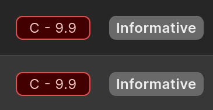
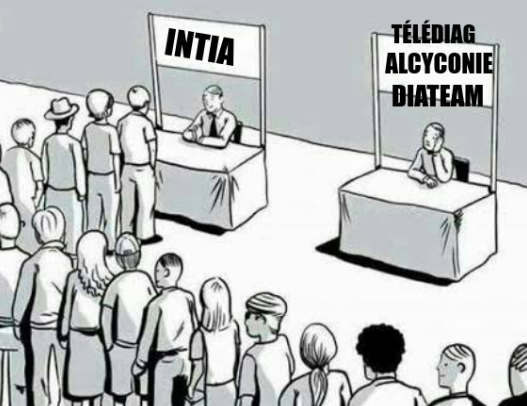

# Retex: Phreaks 2600 at the 'Unlock Your Brain' Student Bug Bounty 2025

## The Event: Unlock Your Brain Student Bug Bounty

The **Unlock Your Brain** event, held in Brest for its second edition, featured a fantastic initiative: a **Bug Bounty dedicated exclusively to cybersecurity students**.

This event was made possible through partnerships with the **YesWeHack** platform and the expert triagers from **BZHunt**. It perfectly embodies the spirit of **UYBHYS** (Unlock Your Brain Hack Your School).

### Educational and Practical Objectives

The core purpose of this event is twofold:

1. **Promote** cybersecurity issues and careers to the next generation of students.
2. Offer participants real-world experience in vulnerability research on a scope of **web applications** and **professional connected objects** provided by the partners, all within a dynamic and collaborative atmosphere.

For over **9 hours** of intense competition, students were challenged to discover security flaws. It was highly motivating to see so many talented individuals gathered, and exciting to meet familiar high-performing faces from the previous year.

---

## Team Phreaks 2600 Participation

The CTF association from École 2600, **Phreaks 2600**, was actively present, bringing its collective expertise and passion for bug hunting. We arrived with a strong delegation on site, supported by our coach.

**The Phreaks 2600 Team:**

- Elliot Belt
- tibo.wav
- lightender
- anthrace
- wepfen
- asako
- Rayanlecat (Coach)

### Results and Notable Achievements

Our collective and individual efforts paid off, securing us a top position:

| Category | Ranking | Participant(s) |
| :--- | :--- | :--- |
| **Team Ranking** | **2nd Place** | Phreaks 2600 |
| **Individual Ranking** | **3rd Place** | tibo.wav |
| **Individual Ranking** | **9th Place** | Elliot Belt |
| **Individual Ranking** | **10th Place** | lightender |

Congratulations to the **ESNA Bretagne** team, who won this edition, repeating their performance from the previous year.

---

## Technical Findings and Special Awards

The scope provided by YesWeHack was diverse and interesting, covering approximately **4 to 5 targets** with complex features that made for great hunting.

### Creativity and Cryptography

**Lightender** made a significant impact and won two well-deserved awards: **Most Creative Bug** and **Best Write-up**. The vulnerability hinged on forging cookies by exploiting insufficient entropy in their generation, illustrating the classic **CWE-331: Insufficient Entropy** weakness and its predictability risks for authentication flows [[CWE-331]](https://cwe.mitre.org/data/definitions/331.html).

### tibo.wav's Haul (3rd Individual)

**tibo.wav**, who finished 3rd overall, was extremely effective, submitting several high-impact vulnerabilities, particularly those related to:

- **Trust Abuse** (exploiting trust relationships between system components and user related features).
- **Leaked Secrets** (exposed configuration informations).

### My Contributions and the Triage Reality

On a personal level, I was pleased to have a major vulnerability accepted and rated **8.8 (High)**: a successful **Privilege Escalation** that allowed a standard account to gain full administrative rights on the platform.

I also submitted two **critical 9.9** reports that were ultimately downgraded to *Informative* during triage...

### The Non-Technical Wins: Wepfen's Awards

Not all victories appear in the leaderboard. **wepfen** secured two unofficial but highly sought-after titles: the **Best RTFS** (Read The F**king Scope) Award and the **Best Meme** Award. His ability to balance relentless enumeration with brainrot was quite impressive.

---

## Conclusion and Acknowledgments

The Unlock Your Brain Bug Bounty was a day marked by intense hunting and great human connection.

A huge thank you to **BZHunt** for the excellent organization, the great lunch, and the comfortable setting, which made the hunt both enjoyable and productive. It was truly inspiring to see so many passionate students.

We also thank **YesWeHack** for providing a high-quality scope. We sincerely hope that this discovery-rich day will contribute to the long-term security of the audited platforms.

---

*See you soon for another retex - Elliot*
