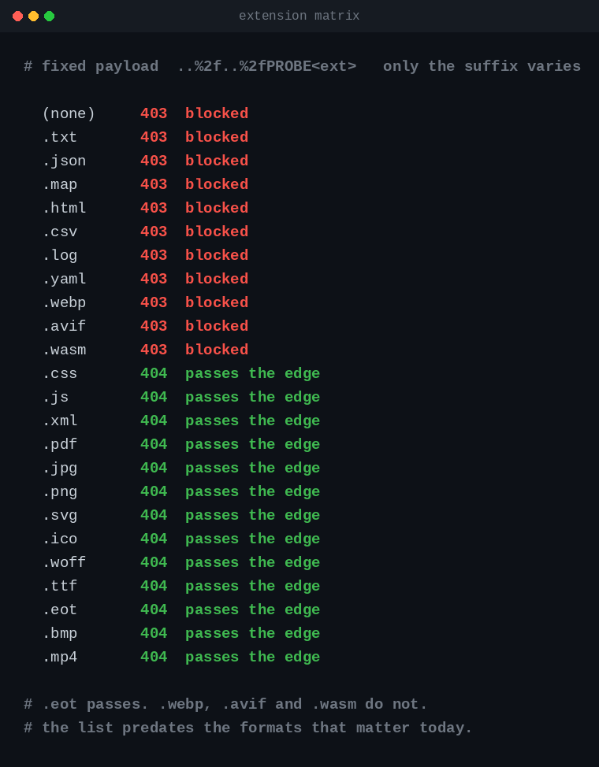
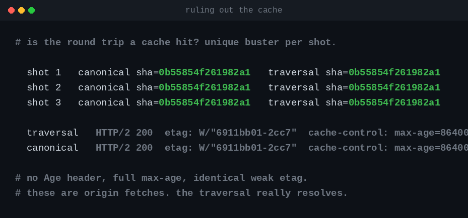
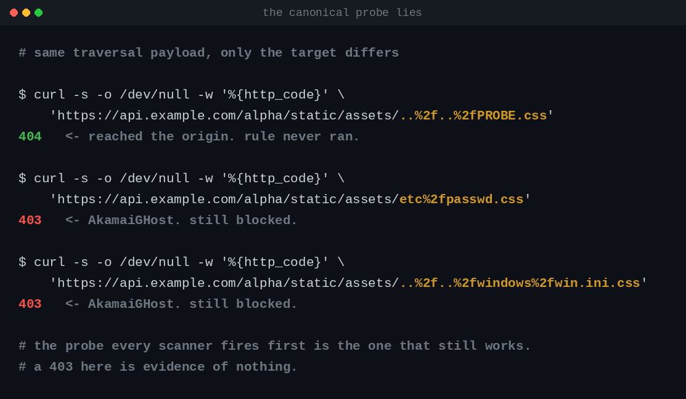

I was hunting on a private YesWeHack program and I kept hitting the same wall. Not a hardened application, a `403`: 461 bytes of HTML, `server: AkamaiGHost`, back in forty milliseconds. Whenever I got close to something the edge ate the request before the origin saw it. Three separate leads died that way across two sessions, and after the third one I stopped treating it as bad luck.

So I changed what I was working on. Not the program, the object of study. I spent two days measuring the WAF itself instead of hunting the application through it. That worked, and the reports went in off the back of it.

Appending a static extension to get past a filter is old folklore, and I deal with the prior art properly further down rather than pretend otherwise. What I had not seen documented anywhere is which rules the exemption actually switches off, and the consequence that follows: **the canonical traversal probe, the one every scanner fires first, is the one probe that still gets blocked.** Test this the obvious way and the WAF tells you it is holding.

The target stays anonymous. Every status code, byte count and hash below is a real measurement taken on 6 and 7 September 2026 against a production estate running Akamai in front of Azure API Management, with hostnames and path prefixes renamed.

---

## The wall

The service serves static assets. There is a public stylesheet, and a gated HTML file that returns `401` from the API gateway when requested directly.

```
GET /alpha/static/assets/css/main.css   ->  200, 11463 bytes, text/css
GET /alpha/static/swim/stroke.html      ->  401, 85 bytes, application/json
```

One `..` segment crosses that authorisation boundary, which I already had going in. It comes from a separate defect where the gateway authorises on the raw path while the backend normalises afterwards, so the URL that authorises is not the URL that serves.

```
GET /alpha/static/assets/..%2fswim%2fstroke.html  ->  200, 687 bytes
```

Two adjacent `..` segments do not:

```
GET /alpha/static/assets/..%2f..%2fPROBE  ->  403, 461 bytes, server: AkamaiGHost
```

The rule blocks two adjacent `..` segments in any encoding it decodes, and one always passes. Depth 1 is free, depth 2 is a wall, and depth 1 on its own is close to worthless: you move sideways inside a directory but you cannot climb out of it. Everything I wanted was one level up. A WAF rule was capping me exactly one level short of a reportable finding, which is what pushed me at the WAF rather than the app.

---

## Two days on the wrong axis

The obvious move is to find an encoding of `..` or `/` that the WAF fails to recognise but that something downstream still decodes: overlong UTF-8, double encoding, fullwidth characters, `%u` notation, mixed dots. A bypass on this axis needs both halves. An encoding that crosses the edge but that nothing downstream decodes buys you a 404 and a false sense of progress, which is the dominant false positive in this genre.

So each of 28 encodings got two probes: one at depth 2 to see whether the edge lets it through, and one at depth 1 against a file whose hash I already knew, to see whether anything actually decodes it. The second is a round trip, so if the traversal resolves the body carries the same sha256 as the canonical path.

Every single one came back either decoded by a backend and blocked by the edge (`%2f`, `%2e%2e`, `.%2e` and friends), or ignored by the edge and decoded by nothing (`%c0%af`, `%e0%80%af`, `%ef%bc%8f`, `%e2%88%95`, the rest of the overlong family). Bimodal, no exceptions across 28 samples. One confound worth ruling out: a path matching no published gateway operation dies at the gateway before reaching any decoder, which would look identical from outside. The signatures separate them, since the gateway answers `404` with 54 bytes of JSON while every overlong probe came back `404` with 153 bytes of `text/html`, which is nginx. They reached the static server and it did not decode them.

Against a modern decoder, overlong UTF-8 is a WAF bypass rather than a path bypass. It regains value against a permissive one, old Tomcat or IIS or something hand rolled in C, and not here.

One caveat that cost me time later: what a backend decodes is a property of *that* backend, not of the stack. On this same target `%5c` is not decoded by nginx, but it is decoded by the object storage SDK sitting behind a different service.

Two days to establish a negative, and useful afterwards, because it told me the answer was never going to be a cleverer payload.

---

## When the rule runs at all

I had been asking what the rule fails to parse. The better question is when it executes, because commercial WAFs do not evaluate every rule against every request. In Akamai's model the scoping object is a *match target*, and the documentation is explicit about what happens outside one:

> When your security configuration assesses a request, it checks to see if the request meets match target criteria. **If it does, protections apply. If not, content delivery starts.**

The [match target reference](https://techdocs.akamai.com/terraform/docs/match-target-options) lists `fileExtensions` as "file types subject to scanning", alongside negation booleans `isNegativePathMatch` and `isNegativeFileExtensionMatch` that express "everything except these extensions". Excluding static assets from inspection is a normal thing to do, for performance and for noise.

The test is trivial. Take a payload known to be blocked, change nothing but the final extension. Twelve requests to know the answer, twenty eight to map the boundary.



Each row repeated 8/8 consistent, and the whole matrix rerun three times with a unique cache busting URL, so none of it comes from a cache entry.

The composition of that list dates it. `.eot` is a font format that died with Internet Explorer, `.bmp` and `.mp4` are in, and `.webp`, `.avif` and `.wasm` are all blocked. It was never a security boundary, it is an inventory of static content frozen at some point and never revisited. Attacking, bet on the old extensions. Defending, `.eot` present beside `.webp` absent tells you nobody has audited this configuration in years.

The exemption does not raise the depth ceiling, it removes it. Under the site root, bare paths return 403 at depths 2 through 8 while `.css` paths return 404 at every one of them.

Crossing the edge proves nothing by itself, so here is the round trip. A traversal built from a prefix and enough `..` segments to land back on the canonical file returns 200, 11463 bytes, sha256 `0b55854f261982a1`, byte identical to requesting it directly. That needs a control, because a cache with a normalised key would produce the same result without anything resolving:



Three pairs, three identical hashes, `max-age=86400` and no `Age` on either side. Origin fetches, not cache hits.

---

## How the matcher parses a suffix

If the extension decides whether a rule runs, the semantics of "the extension" are the attack surface. Traversal payload held constant:

| Case | Result | What it tells you |
|---|---|---|
| `.CSS`, `.Css` | passes | case insensitive |
| `.txt.css` | passes | last extension wins |
| `.css.txt` | blocked | same rule, mirrored |
| `PROBE%2ecss` | **blocked** | **no percent decoding**, the raw suffix is not `.css` |
| `.c%73s` | blocked | confirms it on a single letter |
| `.txt%23.css` | **passes** | `%23` not decoded, so the raw suffix is `.css` |
| `.css;.txt` | **passes** | matrix parameters stripped before the test |
| `.txt?x=.css` | blocked | the query string is not considered |
| `.css%2fsuite` | blocked | must be the final segment |
| `.css.`, `.css%20`, `.css%00.txt` | blocked | the suffix has to end exactly there |

A suffix comparison on the raw path, after stripping query string and matrix parameters, case insensitive, with no percent decoding anywhere.

Put that beside the rule it gates, on the same request, inside the same appliance. The rule sees `..` through a decode of `%2e%2e`. The matcher does not decode `%2e` at all, which is why `PROBE%2ecss` stays blocked. One component sees a traversal, the other fails to see a stylesheet, and they are not looking at the same URL. You craft a request that is a traversal to the rule engine and an asset to the dispatcher, the dispatcher runs first, and it decides whether the rule engine gets a turn. The familiar proxy versus backend normalisation discrepancy, folded inside a single product.

---

## Which rules the exemption covers

My first assumption was that `.css` switched the whole policy off, which would be a much larger and much more obvious hole. It does not. Same payloads in the path, with and without the suffix: `..%2f..%2f`, `..%5c..%5c` and `%2e%2e%2f%2e%2e%2f` all flip from 403 to 404, while `<script>alert(1)</script>`, `' UNION SELECT NULL--`, `{{7*7}}`, `${jndi:ldap://...}` and `;cat /etc/passwd` stay at 403. The same payloads in the query string and in `User-Agent` stay blocked too.

Of the nine families I tested, one stopped firing: generic detection of `..` sequences. That is an observation over nine probes rather than a claim about how the policy is assembled, since I cannot confirm from outside that these rules share a match target.

The next result explains the longevity.



The known sensitive file rules keep their coverage under the exemption. `etc%2fpasswd`, `win.ini` and `proc%2fself%2fenviron` stay blocked with `.css` appended, while the generic traversal beside them sails through. You send `../../etc/passwd`, you get a 403, you retry with `.css` because you are thorough, you get a 403 again, you write "path traversal: not exploitable, WAF in place" and move on. Correct about your probe, wrong about the platform. That is what I did on my first pass.

The tuning makes sense once you see it. A generic rule firing on every `..` produces enormous false positive volume on static assets, because build chains and stylesheets emit unresolved relative paths constantly, so exempting static extensions from that rule is the obvious remedy. Exempting them from the `/etc/passwd` rule would achieve nothing, since a stylesheet request never contains that string. Somebody made a careful, narrowly scoped decision, and the consequence of that care is a hole invisible to every standard test, because every standard test aims at the rules left in place.

The probe that finds it is a legitimate static file reached through an illegitimate path, validated by hash. It is now the first thing I run against a WAF.

---

## What it unblocked, and where it stops

Removing the depth cap changed the class of what I could prove. The finding stuck as a confined read at depth 1 became a write primitive at depth 2, landing in a production storage container the account had no business reaching. Full run, from a self-signup account created for the test:


The first line is the control that makes the rest mean anything: identical request, identical payload, no static extension, refused by the edge in 46 milliseconds. Four characters later the same write returns `201`. The object reads back out of a container the account cannot list, is absent from our own namespace, and a name never written returns `404`, so nothing here is a catch-all. The file is an inert CSS comment carrying a sentinel and a "please ignore" annotation, which is the least interesting payload that still proves the capability.

That, with the other leads the edge had been killing, went into the reports I filed on the program.

The bound matters as much as the result. Traversing toward a different service fails, though not because of the WAF: the gateway matches operations on the raw path and answers `404` with 54 bytes of JSON, and escaping the site root gets a 403 from `http.sys` at the origin. Exploitability therefore needs a second, independent condition. At the edge, the path ends in an exempted extension, which removes the rule. At the gateway, an operation is declared with a wildcard whose backend normalises the path after authorisation was evaluated. That second condition is what converts a WAF bypass into a vulnerability, and both held here.

The target of the traversal also has to end in an exempted extension. You reach and write static assets, you do not read `/etc/passwd`, and a writeup claiming otherwise would be overselling. For a defender that ordering means grepping gateway specs for wildcard operations beats hardening the WAF. The WAF was not the defence here, it only resembled one.

---

## Prior art, stated plainly

Appending a static extension to get past a filter is standard 403 bypass folklore. [`gobypass403`](https://github.com/slicingmelon/gobypass403) ships an `end_paths` module that appends suffixes from a wordlist, PortSwigger has a [`403-bypasser`](https://github.com/PortSwigger/403-bypasser) extension, and the technique sits in beginner-level [403 bypass](https://kathan19.gitbook.io/howtohunt/status-code-bypass/403bypass) collections. If you have hunted for any length of time you have fired `/admin.css` at something.

What those tools do not tell you is why it works on a given target, which rules it disables and which it leaves standing, or how the matcher parses the suffix. They append and observe. The contribution here is the characterisation and the corollary above, which inverts how you read a negative result.

The `.txt%23.css` row has a name too. Fooling a suffix matcher with what follows a `#` is [CVE-2023-45539](https://nvd.nist.gov/vuln/detail/CVE-2023-45539), where HAProxy accepted `#` as part of the URI and `index.html#.png` satisfied a `path_end .png` rule. The variant here is adjacent rather than identical, since `%23` stays percent encoded and never becomes a fragment, so no URI parser is being confused. The matcher never decodes anything and the raw bytes happen to end in `.css`. Same family, different mechanism, and the second survives a fix for the first.

This is also not one vendor being sloppy. AWS documents the same pattern as a scope down statement and ships a [copy pasteable example](https://docs.aws.amazon.com/waf/latest/developerguide/waf-bot-control-example-scope-down-dynamic-content.html) whose regex is `(?i)\.(jpe?g|gif|png|svg|ico|css|js|woff2?)$`, applied to `UriPath` with `"TextTransformations": [{"Type": "NONE"}]`. No normalisation before the extension test, `$` anchored on the path as it arrives, and no `webp` or `avif` in the list. AWS scopes down an entire managed rule group there rather than a single rule, so the transfer is partial, but the attacker controlled unnormalised suffix is the same property. On the academic side, [WAFFLED](https://arxiv.org/abs/2503.10846) is the systematic study with 1207 bypasses across five WAFs, but its scope is request bodies, paths and query strings are explicitly excluded, and Akamai was not tested.

---

## Three ways I fooled myself

Every failure mode below is one I produced and had to retract during this work, which on a bug bounty program costs more than a missed finding.

**The origin 403 read as the WAF.** At depth 4 and above the traversal escapes the site root and the response is a 403, so it looks like the WAF caught up. It carries no `server` header, it is 312 bytes of `charset=us-ascii`, and the body reads `Forbidden URL / HTTP Error 403. The request URL is forbidden.` That is `http.sys` at the origin, which means the request crossed the entire edge before being refused at the far end. Counting 403s gets you the opposite of the truth.

**The response served from cache.** This one caught me three times. The successful traversal returns `cache-control: max-age=86307` and an `etag` with no `Vary`, so an entry populated by an authorised request gets read back by an unauthorised one. You burn yourself by firing the owner variant first, which fills the cache, then the attacker variants, which read that entry and return 200. You conclude that no authorisation is checked anywhere and you are one step from submitting a report that says so. With a fresh object per variant the same test returns 404 for the attacker, because the check was there all along. Any series of variants fired at the same URL is invalid: a fresh object per variant, or nothing. Cache headers are not a cache oracle in either direction, only a unique cache buster per shot is.

**A wave of 401s that was rate limiting.** The token endpoint rate limits, so minting per request produces 429s upstream and a run of 401s downstream that reads exactly like a defence you have just discovered. Cache the token.

---

## Test order

I tested 28 encodings before I tested 12 extensions, which is backwards and cost me two days.

Fingerprint the tiers first, about six requests, because everything downstream is noise without it. Here that meant: edge deny is `403` with `server: AkamaiGHost` at 455 to 591 bytes growing with URL length; origin deny is `403`, 312 bytes, `us-ascii`, no `server`; gateway no-operation is `404` at 54 bytes; gateway JWT refusal is `401` at 85 bytes; the app framework is `404 application/problem+json` at 194 bytes; nginx is `404` at 153 bytes.

Then calibrate three anchors: a gated resource that must return 401, a public one that must return 200, and a known working bypass that must return 200. People skip the third, and it is the sensitivity control. Without it a run of negatives cannot distinguish "the WAF holds" from "my bench is broken".

Then hunt the scoping hole, twelve requests, before anything else, because if it exists everything else is moot. Characterise the matcher. Replay six to eight signature families with and without the suffix, since a rule scoped exception is invisible if you only test one family and the sensitive file rules will lie to you. Validate the round trip by hash, diff against the public baseline, and look for wildcard operations at the gateway. The encoding matrix goes last, if at all.

Underneath all of it: never report a bypass whose three axes are not documented separately, each with its own negative control. Does it cross the edge, does something downstream decode it, and do you obtain something you did not already have. A bypass satisfying only the first is no finding.

---

## Fixing it

For the platform operator, by decreasing value. **Assert the prefix at the backend**, checking after normalisation that the resolved path is still under the expected root, which is the only control that does not depend on the edge behaving. **Audit wildcard operations at the gateway**, the second condition above. **Normalise before dispatching**, because while the matcher and the rule disagree the attacker chooses whether the exemption applies. **Refuse traversal before applying the exemption**, since a request containing `..` under any encoding has no business qualifying as a static asset. **Date the exemption list**, because a missing `.webp` beside a present `.eot` says nobody has looked in a long time.

For the vendors, a scope down example applying an extension test to an unnormalised path will be copied verbatim into production, because that is what reference examples are for. A note about the consequence, or an example applying `URL_DECODE` then `NORMALIZE_PATH` first, would remove a lot of exposure for the price of a documentation edit.

---

## Limits

One deployment, two hostnames, same contract and therefore the same configuration, so n = 1. I did not generalise by measurement, I generalised from vendor documentation, which is weaker and I would rather say so.

The exemption list is deployment specific and matches no published vendor list, so what transfers is the method rather than the table. I never had configuration access, so whether this is a negative match target or a per rule exception is inferred from behaviour: the behaviour is certain, the implementation is not. The AWS prediction is read off documentation rather than measured, and anybody with a test deployment can settle it in a handful of requests.

All of this ran inside the scope of a program that authorises it, at low volume, with a marked User-Agent, without touching another user's data. The findings were reported. If you want to reproduce the method, use something you are allowed to touch.
